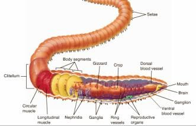
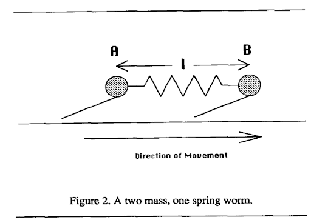
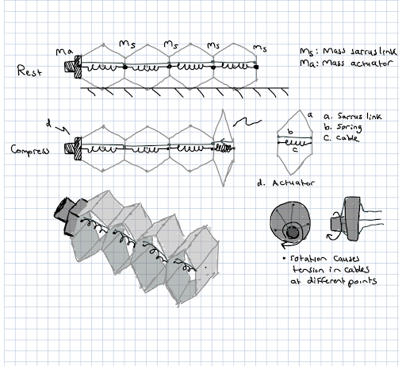
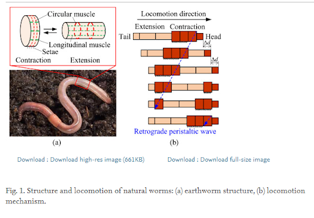
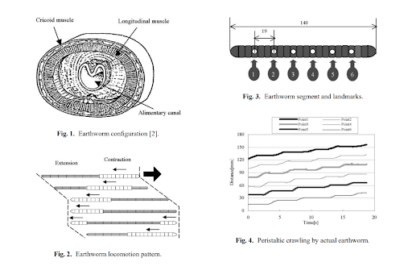
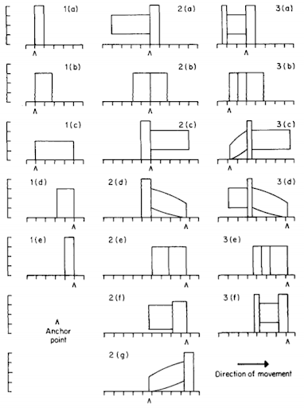
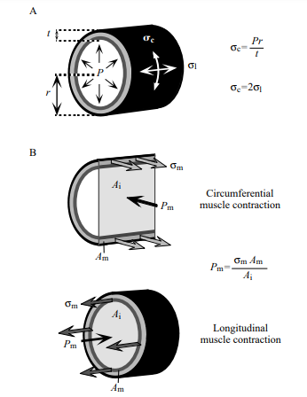
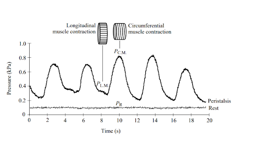

# Biomechanics Background and Initial Specifications
## Description 
[Assignment Instructions](https://egr557.github.io/assignments/biomechanics-background-and-initial-specificaitons.html)

## Team Response
>**Content**\
[Candidate Organism for Bio Inspiration](#Candidate-Organism-for-Bio-Inspiration)\
[Bio-inspired Robots](#Bio-inspired-Robots)\
[Table of relevant info](#Table-of-relevant-info)\
[Extrapolation (Fill in the gaps)](#Extrapolation-(Fill-in-the-gaps))\
  -[Kinetic Energy](#Kinetic-Energy)\
  -[Ground Reaction Force](#Ground-Reaction-Force)\
  -[Axial Acceleration](#Axial-Acceleration)\
  -[Metabolic Rate](#Metabolic-Rate)\
[Figures from literature](#Figures-from-literature)\
[Simple engineering drawing](#Simple-engineering-drawing)\
[Discussion](#Discussion)\
  -[Rationale for animal](#Rationale-for-animal)\
  -[Motor and battery](#Motor-and-battery)\
[Plots and Figures](#Plots-and-Figures)\
[References](#References)

### Candidate Organism for Bio Inspiration
Team 5 sought bio-inspiration from the biomechanics of the Lumbricus Terrestris, which is referred to as the Common Earthworm Fig 1. [1] The common earthworm poses a hydroskeleton which enables locomotion by peristalsis.[1](#f1)

\
Fig 1 Anatomy of Earthworm [2]

One of our initial tasks was to find multiple sources that are closely related to our area of research to obtain physical quantities and develop initial specifications for our robot. The team found a number of relevant articles [3]–[7] (along with several websites), three of which will be especially valuable to the project and will be described in greater detail below.

The work of [3] on worm-like locomotion being used to control soft-bodied peristaltic robots describes the peristaltic motion of the earthworm. The locomotion of the common earthworm (peristalsis) is described as a movement process in which the earthworm segments perform axial extension and radial expansion in order to move through the environment. [4] shares information that is particularly focused on aiding the design of adaptable, dynamic robots by studying the kinematics and kinetics of the common earthworm. More specifically, the authors correlate the changes of worm segment shape to the load distribution of the worm’s weight.

One of the more comprehensive papers, in terms of what Team 5 is trying to accomplish, is [5]which discusses the functional morphology of lumbricid earthworms. This study on multiple species of worms provides some insight into the locomotion of earthworms. _Lumbricus terrestris_ earthworms, compared to other species in the genus, are relatively lengthy with a large number of segments and possess thin bodies made for burrowing. The author discusses the abilities of the worms’ individual segments, noting that an ideal or hypothetical earthworm segment can triple in length as it contracts to half its diameter. Additionally, the article notes that the shorter, thicker body forms may contribute to faster movement, since they are able to constrict further, hence allowing a further extension. Such information will be especially useful to the team and will help shape the movement structure of our project.

The other two noteworthy papers are [6], [7], both authored by the same person. In [6], the author discusses properties of hydrostatic skeletons, which differ significantly as a movement type from the lever-like movement mechanisms of vertebrates and arthropods. In short, hydrostatic skeletons consist of an extensible body wall containing a fluid or fluid-like substance under compression. When the substance becomes pressurized, the organism stiffens, and the muscle forces can be transferred to the environment. This action, repeated in waves, allows movement via peristalsis. Also discussed in the paper are the effects of increased body size on the hydrostatic pressure and static stress on earthworms, the latter of which may become handy if the team moves in a project direction involving a worm-like body under tension. Latter parts of the paper state that the number of segments on a worm is important and that _Lumbricus terrestris_ possesses the same number of body segments throughout their lifetime. In addition, the number and size of segments determines the velocity of a hydrostatic skeleton, which is in agreement with [5].

[7] focuses on the locomotion of hydrostatic animals and how body size affects its kinematics. The findings of this research show that as earthworms get larger, they prefer to take longer strides with a slightly lower frequency, while smaller worms tend to increase their stride frequency. The main aspect that makes this paper stand out is the abundance of quantitative data gathered about the earthworm. Without bogging down this section with numerical data, it was found that earthworms move at approximately one-sixth of their body length per stride and that this equates to 0.04 ± 0.02 body lengths per second. When bringing body size into consideration, earthworms tend to move at the same relative speed, making them “kinematically similar,” meaning that all length, period, and speed ratios are the same between organisms of the same species. This type of data will be quite valuable to the team for homing in on a design and determining parameters.

### Bio-inspired Robots
The five most important papers based on bioinspired worm robots are seen in [3], [8]–[11].These provide both complex and simple worm-based robots as well as the proper scaling, actuators, forces, etc. vital to developing a low cost bio inspired robot in EGR 557. [8], [9] are important but for the scope of the project, papers [3], [10], [11]provide the most detail. To summarize, [8] focuses on the peristaltic motion of a 4 segment, servo driven worm robot providing us with useful periodic and frictional force experimental data. [9] provides a mesh inspired worm, with a description on a miniaturized version, and data on robot force, speed, and bending. Although these papers are very useful, [3], [10], [11] will be summarized in detail below. 
Perhaps the most influential paper we found is the Softworm paper [3] The design effectively uses a deformable mesh to create peristaltic motion. A single drive motor creates a wave, springs to return to normal positions, and meshed cables all work together to create a robot capable of moving through tight spaces. Its unique design allows it to have minimal contact with a surface and produce little slip in both a forward and backward direction. The paper contains valuable mathematical information we could interpolate into our design. To summarize, it has simulation results, kinematics, frictional forces, important parameters, controllers (sine waves), and derivations and use of equations of motion. All the listed results and methods could be referenced when attempting our own calculations. 
Origami and paper folding is a main component of the challenges we are faced with this semester in EGR557. [10] has extensive figures and descriptions of origami inspired techniques to create peristaltic motion. It mentions that the 2D fabrication method (through folding paper) is also a rapid prototyping method, one that would be central to this class. The paper includes a lot of useful information outside of origami folds and folding methods. However, they do list multiple folded configurations and iterations to explore. Other relevant information comes from their description of actuator selection, peristaltic motion (using a figure similar to Fig 2), control parameters, and robot speed based on friction. For origami inspiration and 2D manufacturing methods, this paper provides a strong starting point.

\
Fig 2 A two mass one spring worm [12]

In [11], we see the development of the SAW robot, meaning a single actuator wave like robot. This design is the first robot mentioned not inspired by worms or their peristaltic movement but uses the sine wave. It was mentioned in [12] that modelling a worm's motion can be done using a traveling sine wave, emphasizing one important point from the SAW paper. The main reason that this paper is important is that the robot was made with very cheap parts and a single actuator (a motor). The links are driven by a helical attachment to the end of the motor allowing the robot to travel up and down narrow tubes, and across a variety of level and rough surfaces. Experiments to increase the robot’s speed and miniaturize it also provide useful directions for our experiments. Overall, this paper provides a reference on how to utilize a traveling sine wave to create cheap, single actuated robots that can travel in tight spaces.

### Table of relevant info
The information collected from our most significant references along with other sources was collated into the table of animal specifications below.

_Table 1 Information on Common Earthworm_

| Parameter      | Unit | Value Range | Reference |
| --- | --- | --- | --- |
| Body mass (mb) | kg  | 1.2×10-5- 8.9×10-3 | [13] |
| Average Velocity | m/s  | 0.002 – 0.02 | [14] |
| Radial Burrow Force | N  | 0.32mb0.43 | [13] |
| Axial Burrow Force | N  | 0.26mb 0.47 | [13] |
| Anchoring Force (GRF) | N  | 0.04mb0.45 | [13] |
| Relative crawling speed  | body length s-1  | 0.037 mb0.0006 | [13] |
| Relative burrowing speed  | body length s-1  | 0.007 mb-0.06 | [13] |
| Burrowing Stride frequency  | s-1  | 0.16mb-0.06 | [13] |
| Crawling Stride frequency  | s-1  | 0.25mb-0.07 | [13] |
| Relative burrowing stride length  | body length  | 0.04mb0.03 | [13] |
| Relative crawling stride length  | body length s-1  | 0.15mb0.07 | [13] |
| Resting body length  | m  | 102mb0.34×10-3 | [6] |
| Mean Length  | m  | 124×10-3 | [5] |
| Mean Length/Mean Diameter  |   | 18.1 | [5] |
| Posterior/Anterior Diameter  |   | 0.88 | [5] |
| height/width (anterior)  |   | 0.89 | [5] |
| height/width (posterior)  |   | 0.62 | [5] |
| height/width (middle)  |   | 0.77 | [5] |
| Mean preclitellar length  | m  | (133±4) ×10-3 | [5] |
| Mean postcliterllar length  | m  | (84±3) ×10-3 | [5] |
| Mean preclitellar diameter  | m  | (704±16) ×10-3 | [5] |
| Mean postcliterllar diameter  | m  | (646±17) ×10-3 | [5] |
| Burrow depth  | m  | 0.25 | [5] |
| Mean pressures at circular muscle contraction  | Pa  | 1176.798 | [15] |
| Mean pressures at longitudinal muscle contraction | Pa  | 686.4655 | [15] |
| Mean locomotory Longitudinal Muscle tension value  | g/cm2  | 25 | [15] |
| Mean locomotory Circular Muscle tension values  | g/cm2  | 212 | [15] |

### Extrapolation (Fill in the gaps)
One important metric that we were unable to identify from the literature was the energy consumption of the earthworm during motion. This is perhaps due to the fact that most of the metrics (especially) are dependent on the mass of the earthworm. Below, we present math models of some extra metrics using some of the details in Table 1.

#### Kinetic Energy
The kinetic energy of the earthworm can be calculated by using classical mechanics. It refers to the energy expended or required by an object to move and is dependent on the mass and velocity of the object. The formula is given as  , where _m_ is the mass, and _v_ is the velocity.
Using the average velocities [14] and body masses [13] of the earthworm, the kinetic energy ranges from 2.4×10-11 J to 1.78×10-6 J.

#### Ground Reaction Force
The ground reaction force as described by [13] refers to the forces exerted by the worm segments on the substratum on which they move to enable anchorage. Using the average body masses [13], this value will have a range from 5.47×10-3 N - 1.07×10-1 N. 
#### Axial Acceleration
[13] presented the axial forces exerted by the earthworm during burrowing motion. Since our project focus on this ability of earthworms to navigate tight spaces, the forward acceleration will be computed using the axial force. By classical mechanics _(F=ma)_, the forward acceleration of the earthworm will range between 0.0816 m/s2  and 2.71 m/s2.
#### Metabolic Rate
The team’s literature search did not provide a quantitative value for the metabolic rate of the earthworm. We calculated the metabolic rate using Kleiber’s law[2](#f2) which states that the metabolic rate is the mass of the organism to the power of ¾.\
Using this and the body mass, the metabolic rate of the earthworm is approximately between 0.036 kcal and 5.153 kcal.

### Figures from literature
Paragraph of descriptions of figures only. See [Plots and Figures](#Plots-and-Figures)

Fig 4 [16] showcases the structure and locomotion of a typical earthworm. Motion of an earthworm is driven through three characteristics including metameric segmentation, antagonistic longitudinal and circular muscles, and the setae [16]. Through a wave-like contraction and extension segments, the worm is able to achieve the peristaltic motion moving some d, distance, forward. This figure helps summarize and visualize the muscle anatomy of a worm, and how it assists with peristaltic locomotion. Other robotic kinematic diagrams of their proposed device reside in this paper and could be referenced in the project. 
Similar to Fig 4, Fig 5 from [8, Fig. 1, Fig. 2] summarizes the anatomy and locomotion of an earthworm. Multiple sources and figures providing different graphics of a similar topic solidify understanding. To add to the understanding of Fig 4, Fig 5 provides a segment and landmark chart of a 140 mm long worm with landmarks at 19mm intervals (thickness of worm was 4mm). The motion of the worm was recorded and analyzed. [8, Fig. 4] shows the displacement vs time graph of the landmarked points to display how locomotion propagates from the front to the back of the worm. The worm had an average speed of around 16.1 mm/s. 
Fig 6 [5] displays the worm locomotion in terms of segments, with one, two, and three segments as a,b,c respectively. The motion displayed is relative to the graphical lines seen, and with constant volume constraints, show how step size is achieved. The two important conclusions mentioned are that the more segments mean lower percentage of body length advanced per locomotive cycle, and that distance progressed depends mainly on the anterior function. 
Fig 2 is the last visualization of worm locomotion presented from [12], as it is the simplest diagram broken into an estimated mathematical function. The two-mass single spring system has protruding feet to emulate the setae. When moving forward the feet can slide, but backwards motion causes the feet to dig into the ground. The contraction and extension seen in peristaltic motion is modeled well with sine functions and springs. 
The final figures (Fig 7 and Fig 8) [6] represent the pressure, stresses, and areas of worms. Fig 7 displays a segment of the worm, showing that it is composed of an outer layer in tension (muscles, epidermis), and the internal pressure that accompany it. It also displays the equations for different stress types on the worm body. Fig 8 then takes the internal pressures of a worm and graphs pressure vs time representing peristalsis and resting states. The pressure curve from peristalsis could be approximated by a square or sine wave.

### Simple engineering drawing
\
Fig 3 Proposed Movement Mechanism

Fig 3 depicts the first simple drawing of a proposed mechanism. Here it is four sarrus linkages, with springs between the translational motion plates, and a cable connected to the main actuator. The design takes heavy inspiration from the papers mentioned in the ‘Bio-Inspired Sources’ section.  Our goal for the system is to create the mechanism using low cost parts and decide on advancing to higher cost parts depending on the course. Purposely, we left some materials and methods vague. We want to explore the use of low-cost materials, the number of segments, and the type of actuator. Common actuator types for low cost materials would be similar to a windup toy, with low cost springs being rubber band.\
The top representation labeled ‘Rest’ represents the passive state of the mechanism with springs forcing it to one position. Masses, ms and ma, are displayed as well to show the potential mass points on the system for calculations. Length and height of the system would seek to scale up the size of the worm, as low-cost materials for small sizes wouldn’t be a viable option.\
The ‘Compress’ display shows how the cable compresses the spring, forcing the sarrus link to compress and its overall height to grow. Next to compress is a detail of each individual sarrus link and the proposed actuator method. The actuator method would be similar to the softworm robot [3] as it would use a rotating actuator and offset cables to compress segments at different points. \
An estimate isometric view is also included to provide 3D visualization of the device.
### Discussion
#### Rationale for animal
_Discuss / defend your rationale for the size animal you selected in terms of your ability to replicate key features remotely with limited material selection._

The animal that we chose to model our device after is a typical earthworm. Due to the small amount of forces and velocity that an earthworm is able to produce, we will need to scale up our design from the actual size of an earthworm. Also, due to the fact we are attempting to reduce the amount of actuators and use cheap materials furthermore justifies our need to scale up the size of our design. According to the table on number 3, an earthworm’s axial burrow force can range from 0.0325 N to 0.7264 N. Realistically, for one actuator to drive an entire system of lightweight materials, the axial burrow force would need to be scaled by a factor of 10 minimum.

#### Motor and battery
_Find a motor and battery that can supply the mechanical power needs obtained above. Consider that motor efficiencies may be as high as 95%, but if you can’t find it listed, assume you find a more affordable motor at 50-70% efficiency. Compare the mechanical watts/kg for the necessary motor and battery vs the animal’s mechanical power/mass above? Which one is more energy dense?_

With the axial forces stated in the first question, it can be seen that there is not a need for a significantly strong motor to imitate the axial burrow force of a worm, even when scaled by 10. A simple hobby servo motor such as a 2210 Adafruit servo motor more than doubles the maximum required force. Running at 4.8 V the servo motor outputs 56.4 mNm, and the maximum output force of an earthworm scaled up by a factor of 10 is roughly 22.14 mNm. As previously stated, the 2210 Adafruit motor runs off of 4.8 V, so a simple 4.8 V battery could be used. Considering the weight-to-power ratio of the earthworm to the power of the servo, the servo is far more energy dense.

### Plots and Figures
\
Fig 4 [16]

\
Fig 5 [8]

\
Fig 6 [5]

\
Fig 7 [6]

\
Fig 8 [6]

### References
[1]	“Common Earthworm,” National Geographic. [Online]. Available: https://www.nationalgeographic.com/animals/invertebrates/c/common-earthworm/. \
[2]	“COMMON EARTHWORM (LUMBRICUS TERRESTRIS).” [Online]. Available: https://hailhydraskeletalsystem.weebly.com/common-earthworm-lumbricus-terrestris.html. \
[3]	K. A. Daltorio, A. S. Boxerbaum, A. D. Horchler, K. M. Shaw, H. J. Chiel, and R. D. Quinn, “Efficient worm-like locomotion: Slip and control of soft-bodied peristaltic robots,” Bioinspiration and Biomimetics, vol. 8, no. 3, 2013. \
[4]	E. N. Kanu, K. A. Daltorio, R. D. Quinn, and H. J. Chiel, “Correlating kinetics and kinematics of earthworm peristaltic locomotion,” Lect. Notes Comput. Sci. (including Subser. Lect. Notes Artif. Intell. Lect. Notes Bioinformatics), vol. 9222, pp. 92–96, 2015. \
[5]	T. G. Piearce, “Functional morphology of lumbricid earthworms, with special reference to locomotion,” J. Nat. Hist., vol. 17, no. 1, pp. 95–111, Feb. 1983. \
[6]	K. J. Quillin, “Ontogenetic scaling of hydrostatic skeletons: geometric, static stress and dynamic stress scaling of the earthworm lumbricus terrestris,” J. Exp. Biol., vol. 201, no. 12, pp. 1871 LP – 1883, Jun. 1998. \
[7]	K. J. Quillin, “Kinematic scaling of locomotion by hydrostatic animals: ontogeny of peristaltic crawling by the earthworm lumbricus terrestris,” J. Exp. Biol., vol. 202, no. 6, pp. 661 LP – 674, Mar. 1999. \
[8]	T. Nakamura, T. Kato, T. Iwanaga, and  and Yoichi Muranaka, “Development of a Peristaltic Crawling Robot Based on Earthworm Locomotion,” J. Robot. Mechatronics, vol. 18, no. 3, pp. 299–304, 2006. \
[9]	A. Kandhari, A. Mehringer, H. J. Chiel, R. D. Quinn, and K. A. Daltorio, “Design and Actuation of a Fabric-Based Worm-Like Robot,” Biomimetics , vol. 4, no. 1. 2019. \
[10]	C. D. Onal, R. Wood, and D. Rus, “An Origami-Inspired Approach to Worm Robots,” Mechatronics, IEEE/ASME Trans., vol. 18, pp. 430–438, Apr. 2013. \
[11]	D. Zarrouk, M. Mann, N. Degani, T. Yehuda, N. Jarbi, and A. Hess, “Single actuator wave-like robot (SAW): design, modeling, and experiments,” Bioinspir. Biomim., vol. 11, no. 4, p. 46004, 2016. \
[12]	G. Miller, The motion dynamics of snakes and worms, vol. 22. 1988. \
[13]	K. J. Quillin, “Ontogenetic scaling of burrowing forces in the earthworm Lumbricus terrestris,” J. Exp. Biol., vol. 203, no. 18, pp. 2757–2770, 2000. \
[14]	Jim, “Random Worm Facts,” Uncle Jim’s Worm Farm. [Online]. Available: https://unclejimswormfarm.com/random-worm-facts/. \
[15]	L. T. L and B. Y. M. K. Seymour, “Locomotion and Coelomic Pressure in Lumbricus Terrestris L,” J. Exp. Biol., vol. 51, no. 1, pp. 47–58, 1969. \
[16]	R. Liu and Y. Yao, “A novel serial–parallel hybrid worm-like robot with multi-mode undulatory locomotion,” Mech. Mach. Theory, vol. 137, pp. 404–431, 2019.

___

<b id="f1">1. </b> Peristaltic motion in earthworms involve a wave of posteriorly directed contractions. Segments contract in length and expand in diameter to anchor the worm to the ground, while anterior segments increase in length to produce forward motion. [↩](#a1)\
<b id="f2">2. </b> <a href= "https://en.wikipedia.org/wiki/Kleiber%27s_law#cite_note-balles-4" target="_blank">Kleiber's law</a> [↩](#a2)
