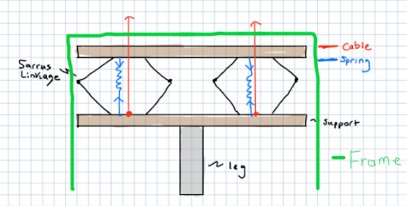

# Biomechanics Background and Initial Specifications
## Description 
[Assignment Instructions](https://egr557.github.io/assignments/biomechanics-background-and-initial-specificaitons.html)

## Team Response
>**Content**\
[Candidate Organism for Bio Inspiration](#Candidate-Organism-for-Bio-Inspiration)\
[Bio-inspired Robots](#Bio-inspired-Robots)\
[Table of relevant info](#Table-of-relevant-info)\
[Extrapolation (Fill in the gaps)](#Extrapolation-(Fill-in-the-gaps))\
  -[Kinetic Energy](#Kinetic-Energy)\
  -[Ground Reaction Force](#Ground-Reaction-Force)\
  -[Axial Acceleration](#Axial-Acceleration)\
  -[Metabolic Rate](#Metabolic-Rate)\
[Figures from literature](#Figures-from-literature)\
[Simple engineering drawing](#Simple-engineering-drawing)\
[Discussion](#Discussion)\
  -[Rationale for animal](#Rationale-for-animal)\
  -[Motor and battery](#Motor-and-battery)\
[Plots and Figures](#Plots-and-Figures)\
[References](#References)

### Candidate Organism for Bio Inspiration
Team 5 sought bio-inspiration from the Crossaster papposus, which is also referred to as a starfish. The mechanism that Team 5 aspires to model their system after is the starfish podia, or tube feet, which allow the starfish to move; these podia can be seen in number 15 of figure 1.

\
Fig 1 Anatomy of StarFish

One of our initial tasks was to find multiple sources that are closely related to our area of research to obtain physical quantities and develop initial specifications for our robot. The team found a  number of relevant articles [x]–[x] (along with several websites), 1 of which will be especially valuable to the project and will be described in greater detail below. The podia of the starfish use a unique locomotion that ultimately allows the starfish to move.
Work # explains the locomotion that is produced from “The thousands of podia each take alternating power and recovery strokes, making movement of the entire animal smooth. When moving this way, the body shape of asteroids (sea stars) remains constant given the movement of individual podia along the lower surface of the arms” [washington paper].
The podia take in water from one position, relocate themselves and then dissipate the water in the new position of the podia.
The displacement of water is not the main aspect of the podia that will be adapted in the project; moreso the ability of the podia to reposition itself and lift the starfish.
When the water is dissipated there is a small lift that takes place, but with thousands of podia, motion is then established and the starfish’s unique gait pattern is then created [science direct]. 
The podia have been used to inspire several starfish bio-inspired robots, although a large amount of these robots utilize hydraulics, which is not desirable for the project at hand. 

### Bio-inspired Robots
The most important starfish bio-inspired robots that related to our projects were papers (list papers).
These papers demonstrated the function of the podia in a robotic nature as well as the gait pattern of the starfish, both important aspects of the desired project.
Of these papers, [harvard paper]  based its robot solely off of the podia of the starfish, which is the intended design for the robot that will be built for EGR 557.
The robot from work [harvard paper] utilized a silicon molded component to serve as the podia shaft of the starfish. These silicon podia were multi-layered, much like a telescope to where the inner layers were able to bend with the outer layers. In the middle of the silicon cylinder lies a magnet and wire mesh and the combination of these with the use of four PWM waves in MATLAB the wheel of podia can be controlled.
The motion in this work, very closely resembles the motion that would be desirable for the foldable podia robot for EGR 557.

### Table of relevant info
The information collected from our most significant references along with other sources was collated into the table of animal specifications below.

_Table 1 Information on STarfish_

| Parameter      | Unit | Value Range | Reference |
| --- | --- | --- | --- |

| Body mass | grams| Up to 4989.516|

| Max Speed | m/s| 0.268224|

| Single Podium Force | N| 0.245 - 0.294|

| Podia Pressure |Pa| 62052.82|

| Size |mm|119.38 - 238.76|

| Longitudinal Young's modulus of body wall |MPa | 267|

| Transverse Young's modulus of body wall | MPa | 249|

### Extrapolation
Below, we present math models  of some extra metrics using some of the details in the above table.

#### Kinetic Energy 
The kinetic energy of the earthworm can be calculated by using classical mechanics.\
It refers to  the energy expended or required by an object to move and is dependent on the mass and velocity  of the object. 
The formula is given as  , where _m_ is the mass, and _v_ is the velocity.\
Using the maximum speed and body mass of the starfish, the kinetic energy is calculated as  from 0.179 J.

#### Metabolic Rate 
The team’s literature search did not provide a quantitative value for the metabolic rate of the  earthworm.\
We calculated the metabolic rate using Kleiber’s law2 which states that the metabolic rate is the mass of the organism to the power of ¾. \
Using this and the body mass, the metabolic rate of the starfish is 3.34cal. 

### Figures from literature

### Simple engineering drawing
\
Fig 3 Proposed Movement Mechanism - Haand drawing
\
Fig 4 Proposed Movement Mechanism - SolidWorks

Figures 3 and 4 both depict the initial drawings of the proposed mechanism.\
The mechanism consists of two sarrus linkages with springs between the translational motion plates, and a cable connected to the main actuator.\
Our goal for the system is to create the mechanism using low cost parts and decide on  advancing to higher cost parts depending on the course.\
Purposely, we left some materials and  methods vague. Although we are undecided on a final material, we have decided on an actuator that we will use to drive the sarrus linkages, this being a DC motor.
The motion that we intend to get from this mechanism is a walking motion in the positive or negative direction in the x-direction.
Both motors will actuate in series and drive the compression spring to lift the corresponding side of the mechanism to move the leg in the direction of the compressed sarrus linkage. 

### Discussion
#### Rationale for animal
_Discuss / defend your rationale for the size animal you selected in terms of your ability to replicate key features remotely with limited material selection._

The animal that we chose to model or system after is a starfish, but specifically from the starfish we will be imitating the podia.
Since it takes thousands of podia to create the gait pattern of the starfish, we will need to scale up the forces in our design.
To create a left-to-right motion, there should be no more than two actuators, so our materials should be minimal.
As it can be seen from the table of animal specifications, the forces are very small, so even scaled up, that force can easily be generated from a small DC motor.

#### Motor and battery
_Find a motor and battery that can supply the mechanical power needs obtained above. Consider that motor efficiencies may be as high as 95%, but if you can’t find it listed, assume you find a more affordable motor at 50-70% efficiency. Compare the mechanical watts/kg for the necessary motor and battery vs the animal’s mechanical power/mass above? Which one is more energy dense?_

With the forces stated in the first question, it can be seen that there is not a need for a  significantly strong motor to imitate the force produced from the podia of a starfish.
A simple 12V DC motor such as a RF370CA-15370 DC motor would prove to be more than sufficient for the required force. Running at 12 V the DC motor outputs 25.3 g-cm, and the maximum output torque of a podia scaled will not be greater than the supply. 
As previously stated, the RF370CA-15370 DC motor runs off of 12 V, so an A23 battery could be used as it supplies 12 V.
Considering the  weight-to-power ratio of the podia to the power of the DC motor, the DC motor is far more energy dense; due to the fact that it takes thousands of podia to move a starfish.

### Plots and Figures

### References
