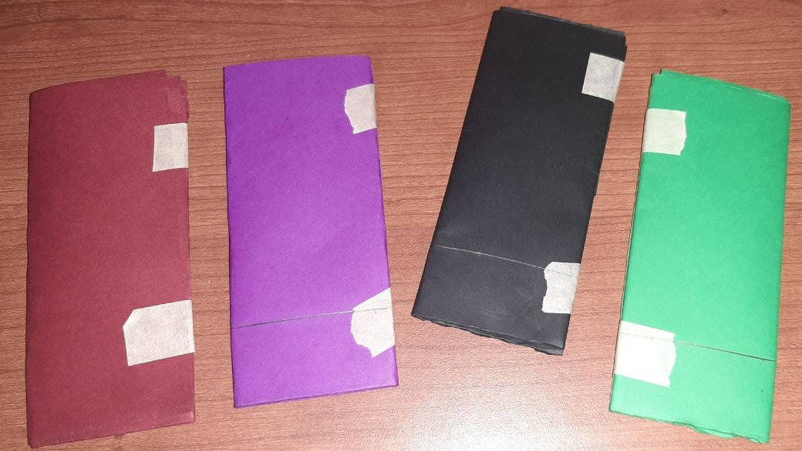
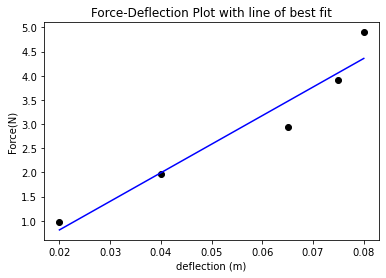
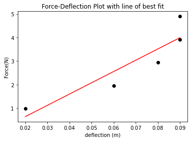
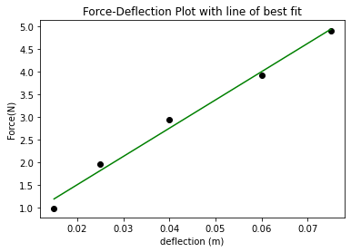

# EGR 557: Cantilever Beam Experiment
Gilgal Ansah

1. 4 Rectangular CardStock Beams



2. Table of thickness

Color|Thickness 1(mm)|Thickness 2(mm)|Average(mm)
-|-|-|-
Violet|4.2|3.4|3.8
Red|4.4|5.3|4.85
Green|4.8|3.4|4.1
Black|4.3|3.7|4.0

The beam dimensions used were $50.8mm\times 125mm$.
The $50.8mm$ was used because that corresponds to the width dimensions of our sarrus linkages.

3-6. Experiments

5 mass values were used to produce a total of 15 deflection/force results. 
They ranged from 100 to 500 grams in 100g increments.

In the experiments, the black beam stayed on top whiles the others were used to produce the recorded values. 

The images below show the different configuration setups used in the experiments. 

###### Violet beam


<p style="text-align: center;">Unloaded</p>


<p style="text-align: center;">100g</p>


<p style="text-align: center;">200g</p>


<p style="text-align: center;">300g</p>


<p style="text-align: center;">400g</p>


<p style="text-align: center;">500g</p>

###### Red beam


<p style="text-align: center;">Unloaded</p>


<p style="text-align: center;">100g</p>


<p style="text-align: center;">200g</p>


<p style="text-align: center;">300g</p>


<p style="text-align: center;">400g</p>


<p style="text-align: center;">500g</p>

###### Green beam


<p style="text-align: center;">Unloaded</p>


<p style="text-align: center;">100g</p>


<p style="text-align: center;">200g</p>


<p style="text-align: center;">300g</p>


<p style="text-align: center;">400g</p>


<p style="text-align: center;">500g</p>

2. Table of deflections

Mass(g)|Deflection_Violet(cm)|Deflection_Red(cm)|Deflection_Green(cm)
-|-|-|-
100|2.0|2.0|1.5
200|4.0|6.0|2.5
300|6.5|8.0|4.0
400|7.5|9.0|6.0
500|8.0|9.0|7.5

### Plots and Calculations


```python
import numpy as np
import matplotlib.pyplot as plt

masses=list(range(100,600,100))
forces = [9.8*x/1000 for x in masses]
l=0.125 #length
w=0.0508 #width
t=0.0038 #thickness
I=w*(t**3)/12 #Inertia

```


```python
#violet beam

vDeflect = [2,4,6.5,7.5,8.0]
vDeflect = [0.01*x for x in vDeflect]

plt.scatter(vDeflect,forces,color="black")
plt.title("Force-Deflection Plot with line of best fit")
plt.xlabel("deflection (m)")
plt.ylabel("Force(N)")

linear_model=np.polyfit(vDeflect,forces,1)
linear_model_fn=np.poly1d(linear_model)
x_s=np.arange(0,1.5)
plt.plot(vDeflect,linear_model_fn(vDeflect),color="blue")
plt.show()
```


    

    


```python
FD=linear_model[0] #slope
E=(FD*(l**3))/(3*I) #Young modulus
E
```


    165653333.11228323


$E = \frac{Pl^3}{3\delta I} =165653333.11228323 Nm^{-2}$


```python
#red beam

rDeflect = [2,6,8,9,9]
rDeflect = [0.01*x for x in rDeflect]

plt.scatter(rDeflect,forces,color="black")
plt.title("Force-Deflection Plot with line of best fit")
plt.xlabel("deflection (m)")
plt.ylabel("Force(N)")

linear_model=np.polyfit(rDeflect,forces,1)
linear_model_fn=np.poly1d(linear_model)

plt.plot(rDeflect,linear_model_fn(rDeflect),color="red")
plt.show()
```


    

    


```python
FD=linear_model[0] #slope
E=(FD*(l**3))/(3*I) #Young modulus
E
```


    134174900.32769114


$E = \frac{Pl^3}{3\delta I} =134174900.32769114 Nm^{-2}$


```python
#green beam

gDeflect = [1.5,2.5,4,6,7.5]
gDeflect = [0.01*x for x in gDeflect]

plt.scatter(gDeflect,forces,color="black")
plt.title("Force-Deflection Plot with line of best fit")
plt.xlabel("deflection (m)")
plt.ylabel("Force(N)")

linear_model=np.polyfit(gDeflect,forces,1)
linear_model_fn=np.poly1d(linear_model)

plt.plot(gDeflect,linear_model_fn(gDeflect),color="green")
plt.show()
```


    

    


```python
FD=linear_model[0] #slope
E=(FD*(l**3))/(3*I) #Young modulus
E
```


    175197146.5426206


$E = \frac{Pl^3}{3\delta I} = 175197146.5426206 Nm^{-2}$


```python
E_mean = np.mean([175197146.5426206,134174900.32769114,165653333.11228323])
E_mean
```


    158341793.32753167


Using the mean of the 3 values, the yound modulus is approximated as\
$E= 158MPa$

The formula for stiffness $k$ is given as \

$k=E\cdot {\frac {A}{L}}$


where

    E is the (tensile) elastic modulus (or Young's modulus),
    A is the cross-sectional area,
    L is the length of the element.


```python
k = E_mean*t*w/l
k
```


    244530.39827157368


$k= 244530Nm^{-1}$
