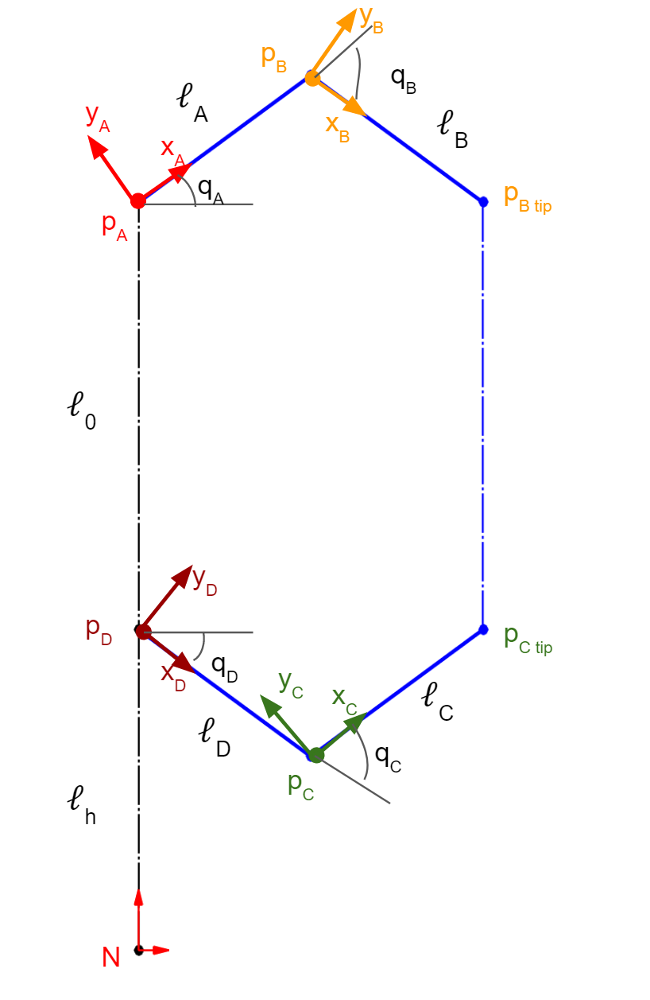
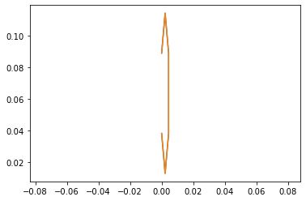
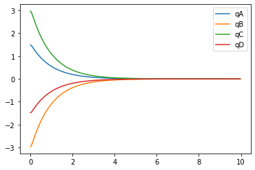
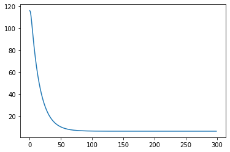
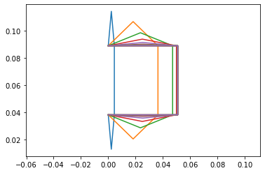
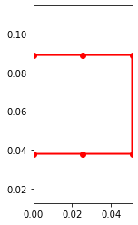

```python
%matplotlib inline
```


```python
global_q = False
use_constraints = True
```


```python
!pip install pypoly2tri idealab_tools foldable_robotics pynamics
```

    Requirement already satisfied: pypoly2tri in c:\users\ansah\anaconda3\lib\site-packages (0.0.3)
    Requirement already satisfied: idealab_tools in c:\users\ansah\anaconda3\lib\site-packages (0.0.22)
    Requirement already satisfied: foldable_robotics in c:\users\ansah\anaconda3\lib\site-packages (0.0.29)
    Requirement already satisfied: pynamics in c:\users\ansah\anaconda3\lib\site-packages (0.0.7)
    Requirement already satisfied: pyyaml in c:\users\ansah\anaconda3\lib\site-packages (from foldable_robotics) (5.3.1)
    Requirement already satisfied: matplotlib in c:\users\ansah\anaconda3\lib\site-packages (from foldable_robotics) (3.3.2)
    Requirement already satisfied: shapely in c:\users\ansah\anaconda3\lib\site-packages (from foldable_robotics) (1.7.1)
    Requirement already satisfied: ezdxf in c:\users\ansah\anaconda3\lib\site-packages (from foldable_robotics) (0.15)
    Requirement already satisfied: numpy in c:\users\ansah\anaconda3\lib\site-packages (from foldable_robotics) (1.19.2)
    Requirement already satisfied: imageio in c:\users\ansah\anaconda3\lib\site-packages (from idealab_tools) (2.9.0)
    Requirement already satisfied: scipy in c:\users\ansah\anaconda3\lib\site-packages (from pynamics) (1.5.2)
    Requirement already satisfied: sympy in c:\users\ansah\anaconda3\lib\site-packages (from pynamics) (1.7.1)
    Requirement already satisfied: pyparsing>=2.0.1 in c:\users\ansah\anaconda3\lib\site-packages (from ezdxf->foldable_robotics) (2.4.7)
    Requirement already satisfied: pillow in c:\users\ansah\anaconda3\lib\site-packages (from imageio->idealab_tools) (8.1.0)
    Requirement already satisfied: cycler>=0.10 in c:\users\ansah\anaconda3\lib\site-packages (from matplotlib->foldable_robotics) (0.10.0)
    Requirement already satisfied: python-dateutil>=2.1 in c:\users\ansah\anaconda3\lib\site-packages (from matplotlib->foldable_robotics) (2.8.1)
    Requirement already satisfied: kiwisolver>=1.0.1 in c:\users\ansah\anaconda3\lib\site-packages (from matplotlib->foldable_robotics) (1.3.0)
    Requirement already satisfied: certifi>=2020.06.20 in c:\users\ansah\anaconda3\lib\site-packages (from matplotlib->foldable_robotics) (2020.12.5)
    Requirement already satisfied: six in c:\users\ansah\anaconda3\lib\site-packages (from cycler>=0.10->matplotlib->foldable_robotics) (1.15.0)
    Requirement already satisfied: mpmath>=0.19 in c:\users\ansah\anaconda3\lib\site-packages (from sympy->pynamics) (1.1.0)
    


```python
# -*- coding: utf-8 -*-
"""
Written by Daniel M. Aukes
Email: danaukes<at>gmail.com
Please see LICENSE for full license.
"""

import pynamics
from pynamics.frame import Frame
from pynamics.variable_types import Differentiable,Constant
from pynamics.system import System
from pynamics.body import Body
from pynamics.dyadic import Dyadic
from pynamics.output import Output,PointsOutput
from pynamics.particle import Particle
import pynamics.integration
import sympy
import numpy
import scipy.optimize
import matplotlib.pyplot as plt
plt.ion()
from math import pi
```


```python
system = System()
pynamics.set_system(__name__,system)
```


```python

```

# Proposed System Kinematics v2





## Parameterization

### Constants


```python
h = Constant(0.0381, 'h',system) #height off the ground due to the front plate (can be set to 0 in the future)
l0 = Constant(0.0508,'l0',system)
la = Constant(0.0254,'la',system)
lb = Constant(0.0254,'lb',system)
lc = Constant(0.0254,'lc',system)
ld = Constant(0.0254,'ld',system)

#Changed to smaller weight to be more reasonable with the system
mA = Constant(.01,'mA',system)
mB = Constant(.01,'mB',system)
mC = Constant(.01,'mC',system)
mD = Constant(.01,'mC',system)


g = Constant(9.81,'g',system)
b = Constant(1e1,'b',system) #damping
k = Constant(1e1,'k',system) #spring force

#spring preloads to system
preload1 = Constant(20*pi/180,'preload1',system) # At-rest angle of NA (A w.r.t. N)
preload2 = Constant(-40*pi/180,'preload2',system) # At-rest angle of AB (B w.r.t. A)
preload3 = Constant(-40*pi/180,'preload3',system) # At-rest angle of DC (C w.r.t. D)
preload4 = Constant(20*pi/180,'preload4',system) # At-rest angle of ND (D w.r.t. N)
 


Ixx_A = Constant(1,'Ixx_A',system)
Iyy_A = Constant(1,'Iyy_A',system)
Izz_A = Constant(1,'Izz_A',system)
Ixx_B = Constant(1,'Ixx_B',system)
Iyy_B = Constant(1,'Iyy_B',system)
Izz_B = Constant(1,'Izz_B',system)
Ixx_C = Constant(1,'Ixx_C',system)
Iyy_C = Constant(1,'Iyy_C',system)
Izz_C = Constant(1,'Izz_C',system)
Ixx_D = Constant(1,'Ixx_D',system)
Iyy_D = Constant(1,'Iyy_D',system)
Izz_D = Constant(1,'Izz_D',system)

```


```python
tol = 1e-12
```


```python
#Animation stuff
tinitial = 0
tfinal = 10
fps = 30
tstep = 1/fps
t = numpy.r_[tinitial:tfinal:tstep]
```


```python
# Creating dynamic state variables. system argument denotes them as state variables for pynamics system from above
qA,qA_d,qA_dd = Differentiable('qA',system) #Angle between N and A
qB,qB_d,qB_dd = Differentiable('qB',system) #from AB
qC,qC_d,qC_dd = Differentiable('qC',system)
qD,qD_d,qD_dd = Differentiable('qD',system) #from DE

```


```python
#Initial condition based geometrically off of a solidworks model
#given 85 and 170 puts it into the 'compressed' state
#2bar
initialvalues = {}
# Setting initial angle values. See above for angle positions
#Listed are important angle configurations
#Smallest(Compressed) 85,170
#Middle ~45,90
#Largest(Extended) 0,0
initialvalues[qA]=85*pi/180  #45
initialvalues[qA_d]=0*pi/180 
initialvalues[qB]=-170*pi/180   #-90
initialvalues[qB_d]=0*pi/180

initialvalues[qC]=170*pi/180 #90
initialvalues[qC_d]=0*pi/180
initialvalues[qD]=-85*pi/180   #-45
initialvalues[qD_d]=0*pi/180
```


```python
statevariables = system.get_state_variables() # tried running this after vector calculation like i kinematics, but no apparent change...
ini0 = [initialvalues[item] for item in statevariables]
```


```python
N = Frame('N') # Initializing frames
A = Frame('A')
B = Frame('B')
C = Frame('C')
D = Frame('D')
```


```python
system.set_newtonian(N)
```


```python
#if not global_q:
#set rotation logic of frames. Kept all z at one and left the negative value in the initial condition calculation
#changing this caused errors in the system
A.rotate_fixed_axis_directed(N,[0,0,1],qA,system) # A reference frame rotates about N's ref frame in Z direction by qA amount
B.rotate_fixed_axis_directed(A,[0,0,1],qB,system)
C.rotate_fixed_axis_directed(D,[0,0,1],qC,system)
D.rotate_fixed_axis_directed(N,[0,0,1],qD,system)

#rotate each about the global reference frame. Add if else later to see which method is simpler
#else:
#  A.rotate_fixed_axis_directed(N,[0,0,1],qA,system) # A reference frame rotates about N's ref frame in Z direction by qA amount
#  B.rotate_fixed_axis_directed(N,[0,0,1],qB,system)
#  C.rotate_fixed_axis_directed(N,[0,0,1],qC,system)
#  D.rotate_fixed_axis_directed(N,[0,0,1],qD,system)
```

Vectors

claculated by using solving the two 2bar problem. Each vector containts the length constant and the previous point given the local reference frame. 


```python

pA = 0*N.x + (l0 + h)*N.y + 0*N.z

pB = pA + la*A.x
pBtip = pB + lb*B.x

pD = 0*N.x + h*N.y + 0*N.z
pC = pD + ld*D.x
pCtip = pC + lc*C.x

```

Center of mass

Considered the midpoint of each link as they will be uniform in size and material


```python
pAcm=pA+(la/2)*A.x
pBcm=pB+(lb/2)*B.x
pCcm=pC+(lc/2)*C.x
pDcm = pD + (ld/2)*D.x
pBCcm = pCtip + (l0/2)*N.y #get end effector 
```

Angular Velocity


```python
wNA = N.getw_(A) #Angular velocity of vector A w.r.t. N
wAB = A.getw_(B) #Angular velocity of vector B w.r.t. A
wDC = D.getw_(C) #Angular velocity of vector C w.r.t. D
wND = N.getw_(D) #Angular velocity of vector D w.r.t. N
```


```python
#vCtip = pCtip.time_derivative(N,system)
```

Define Inertias & Bodies


```python
IA = Dyadic.build(A,Ixx_A,Iyy_A,Izz_A)
IB = Dyadic.build(B,Ixx_B,Iyy_B,Izz_B)
IC = Dyadic.build(C,Ixx_C,Iyy_C,Izz_C)
ID = Dyadic.build(D,Ixx_D,Iyy_D,Izz_D)


BodyA = Body('BodyA',A,pAcm,mA,IA,system)
BodyB = Body('BodyB',B,pBcm,mB,IB,system)
BodyC = Body('BodyC',C,pCcm,mC,IC,system)
BodyD = Body('BodyD',D,pDcm,mD,ID,system)
BodyBCp = Particle(pBCcm,mB,'ParticleBC',system) #would we also need bodyE 
```

Forces & Torques

Defines the system forces, mainly relying on the spring force


```python
system.addforce(-b*wNA,wNA)
system.addforce(-b*wAB,wAB)
system.addforce(-b*wDC,wDC)
system.addforce(-b*wND,wND)

```


    <pynamics.force.Force at 0x1ad87f0ed30>


```python
##########################################
#Shouldn't we only consider spring force on one point ? 
#########################################
#if not global_q:
system.add_spring_force1(k,(qA-preload1)*N.z,wNA)
system.add_spring_force1(k,(qB-preload2)*A.z,wAB)
system.add_spring_force1(k,(qC-preload3)*D.z,wDC)
system.add_spring_force1(k,(qD-preload4)*N.z,wND)
  
#else:
#    system.add_spring_force1(k,(qA-preload1)*N.z,wNA) 
#    system.add_spring_force1(k,(qB-qA-preload2)*N.z,wAB)
#    system.add_spring_force1(k,(qC-qD-preload3)*N.z,wDC)
#    system.add_spring_force1(k,(qD-preload4)*N.z,wND)
```


    (<pynamics.force.Force at 0x1ad87f9e6d0>,
     <pynamics.spring.Spring at 0x1ad87f9e970>)


```python
system.addforcegravity(-g*N.y)
```

Constraints

Constrains the system based off of our system kinematics. (see image above for proposed system kinematics v2)


```python
#Define the closed loop kinematics of the four bar linkage.
#eq_vector = pB - pC
eq_vector1 = pCtip - pBtip

#overconstriants 
eq_vector2 = pBtip - pA
#eq_vector3 = pCtip - pD
```


```python
eq = []
if use_constraints:
    eq.append((eq_vector1).dot(N.x)) #same x value for B and C tip
    eq.append((eq_vector1).length() - l0) #length constraint between B and C tip
    #eq.append((eq_vector).dot(N.x)) #B and C have same x 

#overconstraints test
    eq.append((eq_vector2).dot(N.y)) #pBtip and pA have same y value (move in x)
    #eq.append((eq_vector3).dot(N.y))
    
eq_d=[(system.derivative(item)) for item in eq]
eq_dd=[(system.derivative(item)) for item in eq_d]
```


```python
qi = [qA]
qd = [qB,qC,qD]
```


```python
constants = system.constant_values.copy() # Recalls link lengths declared near beginning
defined = dict([(item,initialvalues[item]) for item in qi])
constants.update(defined)
```


```python
eq = [item.subs(constants) for item in eq]
```


```python
error = (numpy.array(eq)**2).sum()
```


```python
f = sympy.lambdify(qd,error)

def function(args):
    return f(*args)
```


```python
guess = [initialvalues[item] for item in qd]
```


```python
result = scipy.optimize.minimize(function,guess)
#result <- able to call result in kinematics but not here for some reason
```


```python
ini = []
for item in system.get_state_variables():
    if item in qd:
        ini.append(result.x[qd.index(item)])
    else:
        ini.append(initialvalues[item])
```


```python
points = [pA,pB,pBtip,pCtip,pC,pD]
#points_output = PointsOutput(points,system)
points_output = PointsOutput(points, constant_values=system.constant_values)
#points.calc(numpy.array([ini0,ini]))
```


```python
#ini
```


```python
#ini0 # ini and ini0 returning same values
```

All of this code is from system kinematics. Having this verifies the initial coniditon is valid and correct


```python
points = PointsOutput(points, constant_values=system.constant_values)
points.calc(numpy.array([ini0,ini]))
points.plot_time()
```

    2021-02-28 02:37:39,916 - pynamics.output - INFO - calculating outputs
    2021-02-28 02:37:40,028 - pynamics.output - INFO - done calculating outputs
    


    

    


F = ma


```python
f,ma = system.getdynamics()
```

    2021-02-28 02:37:40,223 - pynamics.system - INFO - getting dynamic equations
    


```python
#f
```


```python
#ma
```

Solve for Acceleration 


```python
func1,lambda1 = system.state_space_post_invert(f,ma,eq_dd,return_lambda = True)
```

    2021-02-28 02:37:40,450 - pynamics.system - INFO - solving a = f/m and creating function
    2021-02-28 02:37:40,453 - pynamics.system - INFO - substituting constrained in Ma-f.
    2021-02-28 02:37:43,815 - pynamics.system - INFO - done solving a = f/m and creating function
    2021-02-28 02:37:43,816 - pynamics.system - INFO - calculating function for lambdas
    

Integrate


```python
states=pynamics.integration.integrate(func1,ini,t,rtol=tol,atol=tol, args=({'constants':system.constant_values},))
```

    2021-02-28 02:37:43,881 - pynamics.integration - INFO - beginning integration
    2021-02-28 02:37:43,883 - pynamics.system - INFO - integration at time 0000.00
    2021-02-28 02:37:51,269 - pynamics.system - INFO - integration at time 0004.83
    2021-02-28 02:37:53,462 - pynamics.integration - INFO - finished integration
    

Outputs

We can see all the angle values appraoch 0 over time. For us 0 referes to the most extended state of the sarrus linkage


```python
plt.figure()
artists = plt.plot(t,states[:,:4])
plt.legend(artists,['qA','qB','qC','qD'])
```


    <matplotlib.legend.Legend at 0x1ad89896d60>


    

    


Energy

Energy decreases to 0 as the system comes to rest


```python
KE = system.get_KE()
PE = system.getPEGravity(pA) - system.getPESprings()
energy_output = Output([KE-PE],system)
energy_output.calc(states)
energy_output.plot_time()
```

    2021-02-28 02:37:53,720 - pynamics.output - INFO - calculating outputs
    2021-02-28 02:37:53,730 - pynamics.output - INFO - done calculating outputs
    


    

    


Motion

The system springs open from compressed to extended. This is how we intend to use springs in our system


```python
#points = [pA,pB,pBtip,pCtip,pC,pD]
#points_output = PointsOutput(points,system)
y = points_output.calc(states)
points_output.plot_time(20)
```

    2021-02-28 02:37:53,839 - pynamics.output - INFO - calculating outputs
    2021-02-28 02:37:53,851 - pynamics.output - INFO - done calculating outputs
    


    

    


```python
points_output.animate(fps = fps,movie_name = 'render.mp4',lw=2,marker='o',color=(1,0,0,1),linestyle='-')
```


    

    


```python
from matplotlib import animation, rc
from IPython.display import HTML
HTML(points_output.anim.to_html5_video())
```


<video width="432" height="288" controls autoplay loop>
  <source type="video/mp4" src="render.mp4">
</video>


Next Steps:

How to control the spring force to 'oscillate' around a point

Contain the spring so that is settles before the fully extended position to prevent singularities. 

Factor in a cable (actuator) force to oppose spring force


