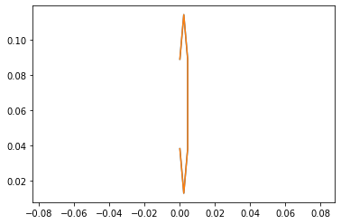
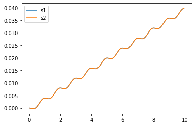
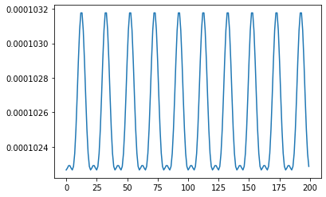
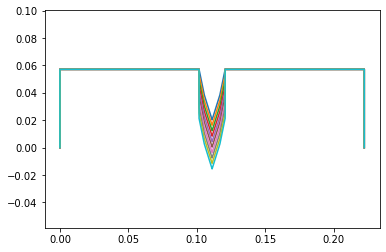
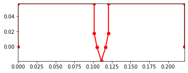

# System Dynamics

## Description
[Assignment Instructions](https://egr557.github.io/assignments/system-dynamics-I.html)

## Team Response

```python
%matplotlib inline
```


```python
global_q = False
use_constraints = True
```


```python
!pip install pypoly2tri idealab_tools foldable_robotics pynamics
```

    Requirement already satisfied: pypoly2tri in /usr/local/lib/python3.7/dist-packages (0.0.3)
    Requirement already satisfied: idealab_tools in /usr/local/lib/python3.7/dist-packages (0.0.22)
    Requirement already satisfied: foldable_robotics in /usr/local/lib/python3.7/dist-packages (0.0.29)
    Requirement already satisfied: pynamics in /usr/local/lib/python3.7/dist-packages (0.0.8)
    Requirement already satisfied: imageio in /usr/local/lib/python3.7/dist-packages (from idealab_tools) (2.4.1)
    Requirement already satisfied: pyyaml in /usr/local/lib/python3.7/dist-packages (from foldable_robotics) (3.13)
    Requirement already satisfied: matplotlib in /usr/local/lib/python3.7/dist-packages (from foldable_robotics) (3.2.2)
    Requirement already satisfied: numpy in /usr/local/lib/python3.7/dist-packages (from foldable_robotics) (1.19.5)
    Requirement already satisfied: shapely in /usr/local/lib/python3.7/dist-packages (from foldable_robotics) (1.7.1)
    Requirement already satisfied: ezdxf in /usr/local/lib/python3.7/dist-packages (from foldable_robotics) (0.15.2)
    Requirement already satisfied: sympy in /usr/local/lib/python3.7/dist-packages (from pynamics) (1.7.1)
    Requirement already satisfied: scipy in /usr/local/lib/python3.7/dist-packages (from pynamics) (1.4.1)
    Requirement already satisfied: pillow in /usr/local/lib/python3.7/dist-packages (from imageio->idealab_tools) (7.0.0)
    Requirement already satisfied: pyparsing!=2.0.4,!=2.1.2,!=2.1.6,>=2.0.1 in /usr/local/lib/python3.7/dist-packages (from matplotlib->foldable_robotics) (2.4.7)
    Requirement already satisfied: cycler>=0.10 in /usr/local/lib/python3.7/dist-packages (from matplotlib->foldable_robotics) (0.10.0)
    Requirement already satisfied: kiwisolver>=1.0.1 in /usr/local/lib/python3.7/dist-packages (from matplotlib->foldable_robotics) (1.3.1)
    Requirement already satisfied: python-dateutil>=2.1 in /usr/local/lib/python3.7/dist-packages (from matplotlib->foldable_robotics) (2.8.1)
    Requirement already satisfied: mpmath>=0.19 in /usr/local/lib/python3.7/dist-packages (from sympy->pynamics) (1.2.1)
    Requirement already satisfied: six in /usr/local/lib/python3.7/dist-packages (from cycler>=0.10->matplotlib->foldable_robotics) (1.15.0)
    


```python
# -*- coding: utf-8 -*-
"""
Written by Daniel M. Aukes
Email: danaukes<at>gmail.com
Please see LICENSE for full license.
"""

#importing packages
import sympy
sympy.init_printing(pretty_print=False)

import pynamics
from pynamics.frame import Frame
from pynamics.variable_types import Differentiable,Constant,Variable
from pynamics.system import System
from pynamics.body import Body
from pynamics.dyadic import Dyadic
from pynamics.output import Output,PointsOutput
from pynamics.particle import Particle
import pynamics.integration
import pynamics.tanh
import scipy.optimize
import sympy
from sympy import sin
import numpy
import matplotlib.pyplot as plt
plt.ion()
from math import pi
import math
```


```python
system = System()
pynamics.set_system(__name__,system)
```


```python

```

# Proposed System Kinematics v2


## Parameterization

### Constants


```python
#Base Structure
l0 = Constant(0.05715, 'l0',system) # 2.25" * 0.0254 m/in = 0.05715
l1 = Constant(0.22225, 'l1',system) # 8.75" = 0.22225m
l2 = Constant(0.1016, 'l2',system) # 4" = 0.1016m
l3 = Constant(0.12065, 'l3',system) # 4.75" = 0.12065m
ls = Constant(0.009525,'ls',system) # 0.375" = 0.009525m
#Leg Sections
lL = Constant(0.01905, 'lL',system) # 0.75" = 0.01905m

#Mass Constants
mFrame = Constant(.05,'mLeft',system) 
#mRight = Constant(.005,'mRight',system)
mLeg = Constant(.005,'mLeg',system)

#Gravity/Damping/Spring Force
g = Constant(9.81,'g',system)
b = Constant(1e1,'b',system) #damping
k = Constant(1e-1,'k',system) #spring force


#spring preloads to system
preload1 = Constant(0*pi/180,'preload1',system)
preload2 = Constant(0*pi/180,'preload2',system)
preloadS = Constant(0.04572,'preloadS',system) #Sarrus at rest at ~1.8 inches 1.8" = 0.04572m


#Inertia of body A
Ixx_A = Constant(1,'Ixx_A',system)
Iyy_A = Constant(1,'Iyy_A',system)
Izz_A = Constant(1,'Izz_A',system)

```


```python
tol = 1e-12
```


```python
#Animation stuff
tinitial = 0
tfinal = 10
fps = 20
tstep = 1/fps
t = numpy.r_[tinitial:tfinal:tstep]
```


```python
# Creating dynamic state variables. system argument denotes them as state variables for pynamics system from above
#Frame angle from N
qA,qA_d,qA_dd = Differentiable('qA',system) #Angle between N and A
#Leg angles
q1,q1_d,q1_dd = Differentiable('q1',system)
q2,q2_d,q2_dd = Differentiable('q2',system)
q3,q3_d,q3_dd = Differentiable('q3',system)
q4,q4_d,q4_dd = Differentiable('q4',system)

#Sarrus extensions
s1,s1_d,s1_dd = Differentiable('s1',system) #should move in A.y
s2,s2_d,s2_dd = Differentiable('s2',system)
```


```python
initialvalues = {}

#Frame constants
initialvalues[qA]=0*pi/180 
initialvalues[qA_d]=0*pi/180 

#Leg angle init Values
initialvalues[q1]=0*pi/180  
initialvalues[q1_d]=0*pi/180 
initialvalues[q2]=0*pi/180   
initialvalues[q2_d]=0*pi/180
initialvalues[q3]=0*pi/180 
initialvalues[q3_d]=0*pi/180
initialvalues[q4]=0*pi/180   
initialvalues[q4_d]=0*pi/180

#Sarrus linkages init extension
initialvalues[s1] = 0.0          #initially both compressed, then will end with right fully extended 0.5" = 0.0127m
initialvalues[s1_d] = 0  #0         #xhanged s1 and s2 velocities. Changing s2 makes it go through 0 as ptip 2 does not have ground constraint
initialvalues[s2] = 0.0          # 0.5" = 0.0127m
initialvalues[s2_d] = 0  #0

```


```python
statevariables = system.get_state_variables() # tried running this after vector calculation like i kinematics, but no apparent change...
ini0 = [initialvalues[item] for item in statevariables]
```


```python
# Initializing frames

#Newtonian
N = Frame('N')
A = Frame('A')
L1 = Frame('L1')
L2 = Frame('L2')
L3 = Frame('L3')
L4 = Frame('L4')
```


```python
system.set_newtonian(N)
```


```python
#Axis rotations

#Frame axis A
A.rotate_fixed_axis_directed(N,[0,0,1],qA,system)

#Leg
#left side of leg from sarrus 1
L1.rotate_fixed_axis_directed(A,[0,0,1],q1,system)
L2.rotate_fixed_axis_directed(L1,[0,0,1],q2,system)
#right side of leg from sarrus 2
L4.rotate_fixed_axis_directed(A,[0,0,1],q4,system)
L3.rotate_fixed_axis_directed(L4,[0,0,1],q3,system)
```

Vectors

claculated by using solving the two 2bar problem. Each vector containts the length constant and the previous point given the local reference frame. 


```python
#Define vectors/Frame/point Locations
pAcm = (l2+ls)*N.x + l0*N.y
#Sarrus extension frames
ps1 = pAcm - ls*A.x
ps2 = pAcm + ls*A.x

pB = ps1  -l2*A.x
pC = ps2  + l2*A.x
pA = pB - l0*A.y
pD = pC - l0*A.y


pL1 = ps1 - s1*A.y
pL2 = pL1 - lL*L1.y
pL4 = ps2 - s2*A.y
pL3 = pL4 - lL*L4.y

pLtip1 = pL2 - lL*L2.y
pLtip2 = pL3 - lL*L3.y

```

Center of mass

Considered the midpoint of each link as they will be uniform in size and material


```python
#Define the locations of the masses
mLocFrame = pAcm
mLocL1 = pL1 - (lL/2)*L1.y
mLocL2 = pL2 - (lL/2)*L2.y
mLocL4 = pL4 - (lL/2)*L4.y
mLocL3 = pL3 - (lL/2)*L3.y

mLocLeftFrame = pA + (l0/2)*A.y
mLocRightFrame = pD + (l0/2)*A.y
```

Angular Velocity and Velocity


```python
#Angular Velocity, w (omega)
wL1 = A.getw_(L1) 
wL2 = L1.getw_(L2)
wL4 = A.getw_(L4)
wL3 = L4.getw_(L3)

#Velocities
vFrame = pAcm.time_derivative() # with no parameters, defaults to (N,system)
vLeg = pLtip1.time_derivative()
vpA = pA.time_derivative()
vpD = pD.time_derivative()

vpL1 = pL1.time_derivative() # for addign a spring force and damping to the sarrus extensions
vpL4 = pL4.time_derivative() 
```

Define Inertias & Bodies


```python
#Define particle locations


#Frame locations
partL1 = Particle(mLocL1,mLeg,'PartL1',system)
partL2 = Particle(mLocL2,mLeg,'PartL2',system)
partL3 = Particle(mLocL3,mLeg,'PartL3',system)
partL4 = Particle(mLocL4,mLeg,'PartL4',system)

#partFrame = Particle(pAcm,mFrame,'PartFrame',system)

#Inertia and Bodie
IA = Dyadic.build(A,Ixx_A,Iyy_A,Izz_A)
bodyFrame = Body('bodyFrame',A,mLocFrame,mFrame,IA,system)

```

Forces & Torques

Defines the system forces, mainly relying on the spring force


```python
#Damping
system.addforce(-b*wL1,wL1)  #seems to work fine with and without
system.addforce(-b*wL2,wL2)
system.addforce(-b*wL3,wL3)
system.addforce(-b*wL4,wL4)

```


    <pynamics.force.Force at 0x7f537d61fad0>


```python

#Spring Force
system.add_spring_force1(k/50,(q1-preload1)*A.z,wL1)
system.add_spring_force1(k/50,(q2-preload1)*L1.z,wL2)
system.add_spring_force1(k/50,(q4-preload1)*A.z,wL4)
system.add_spring_force1(k/50,(q3-preload2)*L4.z,wL3)

#keep s1 and s2 from infinity
amp = .05 #max force
freq = 1 #frequency
fs1 = amp*sin(2* numpy.pi * freq * system.t)                           #Asin(wt); A=amplitude, w = 2*pi*fr
fs2 = amp*sin(2* numpy.pi * freq * system.t - (numpy.pi * freq /2))    #add (2*numpy.pi*freq/4)  ?
system.addforce(-fs1/100*A.y,vpL1)
system.addforce(-fs2/100*A.y,vpL4)
```


    <pynamics.force.Force at 0x7f537d5c6d10>


```python
#system.addforcegravity(-g*N.y)
```

Constraints

Constrains the system based off of our system kinematics. (see image above for proposed system kinematics v2)


```python
#Constraints
eq_vector = pLtip1 - pLtip2
```


```python
#Error list for constraints

eq = []
#if use_constraints:
eq.append((eq_vector).dot(A.x))
eq.append((eq_vector).dot(A.y))
#eq.append(pAcm.dot(N.x)) #Lock frame in place

eq_d=[(system.derivative(item)) for item in eq]
eq_dd=[(system.derivative(item)) for item in eq_d]
```


```python
qi = [s1,s2]
qd = [q1,q2,q3,q4,qA]

```


```python
constants = system.constant_values.copy() # Recalls link lengths declared near beginning
defined = dict([(item,initialvalues[item]) for item in qi])
constants.update(defined)
```


```python
eq = [item.subs(constants) for item in eq]
```


```python
error = (numpy.array(eq)**2).sum()
```


```python
f = sympy.lambdify(qd,error)

def function(args):
    return f(*args)
```


```python
guess = [initialvalues[item] for item in qd]
```


```python
result = scipy.optimize.minimize(function,guess)
#result <- able to call result in kinematics but not here for some reason
```


```python
ini = []
for item in system.get_state_variables():
    if item in qd:
        ini.append(result.x[qd.index(item)])
    else:
        ini.append(initialvalues[item])
```


```python
points = [pA,pB,ps1,pL1,pL2,pLtip1,pLtip2,pL3,pL4,ps2,pC,pD]
points_output = PointsOutput(points, constant_values=system.constant_values)
```


```python
#ini
```


```python
#ini0 # ini and ini0 returning same values
```

All of this code is from system kinematics. Having this verifies the initial coniditon is valid and correct


```python
points = PointsOutput(points, constant_values=system.constant_values)
points.calc(numpy.array([ini0,ini]))
points.plot_time()
```

    2021-03-23 21:41:44,858 - pynamics.output - INFO - calculating outputs
    2021-03-23 21:41:44,861 - pynamics.output - INFO - done calculating outputs
    


    <matplotlib.axes._subplots.AxesSubplot at 0x7f537d6f0210>


    

    


F = ma


```python
f,ma = system.getdynamics()
```

    2021-03-23 21:41:45,068 - pynamics.system - INFO - getting dynamic equations
    


```python
#f
```


```python
#ma
```

Solve for Acceleration 


```python
func1,lambda1 = system.state_space_post_invert(f,ma,eq_dd,return_lambda = True)
```

    2021-03-23 21:41:45,535 - pynamics.system - INFO - solving a = f/m and creating function
    2021-03-23 21:41:45,547 - pynamics.system - INFO - substituting constrained in Ma-f.
    2021-03-23 21:41:46,717 - pynamics.system - INFO - done solving a = f/m and creating function
    2021-03-23 21:41:46,718 - pynamics.system - INFO - calculating function for lambdas
    

Integrate


```python
states=pynamics.integration.integrate(func1,ini,t,rtol=tol,atol=tol, args=({'constants':system.constant_values},))
```

    2021-03-23 21:41:46,746 - pynamics.integration - INFO - beginning integration
    2021-03-23 21:41:46,747 - pynamics.system - INFO - integration at time 0000.00
    2021-03-23 21:41:47,636 - pynamics.system - INFO - integration at time 0000.62
    2021-03-23 21:41:48,500 - pynamics.system - INFO - integration at time 0002.37
    2021-03-23 21:41:49,364 - pynamics.system - INFO - integration at time 0004.17
    2021-03-23 21:41:50,270 - pynamics.system - INFO - integration at time 0005.98
    2021-03-23 21:41:51,112 - pynamics.system - INFO - integration at time 0007.75
    2021-03-23 21:41:51,969 - pynamics.system - INFO - integration at time 0009.57
    2021-03-23 21:41:52,165 - pynamics.integration - INFO - finished integration
    

Outputs

We can see all the angle values appraoch 0 over time. For us 0 referes to the most extended state of the sarrus linkage


```python
plt.figure()
artists = plt.plot(t,states[:,0:5])
plt.legend(artists,['qA','q1','q2','q3','q4'])
plt.figure()
artists = plt.plot(t,states[:,5:7])
plt.legend(artists,['s1','s2'])
```


    <matplotlib.legend.Legend at 0x7f537d5d0390>


    

    


    

    


```python
system.get_state_variables()
```


    [qA, q₁, q₂, q₃, q₄, s₁, s₂, qA_d, q_1_d, q_2_d, q_3_d, q_4_d, s_1_d, s_2_d]


Energy

Energy decreases to 0 as the system comes to rest


```python
KE = system.get_KE()
PE = system.getPEGravity(pA) - system.getPESprings()
energy_output = Output([KE-PE],system)
energy_output.calc(states)
energy_output.plot_time()
```

    2021-03-23 21:41:52,806 - pynamics.output - INFO - calculating outputs
    2021-03-23 21:41:52,820 - pynamics.output - INFO - done calculating outputs
    


    

    


Motion

The system springs open from compressed to extended. This is how we intend to use springs in our system


```python
#points = [pA,pB,pBtip,pCtip,pC,pD]
#points_output = PointsOutput(points,system)
y = points_output.calc(states)
points_output.plot_time(20)
```

    2021-03-23 21:41:53,012 - pynamics.output - INFO - calculating outputs
    2021-03-23 21:41:53,052 - pynamics.output - INFO - done calculating outputs
    


    <matplotlib.axes._subplots.AxesSubplot at 0x7f537a2e20d0>


    

    


```python
points_output.animate(fps = fps,movie_name = 'render.mp4',lw=2,marker='o',color=(1,0,0,1),linestyle='-')
```


    <matplotlib.axes._subplots.AxesSubplot at 0x7f537a214e10>


    

    


```python
from matplotlib import animation, rc
from IPython.display import HTML
HTML(points_output.anim.to_html5_video())
```


<video width="432" height="288" controls autoplay loop>
  <source type="video/mp4" src="dy1.mp4">
</video>
