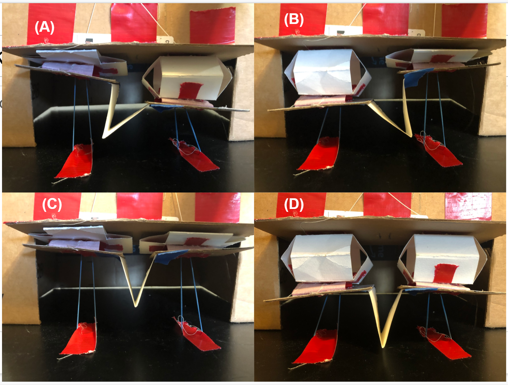
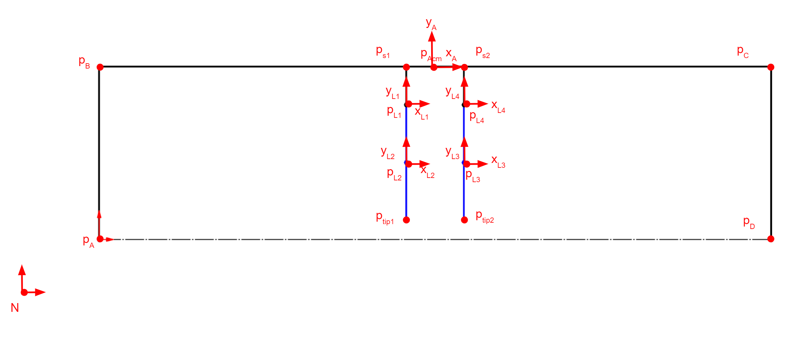
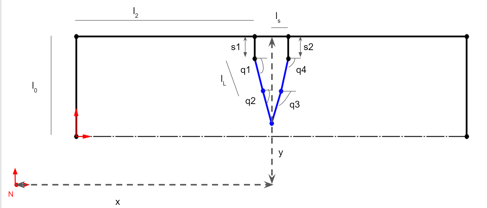
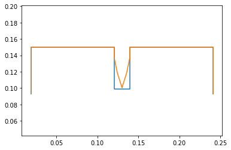
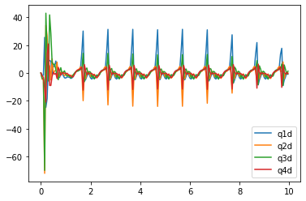
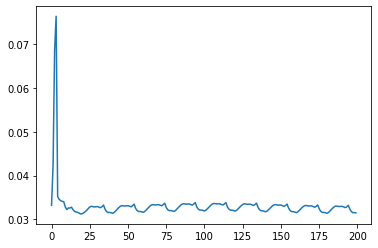
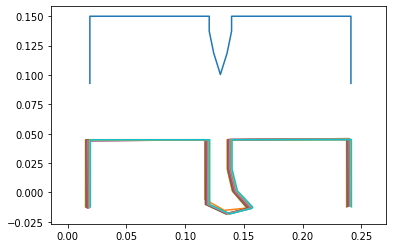
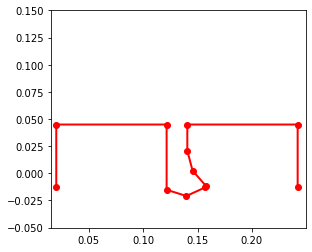

# System Dynamics II


## Description
[Assignment Instructions](https://egr557.github.io/assignments/system-dynamics-II.html)

## Team Response

```python
!pip install pypoly2tri idealab_tools foldable_robotics pynamics
```

    Requirement already satisfied: pypoly2tri in /usr/local/lib/python3.7/dist-packages (0.0.3)
    Requirement already satisfied: idealab_tools in /usr/local/lib/python3.7/dist-packages (0.0.22)
    Requirement already satisfied: foldable_robotics in /usr/local/lib/python3.7/dist-packages (0.0.29)
    Requirement already satisfied: pynamics in /usr/local/lib/python3.7/dist-packages (0.0.8)
    Requirement already satisfied: imageio in /usr/local/lib/python3.7/dist-packages (from idealab_tools) (2.4.1)
    Requirement already satisfied: pyyaml in /usr/local/lib/python3.7/dist-packages (from foldable_robotics) (3.13)
    Requirement already satisfied: ezdxf in /usr/local/lib/python3.7/dist-packages (from foldable_robotics) (0.15.2)
    Requirement already satisfied: shapely in /usr/local/lib/python3.7/dist-packages (from foldable_robotics) (1.7.1)
    Requirement already satisfied: matplotlib in /usr/local/lib/python3.7/dist-packages (from foldable_robotics) (3.2.2)
    Requirement already satisfied: numpy in /usr/local/lib/python3.7/dist-packages (from foldable_robotics) (1.19.5)
    Requirement already satisfied: scipy in /usr/local/lib/python3.7/dist-packages (from pynamics) (1.4.1)
    Requirement already satisfied: sympy in /usr/local/lib/python3.7/dist-packages (from pynamics) (1.7.1)
    Requirement already satisfied: pillow in /usr/local/lib/python3.7/dist-packages (from imageio->idealab_tools) (7.0.0)
    Requirement already satisfied: pyparsing>=2.0.1 in /usr/local/lib/python3.7/dist-packages (from ezdxf->foldable_robotics) (2.4.7)
    Requirement already satisfied: python-dateutil>=2.1 in /usr/local/lib/python3.7/dist-packages (from matplotlib->foldable_robotics) (2.8.1)
    Requirement already satisfied: cycler>=0.10 in /usr/local/lib/python3.7/dist-packages (from matplotlib->foldable_robotics) (0.10.0)
    Requirement already satisfied: kiwisolver>=1.0.1 in /usr/local/lib/python3.7/dist-packages (from matplotlib->foldable_robotics) (1.3.1)
    Requirement already satisfied: mpmath>=0.19 in /usr/local/lib/python3.7/dist-packages (from sympy->pynamics) (1.2.1)
    Requirement already satisfied: six>=1.5 in /usr/local/lib/python3.7/dist-packages (from python-dateutil>=2.1->matplotlib->foldable_robotics) (1.15.0)
    



The above cardboard and paper prototype presents a conceptual proof of our new proposed design. It is bio inspired from starfish podia, used for locomotion and moving objects. The design uses two sarrus linkages in parallel to act as foldable linear actuators, that can be pulled by a cable at offset times to create unique locomotion through the use of a leg attachment. In the prototype, two strings can be pulled to act as the motor, and rubber bands attached to the ground represent the springs needed to keep the linkages extended. 
We are interested in the leg design on the system. The v shaped leg allows the sarrus linkages to move in 1 direction, while the leg deforms and bends. Later in the kinematic and dynamic representation, we represent the deformation in the leg as two two bar systems joined at the tip. The stiffness of the leg can store energy and push the system forward, or push the system upwards in a jumping motion. The system shall consist of a structural box (shell) support, actuators, sarrus linkages, and a leg. 
Positions A and B show the sarrus leg rotating, which can be used to pick up the leg, and push it along the ground to walk. We can also see in C the leg is fully compressed and off the ground, and in D the leg is fully touching the ground. 
Optimizing the leg length and stiffness can be used to produce motion through frictional ground forces, timed sarrus compression and extension patterns, and through the legs stiffness. 




The image shows the necessary points and axis to create the system. Points A,B,C,D (pA,pB,pC,pD) represent the rigid frame of the system. All are relevant to axis A located on the top center of the frame. The sarrus linkages are shown starting at ps1 and ps2, attaching to pL1 and pL4 respectively. The Leg has 4 frames associated with each leg point (pL1,pL2,pL3,pL4) in order to study the stiffness and deformation in the leg. Lastly, the two tip points on the leg are constrained to attach to one another, giving us the v shaped leg initial condition we desire. 
Image 2 (differentiable, qa, s1 etc) 



 
Differentiable variables are important in describing the positions and rotations of the system. They are used extensively in force and dynamic expressions in the code. X and y represent the A frames distance from the Newtonian axis. If we set Y to a positive number, we can see the system fall to zero. S1 and S2 are translational distances to show the sarrus linkage extending and compressing.  The q values q1,q2,q3,q4 represent rotations from the A frame to the respective L frame. These are necessary to observe stiffness and deformation in the leg caused by moving the sarrus linkages and the interaction with the ground. 
Lengths are also shown for some lengths as the system is symmetric and uses the same length in multiple places. 


This FEA analysis of cardstock in Solidworks is how we are coming to a conclusion on the stiffness values to use.


 
For our intended use, a simple 12V DC motor was more than sufficient as its torque at just 5V was almost meeting our power requirements. This motor and circuit is also highly desirable due to its simplicity, as it really only needs: power, the motor and a switch. Due to the small amount of components, this circuit adds minimal weight to our mechanism. Essentially, the DC motor will drive a compression spring that will lie inside of a sarrus linkage; these linkages will connect the leg to the frame. When the motor drives the compression spring on the corresponding side, that side of the mechanism will lift, causing the leg to drag on the floor, thus creating motion. There will be a motor circuit attached to each sarrus linkage, so the mechanism would be capable of motion along either direction in the x-axis.


```python
#importing packages
import sympy
sympy.init_printing(pretty_print=False)

import pynamics
from pynamics.frame import Frame
from pynamics.variable_types import Differentiable,Constant,Variable
from pynamics.system import System
from pynamics.body import Body
from pynamics.dyadic import Dyadic
from pynamics.output import Output,PointsOutput
from pynamics.particle import Particle
import pynamics.integration
import pynamics.tanh
import scipy.optimize
import sympy
from sympy import sin
import numpy
import matplotlib.pyplot as plt
plt.ion()
from math import pi
import math

#Pynamics System
system = System()
pynamics.set_system(__name__,system)

tol = 1e-4
error_tol = 1e-10
```

This cell contains the constants of the system, including the following:
lengths and masses of each link,
the gravity, damping, and spring constants, preload values (to define the resting positions of springs), and the moment of inertia values, which are used in body/motion-related calculations.


```python
#defining constants; inches, uncaled to meters

#Base Structure
l0 = Constant(0.05715, 'l0',system) # 2.25" * 0.0254 m/in = 0.05715
l1 = Constant(0.22225, 'l1',system) # 8.75" = 0.22225m
l2 = Constant(0.1016, 'l2',system) # 4" = 0.1016m
l3 = Constant(0.12065, 'l3',system) # 4.75" = 0.12065m
ls = Constant(0.009525,'ls',system) # 0.375" = 0.009525m
#Leg Sections
lL = Constant(0.01905, 'lL',system) # 0.75" = 0.01905m

#Mass Constants
mFrame = Constant(.05,'mLeft',system) 
#mRight = Constant(.005,'mRight',system)
mLeg = Constant(.005,'mLeg',system)

#Gravity/Damping/Spring Force
g = Constant(9.81,'g',system)
b = Constant(1e1,'b',system) #damping
k = Constant(1e-1,'k',system) #spring force


#spring preloads to system
preload1 = Constant(0*pi/180,'preload1',system)
preload2 = Constant(0*pi/180,'preload2',system)
preloadS = Constant(0.04572,'preloadS',system) #Sarrus at rest at ~1.8 inches 1.8" = 0.04572m


#Inertia of body A
Ixx_A = Constant(1,'Ixx_A',system)
Iyy_A = Constant(1,'Iyy_A',system)
Izz_A = Constant(1,'Izz_A',system)
```

The next few lines define the length and response rate of the animation and position calculations.


```python
#Animation stuff
tinitial = 0
tfinal = 10
fps = 20
tstep = 1/fps
t = numpy.r_[tinitial:tfinal:tstep]
```

The dynamic state variables are used wherever the system experiences change over time. Only qA, x1, and y1 are needed to define the location/orientation of the outer frame, as the rest of the frame is considered rigid and the other links are based on the position of pA.

The q1 and q4 variables represent the angles between the legs and the sarrus extensitons, whose lengths are denoted by s1 and s2. To simulate comliant elements in the system, the legs are split in the middle, and angles q2 and q3 represent the bend in the links.


```python
# Creating dynamic state variables. system argument denotes them as state variables for pynamics system from above

#Frame angle from N
qA,qA_d,qA_dd = Differentiable('qA',system) #Angle between N and A

#Frame position
x1,x1_d,x1_dd = Differentiable('x1',system) #Position of x1, y1, which are at midpoint of L1
y1,y1_d,y1_dd = Differentiable('y1',system)

#Leg angles
q1,q1_d,q1_dd = Differentiable('q1',system)
q2,q2_d,q2_dd = Differentiable('q2',system)
q3,q3_d,q3_dd = Differentiable('q3',system)
q4,q4_d,q4_dd = Differentiable('q4',system)

#Sarrus extensions
s1,s1_d,s1_dd = Differentiable('s1',system) #should move in A.y
s2,s2_d,s2_dd = Differentiable('s2',system)
```

Shown below are the length and angle values (in meters and degrees, respectively) that make up the initial guess for the system.


```python
initialvalues = {}

#Frame constants
initialvalues[qA]=0*pi/180 
initialvalues[qA_d]=0*pi/180 

#Leg angle init Values
initialvalues[q1]=0*pi/180  
initialvalues[q1_d]=0*pi/180 
initialvalues[q2]=0*pi/180   
initialvalues[q2_d]=0*pi/180
initialvalues[q3]=0*pi/180 
initialvalues[q3_d]=0*pi/180
initialvalues[q4]=0*pi/180   
initialvalues[q4_d]=0*pi/180

#Sarrus linkages init extension
initialvalues[s1] = 0.0127          #initially both compressed, then will end with right fully extended 0.5" = 0.0127m
initialvalues[s1_d] = 0  #0         #xhanged s1 and s2 velocities. Changing s2 makes it go through 0 as ptip 2 does not have ground constraint
initialvalues[s2] = 0.0127          # 0.5" = 0.0127m
initialvalues[s2_d] = 0  #0

#Frame contact points
initialvalues[x1] = 0.13
initialvalues[x1_d] = 0 
initialvalues[y1] = .15
initialvalues[y1_d] = 0
```

This creates a list that contains the values above.


```python
#Create initial guess list
statevariables = system.get_state_variables()
ini = [initialvalues[item] for item in statevariables]
```

Below are the reference frames of the system. As mentioned above, only the A reference frame is needed for the system's outer frame, due to the rigidity of the system. The L frames are used to calculate the angles of the leg sections relative to each other.


```python
# Initializing frames

#Newtonian
N = Frame('N')
system.set_newtonian(N)

A = Frame('A')

L1 = Frame('L1')
L2 = Frame('L2')
L3 = Frame('L3')
L4 = Frame('L4')
```

The A frame is rotated qA degrees from the N frame, the L1/L4 frames are rotated q1/q4 degrees from the A frame, and the L2/L3 frames are rotated q2/q3 degrees from the L1 and L4 frames.


```python
#Axis rotations

#Frame axis A
A.rotate_fixed_axis_directed(N,[0,0,1],qA,system)

#Leg
#left side of leg from sarrus 1
L1.rotate_fixed_axis_directed(A,[0,0,1],q1,system)
L2.rotate_fixed_axis_directed(L1,[0,0,1],q2,system)
#right side of leg from sarrus 2
L4.rotate_fixed_axis_directed(A,[0,0,1],q4,system)
L3.rotate_fixed_axis_directed(L4,[0,0,1],q3,system)
```

This is the definition of the vectors that make up the system's links. Each vector is made up of a staring position, and a length multiplied by a unit vector in a particular direction.


```python
#Define vectors/Frame/point Locations
pAcm = x1*N.x + y1*N.y


#Sarrus extension frames
ps1 = pAcm - ls*A.x
ps2 = pAcm + ls*A.x

pB = ps1  -l2*A.x
pC = ps2  + l2*A.x
pA = pB - l0*A.y
pD = pC - l0*A.y


pL1 = ps1 - s1*A.y
pL2 = pL1 - lL*L1.y
pL4 = ps2 - s2*A.y
pL3 = pL4 - lL*L4.y

pLtip1 = pL2 - lL*L2.y
pLtip2 = pL3 - lL*L3.y


#torque/force = A*sympy.sin(w*system.t)+b # create torque about frame, A = amplitude/max value of Torque or force desired; w = frequency of oscillation
# t*A.z
# addForce(torque*A.z, wAB) #adding torques as a function of sin(t)
# Not a position constraint (be at x position at t time)
# Use 
```

These are the positions that we have decided to place the masses in order to keep the system simplified. The locations are found in the same way as the vectors above.


```python
#Define the locations of the masses
mLocFrame = pAcm
mLocL1 = pL1 - (lL/2)*L1.y
mLocL2 = pL2 - (lL/2)*L2.y
mLocL4 = pL4 - (lL/2)*L4.y
mLocL3 = pL3 - (lL/2)*L3.y

mLocLeftFrame = pA + (l0/2)*A.y
mLocRightFrame = pD + (l0/2)*A.y
```

The particles defined below, along with the moment of inertia and body, influence the physics of the system and determine how it will move under loads/forces.


```python
#Define particle locations


#Frame locations
partL1 = Particle(mLocL1,mLeg,'PartL1',system)
partL2 = Particle(mLocL2,mLeg,'PartL2',system)
partL3 = Particle(mLocL3,mLeg,'PartL3',system)
partL4 = Particle(mLocL4,mLeg,'PartL4',system)

#partFrame = Particle(pAcm,mFrame,'PartFrame',system)

#Inertia and Bodie
IA = Dyadic.build(A,Ixx_A,Iyy_A,Izz_A)
bodyFrame = Body('bodyFrame',A,mLocFrame,mFrame,IA,system)

```

The w and v variables below represent angular velocity and linear velocity, respectively. These are used in the force calculations in the following cell.


```python
#Angular Velocity, w (omega)
wL1 = A.getw_(L1) 
wL2 = L1.getw_(L2)
wL4 = A.getw_(L4)
wL3 = L4.getw_(L3)

#Velocities
vFrame = pAcm.time_derivative() # with no parameters, defaults to (N,system)
vLeg = pLtip1.time_derivative()
vpA = pA.time_derivative()
vpD = pD.time_derivative()

vpL1 = pL1.time_derivative() # for addign a spring force and damping to the sarrus extensions
vpL4 = pL4.time_derivative() 

#Messing w/ cm locations
#vFrame = pAcm.time_derivative(N,system) #switched delocity to be relative to the N frame
#vLeg = pLtip1.time_derivative(N,system)
#vpA = mLocLeftFrame.time_derivative(N,system)
#vpD = mLocRightFrame.time_derivative(N,system)

#vpL1 = mLocL1.time_derivative() # for addign a spring force and damping to the sarrus extensions
#vpL4 = mLocL4.time_derivative() #default is by N
```

Below is where we add the system forces. Using offset sine waves, we feed in a frequency of 1 and an amplitude of .05 to lower the overall force output. Fs1 is the sarrus linkage 1 and we will see changes in s1 as it directly moves pL1. Fs2 is the offset sine wave directly moving pl4. The spring forces are all applied to the leg of the system (L1,2,3,4) to add some stiffness to it like the leg would have in the real world application. We subtract the preload and allow it to change based on its stiffness, and the force applied from fs1 and fs2. You can see the q and qd changes in the graphs later in the code.


```python
amp = .05 #max force
freq = 1 #frequency
fs1 = amp*sin(2* numpy.pi * freq * system.t)                           #Asin(wt); A=amplitude, w = 2*pi*fr
fs2 = amp*sin(2* numpy.pi * freq * system.t - (numpy.pi * freq /2))    #add (2*numpy.pi*freq/4)  ?
system.addforce(fs1*A.y,vpL1)
system.addforce(fs2*A.y,vpL4)

#Damping
#system.addforce(-b*wL1,wL1)  #seems to work fine with and without
#system.addforce(-b*wL2,wL2)
#system.addforce(-b*wL3,wL3)
#system.addforce(-b*wL4,wL4)

#Spring Force
system.add_spring_force1(k/50,(q1-preload1)*A.z,wL1)
system.add_spring_force1(k/50,(q2-preload1)*L1.z,wL2)
system.add_spring_force1(k/50,(q4-preload1)*A.z,wL4)
system.add_spring_force1(k/50,(q3-preload2)*L4.z,wL3)

#system.add_spring_force1(k, (s1-preloadS)*A.y,vpL1) #Integration step does not like this
#system.add_spring_force1(k, (s2-preloadS)*A.y,vpL4)
```


    (<pynamics.force.Force at 0x7ff66dfdb750>,
     <pynamics.spring.Spring at 0x7ff66dfdb350>)


```python
system.addforcegravity(-g*N.y)
```


Floor constraints were necessary to keep the system from free falling due to gravity. We add the floor to the ptip 1 (only need the ptip1 as the constraint later combines both ptips) and the left and right bottom points of the frame. Those would be pA and pD respectively. The code below is from the free falling example and takes the difference with the y and makes it zero. This ensures the system is bounded by the x axis. 


```python
#reference frame + state variable = need mass

#Ground forces on contact points

yLeft = pA.dot(N.y)

f_floor1 = (yLeft**2)**.5 - yLeft
f_floor1_d = system.derivative(f_floor1)
system.addforce(-k*100*f_floor1*-N.y,vpA)
system.addforce(-b*f_floor1*vpA,vpA)
system.addforce(-b*f_floor1*f_floor1_d*-N.y,vpA)

yRight = pD.dot(N.y)

f_floor2 = (yRight**2)**.5 - yRight
f_floor2_d = system.derivative(f_floor2)
system.addforce(-k*100*f_floor2*-N.y,vpD)
system.addforce(-b*f_floor2*vpD,vpD)
system.addforce(-b*f_floor2*f_floor2_d*-N.y,vpD)

yFoot = pLtip1.dot(N.y)

f_floor3 = (yFoot**2)**.5 - yFoot
f_floor3_d = system.derivative(f_floor3)
system.addforce(-k*100*f_floor3*-N.y,vLeg)
system.addforce(-b*f_floor3*vLeg,vLeg)
system.addforce(-b*f_floor3*f_floor3_d*-N.y,vLeg)

```


    <pynamics.force.Force at 0x7ff66defadd0>


Here we add only one constraint and then run the same code used in the kinematics assignment to solve a proper initial guess. The only constraint we give the system is that ptip 1 and ptip2 must have the same x and y with respect to the A frame (dot the difference in points with x and y). That way they always rotate with the whole system and always stay together as if it was one leg. 


```python
#Constraints

eq_vector = pLtip1 - pLtip2
```


```python
#Error list for constraints

eq = []
#if use_constraints:
eq.append((eq_vector).dot(A.x))
eq.append((eq_vector).dot(A.y))
#eq.append(pAcm.dot(N.x)) #Lock frame in place

eq_d=[(system.derivative(item)) for item in eq]
eq_dd=[(system.derivative(item)) for item in eq_d]
```


```python
qi = [s1,s2]
qd = [q1,q2,q3,q4,qA,x1,y1]

constants = system.constant_values.copy() # Recalls link lengths declared near beginning
defined = dict([(item,initialvalues[item]) for item in qi])
constants.update(defined)

eq = [item.subs(constants) for item in eq]

error = (numpy.array(eq)**2).sum()

f = sympy.lambdify(qd,error)

def function(args):
    return f(*args)

guess = [initialvalues[item] for item in qd]

result = scipy.optimize.minimize(function,guess)
result

#statevariables = system.get_state_variables()
#ini = [initialvalues[item] for item in statevariables]
iniSolved = []
for item in system.get_state_variables():
    if item in qd:
        iniSolved.append(result.x[qd.index(item)])
    else:
        iniSolved.append(initialvalues[item])
system.get_state_variables()
```


    [qA, x₁, y₁, q₁, q₂, q₃, q₄, s₁, s₂, qA_d, x_1_d, y_1_d, q_1_d, q_2_d, q_3_d, 
    q_4_d, s_1_d, s_2_d]


This graph shows that the system maintains a correct initial position and guess (in orange) and the previous un constrained guess (in blue). We show this to ensure the system is correct and help us troubleshoot bugs and errors that may arise when coding the vectors and points. 


```python
points = [pA,pB,ps1,pL1,pL2,pLtip1,pLtip2,pL3,pL4,ps2,pC,pD]
points_output = PointsOutput(points, constant_values=system.constant_values)

points = PointsOutput(points, constant_values=system.constant_values)
points.calc(numpy.array([ini,iniSolved]))
points.plot_time()
```

    2021-03-19 20:04:25,067 - pynamics.output - INFO - calculating outputs
    2021-03-19 20:04:25,071 - pynamics.output - INFO - done calculating outputs
    


    <matplotlib.axes._subplots.AxesSubplot at 0x7ff67a253210>


    

    


```python
f,ma = system.getdynamics()
func = system.state_space_post_invert(f,ma)
```

    2021-03-19 20:04:25,355 - pynamics.system - INFO - getting dynamic equations
    2021-03-19 20:04:26,506 - pynamics.system - INFO - solving a = f/m and creating function
    2021-03-19 20:04:26,537 - pynamics.system - INFO - substituting constrained in Ma-f.
    2021-03-19 20:04:41,108 - pynamics.system - INFO - done solving a = f/m and creating function
    

We run the system integrations here to solve the dynamics of all the inputs we described above. 
The q and qd values here reflect the sin wave input, as the motion is repeated over time. These are all the q values in the leg describing their rotations in z. 


```python
#Solve for acceleration
func1,lambda1 = system.state_space_post_invert(f,ma,eq_dd,return_lambda = True)

#Integrate
#states=pynamics.integration.integrate(func1,ini,t,rtol=tol,atol=tol, args=({'constants':system.constant_values},))
states=pynamics.integration.integrate(func1,iniSolved,t,rtol=tol,atol=tol, args=({'constants':system.constant_values},))

plt.figure()
artists = plt.plot(t,states[:,3:7])
plt.legend(artists,['q1','q2','q3','q4'])
plt.figure()
artists = plt.plot(t,states[:,12:16])
plt.legend(artists,['q1d','q2d','q3d','q4d'])
```

    2021-03-19 20:04:41,154 - pynamics.system - INFO - solving a = f/m and creating function
    2021-03-19 20:04:41,183 - pynamics.system - INFO - substituting constrained in Ma-f.
    2021-03-19 20:04:53,939 - pynamics.system - INFO - done solving a = f/m and creating function
    2021-03-19 20:04:53,942 - pynamics.system - INFO - calculating function for lambdas
    2021-03-19 20:04:53,955 - pynamics.integration - INFO - beginning integration
    2021-03-19 20:04:53,956 - pynamics.system - INFO - integration at time 0000.00
    2021-03-19 20:05:09,625 - pynamics.system - INFO - integration at time 0000.18
    2021-03-19 20:05:26,620 - pynamics.system - INFO - integration at time 0000.54
    2021-03-19 20:05:42,817 - pynamics.system - INFO - integration at time 0001.66
    2021-03-19 20:05:58,415 - pynamics.system - INFO - integration at time 0002.50
    2021-03-19 20:06:14,857 - pynamics.system - INFO - integration at time 0003.04
    2021-03-19 20:06:31,289 - pynamics.system - INFO - integration at time 0003.81
    2021-03-19 20:06:47,643 - pynamics.system - INFO - integration at time 0004.69
    2021-03-19 20:07:04,046 - pynamics.system - INFO - integration at time 0005.66
    2021-03-19 20:07:20,550 - pynamics.system - INFO - integration at time 0006.36
    2021-03-19 20:07:36,702 - pynamics.system - INFO - integration at time 0006.93
    2021-03-19 20:07:53,275 - pynamics.system - INFO - integration at time 0007.74
    2021-03-19 20:08:11,070 - pynamics.system - INFO - integration at time 0008.68
    2021-03-19 20:08:26,433 - pynamics.system - INFO - integration at time 0009.41
    2021-03-19 20:08:40,190 - pynamics.integration - INFO - finished integration
    


    <matplotlib.legend.Legend at 0x7ff66ace6b10>


    

    


    

    


```python
system.get_state_variables()
```


    [qA, x₁, y₁, q₁, q₂, q₃, q₄, s₁, s₂, qA_d, x_1_d, y_1_d, q_1_d, q_2_d, q_3_d, 
    q_4_d, s_1_d, s_2_d]


Our x value oscillates as the motion is not perfect, however it still follows a very slight upward trend, meaning over time, it is moving its frame position to the left. The Y value displays it dropping then remaining constant. 
S1 and S2 values show that they are oscillating over the time span. S1’s oscillation dominates s2. 


```python
plt.figure()
artists = plt.plot(t,states[:,1:3])
plt.legend(artists,['x1','y1'])
plt.figure()
artists = plt.plot(t,states[:,7:9])
plt.legend(artists,['s1','s2'])
```


    <matplotlib.legend.Legend at 0x7ff66ab92790>


    

    


    

    


```python
KE = system.get_KE()
PE = system.getPEGravity(pA) - system.getPESprings()
energy_output = Output([KE-PE],system)
energy_output.calc(states)
energy_output.plot_time()
```

    2021-03-19 20:08:41,484 - pynamics.output - INFO - calculating outputs
    2021-03-19 20:08:41,537 - pynamics.output - INFO - done calculating outputs
    


    

    


This position diagram helps display the very slight walking motion the system performs. We drop it from an initial height, then it inches to the left very slightly. 


```python
points = [pA,pB,ps1,pL1,pL2,pLtip1,pLtip2,pL3,pL4,ps2,pC,pD]
points_output = PointsOutput(points,system)
y = points_output.calc(states)
points_output.plot_time(20)
```

    2021-03-19 20:08:41,950 - pynamics.output - INFO - calculating outputs
    2021-03-19 20:08:41,990 - pynamics.output - INFO - done calculating outputs
    


    <matplotlib.axes._subplots.AxesSubplot at 0x7ff66e214f10>


    

    


```python
points_output.animate(fps = fps,movie_name = 'render.mp4',lw=2,marker='o',color=(1,0,0,1),linestyle='-')
```


    <matplotlib.axes._subplots.AxesSubplot at 0x7ff66aa46290>


    

    


The video here displays the leg with given sarrus input. The inputs are changing based on offset sin waves as discussed above. We can see the leg hit the ground, deform, and then push off creating a walking motion


```python
from matplotlib import animation, rc
from IPython.display import HTML
HTML(points_output.anim.to_html5_video())
```

<video width="432" height="288" controls autoplay loop>
  <source type="video/mp4" src="dy2.mp4">
</video>
