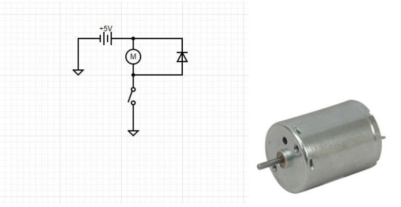

There were significant changes that team 5 needed to make to their concept, which would overall change their plans for motion. A new plan for motion was needed, which would change the energy requirement on the motor and motor requirements as a result. There are two new proposed ideas that team 5 is deciding between. The first concept includes the use of two sets of three saurus linkages connected in the center by a spine. Ideally, the spine would be the main mechanism of the system while the saurus linkages would serve as springs. To cause the proposed motion, a DC motor would be required for each side of the spine to move the corresponding set of linkages. The second concept uses two sarrus linkages in series that would lie on a peg to imitate the motion of a leg. The first concept would be more strenuous on the DC motor compared to the second concept, but a simple 12V DC motor would be sufficient for either application.

According to the spec sheet of the 12V DC motor that team 5 used for testing, the operating voltage of the motor was 3-12V; so a 5V power supply was used. The motor was connected to the 5V power supply in parallel with a diode to allow a path for dissipated energy when the switch is used. Lastly, the two are connected to the switch which is then connected to ground.

The motor was able to pull small items with a string such as coins and small household desk items. The first item that was tested was a quarter and the DC motor was able to pull the quarter with ease. To add more weight, a second quarter was added and the results were very similar, as the motor was easily able to move the coins. In an attempt to add more weight in small increments, simple desk items were used to move such as an eraser. As expected, the eraser with the addition of the two quarters was easily able to be moved. The last set of items that was tested was the two quarters, an eraser and a small stapler. The motor was able to pull the last set of items with relative ease, so slightly more weight could have been added. According to the spec sheet of the motor used, at max efficiency the motor has a torque of 25.3 g-cm. The spec sheet also states that the motor draws roughly 0.17A at max efficiency [1]. With the motor running off of a 12V supply at full power, this motor would be more than enough for Team 5’s intended application.

## References
[1]"RF370CA-15370: Mabuchi Motor Company : 12 Volt DC Motor 170mA 4,840 RPM 25.3g-cm Torque : Electromechanical", Jameco.com, 2021. [Online]. Available: https://www.jameco.com/shop/ProductDisplay?catalogId=10001&langId=-1&storeId=10001&productId=238473. [Accessed: 07- Mar- 2021].
