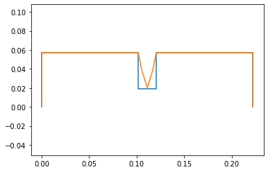
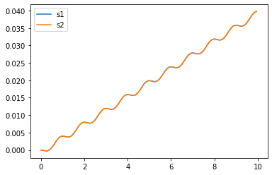
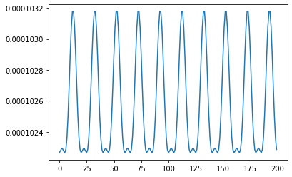
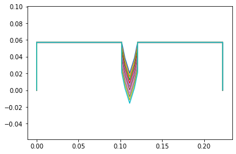
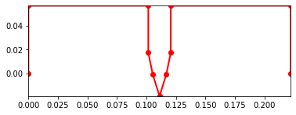

```python
%matplotlib inline
```


```python
global_q = False
use_constraints = True
```


```python
!pip install pypoly2tri idealab_tools foldable_robotics pynamics
```

    Requirement already satisfied: pypoly2tri in /usr/local/lib/python3.7/dist-packages (0.0.3)
    Requirement already satisfied: idealab_tools in /usr/local/lib/python3.7/dist-packages (0.0.22)
    Requirement already satisfied: foldable_robotics in /usr/local/lib/python3.7/dist-packages (0.0.29)
    Requirement already satisfied: pynamics in /usr/local/lib/python3.7/dist-packages (0.0.8)
    Requirement already satisfied: imageio in /usr/local/lib/python3.7/dist-packages (from idealab_tools) (2.4.1)
    Requirement already satisfied: pyyaml in /usr/local/lib/python3.7/dist-packages (from foldable_robotics) (3.13)
    Requirement already satisfied: matplotlib in /usr/local/lib/python3.7/dist-packages (from foldable_robotics) (3.2.2)
    Requirement already satisfied: numpy in /usr/local/lib/python3.7/dist-packages (from foldable_robotics) (1.19.5)
    Requirement already satisfied: shapely in /usr/local/lib/python3.7/dist-packages (from foldable_robotics) (1.7.1)
    Requirement already satisfied: ezdxf in /usr/local/lib/python3.7/dist-packages (from foldable_robotics) (0.15.2)
    Requirement already satisfied: sympy in /usr/local/lib/python3.7/dist-packages (from pynamics) (1.7.1)
    Requirement already satisfied: scipy in /usr/local/lib/python3.7/dist-packages (from pynamics) (1.4.1)
    Requirement already satisfied: pillow in /usr/local/lib/python3.7/dist-packages (from imageio->idealab_tools) (7.0.0)
    Requirement already satisfied: pyparsing!=2.0.4,!=2.1.2,!=2.1.6,>=2.0.1 in /usr/local/lib/python3.7/dist-packages (from matplotlib->foldable_robotics) (2.4.7)
    Requirement already satisfied: cycler>=0.10 in /usr/local/lib/python3.7/dist-packages (from matplotlib->foldable_robotics) (0.10.0)
    Requirement already satisfied: kiwisolver>=1.0.1 in /usr/local/lib/python3.7/dist-packages (from matplotlib->foldable_robotics) (1.3.1)
    Requirement already satisfied: python-dateutil>=2.1 in /usr/local/lib/python3.7/dist-packages (from matplotlib->foldable_robotics) (2.8.1)
    Requirement already satisfied: mpmath>=0.19 in /usr/local/lib/python3.7/dist-packages (from sympy->pynamics) (1.2.1)
    Requirement already satisfied: six in /usr/local/lib/python3.7/dist-packages (from cycler>=0.10->matplotlib->foldable_robotics) (1.15.0)
    


```python
# -*- coding: utf-8 -*-
"""
Written by Daniel M. Aukes
Email: danaukes<at>gmail.com
Please see LICENSE for full license.
"""

#importing packages
import sympy
sympy.init_printing(pretty_print=False)

import pynamics
from pynamics.frame import Frame
from pynamics.variable_types import Differentiable,Constant,Variable
from pynamics.system import System
from pynamics.body import Body
from pynamics.dyadic import Dyadic
from pynamics.output import Output,PointsOutput
from pynamics.particle import Particle
import pynamics.integration
import pynamics.tanh
import scipy.optimize
import sympy
from sympy import sin
import numpy
import matplotlib.pyplot as plt
plt.ion()
from math import pi
import math
```


```python
system = System()
pynamics.set_system(__name__,system)
```


```python

```

# Proposed System Kinematics v2


## Parameterization

### Constants


```python
#Base Structure
l0 = Constant(0.05715, 'l0',system) # 2.25" * 0.0254 m/in = 0.05715
l1 = Constant(0.22225, 'l1',system) # 8.75" = 0.22225m
l2 = Constant(0.1016, 'l2',system) # 4" = 0.1016m
l3 = Constant(0.12065, 'l3',system) # 4.75" = 0.12065m
ls = Constant(0.009525,'ls',system) # 0.375" = 0.009525m
#Leg Sections
lL = Constant(0.01905, 'lL',system) # 0.75" = 0.01905m

#Mass Constants
mFrame = Constant(.05,'mLeft',system) 
#mRight = Constant(.005,'mRight',system)
mLeg = Constant(.005,'mLeg',system)

#Gravity/Damping/Spring Force
g = Constant(9.81,'g',system)
b = Constant(1e1,'b',system) #damping
k = Constant(1e-1,'k',system) #spring force


#spring preloads to system
preload1 = Constant(0*pi/180,'preload1',system)
preload2 = Constant(0*pi/180,'preload2',system)
preloadS = Constant(0.04572,'preloadS',system) #Sarrus at rest at ~1.8 inches 1.8" = 0.04572m


#Inertia of body A
Ixx_A = Constant(1,'Ixx_A',system)
Iyy_A = Constant(1,'Iyy_A',system)
Izz_A = Constant(1,'Izz_A',system)

```


```python
tol = 1e-12
```


```python
#Animation stuff
tinitial = 0
tfinal = 10
fps = 20
tstep = 1/fps
t = numpy.r_[tinitial:tfinal:tstep]
```


```python
# Creating dynamic state variables. system argument denotes them as state variables for pynamics system from above
#Frame angle from N
qA,qA_d,qA_dd = Differentiable('qA',system) #Angle between N and A
#Leg angles
q1,q1_d,q1_dd = Differentiable('q1',system)
q2,q2_d,q2_dd = Differentiable('q2',system)
q3,q3_d,q3_dd = Differentiable('q3',system)
q4,q4_d,q4_dd = Differentiable('q4',system)

#Sarrus extensions
s1,s1_d,s1_dd = Differentiable('s1',system) #should move in A.y
s2,s2_d,s2_dd = Differentiable('s2',system)
```


```python
initialvalues = {}

#Frame constants
initialvalues[qA]=0*pi/180 
initialvalues[qA_d]=0*pi/180 

#Leg angle init Values
initialvalues[q1]=0*pi/180  
initialvalues[q1_d]=0*pi/180 
initialvalues[q2]=0*pi/180   
initialvalues[q2_d]=0*pi/180
initialvalues[q3]=0*pi/180 
initialvalues[q3_d]=0*pi/180
initialvalues[q4]=0*pi/180   
initialvalues[q4_d]=0*pi/180

#Sarrus linkages init extension
initialvalues[s1] = 0.0          #initially both compressed, then will end with right fully extended 0.5" = 0.0127m
initialvalues[s1_d] = 0  #0         #xhanged s1 and s2 velocities. Changing s2 makes it go through 0 as ptip 2 does not have ground constraint
initialvalues[s2] = 0.0          # 0.5" = 0.0127m
initialvalues[s2_d] = 0  #0

```


```python
statevariables = system.get_state_variables() # tried running this after vector calculation like i kinematics, but no apparent change...
ini0 = [initialvalues[item] for item in statevariables]
```


```python
# Initializing frames

#Newtonian
N = Frame('N')
A = Frame('A')
L1 = Frame('L1')
L2 = Frame('L2')
L3 = Frame('L3')
L4 = Frame('L4')
```


```python
system.set_newtonian(N)
```


```python
#Axis rotations

#Frame axis A
A.rotate_fixed_axis_directed(N,[0,0,1],qA,system)

#Leg
#left side of leg from sarrus 1
L1.rotate_fixed_axis_directed(A,[0,0,1],q1,system)
L2.rotate_fixed_axis_directed(L1,[0,0,1],q2,system)
#right side of leg from sarrus 2
L4.rotate_fixed_axis_directed(A,[0,0,1],q4,system)
L3.rotate_fixed_axis_directed(L4,[0,0,1],q3,system)
```

Vectors

claculated by using solving the two 2bar problem. Each vector containts the length constant and the previous point given the local reference frame. 


```python
#Define vectors/Frame/point Locations
pAcm = (l2+ls)*N.x + l0*N.y
#Sarrus extension frames
ps1 = pAcm - ls*A.x
ps2 = pAcm + ls*A.x

pB = ps1  -l2*A.x
pC = ps2  + l2*A.x
pA = pB - l0*A.y
pD = pC - l0*A.y


pL1 = ps1 - s1*A.y
pL2 = pL1 - lL*L1.y
pL4 = ps2 - s2*A.y
pL3 = pL4 - lL*L4.y

pLtip1 = pL2 - lL*L2.y
pLtip2 = pL3 - lL*L3.y

```

Center of mass

Considered the midpoint of each link as they will be uniform in size and material


```python
#Define the locations of the masses
mLocFrame = pAcm
mLocL1 = pL1 - (lL/2)*L1.y
mLocL2 = pL2 - (lL/2)*L2.y
mLocL4 = pL4 - (lL/2)*L4.y
mLocL3 = pL3 - (lL/2)*L3.y

mLocLeftFrame = pA + (l0/2)*A.y
mLocRightFrame = pD + (l0/2)*A.y
```

Angular Velocity and Velocity


```python
#Angular Velocity, w (omega)
wL1 = A.getw_(L1) 
wL2 = L1.getw_(L2)
wL4 = A.getw_(L4)
wL3 = L4.getw_(L3)

#Velocities
vFrame = pAcm.time_derivative() # with no parameters, defaults to (N,system)
vLeg = pLtip1.time_derivative()
vpA = pA.time_derivative()
vpD = pD.time_derivative()

vpL1 = pL1.time_derivative() # for addign a spring force and damping to the sarrus extensions
vpL4 = pL4.time_derivative() 
```

Define Inertias & Bodies


```python
#Define particle locations


#Frame locations
partL1 = Particle(mLocL1,mLeg,'PartL1',system)
partL2 = Particle(mLocL2,mLeg,'PartL2',system)
partL3 = Particle(mLocL3,mLeg,'PartL3',system)
partL4 = Particle(mLocL4,mLeg,'PartL4',system)

#partFrame = Particle(pAcm,mFrame,'PartFrame',system)

#Inertia and Bodie
IA = Dyadic.build(A,Ixx_A,Iyy_A,Izz_A)
bodyFrame = Body('bodyFrame',A,mLocFrame,mFrame,IA,system)

```

Forces & Torques

Defines the system forces, mainly relying on the spring force


```python
#Damping
system.addforce(-b*wL1,wL1)  #seems to work fine with and without
system.addforce(-b*wL2,wL2)
system.addforce(-b*wL3,wL3)
system.addforce(-b*wL4,wL4)

```


    <pynamics.force.Force at 0x7f537d61fad0>


```python

#Spring Force
system.add_spring_force1(k/50,(q1-preload1)*A.z,wL1)
system.add_spring_force1(k/50,(q2-preload1)*L1.z,wL2)
system.add_spring_force1(k/50,(q4-preload1)*A.z,wL4)
system.add_spring_force1(k/50,(q3-preload2)*L4.z,wL3)

#keep s1 and s2 from infinity
amp = .05 #max force
freq = 1 #frequency
fs1 = amp*sin(2* numpy.pi * freq * system.t)                           #Asin(wt); A=amplitude, w = 2*pi*fr
fs2 = amp*sin(2* numpy.pi * freq * system.t - (numpy.pi * freq /2))    #add (2*numpy.pi*freq/4)  ?
system.addforce(-fs1/100*A.y,vpL1)
system.addforce(-fs2/100*A.y,vpL4)
```


    <pynamics.force.Force at 0x7f537d5c6d10>


```python
#system.addforcegravity(-g*N.y)
```

Constraints

Constrains the system based off of our system kinematics. (see image above for proposed system kinematics v2)


```python
#Constraints
eq_vector = pLtip1 - pLtip2
```


```python
#Error list for constraints

eq = []
#if use_constraints:
eq.append((eq_vector).dot(A.x))
eq.append((eq_vector).dot(A.y))
#eq.append(pAcm.dot(N.x)) #Lock frame in place

eq_d=[(system.derivative(item)) for item in eq]
eq_dd=[(system.derivative(item)) for item in eq_d]
```


```python
qi = [s1,s2]
qd = [q1,q2,q3,q4,qA]

```


```python
constants = system.constant_values.copy() # Recalls link lengths declared near beginning
defined = dict([(item,initialvalues[item]) for item in qi])
constants.update(defined)
```


```python
eq = [item.subs(constants) for item in eq]
```


```python
error = (numpy.array(eq)**2).sum()
```


```python
f = sympy.lambdify(qd,error)

def function(args):
    return f(*args)
```


```python
guess = [initialvalues[item] for item in qd]
```


```python
result = scipy.optimize.minimize(function,guess)
#result <- able to call result in kinematics but not here for some reason
```


```python
ini = []
for item in system.get_state_variables():
    if item in qd:
        ini.append(result.x[qd.index(item)])
    else:
        ini.append(initialvalues[item])
```


```python
points = [pA,pB,ps1,pL1,pL2,pLtip1,pLtip2,pL3,pL4,ps2,pC,pD]
points_output = PointsOutput(points, constant_values=system.constant_values)
```


```python
#ini
```


```python
#ini0 # ini and ini0 returning same values
```

All of this code is from system kinematics. Having this verifies the initial coniditon is valid and correct


```python
points = PointsOutput(points, constant_values=system.constant_values)
points.calc(numpy.array([ini0,ini]))
points.plot_time()
```

    2021-03-23 21:41:44,858 - pynamics.output - INFO - calculating outputs
    2021-03-23 21:41:44,861 - pynamics.output - INFO - done calculating outputs
    


    <matplotlib.axes._subplots.AxesSubplot at 0x7f537d6f0210>


    

    


F = ma


```python
f,ma = system.getdynamics()
```

    2021-03-23 21:41:45,068 - pynamics.system - INFO - getting dynamic equations
    


```python
#f
```


```python
#ma
```

Solve for Acceleration 


```python
func1,lambda1 = system.state_space_post_invert(f,ma,eq_dd,return_lambda = True)
```

    2021-03-23 21:41:45,535 - pynamics.system - INFO - solving a = f/m and creating function
    2021-03-23 21:41:45,547 - pynamics.system - INFO - substituting constrained in Ma-f.
    2021-03-23 21:41:46,717 - pynamics.system - INFO - done solving a = f/m and creating function
    2021-03-23 21:41:46,718 - pynamics.system - INFO - calculating function for lambdas
    

Integrate


```python
states=pynamics.integration.integrate(func1,ini,t,rtol=tol,atol=tol, args=({'constants':system.constant_values},))
```

    2021-03-23 21:41:46,746 - pynamics.integration - INFO - beginning integration
    2021-03-23 21:41:46,747 - pynamics.system - INFO - integration at time 0000.00
    2021-03-23 21:41:47,636 - pynamics.system - INFO - integration at time 0000.62
    2021-03-23 21:41:48,500 - pynamics.system - INFO - integration at time 0002.37
    2021-03-23 21:41:49,364 - pynamics.system - INFO - integration at time 0004.17
    2021-03-23 21:41:50,270 - pynamics.system - INFO - integration at time 0005.98
    2021-03-23 21:41:51,112 - pynamics.system - INFO - integration at time 0007.75
    2021-03-23 21:41:51,969 - pynamics.system - INFO - integration at time 0009.57
    2021-03-23 21:41:52,165 - pynamics.integration - INFO - finished integration
    

Outputs

We can see all the angle values appraoch 0 over time. For us 0 referes to the most extended state of the sarrus linkage


```python
plt.figure()
artists = plt.plot(t,states[:,0:5])
plt.legend(artists,['qA','q1','q2','q3','q4'])
plt.figure()
artists = plt.plot(t,states[:,5:7])
plt.legend(artists,['s1','s2'])
```


    <matplotlib.legend.Legend at 0x7f537d5d0390>


    

    


    

    


```python
system.get_state_variables()
```


    [qA, q₁, q₂, q₃, q₄, s₁, s₂, qA_d, q_1_d, q_2_d, q_3_d, q_4_d, s_1_d, s_2_d]


Energy

Energy decreases to 0 as the system comes to rest


```python
KE = system.get_KE()
PE = system.getPEGravity(pA) - system.getPESprings()
energy_output = Output([KE-PE],system)
energy_output.calc(states)
energy_output.plot_time()
```

    2021-03-23 21:41:52,806 - pynamics.output - INFO - calculating outputs
    2021-03-23 21:41:52,820 - pynamics.output - INFO - done calculating outputs
    


    

    


Motion

The system springs open from compressed to extended. This is how we intend to use springs in our system


```python
#points = [pA,pB,pBtip,pCtip,pC,pD]
#points_output = PointsOutput(points,system)
y = points_output.calc(states)
points_output.plot_time(20)
```

    2021-03-23 21:41:53,012 - pynamics.output - INFO - calculating outputs
    2021-03-23 21:41:53,052 - pynamics.output - INFO - done calculating outputs
    


    <matplotlib.axes._subplots.AxesSubplot at 0x7f537a2e20d0>


    

    


```python
points_output.animate(fps = fps,movie_name = 'render.mp4',lw=2,marker='o',color=(1,0,0,1),linestyle='-')
```


    <matplotlib.axes._subplots.AxesSubplot at 0x7f537a214e10>


    

    


```python
from matplotlib import animation, rc
from IPython.display import HTML
HTML(points_output.anim.to_html5_video())
```


<video width="432" height="288" controls autoplay loop>
  <source type="video/mp4" src="data:video/mp4;base64,AAAAHGZ0eXBNNFYgAAACAGlzb21pc28yYXZjMQAAAAhmcmVlAAA4XW1kYXQAAAKuBgX//6rcRem9
5tlIt5Ys2CDZI+7veDI2NCAtIGNvcmUgMTUyIHIyODU0IGU5YTU5MDMgLSBILjI2NC9NUEVHLTQg
QVZDIGNvZGVjIC0gQ29weWxlZnQgMjAwMy0yMDE3IC0gaHR0cDovL3d3dy52aWRlb2xhbi5vcmcv
eDI2NC5odG1sIC0gb3B0aW9uczogY2FiYWM9MSByZWY9MyBkZWJsb2NrPTE6MDowIGFuYWx5c2U9
MHgzOjB4MTEzIG1lPWhleCBzdWJtZT03IHBzeT0xIHBzeV9yZD0xLjAwOjAuMDAgbWl4ZWRfcmVm
PTEgbWVfcmFuZ2U9MTYgY2hyb21hX21lPTEgdHJlbGxpcz0xIDh4OGRjdD0xIGNxbT0wIGRlYWR6
b25lPTIxLDExIGZhc3RfcHNraXA9MSBjaHJvbWFfcXBfb2Zmc2V0PS0yIHRocmVhZHM9MyBsb29r
YWhlYWRfdGhyZWFkcz0xIHNsaWNlZF90aHJlYWRzPTAgbnI9MCBkZWNpbWF0ZT0xIGludGVybGFj
ZWQ9MCBibHVyYXlfY29tcGF0PTAgY29uc3RyYWluZWRfaW50cmE9MCBiZnJhbWVzPTMgYl9weXJh
bWlkPTIgYl9hZGFwdD0xIGJfYmlhcz0wIGRpcmVjdD0xIHdlaWdodGI9MSBvcGVuX2dvcD0wIHdl
aWdodHA9MiBrZXlpbnQ9MjUwIGtleWludF9taW49MjAgc2NlbmVjdXQ9NDAgaW50cmFfcmVmcmVz
aD0wIHJjX2xvb2thaGVhZD00MCByYz1jcmYgbWJ0cmVlPTEgY3JmPTIzLjAgcWNvbXA9MC42MCBx
cG1pbj0wIHFwbWF4PTY5IHFwc3RlcD00IGlwX3JhdGlvPTEuNDAgYXE9MToxLjAwAIAAAA2qZYiE
AD///vdonwKbWkN6gOSVxSXbT4H/q2dwfI/pAwAAAwAArqxz6KZIGF3rxgACbgAFbHIqhE1ik85I
kAVkmPMSSa0L972+HWM0BkB/i/6mdhXEpX2LczF2N/x/Bnx3oso/6i5yen0O93ojmWihZt6/FIA4
2icURKZHQqv4ZlPsnxb8bRpBuc2eZ89nPfigXJfcFFuwh7g/y1oIdALdu+xri+i3SquL1DHtllU3
V5X2cK2IQVisuOJT3cl6H/zBYpG/s7tkQ9jjbXH6L7QhEQFxKq3+cv1/mvKPI0CZe7n89qPbXWg0
GQRB9QvfUBbcqjtu7FwQ7excQS37jEorBTyOw3yB57FnCys6eWkRQe5YzP8R65HHJLmaoYdX9rAf
KJBk6vvYg2sc5Q3Z83+qxC04+1NsU/0hggeCoF7RWSmjUrxoUChi0bvzNjyRmaVBmhd/1hzcGtrJ
oDFkCRe34J5dmKuhyAR1Gfds4lRt+6MMuKA1N+CyiEhQS1dOta8I+dGLiZ6/5rbUrj/NyOIeUR0o
y1/6N8LUmOClvuarcbJyT+LUKx3W4tN49ElfJbZ1ZLMPuKGVdgRJLjFml113e4jpehG7jiBeHa6h
UeRGc/u9Jm/yJj74quQsDRMlFezoTr+KDhBHnvJnQQuKYKsybUWuIgnCHebUA1Z5nSzTkcMctRJS
p71uslI0awLMGNAB7T7ti50PP187o2VRvoK1r7lxqVSDWO+pxdRgcBKDYABx50pAa5ES5g5/JFMh
6v5bwetzNS/dMpiaY388559yMhBin98TFNA8h0yg2Pr1bdZbUsA00xn3fQEO6TlApDdt8h0cZldg
r1e+bQlhE0oMIOqGJWYjnzHncV1r2voBp76bNMNtboN92830atFplEgeeFhcEc1O+k4x3c5b2AJ9
1T2p6u70jsGhrbUNBkWHrhmFqyv7SGdZe+aqsgJYtGRmo954JfnqO24Nf2tJVxFx90E18t2YvusG
657dVjTXTRyw3dps0ptNQsHmWOwq/f1uk1BfLCgHJAXQUcEordH5KuEkU3SJTFZyijKUatm56emA
uHjqMbUzqrgnG9AWbCxbzncI3+jSH7AX4xLFeAJRbSf/7I+M47zN476U+mZp+Xd4dHMZf9gAeVSa
Rs4HTCdbXirP48RbQju4OuimL6JeL/2sHybvDTwADmEA+6RUmLIcciCGnNloED1lFRYN5v9NbVad
hOlDNquy1V0KmtBPrrrYVGlkHIGbpmGEIhjhKT/17dXqkakz6m2Z+NEaxM8i5gEruBRsakpnZrzg
YOW/ywi6sPBzKWNjifzpKsddQ0Iv/XwAdeHg3Wi7JZYVu3kiYzRnZe8i8jM+9uUGx9tGTxC7nWQO
cD1bxqBgcTUCDjG3dLCFqrIlUFYpLD3JLHR2DYMimQ7vw/AfWpoOt89v1IGLzzVAVI1mOm2zaSwJ
G75lrQPgqrfegWDSyVtpqNMgloU8Ax9eWHBFnYlPyckFUN/KiSd5haWjZJN1ZXFhlZAPdkr/jB/T
XuWRa9L5vLw/Fh7+owUxzG2sBCDJ2gwLh45BrZlKRZmLO0Gxte3gynvD2YxNlL/t7FfnBcO7VDG6
X14VwQD6GUKNaqqaCImsBUlWJikqdiBDZfJtEUYEY2seIvlwEs8lgbCUFBJG7LmqXwJkJ41UBAbY
SlyUlTd3oLIch1FFIkZFHO36+3DaJgStr3WxuaJ+m6Xdf4FqVC4u6+7/mbA5jZNjKpGmtykpthwD
abVKOVV7rL15QKtsSWuUS9aNFufZP0WoRMDovjOzuPXz7cjUCcG5bq+Z4KB3ZXIkxHuwYyozYA9Y
u5qiodsy+NHCWX/BEj751y18VNWsQL3YRD277UL+sSkZ+6ecTp9Ig28DmRcl+6LVunKEF5wX/XLw
UR6Yw3/26MOoQRjp28voBu25lCUUEhikdXaOBjvrb6cV1oipT2hGIuM91lmdPpqqIdLleNXn2uid
tLfeX7NSx4j7WzBkBqUSfwo+viKQsdcpmBGP3+7CY7MR29bvZckNRvVxikploDiDhwxxu/mEyi8y
7VaVsRvghrH6F5w3hRfX6cJjrS2v8NMXZKLjb5rh5nhRE2A37pTucZe74THJrXpXkEGSsGBoRxDW
+5qazOM775lY4WDrY9upWCh/cx2GC9JP7nkgKJmKyjfvkRcpp5PMDCZuwNXx1qR/U0G6kwJpwMVL
ThvGugeHjG3ri/LbDQeO8YCRMYEOH49MgHwCGIv1Ni+FJFtQUgpa9u0up7tXEjbNaMuSMQw31yAj
ZOipw2veJWsZe1EXnAPp5q0tkazt31WvwNt8243ztF8dth1JDI8mW+eSdjREVIdX5BRyCECjd/HG
Vo+8mKrp8AYmHyDKjf+bh44retPtgVUlCqbLfxjxVHZ38GLkBOd+DF+MDmGfouV7gtzdiX3CIWK2
tdEZ3o8Q9351+KF7ZIcgSIrRuIbcdhVKubMzjTgk3721/BxRAMeCEma+sYhDPytBBtg387MICT0x
/a4Qedc3ruN//KTxfTiWtyDJ0dMMYSwjkLwKPelQqOFDW+IRkRvQ0YXCT7phkhJQf6gNmtqLu0fI
2D6AZi/qiXizpepMi+ee4Wxzb5Q96zqIcAUJzafe1ytD93/QTpRDDl8rPxi70cq1UeRwjytUTXfT
NQn4ecdCVPQomO+ublZz5/8tGn00Kr9VFRVpm5nx8kvIB9hFH10gbggRMttwX8RXMotMmP4r2qH5
v4QTriRfRmuwIbCKSNEVtDqxTLtzTgMRtHzHXYwA5O8AMQZ3TFVur8zI6PL3fNAUPxeoevRYunYr
db1YYHQV6nV/hwXh+3vpY6/hRIXGmzSRqAWKFS2lhL0/umEZFUmExR4hBcoUvQzlEDAHMUXItqML
hYVlV+I98wTPkuelIf/mtCpw7PiqKUEPe9/Kx3It49MPWwaeoW3fniiGetOLo2O6LZuCxmt9VQRN
YLG11Ymh48Ut+RmSyOozH4q7EblUDp6zE56Vnt+OV2ej6Kyy3uazGYv6D7kDx7b8APgf4Wk/6mie
LsHEZclyzzMAwTvkOs1x6X48li0zHt+rXJ3g7puDujKf0SNxVfCDz60wN/IzBmQc0HYKviaOvoIF
nC+UImvOL6ETQVzks8tcm2U5jfW9GGzoOOITikUfZEFaVS98IHEdxBgSXz9y2UyN2GJjBajpysYx
w6wdwFr16Cfz0NDFhI7vs2NzokH+47BjiUklmllsKfEnaI4FdlJMKWmkpCu1zYdMFrxFy67tWkie
3TRTUxwOshBmXCA43MAAXrm51F4Ek6b/pGRXzJBIcxsAL6t2LlOPaQNarDAWHhBU+/wqgGEq0TG7
M1RVXkAATOXm9bHXQSBKXO2XKMQTK84Yy9DPOwGp8DwlhgPnMRf5HauvA/iSVa5CmhlaTRT4hK89
tv5ilFOIziVu3Q7spB3leSRfJihsUL1djXs+elz5JmWzso4EGmO4m0+D2wjsaB0zXNQShSWNwcPA
ryLgVayg39GBM/1NdFGkUqXznq5RRA8XlN/5u/JilO6r/BWJbVaHU9ukr7WvQ6GtftfGhcYcf9oF
fa+zF/IrF9+T1K6NvT/nDNjQ6WGTp5/lwsuPSOHQeVKKi6Q79wJsDqo4ynDH4ySV0cZX+MfSGFFo
Y2TEmWod8MGvupXYv3oov1e4xKT6KKUKaDnSh36xNivgY2CvfzBh9YzK/uw9EmaYRx1pbOPaKSxJ
b6Yfoa4XCPAaQc+YHhE79bVhy6vaDZnqA8w5n3cSl9vv+1j7QBiY2Qnr84nuuheoP/2teal3Xs2+
tT1kx4TEUsGJFFdzxNxvTSheVi5g+pp0V3z2yUy/eI3eu9t6P7aLBA96N1X0ndzm45YFGKbleaKT
bCm/mxzYGEqWXO9KwMqL3ahPONx68Ac5jTEMMw6NE5dDi5NlZq5Siz/AzImO5ORzrrk7PLmlBcuv
lzweq/nPGDflMYKcJC+xZYPHHd7PHjfNqgVRY0cvQ+MD2DNhrG9KtPD7G7xnEU0apmIPp0b9YG2C
Zhxg9hYtxk0bGJO1L3cBaLaIcuOsPXUoEMVDzzh6I2Dbu01QKZt2+Evoa6yGvVY0jfw3wfbrrcua
UWIjqEpEM9Af6mD/Qatx8VTTa0zafAguqls5jGZ2Si4qd+aCPGhqyd1QAkwBT8MqphAmBT4mLF+s
1lypt3PWo3GHWOgjE97yZiKcUmuXaICfVbK+mhxGD92GN6jqEEQ7hr3j7bmmWorcKu9MXmgp2IsR
8iqHZotgkrqgWnitiqOeMY5AayFXy9kHZdcQY4t680r9XkBxWPLSZW4SMoesDvJwuC/1xq54X2dv
XqGqcLGMe2xNsHKzrqhsqbVrXTq9eYUIzG1QLoaGGD8WJDMtXLlCo9FN11QpqTT5TkJTFTUw03GB
UpaGnZqn/A87HGBChSuGWpEGr6/Z1ntwTYdiMYKoRMQr3Jm8M9QZGPNGyNQK9beugm3PJ2Xg8rnT
hJ6pHZCCmOfaEzFaN0id6m+31ZgC0SYozfp8BCkzOd9LUcfsI/95/tjqxQA0YwB+F9Nj/IZOt8ar
tJ40STEoY4rxSxjetUXFizEkwrGdw6Lv8lREXwiZRQ15ZE+XRRmhvww7iE9DF5Ly/Gf9+PrSbVbT
ErrR3P5beeIAr5AjTBAAABARAAAAgEGaJGxD//6plgAWamLWoWogBx5W+edwQuexmc3V1Y0nLPHq
zRuUhds+CANvyV/32My+oFK9TJr4ZJULm+68hewKA4EhFv74Hs2Q+Ac837wqWgO0ElWS2Bh6Owos
rfjR7Ve/22HUA+7E8ihXbL595OKOuMH5GeloZe9M+ztPJZWwAAAAEkGeQniGfwAJrjX1jMOtYnOr
LwAAAAsBnmF0Qr8AAAMBiwAAAA0BnmNqQr8AEd1/dDehAAAAPUGaaEmoQWiZTAh3//6plgAWUXCl
v9lONKs0G4lpYAAmoLQDRE0DigDlVGDJMgQN796RMFOf1KKXrnXlPHEAAAAZQZ6GRREsM/8AEtuI
B/Hys2wVbu5Xy1EcsQAAAB4BnqV0Qr8AEdcx8xOQpsJzHK/PwAE626ugcjNsZ80AAAAOAZ6nakK/
ABHdfxGGC4gAAACIQZqqSahBbJlMFEw///6plgAWSu5M7qQAtjd6fCEOTh6wmZ+2SXtSoN4Ky+Np
SyffWFMOQTBP+VgdItTp6e/nftBhAgws8Ow02grDFslL4NY4cZxjluSPI+TFLd7AF80nRwTFRNEB
6rKT7FOzrwGmrMBoXE7dioTK/F+pJpCfaWNxmNY/HAjJ1gAAACEBnslqQr8AI7ruVHOOepjVda0b
T9f/MG3bXUTaIDoiZmEAAACpQZrOSeEKUmUwIf/+qZYAFksNVnhnCAG4wlegFkrxmO06gsXcunGd
1RCIq+vmH3n42ulkWrFDIlqCic2rFgE3e/tjv4UpQgqbFXqh/WHfyu6/LrDhLMoRLFfM0RWchijf
PjZYpikgDKV2yU9M51YWF4yqOvaeHW25bexISLAKYpXKrchnj0PhGimQ+vyHdMGBp3zLok26/pET
cbB0RA1pOFb4X7eqUMe4+AAAACZBnuxFNEwz/wATHJvwEka0JUBCsuNogCyyV1/VXtvu+1JwqAM2
gAAAAB0Bnwt0Qr8AI65sUJJ4T3R4JqOcv8e/osbHAAFhSQAAAB4Bnw1qQr8AIza93IZbzyuHYB2c
tSnSg2nB8dLPiekAAACcQZsSSahBaJlMCH///qmWABZK7exYIIAg9g1x+YBC8ns1rQjpk0WMdD57
tXs3RbmEHDThVBlNPPcCpF/IPaUlweXNQ1hLaiZHQDtmRrzjS4Em/iBPKyNHsrgUrfvXsI/QaVAA
wCfhNpRCFF4z+r6XNecOGj3XC0woP94IXhL0rJG5BmvbQU527H4Jq1lznXhpKA/oUHr6FqhYE5Cx
AAAAJEGfMEURLDP/ABMcg+JeqKiy8TA8WakwcRl9hrWrUh6l2cYwIAAAABoBn090Qr8AI74MaBRC
bWKbsKBN/hK5zUNhgAAAABcBn1FqQr8AI7ruVHWJj+oGPM9pm78FlQAAACBBm1ZJqEFsmUwIf//+
qZYAFt5zYAVBTSAEDWZLIqAf4AAAABpBn3RFFSwz/wAJbQHI2qdMmOxW8KTqBa/ugAAAAA8Bn5N0
Qr8ACOuhuFr16vEAAAAPAZ+VakK/AAjuv9hl9+rwAAAAdUGbmkmoQWyZTAh///6plgAWZAKRUgBt
8loEDvXb+f1U29OTwqL/vll6QLVyBFYf/lGSDdcPlbEu3lGh5H+WxvlMRYH7kj3P6hZxLBbiG6VE
9QbUFaAEvTcLuAM4l4a8jGRnxSWxIWksSswdV/U/mUhMBWEMGQAAABhBn7hFFSwz/wATWKn0gk1u
lScZEuvdWKkAAAATAZ/XdEK/ACO+DGgURllNB+kKQAAAACsBn9lqQr8ACO68jT2CgAmTUiQC448A
nKxAXRwLCJ/aMmSA+ZxBY5R/kuzBAAAA0kGb3kmoQWyZTAh///6plgAW3y6HAGoxWekfHFpyHSQy
uFabECLCnv5diCDg4qDgLv2Bx/O+ydivkgufLi7cfUnoCv5fZSHD7EZ0HVAJzuS2JruM42T/0x2B
f6xFJG/uInlOldicQ2FU60YAxovnILu9X+FZ3nFazKQ27TjIeF7BP2T6W/zdVWsbZs9fa17OQ/yh
HmBbHArMKZ9Mqo5c92qDsYDO/ls1jGTgZyJ26Dc54Bu9i9XfTA/U9iCFtrXyse7xncjcBsoXXBGn
bGlmh0RNqAAAACFBn/xFFSwz/wATXIHoHebluR+SrF1CJYFbwn2lgXJgnoEAAAATAZ4bdEK/ACOu
bFCTvwPKql3NoQAAAB4Bnh1qQr8AI7ruVHOYJUK8AvGXWBml21giWx00ptAAAACgQZoBSahBbJlM
CH///qmWABZLDVjndSAH7vjpvG95Ww0Ykr1GageV6IWWKU1jSg5KG5lezA8uu6gullUju5X3g1/Z
53ABtcfj45IvUO1Ozfi3mb1WBLTo7FfV6+wj/ZTKqoB1nm3Fh1vhGE9lhSdL3zRnZBu5IH1OjFJK
E21Gv1hwL+wxqc0o52mG929x9FvpRYh+W8OcLXVlgDFrJsGhcAAAADtBnj9FFSwv/wAacmMAE43+
BHZeCLt83JruTbF92kCAY32ztfMbu9em90rclrO5le6JES9L/p7KMkQBgQAAACMBnkBqQr8AI7ru
VHMs1q42efAkgxbM0hq/L+GNt5bj+FlYqAAAAPdBmkVJqEFsmUwIf//+qZYAFk6baAFh+RB0cSQx
tnKqFS8faNFnwUa1tHQSV8+T6NfNq+wuYZrnbwNGuCk7AmceL+8scJOms2bx1iPvbnnSYhynaSyz
X5E+ygtPQoJ4sCgM/CsFVir+L4i02SHyJLiOIGYFfqv6Q19IQLI9qHaLpBdPHHsA4LwEaePVfhgh
9MtTWnUk5oBe8xM1pCHon+GF+0n+/TVSqtXxeNdhTcE6RVbpRND1ZeY/KACwZbvSqZEzRQdfqD4p
rP9xDJ0B8cfzmZeSu0MB75qTNRzo8Jb26helAMveMK4ZQaHw2dTZF4mhjmGu+ukhAAAANEGeY0UV
LDP/ABLnlYAE5vPCSeAs/g8K0bIpouaOnNTX23ztElKYOPlGFKtsy8N/t2WyaTgAAAAhAZ6CdEK/
ACOubFCOxvj2kSRm6RfKH82YFdTsFeMODnHdAAAAHwGehGpCvwAjshOSz/McvKe8DZnsxALohWfl
PuPZLSEAAACqQZqJSahBbJlMCH///qmWABZOm2gBYfkQaclj+raLlJ1EQ4+AuZqBUaOavt8DljYF
5TnYFamnTlaSYTYUKpAonIVxamSM/7ZiJkXUTnD9nWxDNiIWilEVU9lHcPSoL+sVbAZXtuIeX/yK
51gvvAi6JKI9l3Pv7LXJst4LYqj6aMOjmsUTvKfHoE8iHCf+R7PKd6YTEnDdbuKRVlcmgTPtub5z
9/sDusB3zW0AAAAbQZ6nRRUsM/8AE1ip9IJNH1EdWEUsUuE0/Jd1AAAAGQGexnRCvwAjrmxQjJJc
iwcJPqsklgygzyQAAAAQAZ7IakK/AAjuv4jLBWqCCAAAAEVBms1JqEFsmUwIf//+qZYAFlFwK7h2
dEaKLaAQj0JsWmqPPwUWWcOcKh3/1i3gdwhiKvTZxzmhPllHt1YWgyVdoNrEUUEAAAAoQZ7rRRUs
M/8AE1uIBqc2ivhwT+S8l1n962bedPnAALfv/7HDWtD+OAAAAA4Bnwp0Qr8ACOuhQStTMAAAABUB
nwxqQr8AI7ITktJzZ2bMafRYb5kAAABnQZsRSahBbJlMCH///qmWABZQmCa2wAJLDlH0X3wIQnNc
MR50aL9n8fYEm1DGlVGjgWc07cn88wHr2jo/Z0uBtjhu8Qr1mV3jok4vM6YsFOJ5spqKFoYJjAbk
9AnfyvBJpfXFwMJzWwAAAB9Bny9FFSwz/wATWKn0gu+guExGrfBk/CJppdrA9N5BAAAAGAGfTnRC
vwAjvgxoA9mmuEfRDd3fdbcV+AAAABEBn1BqQr8ACO7ACbcQuUMMzAAAALNBm1RJqEFsmUwIf//+
qZYAFk6dcACUmg65HyyeWPxp6ndDQ1B4ghvAYFjyey8Rhn5MaUWc9VGJJ++YUMpuf2Ymm/LN+nBJ
muWBtkRuxKxseBUDtqYSd93mNlVmu1l+TG6eBDP4hCp1zwFi8l2V16izacIcstafWmvpBdQXcdQs
f6KDJzqDsxXAtJk7Evms/rb7eILZav7TOhJZ9L+ll7tPr8RmOwS8xa/lCgvv8/3ax+N/gQAAACRB
n3JFFSwv/wAaYL/Xqt2/cyeemTKoKxHgzr+MuEanrPQNmYAAAAAoAZ+TakK/ABHRzEqvnaSgEgAn
FvrafZ+wAd8IH58ehzrfK/3WWzm6YAAAAG5Bm5hJqEFsmUwIf//+qZYACywZZvdfmAKpFgiHAcRo
oJbwcsZROfHmOj6xkr9HtA+chF5jCPQyLRyj2DTtITpLZg4c1UbxNKkkX0PXbqZqFIcagpr10ZaD
3OvOp1xqkuW/DS3fzevtC0ZSxsvQgQAAACBBn7ZFFSwz/wAJrTDOAQGT733g9eZnAqVlH1tB++kj
sAAAABoBn9V0Qr8AEdS6y/sbnIbKTmMTLglzw98GwQAAABkBn9dqQr8AEeExFu/rAfqTA/dl5Be4
xDWxAAAAb0Gb3EmoQWyZTAh///6plgALLGDO6nACJryWolVqhP6ec1RC/fNsqdogw6J/z13bs+yT
M9OoA0+Tcq4faasK7DagLAs5SvD3UB61g3VKkOOyCUL+F3mBIhpJ2O/3tJu++cCl1BxJKw/PiuBM
qxwctgAAABxBn/pFFSwz/wAJrFT6PWB0Li3G3MsTyPNO0xmLAAAAIQGeGXRCvwAR3wY0CiMqJ+or
BgPvORYABO4CPOrOAio8sAAAAA8BnhtqQr8ABHdgLREQY2EAAABzQZoASahBbJlMCH///qmWAAsn
0YNAAEBzB0eQS/WrchSdl3Lj3MBknKgfKbTZVQP9V/xkjNHUbEjNjILJSlZdpDggDqQO77UZ6F8P
fI4SADZSgDhHvCJNcNHMu/yr3BNVpJVFvUTXpyCNIno0e1cLWYC34QAAABdBnj5FFSwz/wAJqpH/
wb3HKZgcFZHmNAAAAA0Bnl10Qr8ABHXQzTegAAAAEQGeX2pCvwAR3XcqOsTIF6wtAAAAKUGaREmo
QWyZTAh///6plgALKLgPOWXQGtxsCpHig1Bb6RFOmsaGPrpIAAAAGkGeYkUVLDP/AAmtxANTUk2M
pwghIjBMMD6RAAAAEgGegXRCvwAI66FAarW1MLwZqQAAAA8BnoNqQr8AEdkJyXcUJGEAAACKQZqI
SahBbJlMCH///qmWAAsld/jflagBxFsKgEjfCArhbECWZlGyLP7o1ykO/wD6OJ31IflqUTU5Wd2g
1cqi2Dp842grXuYVVCBK7vZ8gyfzzLQInjvzASEMHnHUhLXADtazyAT7dlaGLXJWywQ5cl8u8Ycu
hQutv/RHqna/o/KrH5mrQ2+4lcaBAAAAH0GepkUVLDP/AAmtMM4BDPic49PsE3G82kV9XN1wJBEA
AAAYAZ7FdEK/ABHfBi3xnu93R/7Yb/JjJU8tAAAAHAGex2pCvwAR2QnJd35Nmz2H5eBLO/Shrox5
wIAAAAB0QZrMSahBbJlMCH///qmWAAsyI+xwHQAqA7exvFrdZM7a9ZoxT8IDegNPE2zIl36UyWDr
B9ypTHyRVrtvjCKrBm/OrgnSBCT5Fi9W13/ZUOL0cb01DtyBov0P3FqBfhsaZFXXZLtzdE+04WxJ
JEvrrEOQctgAAAAiQZ7qRRUsM/8ACa4RWQsUMwHAyxojMPuDs4Wn39axZozSoQAAABsBnwl0Qr8A
EdugwoKBfpwJrdtaPD7OeGRnU1sAAAAcAZ8LakK/ABGbXhlcahxnIW377K9Z7kNuvhKXSAAAAGVB
mxBJqEFsmUwIf//+qZYACzIiREAAJ7iVYwuWHx+dLq8JBf4M3xbARh81lVX/8II9hj8W+R5TQaiw
bw79EvM8jTFqMv3543IQ+C+90eQpk436rSH1eGzkXrrJGq+biRROTj7m6QAAAB5Bny5FFSwz/wAJ
rFT6PWB0/R9YI+UbATM9paGsnmEAAAAgAZ9NdEK/ABHfBjQB2h1VDRWIAz7DAsrgA+m8d7qrnPkA
AAAOAZ9PakK/AAIrIT0yMGAAAACUQZtUSahBbJlMCH///qmWAAsyw0zdmEi2T5GoD1TYDu2MZLRi
FbbHMMJIDL+ZMrO+e/H5T/tf4bAP/mBgdcySslx0m0LATqTfLeOhoc08OO/3/LlcfDPc+NQVN0uj
0y8UhIgbYUETuJY9e6d3rx3Ru/a7g021lU2lWeo9Zr1DfQts2MjHKh2vKuVgZ6+RyYq/Dzr5gAAA
ABhBn3JFFSwz/wAJrcQDU1JN2QJ67FWbU2sAAAALAZ+RdEK/AAADAYsAAAASAZ+TakK/ABHddyo5
lytpHkWVAAAASkGbmEmoQWyZTAh///6plgALMpGtXPbKHklqA9SzL7eyqcBTNvmho3TYZBPBHs5K
Qp2f4lOjF6o4jeR7LSgRn/8h/xi5NIhFzsJxAAAAG0GftkUVLDP/AAmtxANTUk3nWFUbbuchPRjq
wAAAABABn9V0Qr8ABHXOTiUHV1mpAAAAEwGf12pCvwAR2QnJaTlZE0IjImEAAAB9QZvcSahBbJlM
CH///qmWAAsyAIPuQBFHhgQgDcDXFWo/SSMkqL3M9DySVFQUhu5xYWfXAE//5sf7KXPHWvQZ33Pi
tox1ZmARTCQETAKc7ZSLLrJwVTXiYseiNRuq4KG4g2zPmdhwD5iFBumFof/078Wv9edxoA75fTDu
boAAAAAeQZ/6RRUsM/8ACa0wyq3W9E75vjXukr0uj8Gi0LpBAAAAGQGeGXRCvwAR3wY0AWmlEhnm
Pp/GXDwjZdIAAAAgAZ4bakK/ABHddyo5Yt9l6q0cIj0ePxIWcTHiaUxE2v0AAACzQZoASahBbJlM
CH///qmWAAs3oqEEstKJR7Ne27FTz19dxMG1/jmWVD1/zUbDP88T0U/cWbYHB/g8hmCov5tcQ+EI
bCehisMq4sQSxQsjVqxSTtmzaxtQs6zYkYJbRky10QlSIo5QrTbuOJu2FiBZJ2SJdDE040vAirpu
cEkeVs0LvHnD3e1HnRXGvWDP3cT1+CKQfFIIlbwjlYOkQ8atB946VvfoT0t7koscA7APx/fcNMEA
AAAjQZ4+RRUsM/8ACa0wzgEBk+906ltfjZWsnhH0Y4TOaCJScZgAAAAbAZ5ddEK/ABHYnNzrjV+L
Prutnfmnof5/Ua2AAAAAGQGeX2pCvwAR3XcqOcviwkHUR7KYG9DhNbEAAACGQZpESahBbJlMCH//
/qmWAApQTaKRWrxAEa4a4D2BblCqwLp15uvFxsiapku+hpG2EGpUaRY23Jk7vduIpMH/99c0A82t
Ow6zmHe0f+JNs1Yqni048gNx25j2J0Q9lD2x4wnqlduebKGz+uCwLSQjkg4MFH/X8Svt0WdtE7X6
q6niqX7FZ8wAAAAdQZ5iRRUsM/8ABNYpw/sPI5MWZ1ETqPlPkpysT6cAAAAdAZ6BdEK/AAjvZvXo
uCEo81z3zjVwA1Khh6oR9MAAAAALAZ6DakK/AAADAYsAAAB0QZqISahBbJlMCH///qmWAAWUXSvA
EbNIyVsuwwFPIQSvz4sXvzi3vsCbumJeLPPl4vHInpaxsMnQPrtm2R+XhSknUesX6VCL4bdFUoq4
76XfUt5aj4NMZbm5ipQXPl3y32XJ6oPfo2cVzovnGB2bITbhnzEAAAAVQZ6mRRUsM/8ABNbiIggA
hWOgpIeBAAAACwGexXRCvwAAAwGLAAAAEAGex2pCvwAI7ITktl+IpvQAAAA6QZrMSahBbJlMCH//
/qmWAArfMyZBBdrW0oHOlJGok4rCJhFyaYt9FwJXMB637asn2SPm1l2FGqPS2AAAABdBnupFFSwz
/wAE1uIBqdKkPw06qel78wAAABQBnwl0Qr8ABHXMfMThJ+a1MqudgQAAABIBnwtqQr8ACOyA3BN4
omESGh4AAACAQZsQSahBbJlMCH///qmWAArgxvkNO6uscvszAJ6RmI/sAfqbByWwq1Rqujryr3bA
bN/3/enQnPicSmPIRmMvC3+7eU4WCo5ERKf+9m8bWfhoETA8yyFbThidW9gZ2xtHr+awYvoso+jQ
5JO32zDFxTIrXkkZrZM3EweEK1xeIjEAAAA5QZ8uRRUsM/8ABNcJ+BwtArDqJan7xgtUpPfPLw0f
GSYLechIUAqva0a/DFni+5Wdo91Rh7v606aRAAAAGQGfTXRCvwAI730nyBvxqBQXRP9HvMGVEkkA
AAAgAZ9PakK/AAjuuwZ6B7/a/+HWoii+YJd/tqHENSj0pwsAAABlQZtUSahBbJlMCH///qmWAAWU
Qw0UAB/l4J+Nf6ksCEkVjxVjP9QucP5iLjlVI7lcfO5H9HOlt0LP6hMcfJY79meY35J3SEQqqkjv
xFTnduQCeOWz0cspipINVbbQdr7zYoCpk2gAAAAfQZ9yRRUsM/8ABNaYZwCAypA/9bjJ0gBf5DsI
HblQgQAAABoBn5F0Qr8ACPCKKYx1goAvXqHouaXVmfpLYAAAABkBn5NqQr8ACO67lR1iNy/+H6DJ
bbN8jCgQAAAAf0GbmEmoQWyZTAh///6plgAFljBnb7wAFKPQG/quuSYjYDUlZ6hc5Spkz58r75ET
ouH6wRVRhOJDhOW3Um9T2v3Ei0RnJfHUquq/g03zcDIOvgXtKCeLSuvJp5Fcbn/zfSWo1xxAVQTy
9fioN7D+mUxvPOz8NQabwsQzg4sfy2cAAAAcQZ+2RRUsM/8ABNYqfSCbD+Crw0bmKw7QX9ioQAAA
AB0Bn9V0Qr8ACO+DGgUQrzkx6yh2AAnWinGtb+OrwQAAAAsBn9dqQr8AAAMBiwAAAJtBm9xJqEFs
mUwIf//+qZYABZRdQxAEOoKBb9lynTtPljlCNk0lBYzTvY8rJeU08HEfxQwS/iVNWGvisuSoJ7Aq
rvqWF1lgNCEpamo19qMuMC2rBKS1p2pOPCP0TkzOTS6M8ai8aVxLO4aigBDp6pI+OOPHipIzHPyF
59zBEBqDzkbbj512RlGfBH0xFzo6X+/TIkN13eSTgN7EkAAAABlBn/pFFSwz/wAE1uIBqZDj2CE2
HN0PDfSBAAAACwGeGXRCvwAAAwGLAAAAFAGeG2pCvwAI7ITklaZlTCp6EHpJAAAALUGaAEmoQWyZ
TAh///6plgAFlCYIiF3IC0JzoAuSXdJjOy/EHuPOK7yrT2PYkwAAABpBnj5FFSwz/wAE1uIBqakm
85owEM1WTF5xmAAAABEBnl10Qr8ACCuhQUrw5QMVbAAAABIBnl9qQr8ACOyE5JWmhVgcYLEAAACC
QZpESahBbJlMCH///qmWAAWT5rcuEQ1XUAM3Qtu4RcVFYCOLvgHuTDVobGZzUEQBrh9WGWCZD6tu
L8eL23TI5MiI+GPSRjRuK53mkJ61DZwr5wh/PO6B7KXWAR0rhakrh2AWNglLYPSEkywLLuozu6lM
8hzqfQjHwjCxQtcOWAZH4AAAACZBnmJFFSwz/wAE1phnAHcvD+77pJGrIF+B7xj2UAKroPmhthJA
gQAAABsBnoF0Qr8ACO+DFO7lsn7+ZvzOzUzkxhyW4ngAAAAdAZ6DakK/AAjuu5UY1GJiBCSDXxyH
2jIf1kCglsEAAAB6QZqISahBbJlMCH///qmWAAWT5Cx2UGkAcsJ9+1ibHmTHU1Xi5eAGoqOdrHWs
LrI8wzxVsBy+ZlKqY/xt/+pEH5VDZoYGQ/xbHVEBZmohqBnHTN/1SKmrQxn0QhF8zfhT9DnVBhwg
k2S+0oJ5ensVjbXUomOcqXr0fbEAAAAkQZ6mRRUsM/8ABNcIrN1+SEgsTbLG79SlgepLu5EGRxrz
ZTcxAAAAGwGexXRCvwAI7E5uddh0ZwrHdLL943SqajXNzQAAABsBnsdqQr8ACO67lRjTGzjZ7KaN
669bR0pdVAgAAABmQZrMSahBbJlMCH///qmWAAWUQ8OSqD0lbdAImuLtqrk92cRhe0jax2I7hRE8
4beiJf/FAxU3NvNwS/1yDLFJdwqVdMOK9leK6VWrSV14bloJZxbnhIt50+OU3PiySSE1XgEwJ9X4
AAAAIEGe6kUVLDP/AATWKn0esDqlYL59U3Lj71bzJmVvhgqBAAAAGwGfCXRCvwAI74MZ1FGCRFCV
FA9HFoYgKDKKtgAAAA0BnwtqQr8ACC6/ujugAAAAkEGbEEmoQWyZTAh///6plgAFk+i643wdsr2q
U9AGvqUQ/qpQxYAdnvf3pSonLc/ZHfaa/zrXm+VFqNavsAFpa2dDExj04FaeMVeoYTQwQKoXwMwx
AXj6D3x1ZoMJPBATJ31cFSL6tDyJBzr4qXZ/xdKHBdavP+9Bx5tfd3713TnI4ttiYzLXLH2tzldB
cKvVqQAAABdBny5FFSwz/wAE1uIBqakm87JAhaM5WwAAAA0Bn010Qr8ACCuhmjuhAAAAFQGfT2pC
vwAI7ITklZ2mRJIsz0KSMAAAAEFBm1RJqEFsmUwId//+qZYABZQmip94DO5AS9h2SYyfeJghPVbC
2vWCAcfQ2vR+s/hnAz/yngs21q0ClmAvC3P0+AAAABtBn3JFFSwz/wAE1uIBqakm87I9Z4QmQRNo
UcEAAAAQAZ+RdEK/AAgrofCyS4+sCAAAABMBn5NqQr8ACOyE5JWdpfBX8xgQAAAAbUGblkmoQWyZ
TBRMP//+qZYABZPpHs4QYeU+dQCVD0Bvxwe2DDFpbu2eqZKshRFCoT9Q69xrcCLTMY1iuGqs8rSO
Wn44vJRdjzy5f30rXCQzu43aEEqoxElF70U3W7AYZmk4s7TgJpWyM1F09PkAAAAgAZ+1akK/AAju
u5UaXT41dMt6uKsSJoACFwXryK4KpYAAAABeQZu6SeEKUmUwIf/+qZYABZuFkngqDERXf+J6os2P
AwOwLWEH3MQQVTYASBXipXRVxDzYeJqfT/x0GU8JVJ1s7M5TsHIobvCKO2B+o26XfKu0QqvQSPZp
keM4TehrUQAAACpBn9hFNEwz/wAE1wn34lkPNxb5HlI+c7sDLT0p8gC9/j7heThjrn7cgqEAAAAc
AZ/3dEK/AAjvgxnUT9hmxPXSRN5wnAeNiR4KgAAAABoBn/lqQr8ACOyE5JWhKVkUPnp/c/YgwlMF
QQAAAD5Bm/5JqEFomUwIf//+qZYAAsnzW5cIhrS7Xkvj60dgAv0Z+csSYd926SehcA4huYTtgqXp
8sWmY5Tc46BH4AAAAB1BnhxFESwz/wAEd13u2pE7COKmtw1wbh1KScUWFwAAAB8Bnjt0Qr8ACCui
ajwWr0+B0KI99bm511HX3ee+N05JAAAAHgGePWpCvwAILsCM2+PMXfeErm91jvZKIsEfz2fSmAAA
ABxBmiJJqEFsmUwIf//+qZYAAFS5zYAaBUOHoPz4AAAAD0GeQEUVLDP/AAR3XeHjuwAAAA0Bnn90
Qr8ACCuhmjugAAAADQGeYWpCvwAILr+6O6EAAACdQZpmSahBbJlMCH///qmWAALMimowkgCHF1Bn
LwZFmu1uRXfjOl7FwuUObTWTidOaY6KEkdQqrG1JAMygMxhwOtZ+KxcVZ/fyShFTYrb9GpZdQUSK
+/0cS8tdBFGVJzSibdYDdgr5GLxAiH1WR/r/4IoQ7S1uHaKySG0jUZSblRpwu5tqjoEC3r6UdBeJ
yC2lwPAOTRq5sX5YQEHbJAAAABhBnoRFFSwz/wAEd13uzssWevOfJCvieYEAAAAUAZ6jdEK/AAgr
omucseLCwb8/pwMAAAAPAZ6lakK/AAguwBLoqDExAAAAcEGaqkmoQWyZTAh///6plgAFb5eMqBzE
bnao9Yz09xzAFTDLw76e8OHY/Mh5PUgDUkjesWGmZJBn8/2MlpQFIeWEpbXVmjCtKY4MxwhU7ZtH
AwXbTBIPkiZn3ox1qUoyp3aJ16xauL2P19WhvsEBxKUAAAAgQZ7IRRUsM/8ABHdd7torfxMlaYuW
yd9xFPVs1Oi1FIAAAAAXAZ7ndEK/AAgromucseI0r2L77t565JIAAAAaAZ7pakK/AAguwI2OR/IX
Zn7mc6R1juZXSIUAAABUQZruSahBbJlMCH///qmWAALKIYb4qg9McSQYXwA0nngBwXWswC91JzdO
J3x7nKAM9dZTjLFOkqlwD9gNu0dU6C6Sy6vsEyTuFhz9ZlXx3XgTQIFMAAAAJEGfDEUVLDP/AAR3
Xe7akA0I4qaLfZKqvlwNKIh1CVRPlyAxCAAAACQBnyt0Qr8ACCuia+6Sy5mTeADu/24X9BSszal8
nPJnINhEWFkAAAAbAZ8takK/AAguwIyBLdI2yLAebcwx3VO5INxTAAAAK0GbMkmoQWyZTAh///6p
lgACyfNblwiGtLXqKqwrXLe2vAEcVGjFxqJo5sEAAAAhQZ9QRRUsM/8ABHdd7sKRtDSTkjYwmY6H
6SzEK8p08dFKAAAAJgGfb3RCvwAIK6JtKugsKgwuxACYTfTPnqhpMnsiMcSLOY+LGWvAAAAAFwGf
cWpCvwAILsCM2+PMa7d6CyhLjKtVAAAAFUGbdkmoQWyZTAh///6plgAAAwDwgAAAABNBn5RFFSwz
/wAEd13jOVZ2cvoEAAAADQGfs3RCvwAIK6GaO6EAAAANAZ+1akK/AAguv7o7oAAAAHBBm7pJqEFs
mUwId//+qZYAAsyAUe3/EAZbpMCuQCy+iQz56ML6lVkWX3+hGjDG22M5BJxFumi/699kSYnv+9XV
RzDEaW4W1PKqyNlnkN+nEn5V7rMprTdvlbFCJSi3whdMT2kQgTyajDzDXGiQ8rLxAAAAGEGf2EUV
LDP/AAR3Xe7OyxZ6OhJsFZXW0QAAABQBn/d0Qr8ACCuia5yx4uB+kr65sAAAAA8Bn/lqQr8ACC6/
5lRUITEAAABNQZv+SahBbJlMCHf//qmWAALJ8nQXTKw5zqPIuABkoLTt1l0qjk936d6HjYs/dpul
u54/o+CJ9P3F7K2BxEraZb0rwGdbxJUVD9fIJ/AAAAAiQZ4cRRUsM/8ABHdd7torfxJrzxeI3dNC
r3HTC/Lh6Kv7VQAAABUBnjt0Qr8ACCuia5yx4mXknNoI5GEAAAAbAZ49akK/AAguwIzb48w6Rhdm
XGZ1grpKvwdsAAAAUEGaIkmoQWyZTAh3//6plgACyiGHIvohEP/tIH6/i5fGeso9jc1wAfnXJSOc
xUcPF2NuKqulTCEwD84uV+cMy6OTNAl1Gis7y8R1TET/6EmwAAAAJ0GeQEUVLDP/AAR3Xe7TAjI3
sLrfD+MGljA14ncHTISkLEK/0yiuwQAAACYBnn90Qr8ACCuibSroK58b2NU0LX9ocoRQC3QIn/AA
NgtwmBynwAAAAB0BnmFqQr8ACC7AjIEnYyKo/H6IlAm75ONEnAIopwAAACVBmmZJqEFsmUwIZ//+
nhAAFY4QS+5HXt4o22zJ36r6dSmNZI1AAAAAI0GehEUVLDP/AAR3Xe7TJ66SKLJ5GlZHI6Smc62s
r64+JiNhAAAAIQGeo3RCvwAIK6JtKugrD1zeyof7UeuMtMGm1eFiZQJNZQAAAB8BnqVqQr8ACC7A
jNvjzB6Qr2+kI080Gy8N1zfiN/ftAAAAE0Gap0moQWyZTAhX//44QAAAHHEAAAx+bW9vdgAAAGxt
dmhkAAAAAAAAAAAAAAAAAAAD6AAAJxAAAQAAAQAAAAAAAAAAAAAAAAEAAAAAAAAAAAAAAAAAAAAB
AAAAAAAAAAAAAAAAAABAAAAAAAAAAAAAAAAAAAAAAAAAAAAAAAAAAAAAAAAAAgAAC6h0cmFrAAAA
XHRraGQAAAADAAAAAAAAAAAAAAABAAAAAAAAJxAAAAAAAAAAAAAAAAAAAAAAAAEAAAAAAAAAAAAA
AAAAAAABAAAAAAAAAAAAAAAAAABAAAAAAbAAAAEgAAAAAAAkZWR0cwAAABxlbHN0AAAAAAAAAAEA
ACcQAAAEAAABAAAAAAsgbWRpYQAAACBtZGhkAAAAAAAAAAAAAAAAAAAoAAABkABVxAAAAAAALWhk
bHIAAAAAAAAAAHZpZGUAAAAAAAAAAAAAAABWaWRlb0hhbmRsZXIAAAAKy21pbmYAAAAUdm1oZAAA
AAEAAAAAAAAAAAAAACRkaW5mAAAAHGRyZWYAAAAAAAAAAQAAAAx1cmwgAAAAAQAACotzdGJsAAAA
s3N0c2QAAAAAAAAAAQAAAKNhdmMxAAAAAAAAAAEAAAAAAAAAAAAAAAAAAAAAAbABIABIAAAASAAA
AAAAAAABAAAAAAAAAAAAAAAAAAAAAAAAAAAAAAAAAAAAAAAAAAAAGP//AAAAMWF2Y0MBZAAV/+EA
GGdkABWs2UGwloQAAAMABAAAAwCgPFi2WAEABmjr48siwAAAABx1dWlka2hA8l8kT8W6OaUbzwMj
8wAAAAAAAAAYc3R0cwAAAAAAAAABAAAAyAAAAgAAAAAUc3RzcwAAAAAAAAABAAAAAQAABkBjdHRz
AAAAAAAAAMYAAAABAAAEAAAAAAEAAAoAAAAAAQAABAAAAAABAAAAAAAAAAEAAAIAAAAAAQAACgAA
AAABAAAEAAAAAAEAAAAAAAAAAQAAAgAAAAABAAAGAAAAAAEAAAIAAAAAAQAACgAAAAABAAAEAAAA
AAEAAAAAAAAAAQAAAgAAAAABAAAKAAAAAAEAAAQAAAAAAQAAAAAAAAABAAACAAAAAAEAAAoAAAAA
AQAABAAAAAABAAAAAAAAAAEAAAIAAAAAAQAACgAAAAABAAAEAAAAAAEAAAAAAAAAAQAAAgAAAAAB
AAAKAAAAAAEAAAQAAAAAAQAAAAAAAAABAAACAAAAAAEAAAgAAAAAAgAAAgAAAAABAAAKAAAAAAEA
AAQAAAAAAQAAAAAAAAABAAACAAAAAAEAAAoAAAAAAQAABAAAAAABAAAAAAAAAAEAAAIAAAAAAQAA
CgAAAAABAAAEAAAAAAEAAAAAAAAAAQAAAgAAAAABAAAKAAAAAAEAAAQAAAAAAQAAAAAAAAABAAAC
AAAAAAEAAAgAAAAAAgAAAgAAAAABAAAKAAAAAAEAAAQAAAAAAQAAAAAAAAABAAACAAAAAAEAAAoA
AAAAAQAABAAAAAABAAAAAAAAAAEAAAIAAAAAAQAACgAAAAABAAAEAAAAAAEAAAAAAAAAAQAAAgAA
AAABAAAKAAAAAAEAAAQAAAAAAQAAAAAAAAABAAACAAAAAAEAAAoAAAAAAQAABAAAAAABAAAAAAAA
AAEAAAIAAAAAAQAACgAAAAABAAAEAAAAAAEAAAAAAAAAAQAAAgAAAAABAAAKAAAAAAEAAAQAAAAA
AQAAAAAAAAABAAACAAAAAAEAAAoAAAAAAQAABAAAAAABAAAAAAAAAAEAAAIAAAAAAQAACgAAAAAB
AAAEAAAAAAEAAAAAAAAAAQAAAgAAAAABAAAKAAAAAAEAAAQAAAAAAQAAAAAAAAABAAACAAAAAAEA
AAoAAAAAAQAABAAAAAABAAAAAAAAAAEAAAIAAAAAAQAACgAAAAABAAAEAAAAAAEAAAAAAAAAAQAA
AgAAAAABAAAKAAAAAAEAAAQAAAAAAQAAAAAAAAABAAACAAAAAAEAAAoAAAAAAQAABAAAAAABAAAA
AAAAAAEAAAIAAAAAAQAACgAAAAABAAAEAAAAAAEAAAAAAAAAAQAAAgAAAAABAAAKAAAAAAEAAAQA
AAAAAQAAAAAAAAABAAACAAAAAAEAAAoAAAAAAQAABAAAAAABAAAAAAAAAAEAAAIAAAAAAQAACgAA
AAABAAAEAAAAAAEAAAAAAAAAAQAAAgAAAAABAAAKAAAAAAEAAAQAAAAAAQAAAAAAAAABAAACAAAA
AAEAAAoAAAAAAQAABAAAAAABAAAAAAAAAAEAAAIAAAAAAQAACgAAAAABAAAEAAAAAAEAAAAAAAAA
AQAAAgAAAAABAAAKAAAAAAEAAAQAAAAAAQAAAAAAAAABAAACAAAAAAEAAAoAAAAAAQAABAAAAAAB
AAAAAAAAAAEAAAIAAAAAAQAACgAAAAABAAAEAAAAAAEAAAAAAAAAAQAAAgAAAAABAAAGAAAAAAEA
AAIAAAAAAQAACgAAAAABAAAEAAAAAAEAAAAAAAAAAQAAAgAAAAABAAAKAAAAAAEAAAQAAAAAAQAA
AAAAAAABAAACAAAAAAEAAAoAAAAAAQAABAAAAAABAAAAAAAAAAEAAAIAAAAAAQAACgAAAAABAAAE
AAAAAAEAAAAAAAAAAQAAAgAAAAABAAAKAAAAAAEAAAQAAAAAAQAAAAAAAAABAAACAAAAAAEAAAoA
AAAAAQAABAAAAAABAAAAAAAAAAEAAAIAAAAAAQAACgAAAAABAAAEAAAAAAEAAAAAAAAAAQAAAgAA
AAABAAAKAAAAAAEAAAQAAAAAAQAAAAAAAAABAAACAAAAAAEAAAoAAAAAAQAABAAAAAABAAAAAAAA
AAEAAAIAAAAAAQAACgAAAAABAAAEAAAAAAEAAAAAAAAAAQAAAgAAAAABAAAKAAAAAAEAAAQAAAAA
AQAAAAAAAAABAAACAAAAAAEAAAoAAAAAAQAABAAAAAABAAAAAAAAAAEAAAIAAAAAAQAABAAAAAAc
c3RzYwAAAAAAAAABAAAAAQAAAMgAAAABAAADNHN0c3oAAAAAAAAAAAAAAMgAABBgAAAAhAAAABYA
AAAPAAAAEQAAAEEAAAAdAAAAIgAAABIAAACMAAAAJQAAAK0AAAAqAAAAIQAAACIAAACgAAAAKAAA
AB4AAAAbAAAAJAAAAB4AAAATAAAAEwAAAHkAAAAcAAAAFwAAAC8AAADWAAAAJQAAABcAAAAiAAAA
pAAAAD8AAAAnAAAA+wAAADgAAAAlAAAAIwAAAK4AAAAfAAAAHQAAABQAAABJAAAALAAAABIAAAAZ
AAAAawAAACMAAAAcAAAAFQAAALcAAAAoAAAALAAAAHIAAAAkAAAAHgAAAB0AAABzAAAAIAAAACUA
AAATAAAAdwAAABsAAAARAAAAFQAAAC0AAAAeAAAAFgAAABMAAACOAAAAIwAAABwAAAAgAAAAeAAA
ACYAAAAfAAAAIAAAAGkAAAAiAAAAJAAAABIAAACYAAAAHAAAAA8AAAAWAAAATgAAAB8AAAAUAAAA
FwAAAIEAAAAiAAAAHQAAACQAAAC3AAAAJwAAAB8AAAAdAAAAigAAACEAAAAhAAAADwAAAHgAAAAZ
AAAADwAAABQAAAA+AAAAGwAAABgAAAAWAAAAhAAAAD0AAAAdAAAAJAAAAGkAAAAjAAAAHgAAAB0A
AACDAAAAIAAAACEAAAAPAAAAnwAAAB0AAAAPAAAAGAAAADEAAAAeAAAAFQAAABYAAACGAAAAKgAA
AB8AAAAhAAAAfgAAACgAAAAfAAAAHwAAAGoAAAAkAAAAHwAAABEAAACUAAAAGwAAABEAAAAZAAAA
RQAAAB8AAAAUAAAAFwAAAHEAAAAkAAAAYgAAAC4AAAAgAAAAHgAAAEIAAAAhAAAAIwAAACIAAAAg
AAAAEwAAABEAAAARAAAAoQAAABwAAAAYAAAAEwAAAHQAAAAkAAAAGwAAAB4AAABYAAAAKAAAACgA
AAAfAAAALwAAACUAAAAqAAAAGwAAABkAAAAXAAAAEQAAABEAAAB0AAAAHAAAABgAAAATAAAAUQAA
ACYAAAAZAAAAHwAAAFQAAAArAAAAKgAAACEAAAApAAAAJwAAACUAAAAjAAAAFwAAABRzdGNvAAAA
AAAAAAEAAAAsAAAAYnVkdGEAAABabWV0YQAAAAAAAAAhaGRscgAAAAAAAAAAbWRpcmFwcGwAAAAA
AAAAAAAAAAAtaWxzdAAAACWpdG9vAAAAHWRhdGEAAAABAAAAAExhdmY1Ny44My4xMDA=
">
  Your browser does not support the video tag.
</video>


```python

```
