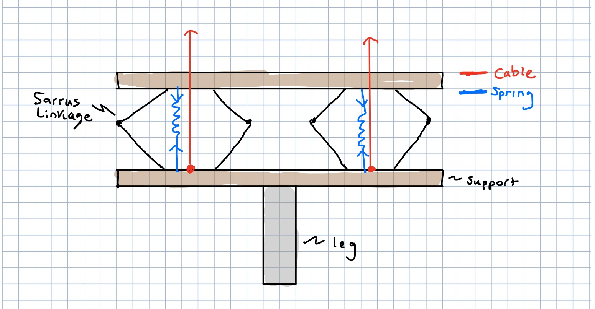
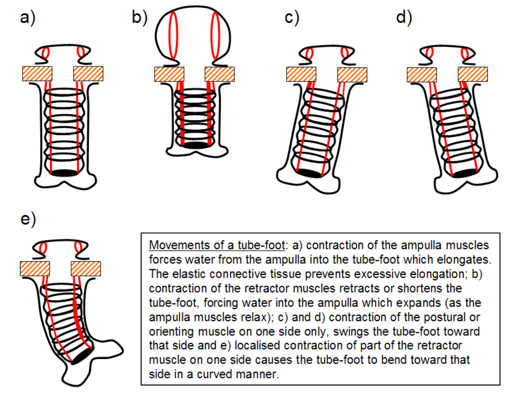
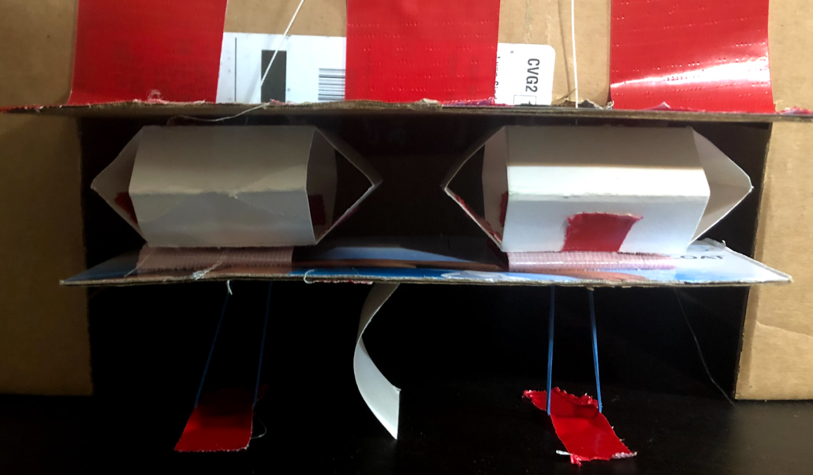
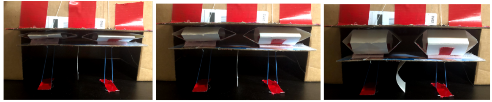

# Sarrus Linkage Leg (Podia Inspired)

Taking two sarrus linkages, capable of just linear motion, in a parallel setup allow us to lift and ‘walk’ with a leg.
The prototype concept diagram shown (Figure 1) depicts the sarrus linkages, with a cable force to contract them, and a spring force to extend them.
The leg is longer than the ground, so we could explore the stiffness of the leg as well.
The leg and its stiffness, friction, weight, etc can be explored for further functions in the system. 

Figure 1: Sarrus Leg Concept \

This design is loosely inspired by the locomotion of a starfish, specifically the podia of a starfish.
Podia are intended to move food to the mouth of the starfish, as well as assist with walking. With hydraulic pressure, the podia are capable of contraction and extension (linear translation) as well as rotation.
A series of podias are able to move in specific patterns of translations and rotations to move food particles to the starfish’s mouth or move the starfish itself. 
Discussed here, we only mention the podia and its mechanisms, not including ampullae and other components of starfish motion.[1]

Figure 2: Tube Foot Motion [2]\

The image above displays tube foot motion, which includes the ampullae (top, circular component) and the podium (bottom, cylindrical component). Discussed in the image is the motion. 

## Prototype/Proof of Concept
Prototype set up as seen in figure 3, we utilize cardstock sarrus linkage. The cut out guide of the sarrus linkage is seen in figure 4. 

Figure 3: Prototype Set up\

Figure 4: Sarrus linkage paper cut out guide\

Cardboard stabilizes the linkages, such that the system can move together. Kite string is attached to the bottom of the sarrus linkage, in the center, to act as the cable force that would be supplied by an actuator. Rubber bands act as compressive springs. They are also attached to the bottom of the sarrus linkage, and attach to the ground to extend the sarrus linkage when no cable force is applied. Lastly, a cardstock leg is shown. It is capable of compressing, adding another interesting motion in the system. Three videos submitted separately show two interesting motions the system would be capable of.
Figure 5 shows three positions of full contraction, middle of motion, and max extension when both linkages are moved together.

Figure 5: Up, Middle, Down of parallel linkage motion\

## Prototype Motion Videos
Video one, Sarrus Leg Left, touches down on the right side and moves the leg to the left.  Similarly Video two, Sarrus Leg Right, touches down on the left side, and moves the leg to the right. These videos showcase that the system can ‘walk’ in two directions when given a specific, opposite, sequence of compression/extension in the links. Video three, Sarrus Leg Up, contracts and extends both linkages at the same time to ‘bounce’ or ‘jump’, which can be explored further with different leg materials.

## Conclusions
This system is already capable of interesting motion. The leg can be considered a spring mass system, and the linkages can be simplified to linear actuators. System Kinematics and dynamics are part of the next steps, as well as a motion study of the system using tracker, to explore the damping of the leg. We can model both sarrus linkages as just two points that translate, and add a kinematic model on the leg to explore how it may help walk. 
After the kinematics and dynamics are redefined for just one leg, we can start to add multiple legs in series (each leg consists of two sarrus linkages) to perform different unique tasks. Accurate motion from the legs will require that each linkage is independently actuated, however we can explore using a single actuator for both if we want the system to only perform periodic motion. 

# References

[1] J. E. Smith, “The Mechanic and Innervation of the Starfish Tube Foot-Ampulla System,”, pp. 279-310, 1944
https://royalsocietypublishing.org/doi/pdf/10.1098/rstb.1946.0003?casa_token=IVlTV6xCV30AAAAA%3AcamyU1c2q8Uw3zFnYz1VW2Hc2Q5_G-Ni3hL1-Zxfc8Og_HMBDNYm8JgODuqLyWc5aVh5e3S1Smep& \

[2] Cronodon BioTech, Asteroid mechanics, “Asteroids 2- Hydraulic systems”
https://cronodon.com/BioTech/Asteroids_hydraulics.html

