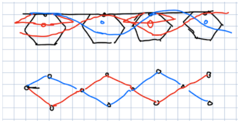
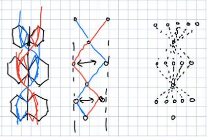
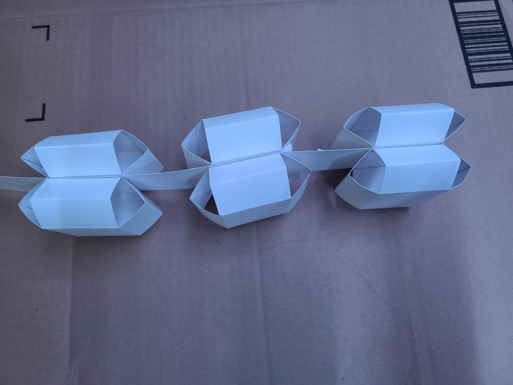
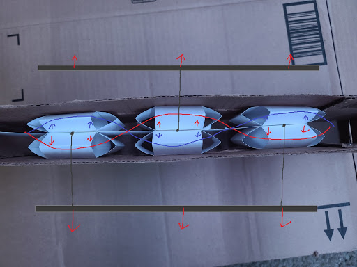

# Flexible Spine

## Concepts and Drawings
Unfortunately, the initial concept that Team 5 planned to move forward with resulted in too many snags that would have held the team back in the near future.
To get around this situation, it was decided that the team would research two new motion mechanisms, both of which attempt to utilize sarrus linkages in order to traverse small spaces.
The first of the two concepts is loosely inspired by the SAW robot [1], which is a miniature robot that produces a wave-like motion to crawl on/through different surfaces.
Some of the preliminary sketches of the concept are shown below in figures 1 and 2.These portray the intended motion of the mechanism, which resembles a sin wave by having springy sarrus linkages that alternate on either side of a flexible spine.
The red and blue lines represent the overall shape of the mechanism at opposite stages of the motion, where adjacent sarrus linkages would be in different positions (expanded or contracted).

\
Figure 1. Concept drawings of wave-like sarrus bot.\
\
Figure 2. Concept drawings of wave-like sarrus bot, cont.

The team theorized that this type of motion would function best in tight, tube-like spaces, in which the sarrus linkages would be able to properly push against the walls and manipulate the shape of the flexible spine. To test whether or not this motion would be interesting and feasible, a physical prototype would be needed.

## Prototype
Shown below in figure 3 is a rough prototype of the system made out of cardstock and tape.
Each of the sarrus linkages was cut out from a template printed onto the cardstock and the joints were linked on the inside and outside with clear packaging tape.
These were then spaced out and fastened to the cardstock spine with double-sided tape.

\
Figure 3. Cardstock/tape prototype.\
\
Figure 4. Prototype in cardboard “tube.”

The initial plan was to use string or fishing line strung through slots in the sides of the cardboard to pull multiple sarrus linkages, like shown in figure 4, but I found that simply manually manipulating them was sufficient. 
## Conclusion
After attempting to move the physical model by manipulating the sarrus linkages and flexible spine, I found that the system produces no significant directional motion. It instead remains stationary with the linkages only moving the spine side to side. After further analysis of the SAW robot motion, it becomes apparent that the motion stems from the movement of the individual links that are perpendicular to the wavelike motion. Since these links rotate as the wave moves up or down the body, that rotation causes the links to act almost like legs for a very brief moment, propelling the bot forward.

Perhaps the type of movement attempted here would be viable with numerous linkages or with more actuators, but since both of those would greatly increase the size or complexity of the robot, the team will likely move forward with the other brainstormed concept.

## References
[1] Zarrouk Lab. "Miniature SAW robot presented at ICRA 2019," YouTube, July 5, 2020. [Video file]. Available: https://www.youtube.com/watch?v=WTOz0OyJhzM. [Accessed: Mar. 6, 2021].
