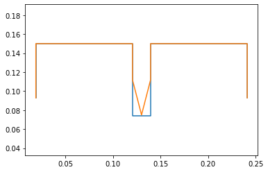

#System Kinematics

Team 5


Gilgal Ansah
gjansah@asu.edu

Javon Grimes
jdgrime1@asu.edu

Jonathan Nguyen
jrnguyen@asu.edu

Jacob Sindorf 
jsindorf@asu.edu

#Kinematic Model

Code of the kinematic model (see HW step 3)


```python
!pip install pypoly2tri idealab_tools foldable_robotics pynamics
```

    Requirement already satisfied: pypoly2tri in /usr/local/lib/python3.7/dist-packages (0.0.3)
    Requirement already satisfied: idealab_tools in /usr/local/lib/python3.7/dist-packages (0.0.22)
    Requirement already satisfied: foldable_robotics in /usr/local/lib/python3.7/dist-packages (0.0.29)
    Requirement already satisfied: pynamics in /usr/local/lib/python3.7/dist-packages (0.0.8)
    Requirement already satisfied: imageio in /usr/local/lib/python3.7/dist-packages (from idealab_tools) (2.4.1)
    Requirement already satisfied: ezdxf in /usr/local/lib/python3.7/dist-packages (from foldable_robotics) (0.15.2)
    Requirement already satisfied: pyyaml in /usr/local/lib/python3.7/dist-packages (from foldable_robotics) (3.13)
    Requirement already satisfied: matplotlib in /usr/local/lib/python3.7/dist-packages (from foldable_robotics) (3.2.2)
    Requirement already satisfied: numpy in /usr/local/lib/python3.7/dist-packages (from foldable_robotics) (1.19.5)
    Requirement already satisfied: shapely in /usr/local/lib/python3.7/dist-packages (from foldable_robotics) (1.7.1)
    Requirement already satisfied: scipy in /usr/local/lib/python3.7/dist-packages (from pynamics) (1.4.1)
    Requirement already satisfied: sympy in /usr/local/lib/python3.7/dist-packages (from pynamics) (1.7.1)
    Requirement already satisfied: pillow in /usr/local/lib/python3.7/dist-packages (from imageio->idealab_tools) (7.0.0)
    Requirement already satisfied: pyparsing>=2.0.1 in /usr/local/lib/python3.7/dist-packages (from ezdxf->foldable_robotics) (2.4.7)
    Requirement already satisfied: kiwisolver>=1.0.1 in /usr/local/lib/python3.7/dist-packages (from matplotlib->foldable_robotics) (1.3.1)
    Requirement already satisfied: cycler>=0.10 in /usr/local/lib/python3.7/dist-packages (from matplotlib->foldable_robotics) (0.10.0)
    Requirement already satisfied: python-dateutil>=2.1 in /usr/local/lib/python3.7/dist-packages (from matplotlib->foldable_robotics) (2.8.1)
    Requirement already satisfied: mpmath>=0.19 in /usr/local/lib/python3.7/dist-packages (from sympy->pynamics) (1.2.1)
    Requirement already satisfied: six in /usr/local/lib/python3.7/dist-packages (from cycler>=0.10->matplotlib->foldable_robotics) (1.15.0)
    


```python
%matplotlib inline
```


```python
import pynamics
from pynamics.frame import Frame
from pynamics.variable_types import Differentiable,Constant
from pynamics.system import System
#from pynamics.body import Body
#from pynamics.dyadic import Dyadic
from pynamics.output import Output,PointsOutput
#from pynamics.particle import Particle
import pynamics.integration
import sympy
import numpy
import matplotlib.pyplot as plt
plt.ion()
from math import pi
#from pynamics.constraint import Constraint
import scipy.optimize
import math as m
```


```python
system = System()
pynamics.set_system(__name__,system)
```

Creates the required lengths of each link and labels them accordingly. The sizes of the links are the same as seen in the diagram above converted to meters.


```python
#Defining link lengths

#Base Structure
l0 = Constant(0.05715, 'l0',system) # 2.25" * 0.0254 m/in = 0.05715
l1 = Constant(0.22225, 'l1',system) # 8.75" = 0.22225m
l2 = Constant(0.1016, 'l2',system) # 4" = 0.1016m
l3 = Constant(0.12065, 'l3',system) # 4.75" = 0.12065m
ls = Constant(0.009525,'ls',system) # 0.375" = 0.009525m

#Legs
lL = Constant(0.0381, 'lL',system) # 1.5" = 0.0381m

"""
#Leg Sections
lL = Constant(0.01905, 'lL',system) # 0.75" = 0.01905m
"""
```


    '\n#Leg Sections\nlL = Constant(0.01905, \'lL\',system) # 0.75" = 0.01905m\n'


Our system will consist of an outer frame that houses two sarrus linkages, which manipulate a v-shaped leg to move horizontally. The system is fixed a set distance away from the newtonian frame in the same orientation. Below we describe the angles and their differentiables based off the system kinematics diagram. These are needed to solve the Jacobian and final system kinematics. 


```python
# Creating dynamic state variables. system argument denotes them as state variables for pynamics system from above

#Frame angle from N
qA,qA_d,qA_dd = Differentiable('qA',system) #Angle between N and A

#Frame position
x1,x1_d,x1_dd = Differentiable('x1',system) #Position of x1, y1, which are at midpoint of L1
y1,y1_d,y1_dd = Differentiable('y1',system)

#Leg angles
q1,q1_d,q1_dd = Differentiable('q1',system)
q2,q2_d,q2_dd = Differentiable('q2',system)

#Sarrus extensions
s1,s1_d,s1_dd = Differentiable('s1',system)
s2,s2_d,s2_dd = Differentiable('s2',system)

"""
#Frame position
x1,x1_d,x1_dd = Differentiable('x1',system) #Position of x1, y1, which are at midpoint of L1
y1,y1_d,y1_dd = Differentiable('y1',system)

#Leg angles
q1,q1_d,q1_dd = Differentiable('q1',system)
q2,q2_d,q2_dd = Differentiable('q2',system)
q3,q3_d,q3_dd = Differentiable('q3',system)
q4,q4_d,q4_dd = Differentiable('q4',system)

#Sarrus extensions
s1,s1_d,s1_dd = Differentiable('s1',system)
s2,s2_d,s2_dd = Differentiable('s2',system)
"""
```


    "\n#Frame position\nx1,x1_d,x1_dd = Differentiable('x1',system) #Position of x1, y1, which are at midpoint of L1\ny1,y1_d,y1_dd = Differentiable('y1',system)\n\n#Leg angles\nq1,q1_d,q1_dd = Differentiable('q1',system)\nq2,q2_d,q2_dd = Differentiable('q2',system)\nq3,q3_d,q3_dd = Differentiable('q3',system)\nq4,q4_d,q4_dd = Differentiable('q4',system)\n\n#Sarrus extensions\ns1,s1_d,s1_dd = Differentiable('s1',system)\ns2,s2_d,s2_dd = Differentiable('s2',system)\n"


The following guess the initial values of the mechanism. Here we want to create it in a point of interesting motion, so our guesses are based on the mechanism in a "halfway" point. That being halfway through the bot's motion, when both sarrus linkages are extended and one is about to contract.


```python
#Create an initial guess for their starting positions; not necessarily accurate, given the constraint that they are supposed to be connected with given, constant length
#Guesses are close but not quite exact for the desired configuration to show that it solves correctly

initialvalues = {}

#Frame constants
initialvalues[qA]=0*pi/180 
initialvalues[qA_d]=0*pi/180 

#Leg angle init Values
initialvalues[q1]=0*pi/180  
initialvalues[q1_d]=0*pi/180 
initialvalues[q2]=0*pi/180   
initialvalues[q2_d]=0*pi/180

#Sarrus linkages init extension
initialvalues[s1] = 0.0381 # 0.0127 multiplied by 2 to show some adjustment when solving
initialvalues[s1_d] = 0
initialvalues[s2] = 0.0381 # 1.5" = 0.0381m
initialvalues[s2_d] = 0

#Frame center
initialvalues[x1] = 0.13
initialvalues[x1_d] = 0 
initialvalues[y1] = .15
initialvalues[y1_d] = 0

"""
#Leg angle init Values
initialvalues[q1]=0*pi/180  
initialvalues[q1_d]=0*pi/180 
initialvalues[q2]=0*pi/180   
initialvalues[q2_d]=0*pi/180
initialvalues[q3]=0*pi/180 
initialvalues[q3_d]=0*pi/180
initialvalues[q4]=0*pi/180   
initialvalues[q4_d]=0*pi/180

#Sarrus linkages init extension
initialvalues[s1] = 0.0127*2 # multiplied by 2 to show some adjustment when solving
initialvalues[s1_d] = 0
initialvalues[s2] = 0.0127
initialvalues[s2_d] = 0

#Frame contact points
initialvalues[x1] = 0.13
initialvalues[x1_d] = 0 
initialvalues[y1] = .15
initialvalues[y1_d] = 0
"""
```


    '\n#Leg angle init Values\ninitialvalues[q1]=0*pi/180  \ninitialvalues[q1_d]=0*pi/180 \ninitialvalues[q2]=0*pi/180   \ninitialvalues[q2_d]=0*pi/180\ninitialvalues[q3]=0*pi/180 \ninitialvalues[q3_d]=0*pi/180\ninitialvalues[q4]=0*pi/180   \ninitialvalues[q4_d]=0*pi/180\n\n#Sarrus linkages init extension\ninitialvalues[s1] = 0.0127*2 # multiplied by 2 to show some adjustment when solving\ninitialvalues[s1_d] = 0\ninitialvalues[s2] = 0.0127\ninitialvalues[s2_d] = 0\n\n#Frame contact points\ninitialvalues[x1] = 0.13\ninitialvalues[x1_d] = 0 \ninitialvalues[y1] = .15\ninitialvalues[y1_d] = 0\n'


```python
#Retrieve state variables in the order they are stored in the system
statevariables = system.get_state_variables()
```

All references frames needed to define the system. Set the N frame as the newtonian frame that is fixed. We then rotate each frame from the frame prior (seperatley for each side) about the z axis by an amount of q. q relates to the initial angles we guessed. 


```python
# Initializing reference frames
N = Frame('N')

A = Frame('A')

L1 = Frame('L1')
L2 = Frame('L2')

"""
L1 = Frame('L1')
L2 = Frame('L2')
L3 = Frame('L3')
L4 = Frame('L4')
"""
```


    "\nL1 = Frame('L1')\nL2 = Frame('L2')\nL3 = Frame('L3')\nL4 = Frame('L4')\n"


```python
#Set N frame as the newtonian
system.set_newtonian(N)
```


```python
#Declare axis that reference frames are rotated about

#Frame axis A
A.rotate_fixed_axis_directed(N,[0,0,1],qA,system)

#Leg
#left side of leg from sarrus 1
L1.rotate_fixed_axis_directed(A,[0,0,1],q1,system)
#right side of leg from sarrus 2
L2.rotate_fixed_axis_directed(A,[0,0,1],q2,system)


"""
#Leg
#left side of leg from sarrus 1
L1.rotate_fixed_axis_directed(A,[0,0,1],q1,system)
L2.rotate_fixed_axis_directed(L1,[0,0,1],q2,system)
#right side of leg from sarrus 2
L4.rotate_fixed_axis_directed(A,[0,0,1],q4,system)
L3.rotate_fixed_axis_directed(L4,[0,0,1],q3,system)
"""
```


    '\n#Leg\n#left side of leg from sarrus 1\nL1.rotate_fixed_axis_directed(A,[0,0,1],q1,system)\nL2.rotate_fixed_axis_directed(L1,[0,0,1],q2,system)\n#right side of leg from sarrus 2\nL4.rotate_fixed_axis_directed(A,[0,0,1],q4,system)\nL3.rotate_fixed_axis_directed(L4,[0,0,1],q3,system)\n'


Here we define the necessary points to create the mechanism. 

The outer frame is all based off of frame A, which is currently in the same orientation as frame N. The sarrus extension lengths s1 and s2 protrude out from the middle of the frame and connect the the legs, which are made up of pL1, pLtip1, pLtip2, and pL2. The end effector is located that pLtip1. Each vector equation is made up of a starting vector/point and a distance multiplied by a directional unit vector.


```python
#Define vectors/points of the mechanism based on frames and previous vectors

#Center of outer frame
pAcm = x1*N.x + y1*N.y

#Sarrus extension frames
ps1 = pAcm - ls*A.x
ps2 = pAcm + ls*A.x

#Outer frame
pB = ps1  -l2*A.x
pC = ps2  + l2*A.x
pA = pB - l0*A.y
pD = pC - l0*A.y

#Legs
pL1 = ps1 - s1*A.y
pL2 = ps2 - s2*A.y

#Leg tips/foot
pLtip1 = pL1 - lL*L1.y
pLtip2 = pL2 - lL*L2.y

#Arbitrary pout that represents the end effector, here it is  pFE. The system moves in one direction
pout = pLtip1

"""
#Center of outer frame
pAcm = x1*N.x + y1*N.y

#Sarrus extension frames
ps1 = pAcm - ls*A.x
ps2 = pAcm + ls*A.x

#Outer frame
pB = ps1  -l2*A.x
pC = ps2  + l2*A.x
pA = pB - l0*A.y
pD = pC - l0*A.y

#Legs
pL1 = ps1 - s1*A.y
pL2 = pL1 - lL*L1.y
pL4 = ps2 - s2*A.y
pL3 = pL4 - lL*L4.y

#Leg tips/foot
pLtip1 = pL2 - lL*L2.y
pLtip2 = pL3 - lL*L3.y
"""
```


    '\n#Center of outer frame\npAcm = x1*N.x + y1*N.y\n\n#Sarrus extension frames\nps1 = pAcm - ls*A.x\nps2 = pAcm + ls*A.x\n\n#Outer frame\npB = ps1  -l2*A.x\npC = ps2  + l2*A.x\npA = pB - l0*A.y\npD = pC - l0*A.y\n\n#Legs\npL1 = ps1 - s1*A.y\npL2 = pL1 - lL*L1.y\npL4 = ps2 - s2*A.y\npL3 = pL4 - lL*L4.y\n\n#Leg tips/foot\npLtip1 = pL2 - lL*L2.y\npLtip2 = pL3 - lL*L3.y\n'


```python
#Define points list for plotting
points = [pA,pB,ps1,pL1,pLtip1,pLtip2,pL2,ps2,pC,pD]

"""
points = [pA,pB,ps1,pL1,pL2,pLtip1,pLtip2,pL3,pL4,ps2,pC,pD]
"""
```


    '\npoints = [pA,pB,ps1,pL1,pL2,pLtip1,pLtip2,pL3,pL4,ps2,pC,pD]\n'


Create list of initial values 


```python
#Create list of initial variables
statevariables = system.get_state_variables()
ini0 = [initialvalues[item] for item in statevariables]
```

Create constraints.

Our system has 2 inputs, which we defined as the s values earlier, leaving dependant values for q1, and q2. With that we have 2 unknowns and will need 2 constraint equations.

The following vector is the one we will use for both constraints. eq_vector represents the distance between pLtip1 and pLtip2.


```python
#Define constraint vectors that will be used to limit the motion of the system as desired

eq_vector = pLtip1 - pLtip2
```

The actual constraint equations (2 for 2 unknowns) are below

In short, the differences between the two x values and between the two y values are added into a list as errors, which will later be reduced to optimize a solution.


```python
#Create list eq and append errors into it for later optimization
eq = []

eq.append((eq_vector).dot(A.x))
eq.append((eq_vector).dot(A.y))

eq_d=[(system.derivative(item)) for item in eq]
```

Here the independant and dependant values are officially defined. We now have the 2 constraint equations to satisfy the 2 unknowns.


```python
#Define independent and dependent variables; # of items in qd should equal # of constraints above

qi = [s1,s2]
qd = [q1,q2]

"""
#qd = [q1,q2,q3,q4,qA,x1,y1]
"""
```


    '\n#qd = [q1,q2,q3,q4,qA,x1,y1]\n'


```python
constants = system.constant_values.copy() # Recalls link lengths declared near beginning
defined = dict([(item,initialvalues[item]) for item in qi])
constants.update(defined)
constants # Stores the names of constants/known values along with their values
```


    {l₀: 0.05715, l₁: 0.22225, l₂: 0.1016, l₃: 0.12065, lL: 0.0381, ls: 0.009525, 
    s₁: 0.0381, s₂: 0.0381}


```python
#substitute constants in equation
eq = [item.subs(constants) for item in eq] # substitutes the values from constants into the equation eq
```


```python
#convert to numpy array and sum the error
error = (numpy.array(eq)**2).sum()
```


```python
#Convert to a function that scipy can use. Sympy has a “labmdify” function that evaluates an expression, but scipy needs a slightly different format.
f = sympy.lambdify(qd,error)

def function(args):
    return f(*args)
```


```python
guess = [initialvalues[item] for item in qd]
```


```python
result = scipy.optimize.minimize(function,guess)
#if result.fun>1e-3:
    #raise(Exception("out of tolerance"))

result.fun # if 0, then solves fine
```


    1.8074551908110335e-10


Here the code solved for the desired mechanism (orange) given the initial guesses (blue). We purposely gave a wrong initial guess for one angle so that it is easy to visualize that the system solved correctly and to make the definition of frames simpler.


```python
ini = []
for item in system.get_state_variables():
    if item in qd:
        ini.append(result.x[qd.index(item)])
    else:
        ini.append(initialvalues[item])
```


```python
points = PointsOutput(points, constant_values=system.constant_values)
points.calc(numpy.array([ini0,ini]))
points.plot_time()
```

    2021-03-23 22:21:42,278 - pynamics.output - INFO - calculating outputs
    2021-03-23 22:21:42,280 - pynamics.output - INFO - done calculating outputs
    


    <matplotlib.axes._subplots.AxesSubplot at 0x7f9018f62a50>


    

    


 Find Internal Jacobian

 To do so we turn the constraint equations into vectors, giving us two equations for independant and dependant. We then take the derivative of those constraint equation vectors and solve for the internal input/output Jacobian


```python
eq_d = sympy.Matrix(eq_d)
```


```python
qi = sympy.Matrix([s1_d,s2_d])
qd = sympy.Matrix([q1_d,q2_d])

"""
qi = sympy.Matrix([s1_d,s2_d])
qd = sympy.Matrix([q1_d,q2_d,q3_d,q4_d,qA_d,x1_d,y1_d])
"""
```


    '\nqi = sympy.Matrix([s1_d,s2_d])\nqd = sympy.Matrix([q1_d,q2_d,q3_d,q4_d,qA_d,x1_d,y1_d])\n'


```python
AA = eq_d.jacobian(qi)
BB = eq_d.jacobian(qd)
```


```python
BB.simplify() #simplify expression so we can actually run jacobian smoothly
BB
```


    ⎡lL⋅cos(q₁)  -lL⋅cos(q₂)⎤
    ⎢                       ⎥
    ⎣lL⋅sin(q₁)  -lL⋅sin(q₂)⎦


```python
J = -BB.inv()*AA
J  #note, somewhat long; simplify helps to comprehend
```


    ⎡               -cos(q₂)                                   cos(q₂)            
    ⎢────────────────────────────────────────  ───────────────────────────────────
    ⎢-lL⋅sin(q₁)⋅cos(q₂) + lL⋅sin(q₂)⋅cos(q₁)  -lL⋅sin(q₁)⋅cos(q₂) + lL⋅sin(q₂)⋅co
    ⎢                                                                             
    ⎢                cos(q₁)                                  -cos(q₁)            
    ⎢───────────────────────────────────────   ───────────────────────────────────
    ⎣lL⋅sin(q₁)⋅cos(q₂) - lL⋅sin(q₂)⋅cos(q₁)   lL⋅sin(q₁)⋅cos(q₂) - lL⋅sin(q₂)⋅cos
    
         ⎤
    ─────⎥
    s(q₁)⎥
         ⎥
         ⎥
    ──── ⎥
    (q₁) ⎦


We can then simplify the jacobian into a cleaner looking form that we can utulize for calculations. qd2 is the dependant variables we solve for and subs substitutes the values for us. An example finding vout is shown below that is reused in part 8 of this assignment


```python
J.simplify()
J
```


    ⎡    cos(q₂)         -cos(q₂)    ⎤
    ⎢───────────────  ───────────────⎥
    ⎢lL⋅sin(q₁ - q₂)  lL⋅sin(q₁ - q₂)⎥
    ⎢                                ⎥
    ⎢    cos(q₁)         -cos(q₁)    ⎥
    ⎢───────────────  ───────────────⎥
    ⎣lL⋅sin(q₁ - q₂)  lL⋅sin(q₁ - q₂)⎦


```python
qd2 = J*qi
qd2
```


    ⎡ s_1_d⋅cos(q₂)     s_2_d⋅cos(q₂) ⎤
    ⎢─────────────── - ───────────────⎥
    ⎢lL⋅sin(q₁ - q₂)   lL⋅sin(q₁ - q₂)⎥
    ⎢                                 ⎥
    ⎢ s_1_d⋅cos(q₁)     s_2_d⋅cos(q₁) ⎥
    ⎢─────────────── - ───────────────⎥
    ⎣lL⋅sin(q₁ - q₂)   lL⋅sin(q₁ - q₂)⎦


```python
subs = dict([(ii,jj) for ii,jj in zip(qd,qd2)])
subs
```


    ⎧        s_1_d⋅cos(q₂)     s_2_d⋅cos(q₂)           s_1_d⋅cos(q₁)     s_2_d⋅cos
    ⎨q_1_d: ─────────────── - ───────────────, q_2_d: ─────────────── - ──────────
    ⎩       lL⋅sin(q₁ - q₂)   lL⋅sin(q₁ - q₂)         lL⋅sin(q₁ - q₂)   lL⋅sin(q₁ 
    
    (q₁) ⎫
    ─────⎬
    - q₂)⎭


```python
pout #pBC end effector
```


    -lL*L1.y - ls*A.x - s1*A.y + x1*N.x + y1*N.y


```python
vout = pout.time_derivative()
vout
```


    lL*L1.x*(q1_d + qA_d) + qA_d*s1*A.x + x1_d*N.x + y1_d*N.y + A.y*(-ls*qA_d - s1_d)


```python
vout = vout.subs(subs)
vout
```


    lL*L1.x*(qA_d + s1_d*cos(q2)/(lL*sin(q1 - q2)) - s2_d*cos(q2)/(lL*sin(q1 - q2))) + qA_d*s1*A.x + x1_d*N.x + y1_d*N.y + A.y*(-ls*qA_d - s1_d)


## Middle of Typical Gait (#4)

As mentioned above, when solving the constraints and creating the mechanism, we initially made it into a position of interest. That position being the point where both sarrus lingages are extended. That point in the motion is where the motion is at its fastest, as the leg is fully extended and is about to continue its curcular gait to the side

## Plot (#5)


## Force Vector Estimates (#6)

>From your biomechanics-based specifications, define one or more force vector estimates (one for each end effector) that the system should be expected to experience. Consider including, based on your research
>
>1. the force of gravity exerted by the mass of a “payload” or the main body of the robot.
>2. the acceleration the system experiences during a typical gait
>3. ground reaction forces measured from biomechanics studies.

Below are some of the main forces we are considering.

- Gravity -> Friction on End-Effector and Rear/Base
 - Need to consider weight of motor and weight of materials
- Spring Force
 - Defined by distance between links and spring constant
- Tension from Motor/String
 - Enough to match or surpass spring force

# Force/Torque at Input (#7)

>Calculate the force or torque required at the input to satisfy the end-effector force requirements

Below is the calculation of the force required at the input, based on the sarrus kinematics assignment.


```python
F_ee
```


    array([0. , 0.5])


```python
F_ee = numpy.array([0, 0.5]).T # Arbitrary force vector on end effector
F_in = J.T.dot(F_ee)
F_in
```

    /usr/local/lib/python3.7/dist-packages/sympy/matrices/matrices.py:1357: SymPyDeprecationWarning: 
    
    Dot product of non row/column vectors has been deprecated since SymPy
    1.2. Use * to take matrix products instead. See
    https://github.com/sympy/sympy/issues/13815 for more info.
    
      useinstead="* to take matrix products").warn()
    


    ⎡  0.5⋅cos(q₁)     -0.5⋅cos(q₁)  ⎤
    ⎢───────────────, ───────────────⎥
    ⎣lL⋅sin(q₁ - q₂)  lL⋅sin(q₁ - q₂)⎦


## Velocity of End Effector (#8)

>Estimate the velocity of the end-effector in this configuration. Using the Jacobian, calculate the speed required by the input(s) to achieve that output motion.

Below are the calculations done to find the velocity of the end effector. See discussion for more details.


```python
vout
```


    lL*L1.x*(qA_d + s1_d*cos(q2)/(lL*sin(q1 - q2)) - s2_d*cos(q2)/(lL*sin(q1 - q2))) + qA_d*s1*A.x + x1_d*N.x + y1_d*N.y + A.y*(-ls*qA_d - s1_d)


```python
"""
angA = 135*pi/180 #radians
angF = 45*pi/180 #radians
length0 = 0.0254 #meters
v_in = 0.02 # meters/sec
r = 0.0254
w = -v_in/r
v_out = length0 * w * m.cos(angA)/m.cos(angF)
v_out
"""
```

>Finally, using the two estimates about force and speed at the input, compute the required power in this configuration

Power = Force * Velocity 


```python
power = F_in * v_out
power
```


    ---------------------------------------------------------------------------

    NameError                                 Traceback (most recent call last)

    <ipython-input-1-6ea290b5269d> in <module>()
    ----> 1 power = F_in * v_out
          2 power
    

    NameError: name 'F_in' is not defined


```python

```

## Discussion

1. How many degrees of freedom does your device have? How many motors? If the answer is not the same, what determines the state of the remaining degrees of freedom? How did you arrive at that number?

Our system has two degrees of freedom and we will be able to drive our system with the strength of one motor, though we may use two for now to simplify the sytem. The use of two sarrus linkages with a leg across them allows for more complex motion.

2. If your mechanism has more than one degree of freedom, please describe how those multiple degrees of freedom will work togehter to create a locomotory gait or useful motion. What is your plan for synchonizing, especially if passive energy storage?

The shape of the leg, along with the alternating extension from the sarrus linkages will allow for a circular movement gait, a portion of which will contact the ground and result in movement for the bot. As mentioned earlier, this system coould be controlled by one motor. This would be done by having two cables from the sarrus linkages/springs connected to a sort of cam on two different points. As the motor rotates, the cables would be pulled taught in sequence.

3. How did you estimate your expected end-effector forces

Our robot kinematics was modeled with bio-inspiration from the starfish. Based on previously conducted research on the biomechanics of the starfish, we used the maximum mass of the starfish as a basis of calculating the ground reaction force that our end effector will experience. 

4. How did you estimate your expected end-effector speeds

The equation for the velocity of the end effector was found symbolically through the python simulation above. For the estimated velocity values, we used values determined by the biomechanics assignment for movement speed. Geometric relations for angular speed helped us determine the output velocity given a specific input. 


```python

```
