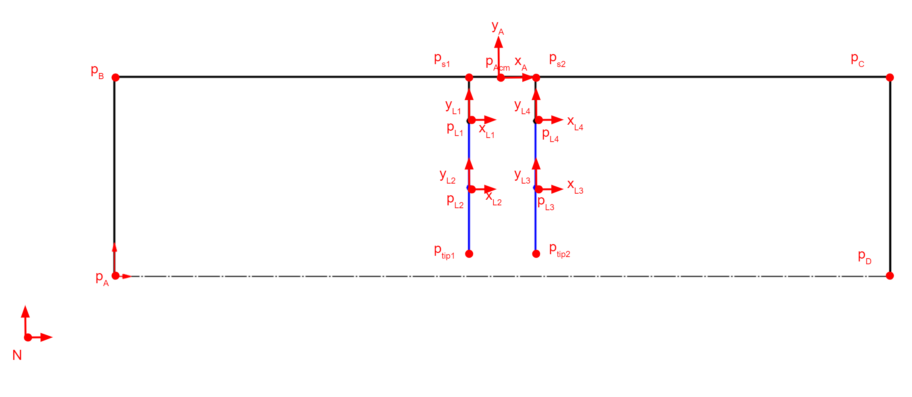
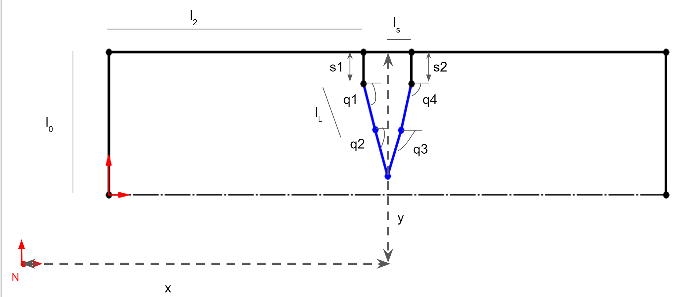
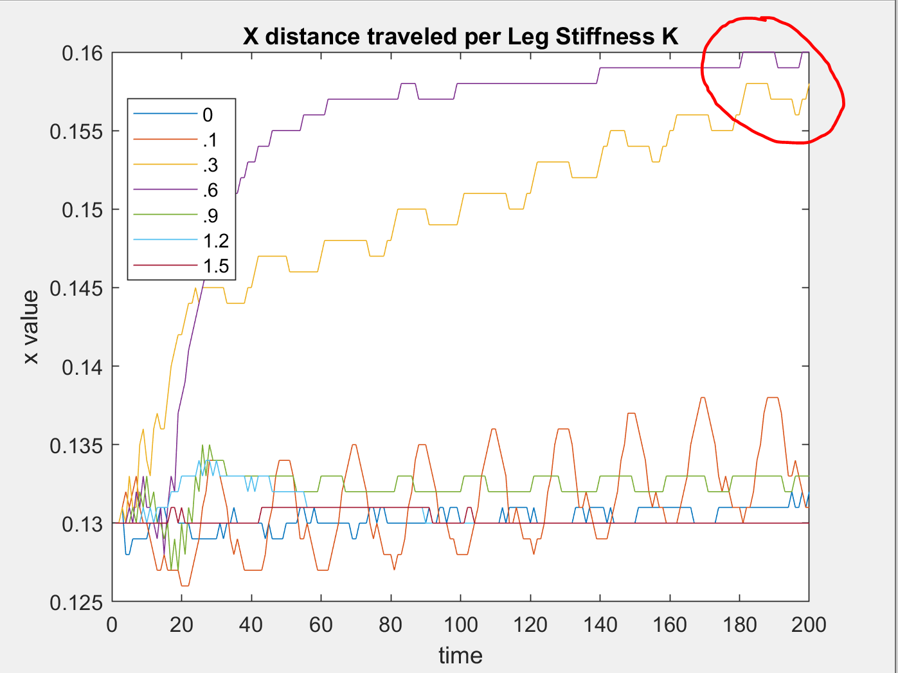
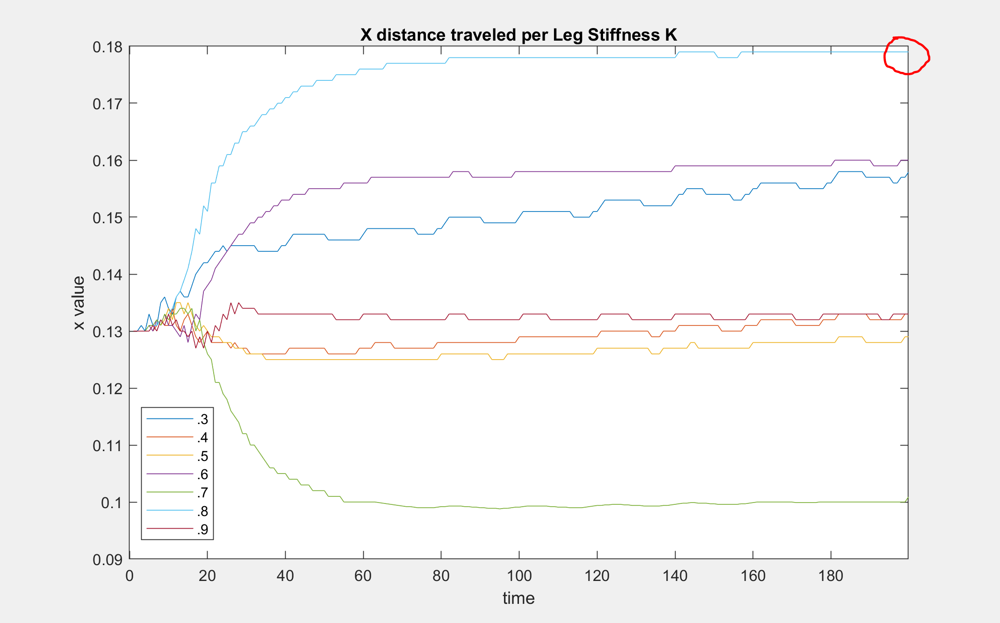

### Description
[Assignment Instructions](https://egr557.github.io/assignments/design-optimization.html)
 
### Performance Measurement
a. Explain, in words, how your team will evaluate the success of your robot’s design. This could be by measuring the forces produced by your design, the speed at which it walks, its thrust:weight ratio, the height it can jump, etc. Explain, in words, how you will measure performance in simulation. How will you measure performance in experiments?
* Our team’s device is intended to walk using the foldable concepts we learned in class. The locomotion is driven through alternating sarrus linkages and a leg stiffness to move in a forward direction. In order to have a successful device, we wouldn't want to optimize the leg stiffness such that we get the maximum distance traveled per stride. To measure this, we would need to start the device at a specific zero point, with sarrus linkages and leg set to a common initial position. After starting the device, taking time measurements and distance traveled (in x) of the device would allow us to calculate distance per stride, body lengths per second, etc. This is achievable with a tape measure adhered to a table, a stopwatch, and a camera (to ensure accuracy). 
* Success: distance traveled/ distance per stride / body lengths per stride
* Measure: tape measure, starting point at 0, stopwatch to measure time points


b. Are experimental vs. simulation metrics similar or vastly different? If different, how will you equate A with B?
* We consider the experimental and simulation metrics to be similar. The simulation metrics are designed to optimize the spring stiffness in the leg based on the device restrictions (such as available motor torque/speed, sarrus linkage spring stiffness etc). The Dynamics II code is then able to output the x distance traveled of the device. The farthest traveled x distance would be the best leg stiffness value. Experimentally, we want to test the optimized leg stiffness, and measure the distance traveled of the device. We could calculate body lengths per second as well. The optimized spring stiffness would be a maximum spring stiffness based on the device restrictions (so the motor and sarrus linkages could still move in a loop). This would give us a ground reaction force that would propel the device more if the force is higher. So the optimized stiffness would yield the farthest distance traveled.  

c. Do you have more than one performance metric you must use as for design goals? If so, either identify the most important one or explain how you will balance two competing criteria. For example, if you need a robot to jump high AND far, which is more important, or how do you establish a relationship between these two possibly competing goals?
* The goal of our device is to travel farther in one stride. A stride would be similar to human gait where it is the duration of leg contact to the next time the leg contacts the ground. In order to travel far, we would need an optimized leg stiffness value, that is able to provide an extra push when walking. A small stiffness would collapse and provide no push, and a rigid leg would not add any extra force to the system. By optimizing the leg stiffness, the distance traveled could be seen as a direct consequence. To balance the criteria, we would first optimize the stiffness through simulation, then we can run performance measurements based on that result. 

d. Explain, in math, the measurable performance metric(s) by which your team can estimate performance.
* (Body lengths/Distance traveled) * (Distance traveled/Second) = Body lengths/Second

e. Write, in code, a function that will evaluate the performance of your current system (as simulated in System Dynamics II).
* See Dynamics II code, we alter the input k value which is the stiffness in the leg. We can then extract the x distance traveled by the device over time and compare that for each given stiffness. 

### Constraints
a. Brainstorm and describe your team’s design constraints. Constraints are aspects of your design that are “bounded” by some physical limit (eg, the size of robot you can cut on a given laser cutter, the range of motion of a typical foldable hinge joint)

* Design constraints would directly affect how we optimize the spring stiffness in the leg.

Some constraints per device part:

The frame could be created out of cardstock or cardboard. The main constraints here would be stability and weight. The frame must be rigid enough to support the motor and its weight, but also light enough to encourage locomotion. 

Sarrus linkages have a specific spring stiffness associated with them. The spring stiffness is weak enough such that the motor is able to contract it (based on motor’s torque capabilities), but strong enough to push the leg into the ground and cause deformation in the leg (which promote locomotion).

Lastly the leg must be stiff enough to pick up and propel the device, but weak enough to be deformed by the sarrus linkage. This is a very important consideration when optimizing the device, as high stiffness values would cause issues with the sarrus linkages. So, at all times the leg stiffness must be less than or equal to the sarrus linkage. 

b. Explain, in words, how you will track violation of design constraints. For example, let's say your optimization routine suggests a design that cannot be made in a single sheet of paper.

* In order to track violations of design constraints, we utilize the dynamics II code as it provides a frame, mass and necessary forces, while allowing us to easily change the leg stiffness. That way all the constants stay constant, but the change in leg stiffness can affect the final outcome and system behavior such as distance traveled. The main constraint is the range of leg stiffness values we can use. Explained in the code, we must have the leg stiffness less than or equal to the sarrus linkage spring stiffness. That would be a range of 0 to 1.5 N/m. Values outside of this range would violate the design constraints. The values of interest to us are those that result in movement in the positive x direction, or where dx = [0,∞].


# Optimization Logic and Steps 

This description walks through how we used our dynamics II code to optimize the spring stiffness value. The code already has weight and forces to restrict the system, so we can change stiffness and see how the system reacts. 

In order to code our optimization for the device, we want to tune the k value (stiffness in the leg) such that the device moves farther in the x direction. Motion in the x is our desired outcome that we seek to maximize based on the leg stiffness. To do so we can utilize our dynamics II code. 
First, we have to know the spring stiffness in the sarrus linkages as the stiffness in the leg must always be less than or equal to it. Otherwise the sarrus linkages would be unable to deform the leg and push it downwards. Using the motor and the motors capable torque, we conclude that:


Kmax = F/x, with x = 1.5 inches (38.1 mm), F (from DC motor = 98mN) 

Kmax = 2.564 N/m

Our spring in particular would have a stiffness approximate to 1.5 N/m. Thus, the leg stiffness needs to have a value less than or equal to 1.5. To test this in our dynamics II simulation, we need to change the input k constant for different values between 0 and 1.5. 
We chose the values (0,.1,.3,.6,.9,1.2,1.5) 

Using the code, we can take the x1 state, where in the diagram below we see x1 is a tracking point at the top middle of the device (just above the center of the leg). 




We can extract the x value using savetxt and put it into a csv file. We do this for all values of k, and can graph them in one graph to compare. We rerun the same code and save the data instead of running a loop to save us from debugging. 


Insert graph of all x values, insert reasoning as to why which one is the best (is there a range of values ?) 



From the plot, we can see that values of .3 and .6 yield higher values of x towards the end. 0.9 then dropped and yielded a poor increase in x distance traveled. Thus we want to have a value somewhere in between .3 and .9, which we ran and tested. 

Viewing the new optimal value graph, we see that the largest motion is performed by .7 and .8 stiffness. .7 however moves in the negative direction, at a lower magnitude than .8. Watching the dynamics motion render we also see the leg attempts to move in the positive direction, so some error may have occurred in our code. With this, we can conclude that an optimal leg stiffness value, given a 1.5 stiffness value for our sarrus linkages, would be .8 N/m.

This plot shows that the .8 stiffness is near the optimal value for us to choose. 




# Dynamics II code

Note: this is the same code from dynamics II assignment, we are adding in different k values to see how the output x value changes.


```python
#importing packages
import sympy
sympy.init_printing(pretty_print=False)

import pynamics
from pynamics.frame import Frame
from pynamics.variable_types import Differentiable,Constant,Variable
from pynamics.system import System
from pynamics.body import Body
from pynamics.dyadic import Dyadic
from pynamics.output import Output,PointsOutput
from pynamics.particle import Particle
import pynamics.integration
import pynamics.tanh
import scipy.optimize
import sympy
from sympy import sin
import numpy
import matplotlib.pyplot as plt
plt.ion()
from math import pi
import math

#Pynamics System
system = System()
pynamics.set_system(__name__,system)

tol = 1e-4
error_tol = 1e-10
```

This cell contains the constants of the system, including the following:
lengths and masses of each link,
the gravity, damping, and spring constants, preload values (to define the resting positions of springs), and the moment of inertia values, which are used in body/motion-related calculations.

This is the cell where leg stiffness is changed


```python
#defining constants; inches, uncaled to meters

#Base Structure
l0 = Constant(0.05715, 'l0',system) # 2.25" * 0.0254 m/in = 0.05715
l1 = Constant(0.22225, 'l1',system) # 8.75" = 0.22225m
l2 = Constant(0.1016, 'l2',system) # 4" = 0.1016m
l3 = Constant(0.12065, 'l3',system) # 4.75" = 0.12065m
ls = Constant(0.009525,'ls',system) # 0.375" = 0.009525m
#Leg Sections
lL = Constant(0.01905, 'lL',system) # 0.75" = 0.01905m

#Mass Constants
mFrame = Constant(.05,'mLeft',system) 
#mRight = Constant(.005,'mRight',system)
mLeg = Constant(.005,'mLeg',system)

#Gravity/Damping/Spring Force
g = Constant(9.81,'g',system)
b = Constant(1e1,'b',system) #damping

###########################################################################################
##############  Leg Stiffnesss Value, changed from 0-1.5 to test optimization##############
###########################################################################################
k = Constant(8e-1,'k',system) #spring force
###.8 here as that was the concluded optimal leg stiffness

#spring preloads to system
preload1 = Constant(0*pi/180,'preload1',system)
preload2 = Constant(0*pi/180,'preload2',system)
preloadS = Constant(0.04572,'preloadS',system) #Sarrus at rest at ~1.8 inches 1.8" = 0.04572m


#Inertia of body A
Ixx_A = Constant(1,'Ixx_A',system)
Iyy_A = Constant(1,'Iyy_A',system)
Izz_A = Constant(1,'Izz_A',system)
```

The next few lines define the length and response rate of the animation and position calculations.


```python
#Animation stuff
tinitial = 0
tfinal = 10
fps = 20
tstep = 1/fps
t = numpy.r_[tinitial:tfinal:tstep]
```

The dynamic state variables are used wherever the system experiences change over time. Only qA, x1, and y1 are needed to define the location/orientation of the outer frame, as the rest of the frame is considered rigid and the other links are based on the position of pA.

The q1 and q4 variables represent the angles between the legs and the sarrus extensitons, whose lengths are denoted by s1 and s2. To simulate comliant elements in the system, the legs are split in the middle, and angles q2 and q3 represent the bend in the links.


```python
# Creating dynamic state variables. system argument denotes them as state variables for pynamics system from above

#Frame angle from N
qA,qA_d,qA_dd = Differentiable('qA',system) #Angle between N and A

#Frame position
x1,x1_d,x1_dd = Differentiable('x1',system) #Position of x1, y1, which are at midpoint of L1
y1,y1_d,y1_dd = Differentiable('y1',system)

#Leg angles
q1,q1_d,q1_dd = Differentiable('q1',system)
q2,q2_d,q2_dd = Differentiable('q2',system)
q3,q3_d,q3_dd = Differentiable('q3',system)
q4,q4_d,q4_dd = Differentiable('q4',system)

#Sarrus extensions
s1,s1_d,s1_dd = Differentiable('s1',system) #should move in A.y
s2,s2_d,s2_dd = Differentiable('s2',system)
```

Shown below are the length and angle values (in meters and degrees, respectively) that make up the initial guess for the system.


```python
initialvalues = {}

#Frame constants
initialvalues[qA]=0*pi/180 
initialvalues[qA_d]=0*pi/180 

#Leg angle init Values
initialvalues[q1]=0*pi/180  
initialvalues[q1_d]=0*pi/180 
initialvalues[q2]=0*pi/180   
initialvalues[q2_d]=0*pi/180
initialvalues[q3]=0*pi/180 
initialvalues[q3_d]=0*pi/180
initialvalues[q4]=0*pi/180   
initialvalues[q4_d]=0*pi/180

#Sarrus linkages init extension
initialvalues[s1] = 0.0127          #initially both compressed, then will end with right fully extended 0.5" = 0.0127m
initialvalues[s1_d] = 0  #0         #xhanged s1 and s2 velocities. Changing s2 makes it go through 0 as ptip 2 does not have ground constraint
initialvalues[s2] = 0.0127          # 0.5" = 0.0127m
initialvalues[s2_d] = 0  #0

#Frame contact points
initialvalues[x1] = 0.13
initialvalues[x1_d] = 0 
initialvalues[y1] = .15
initialvalues[y1_d] = 0
```

This creates a list that contains the values above.


```python
#Create initial guess list
statevariables = system.get_state_variables()
ini = [initialvalues[item] for item in statevariables]
```

Below are the reference frames of the system. As mentioned above, only the A reference frame is needed for the system's outer frame, due to the rigidity of the system. The L frames are used to calculate the angles of the leg sections relative to each other.


```python
# Initializing frames

#Newtonian
N = Frame('N')
system.set_newtonian(N)

A = Frame('A')

L1 = Frame('L1')
L2 = Frame('L2')
L3 = Frame('L3')
L4 = Frame('L4')
```

The A frame is rotated qA degrees from the N frame, the L1/L4 frames are rotated q1/q4 degrees from the A frame, and the L2/L3 frames are rotated q2/q3 degrees from the L1 and L4 frames.


```python
#Axis rotations

#Frame axis A
A.rotate_fixed_axis_directed(N,[0,0,1],qA,system)

#Leg
#left side of leg from sarrus 1
L1.rotate_fixed_axis_directed(A,[0,0,1],q1,system)
L2.rotate_fixed_axis_directed(L1,[0,0,1],q2,system)
#right side of leg from sarrus 2
L4.rotate_fixed_axis_directed(A,[0,0,1],q4,system)
L3.rotate_fixed_axis_directed(L4,[0,0,1],q3,system)
```

This is the definition of the vectors that make up the system's links. Each vector is made up of a staring position, and a length multiplied by a unit vector in a particular direction.


```python
#Define vectors/Frame/point Locations
pAcm = x1*N.x + y1*N.y


#Sarrus extension frames
ps1 = pAcm - ls*A.x
ps2 = pAcm + ls*A.x

pB = ps1  -l2*A.x
pC = ps2  + l2*A.x
pA = pB - l0*A.y
pD = pC - l0*A.y


pL1 = ps1 - s1*A.y
pL2 = pL1 - lL*L1.y
pL4 = ps2 - s2*A.y
pL3 = pL4 - lL*L4.y

pLtip1 = pL2 - lL*L2.y
pLtip2 = pL3 - lL*L3.y


#torque/force = A*sympy.sin(w*system.t)+b # create torque about frame, A = amplitude/max value of Torque or force desired; w = frequency of oscillation
# t*A.z
# addForce(torque*A.z, wAB) #adding torques as a function of sin(t)
# Not a position constraint (be at x position at t time)
# Use 
```

These are the positions that we have decided to place the masses in order to keep the system simplified. The locations are found in the same way as the vectors above.


```python
#Define the locations of the masses
mLocFrame = pAcm
mLocL1 = pL1 - (lL/2)*L1.y
mLocL2 = pL2 - (lL/2)*L2.y
mLocL4 = pL4 - (lL/2)*L4.y
mLocL3 = pL3 - (lL/2)*L3.y

mLocLeftFrame = pA + (l0/2)*A.y
mLocRightFrame = pD + (l0/2)*A.y
```

The particles defined below, along with the moment of inertia and body, influence the physics of the system and determine how it will move under loads/forces.


```python
#Define particle locations


#Frame locations
partL1 = Particle(mLocL1,mLeg,'PartL1',system)
partL2 = Particle(mLocL2,mLeg,'PartL2',system)
partL3 = Particle(mLocL3,mLeg,'PartL3',system)
partL4 = Particle(mLocL4,mLeg,'PartL4',system)

#partFrame = Particle(pAcm,mFrame,'PartFrame',system)

#Inertia and Bodie
IA = Dyadic.build(A,Ixx_A,Iyy_A,Izz_A)
bodyFrame = Body('bodyFrame',A,mLocFrame,mFrame,IA,system)

```

The w and v variables below represent angular velocity and linear velocity, respectively. These are used in the force calculations in the following cell.


```python
#Angular Velocity, w (omega)
wL1 = A.getw_(L1) 
wL2 = L1.getw_(L2)
wL4 = A.getw_(L4)
wL3 = L4.getw_(L3)

#Velocities
vFrame = pAcm.time_derivative() # with no parameters, defaults to (N,system)
vLeg = pLtip1.time_derivative()
vpA = pA.time_derivative()
vpD = pD.time_derivative()

vpL1 = pL1.time_derivative() # for addign a spring force and damping to the sarrus extensions
vpL4 = pL4.time_derivative() 

#Messing w/ cm locations
#vFrame = pAcm.time_derivative(N,system) #switched delocity to be relative to the N frame
#vLeg = pLtip1.time_derivative(N,system)
#vpA = mLocLeftFrame.time_derivative(N,system)
#vpD = mLocRightFrame.time_derivative(N,system)

#vpL1 = mLocL1.time_derivative() # for addign a spring force and damping to the sarrus extensions
#vpL4 = mLocL4.time_derivative() #default is by N
```

Below is where we add the system forces. Using offset sine waves, we feed in a frequency of 1 and an amplitude of .05 to lower the overall force output. Fs1 is the sarrus linkage 1 and we will see changes in s1 as it directly moves pL1. Fs2 is the offset sine wave directly moving pl4. The spring forces are all applied to the leg of the system (L1,2,3,4) to add some stiffness to it like the leg would have in the real world application. We subtract the preload and allow it to change based on its stiffness, and the force applied from fs1 and fs2. You can see the q and qd changes in the graphs later in the code.


```python
amp = .05 #max force
freq = 1 #frequency
fs1 = amp*sin(2* numpy.pi * freq * system.t)                           #Asin(wt); A=amplitude, w = 2*pi*fr
fs2 = amp*sin(2* numpy.pi * freq * system.t - (numpy.pi * freq /2))    #add (2*numpy.pi*freq/4)  ?
system.addforce(fs1*A.y,vpL1)
system.addforce(fs2*A.y,vpL4)

#Damping
#system.addforce(-b*wL1,wL1)  #seems to work fine with and without
#system.addforce(-b*wL2,wL2)
#system.addforce(-b*wL3,wL3)
#system.addforce(-b*wL4,wL4)

#Spring Force
system.add_spring_force1(k/50,(q1-preload1)*A.z,wL1)
system.add_spring_force1(k/50,(q2-preload1)*L1.z,wL2)
system.add_spring_force1(k/50,(q4-preload1)*A.z,wL4)
system.add_spring_force1(k/50,(q3-preload2)*L4.z,wL3)

#system.add_spring_force1(k, (s1-preloadS)*A.y,vpL1) #Integration step does not like this
#system.add_spring_force1(k, (s2-preloadS)*A.y,vpL4)
```


    (<pynamics.force.Force at 0x1d71bb704c0>,
     <pynamics.spring.Spring at 0x1d71bb70430>)


```python
system.addforcegravity(-g*N.y)
```


Floor constraints were necessary to keep the system from free falling due to gravity. We add the floor to the ptip 1 (only need the ptip1 as the constraint later combines both ptips) and the left and right bottom points of the frame. Those would be pA and pD respectively. The code below is from the free falling example and takes the difference with the y and makes it zero. This ensures the system is bounded by the x axis. 


```python
#reference frame + state variable = need mass

#Ground forces on contact points

yLeft = pA.dot(N.y)

f_floor1 = (yLeft**2)**.5 - yLeft
f_floor1_d = system.derivative(f_floor1)
system.addforce(-k*100*f_floor1*-N.y,vpA)
system.addforce(-b*f_floor1*vpA,vpA)
system.addforce(-b*f_floor1*f_floor1_d*-N.y,vpA)

yRight = pD.dot(N.y)

f_floor2 = (yRight**2)**.5 - yRight
f_floor2_d = system.derivative(f_floor2)
system.addforce(-k*100*f_floor2*-N.y,vpD)
system.addforce(-b*f_floor2*vpD,vpD)
system.addforce(-b*f_floor2*f_floor2_d*-N.y,vpD)

yFoot = pLtip1.dot(N.y)

f_floor3 = (yFoot**2)**.5 - yFoot
f_floor3_d = system.derivative(f_floor3)
system.addforce(-k*100*f_floor3*-N.y,vLeg)
system.addforce(-b*f_floor3*vLeg,vLeg)
system.addforce(-b*f_floor3*f_floor3_d*-N.y,vLeg)

```


    <pynamics.force.Force at 0x1d71bb310a0>


Here we add only one constraint and then run the same code used in the kinematics assignment to solve a proper initial guess. The only constraint we give the system is that ptip 1 and ptip2 must have the same x and y with respect to the A frame (dot the difference in points with x and y). That way they always rotate with the whole system and always stay together as if it was one leg. 


```python
#Constraints

eq_vector = pLtip1 - pLtip2
```


```python
#Error list for constraints

eq = []
#if use_constraints:
eq.append((eq_vector).dot(A.x))
eq.append((eq_vector).dot(A.y))
#eq.append(pAcm.dot(N.x)) #Lock frame in place

eq_d=[(system.derivative(item)) for item in eq]
eq_dd=[(system.derivative(item)) for item in eq_d]
```


```python
qi = [s1,s2]
qd = [q1,q2,q3,q4,qA,x1,y1]

constants = system.constant_values.copy() # Recalls link lengths declared near beginning
defined = dict([(item,initialvalues[item]) for item in qi])
constants.update(defined)

eq = [item.subs(constants) for item in eq]

error = (numpy.array(eq)**2).sum()

f = sympy.lambdify(qd,error)

def function(args):
    return f(*args)

guess = [initialvalues[item] for item in qd]

result = scipy.optimize.minimize(function,guess)
result

#statevariables = system.get_state_variables()
#ini = [initialvalues[item] for item in statevariables]
iniSolved = []
for item in system.get_state_variables():
    if item in qd:
        iniSolved.append(result.x[qd.index(item)])
    else:
        iniSolved.append(initialvalues[item])
system.get_state_variables()
```


    [qA, x₁, y₁, q₁, q₂, q₃, q₄, s₁, s₂, qA_d, x_1_d, y_1_d, q_1_d, q_2_d, q_3_d, 
    q_4_d, s_1_d, s_2_d]


This graph shows that the system maintains a correct initial position and guess (in orange) and the previous un constrained guess (in blue). We show this to ensure the system is correct and help us troubleshoot bugs and errors that may arise when coding the vectors and points. 


```python
points = [pA,pB,ps1,pL1,pL2,pLtip1,pLtip2,pL3,pL4,ps2,pC,pD]
points_output = PointsOutput(points, constant_values=system.constant_values)

points = PointsOutput(points, constant_values=system.constant_values)
points.calc(numpy.array([ini,iniSolved]))
points.plot_time()
```

    2021-04-09 10:52:06,272 - pynamics.output - INFO - calculating outputs
    2021-04-09 10:52:06,274 - pynamics.output - INFO - done calculating outputs
    


    

    


```python
f,ma = system.getdynamics()
func = system.state_space_post_invert(f,ma)
```

    2021-04-09 10:52:06,404 - pynamics.system - INFO - getting dynamic equations
    2021-04-09 10:52:07,041 - pynamics.system - INFO - solving a = f/m and creating function
    2021-04-09 10:52:07,058 - pynamics.system - INFO - substituting constrained in Ma-f.
    2021-04-09 10:52:16,805 - pynamics.system - INFO - done solving a = f/m and creating function
    

We run the system integrations here to solve the dynamics of all the inputs we described above. 
The q and qd values here reflect the sin wave input, as the motion is repeated over time. These are all the q values in the leg describing their rotations in z. 


```python
#Solve for acceleration
func1,lambda1 = system.state_space_post_invert(f,ma,eq_dd,return_lambda = True)

#Integrate
#states=pynamics.integration.integrate(func1,ini,t,rtol=tol,atol=tol, args=({'constants':system.constant_values},))
states=pynamics.integration.integrate(func1,iniSolved,t,rtol=tol,atol=tol, args=({'constants':system.constant_values},))

plt.figure()
artists = plt.plot(t,states[:,3:7])
plt.legend(artists,['q1','q2','q3','q4'])
plt.figure()
artists = plt.plot(t,states[:,12:16])
plt.legend(artists,['q1d','q2d','q3d','q4d'])
```

    2021-04-09 10:52:16,813 - pynamics.system - INFO - solving a = f/m and creating function
    2021-04-09 10:52:16,823 - pynamics.system - INFO - substituting constrained in Ma-f.
    2021-04-09 10:52:25,523 - pynamics.system - INFO - done solving a = f/m and creating function
    2021-04-09 10:52:25,524 - pynamics.system - INFO - calculating function for lambdas
    2021-04-09 10:52:25,537 - pynamics.integration - INFO - beginning integration
    2021-04-09 10:52:25,537 - pynamics.system - INFO - integration at time 0000.00
    2021-04-09 10:52:40,136 - pynamics.system - INFO - integration at time 0000.17
    2021-04-09 10:52:54,874 - pynamics.system - INFO - integration at time 0000.26
    2021-04-09 10:53:10,088 - pynamics.system - INFO - integration at time 0000.33
    2021-04-09 10:53:25,469 - pynamics.system - INFO - integration at time 0000.44
    2021-04-09 10:53:40,128 - pynamics.system - INFO - integration at time 0000.52
    2021-04-09 10:53:55,027 - pynamics.system - INFO - integration at time 0000.61
    2021-04-09 10:54:09,920 - pynamics.system - INFO - integration at time 0000.66
    2021-04-09 10:54:25,137 - pynamics.system - INFO - integration at time 0000.75
    2021-04-09 10:54:39,902 - pynamics.system - INFO - integration at time 0000.84
    2021-04-09 10:54:54,908 - pynamics.system - INFO - integration at time 0000.92
    2021-04-09 10:55:09,721 - pynamics.system - INFO - integration at time 0001.03
    2021-04-09 10:55:25,020 - pynamics.system - INFO - integration at time 0001.15
    2021-04-09 10:55:39,727 - pynamics.system - INFO - integration at time 0001.25
    2021-04-09 10:55:54,767 - pynamics.system - INFO - integration at time 0001.39
    2021-04-09 10:56:09,561 - pynamics.system - INFO - integration at time 0001.46
    2021-04-09 10:56:24,368 - pynamics.system - INFO - integration at time 0001.59
    2021-04-09 10:56:39,195 - pynamics.system - INFO - integration at time 0001.77
    2021-04-09 10:56:53,939 - pynamics.system - INFO - integration at time 0001.95
    2021-04-09 10:57:08,703 - pynamics.system - INFO - integration at time 0002.16
    2021-04-09 10:57:22,616 - pynamics.system - INFO - integration at time 0002.37
    2021-04-09 10:57:36,606 - pynamics.system - INFO - integration at time 0002.62
    2021-04-09 10:57:50,457 - pynamics.system - INFO - integration at time 0002.90
    2021-04-09 10:58:04,584 - pynamics.system - INFO - integration at time 0003.20
    2021-04-09 10:58:17,252 - pynamics.system - INFO - integration at time 0003.48
    2021-04-09 10:58:29,981 - pynamics.system - INFO - integration at time 0003.79
    2021-04-09 10:58:43,140 - pynamics.system - INFO - integration at time 0004.08
    2021-04-09 10:58:56,531 - pynamics.system - INFO - integration at time 0004.38
    2021-04-09 10:59:09,242 - pynamics.system - INFO - integration at time 0004.66
    2021-04-09 10:59:22,262 - pynamics.system - INFO - integration at time 0004.96
    2021-04-09 10:59:33,930 - pynamics.system - INFO - integration at time 0005.30
    2021-04-09 10:59:45,853 - pynamics.system - INFO - integration at time 0005.59
    2021-04-09 10:59:57,708 - pynamics.system - INFO - integration at time 0005.96
    2021-04-09 11:00:09,457 - pynamics.system - INFO - integration at time 0006.28
    2021-04-09 11:00:21,297 - pynamics.system - INFO - integration at time 0006.63
    2021-04-09 11:00:33,337 - pynamics.system - INFO - integration at time 0006.99
    2021-04-09 11:00:45,710 - pynamics.system - INFO - integration at time 0007.39
    2021-04-09 11:00:57,298 - pynamics.system - INFO - integration at time 0007.69
    2021-04-09 11:01:08,609 - pynamics.system - INFO - integration at time 0008.08
    2021-04-09 11:01:19,876 - pynamics.system - INFO - integration at time 0008.40
    2021-04-09 11:01:31,098 - pynamics.system - INFO - integration at time 0008.82
    2021-04-09 11:01:42,251 - pynamics.system - INFO - integration at time 0009.33
    2021-04-09 11:01:53,493 - pynamics.system - INFO - integration at time 0009.87
    2021-04-09 11:01:55,228 - pynamics.integration - INFO - finished integration
    


    <matplotlib.legend.Legend at 0x1d71c58a580>


    

    


    

    


```python
system.get_state_variables()
```


    [qA, x₁, y₁, q₁, q₂, q₃, q₄, s₁, s₂, qA_d, x_1_d, y_1_d, q_1_d, q_2_d, q_3_d, 
    q_4_d, s_1_d, s_2_d]


Our x value oscillates as the motion is not perfect, however it still follows a very slight upward trend, meaning over time, it is moving its frame position to the left. The Y value displays it dropping then remaining constant. 
S1 and S2 values show that they are oscillating over the time span. S1’s oscillation dominates s2. 


```python
plt.figure()
artists = plt.plot(t,states[:,1:3])
plt.legend(artists,['x1','y1'])

plt.figure()
artists = plt.plot(t,states[:,7:9])
plt.legend(artists,['s1','s2'])
```


    <matplotlib.legend.Legend at 0x1d71c65ae50>


    

    


    

    


```python
plt.figure()
artists = plt.plot(t,states[:,1])
line = plt.gca().get_lines()[0]
yd = line.get_ydata()

```


    

    


This is where we extract the x values from the states in order to compare them


```python
########################################################################
################# Extract X values #####################################
########################################################################
plt.plot(yd)
numpy.savetxt('Xval_k_8.csv', yd, delimiter=',')
```


    

    


```python
KE = system.get_KE()
PE = system.getPEGravity(pA) - system.getPESprings()
energy_output = Output([KE-PE],system)
energy_output.calc(states)
energy_output.plot_time()
```

    2021-04-09 11:01:56,166 - pynamics.output - INFO - calculating outputs
    2021-04-09 11:01:56,214 - pynamics.output - INFO - done calculating outputs
    


    

    


This position diagram helps display the very slight walking motion the system performs. We drop it from an initial height, then it inches to the left very slightly. 


```python
points = [pA,pB,ps1,pL1,pL2,pLtip1,pLtip2,pL3,pL4,ps2,pC,pD]
points_output = PointsOutput(points,system)
y = points_output.calc(states)
points_output.plot_time(20)
```

    2021-04-09 11:01:56,368 - pynamics.output - INFO - calculating outputs
    2021-04-09 11:01:56,395 - pynamics.output - INFO - done calculating outputs
    


    

    


```python
points_output.animate(fps = fps,movie_name = 'render8.mp4',lw=2,marker='o',color=(1,0,0,1),linestyle='-')
```


    

    


The video here displays the leg with given sarrus input. The inputs are changing based on offset sin waves as discussed above. We can see the leg hit the ground, deform, and then push off creating a walking motion


```python
from matplotlib import animation, rc
from IPython.display import HTML
HTML(points_output.anim.to_html5_video())
```


<video width="432" height="288" controls autoplay loop>
  <source type="video/mp4" src="vid.mp4">
</video>


```python

```
