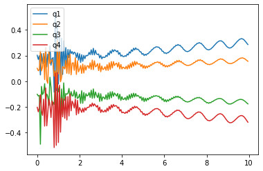

### Description
[Assignment Instructions](https://egr557.github.io/assignments/design-optimization.html)
 
### Performance Measurement
a. Explain, in words, how your team will evaluate the success of your robot’s design. This could be by measuring the forces produced by your design, the speed at which it walks, its thrust:weight ratio, the height it can jump, etc. Explain, in words, how you will measure performance in simulation. How will you measure performance in experiments?
* Our team’s device is intended to walk using the foldable concepts we learned in class. The locomotion is driven through alternating sarrus linkages and a leg stiffness to move in a forward direction. In order to have a successful device, we wouldn't want to optimize the leg stiffness such that we get the maximum distance traveled per stride. To measure this, we would need to start the device at a specific zero point, with sarrus linkages and leg set to a common initial position. After starting the device, taking time measurements and distance traveled (in x) of the device would allow us to calculate distance per stride, body lengths per second, etc. This is achievable with a tape measure adhered to a table, a stopwatch, and a camera (to ensure accuracy). 
* Success: distance traveled/ distance per stride / body lengths per stride
* Measure: tape measure, starting point at 0, stopwatch to measure time points


b. Are experimental vs. simulation metrics similar or vastly different? If different, how will you equate A with B?
* We consider the experimental and simulation metrics to be similar. The simulation metrics are designed to optimize the spring stiffness in the leg based on the device restrictions (such as available motor torque/speed, sarrus linkage spring stiffness etc). The Dynamics II code is then able to output the x distance traveled of the device. The farthest traveled x distance would be the best leg stiffness value. Experimentally, we want to test the optimized leg stiffness, and measure the distance traveled of the device. We could calculate body lengths per second as well. The optimized spring stiffness would be a maximum spring stiffness based on the device restrictions (so the motor and sarrus linkages could still move in a loop). This would give us a ground reaction force that would propel the device more if the force is higher. So the optimized stiffness would yield the farthest distance traveled.  

c. Do you have more than one performance metric you must use as for design goals? If so, either identify the most important one or explain how you will balance two competing criteria. For example, if you need a robot to jump high AND far, which is more important, or how do you establish a relationship between these two possibly competing goals?
* The goal of our device is to travel farther in one stride. A stride would be similar to human gait where it is the duration of leg contact to the next time the leg contacts the ground. In order to travel far, we would need an optimized leg stiffness value, that is able to provide an extra push when walking. A small stiffness would collapse and provide no push, and a rigid leg would not add any extra force to the system. By optimizing the leg stiffness, the distance traveled could be seen as a direct consequence. To balance the criteria, we would first optimize the stiffness through simulation, then we can run performance measurements based on that result. 

d. Explain, in math, the measurable performance metric(s) by which your team can estimate performance.
* (Body lengths/Distance traveled) * (Distance traveled/Second) = Body lengths/Second

e. Write, in code, a function that will evaluate the performance of your current system (as simulated in System Dynamics II).
* See Dynamics II code, we alter the input k value which is the stiffness in the leg. We can then extract the x distance traveled by the device over time and compare that for each given stiffness. 

asdasd

### Constraints
1. Brainstorm and describe your team’s design constraints. Constraints are aspects of your design that are “bounded” by some physical limit (eg, the size of robot you can cut on a given laser cutter, the range of motion of a typical foldable hinge joint)

* Design constraints would directly affect how we optimize the spring stiffness in the leg.

Some constraints per device part:

The frame could be created out of cardstock or cardboard. The main constraints here would be stability and weight. The frame must be rigid enough to support the motor and its weight, but also light enough to encourage locomotion. 

Sarrus linkages have a specific spring stiffness associated with them. The spring stiffness is weak enough such that the motor is able to contract it (based on motor’s torque capabilities), but strong enough to push the leg into the ground and cause deformation in the leg (which promote locomotion).

Lastly the leg must be stiff enough to pick up and propel the device, but weak enough to be deformed by the sarrus linkage. This is a very important consideration when optimizing the device, as high stiffness values would cause issues with the sarrus linkages. So, at all times the leg stiffness must be less than or equal to the sarrus linkage. 

2. Explain, in words, how you will track violation of design constraints. For example, let's say your optimization routine suggests a design that cannot be made in a single sheet of paper.

* In order to track violations of design constraints, we utilize the dynamics II code as it provides a frame, mass and necessary forces, while allowing us to easily change the leg stiffness. That way all the constants stay constant, but the change in leg stiffness can affect the final outcome and system behavior such as distance traveled. The main constraint is the range of leg stiffness values we can use. Explained in the code, we must have the leg stiffness less than or equal to the sarrus linkage spring stiffness. That would be a range of 0 to 1.5 N/m. Values outside of this range would violate the design constraints. The values of interest to us are those that result in movement in the positive x direction, or where dx = [0,∞].


# Optimization Logic and Steps 

This description walks through how we used our dynamics II code to optimize the spring stiffness value. The code already has weight and forces to restrict the system, so we can change stiffness and see how the system reacts. 

In order to code our optimization for the device, we want to tune the k value (stiffness in the leg) such that the device moves farther in the x direction. Motion in the x is our desired outcome that we seek to maximize based on the leg stiffness. To do so we can utilize our dynamics II code. 
First, we have to know the spring stiffness in the sarrus linkages as the stiffness in the leg must always be less than or equal to it. Otherwise the sarrus linkages would be unable to deform the leg and push it downwards. Using the motor and the motors capable torque, we conclude that:


Kmax = F/x, with x = 1.5 inches (38.1 mm), F (from DC motor = 98mN) 

Kmax = 2.564 N/m

Our spring in particular would have a stiffness approximate to 1.5 N/m. Thus, the leg stiffness needs to have a value less than or equal to 1.5. To test this in our dynamics II simulation, we need to change the input k constant for different values between 0 and 1.5. 
We chose the values (0,.1,.3,.6,.9,1.2,1.5) 

Using the code, we can take the x1 state, where in the diagram below we see x1 is a tracking point at the top middle of the device (just above the center of the leg. 


We can extract the x value using savetxt and put it into a csv file. We do this for all values of k, and can graph them in one graph to compare. We rerun the same code and save the data instead of running a loop to save us from debugging. 


Insert graph of all x values, insert reasoning as to why which one is the best (is there a range of values ?) 


From the plot, we can see that values of .3 and .6 yield higher values of x towards the end. 0.9 then dropped and yielded a poor increase in x distance traveled. Thus we want to have a value somewhere in between .3 and .9, which we ran and tested. 

Viewing the new optimal value graph, we see that the largest motion is performed by .7 and .8 stiffness. .7 however moves in the negative direction, at a lower magnitude than .8. Watching the dynamics motion render we also see the leg attempts to move in the positive direction, so some error may have occurred in our code. With this, we can conclude that an optimal leg stiffness value, given a 1.5 stiffness value for our sarrus linkages, would be .8 N/m.

This plot shows that the .8 stiffness is near the optimal value for us to choose. 


# Dynamics II code

Note: this is the same code from dynamics II assignment, we are adding in different k values to see how the output x value changes.


```python
#importing packages
import sympy
sympy.init_printing(pretty_print=False)

import pynamics
from pynamics.frame import Frame
from pynamics.variable_types import Differentiable,Constant,Variable
from pynamics.system import System
from pynamics.body import Body
from pynamics.dyadic import Dyadic
from pynamics.output import Output,PointsOutput
from pynamics.particle import Particle
import pynamics.integration
import pynamics.tanh
import scipy.optimize
import sympy
from sympy import sin
import numpy
import matplotlib.pyplot as plt
plt.ion()
from math import pi
import math

#Pynamics System
system = System()
pynamics.set_system(__name__,system)

tol = 1e-4
error_tol = 1e-10
```

This cell contains the constants of the system, including the following:
lengths and masses of each link,
the gravity, damping, and spring constants, preload values (to define the resting positions of springs), and the moment of inertia values, which are used in body/motion-related calculations.

This is the cell where leg stiffness is changed


```python
#defining constants; inches, uncaled to meters

#Base Structure
l0 = Constant(0.05715, 'l0',system) # 2.25" * 0.0254 m/in = 0.05715
l1 = Constant(0.22225, 'l1',system) # 8.75" = 0.22225m
l2 = Constant(0.1016, 'l2',system) # 4" = 0.1016m
l3 = Constant(0.12065, 'l3',system) # 4.75" = 0.12065m
ls = Constant(0.009525,'ls',system) # 0.375" = 0.009525m
#Leg Sections
lL = Constant(0.01905, 'lL',system) # 0.75" = 0.01905m

#Mass Constants
mFrame = Constant(.05,'mLeft',system) 
#mRight = Constant(.005,'mRight',system)
mLeg = Constant(.005,'mLeg',system)

#Gravity/Damping/Spring Force
g = Constant(9.81,'g',system)
b = Constant(1e1,'b',system) #damping

###########################################################################################
##############  Leg Stiffnesss Value, changed from 0-1.5 to test optimization##############
###########################################################################################
k = Constant(8e-1,'k',system) #spring force
###.8 here as that was the concluded optimal leg stiffness

#spring preloads to system
preload1 = Constant(0*pi/180,'preload1',system)
preload2 = Constant(0*pi/180,'preload2',system)
preloadS = Constant(0.04572,'preloadS',system) #Sarrus at rest at ~1.8 inches 1.8" = 0.04572m


#Inertia of body A
Ixx_A = Constant(1,'Ixx_A',system)
Iyy_A = Constant(1,'Iyy_A',system)
Izz_A = Constant(1,'Izz_A',system)
```

The next few lines define the length and response rate of the animation and position calculations.


```python
#Animation stuff
tinitial = 0
tfinal = 10
fps = 20
tstep = 1/fps
t = numpy.r_[tinitial:tfinal:tstep]
```

The dynamic state variables are used wherever the system experiences change over time. Only qA, x1, and y1 are needed to define the location/orientation of the outer frame, as the rest of the frame is considered rigid and the other links are based on the position of pA.

The q1 and q4 variables represent the angles between the legs and the sarrus extensitons, whose lengths are denoted by s1 and s2. To simulate comliant elements in the system, the legs are split in the middle, and angles q2 and q3 represent the bend in the links.


```python
# Creating dynamic state variables. system argument denotes them as state variables for pynamics system from above

#Frame angle from N
qA,qA_d,qA_dd = Differentiable('qA',system) #Angle between N and A

#Frame position
x1,x1_d,x1_dd = Differentiable('x1',system) #Position of x1, y1, which are at midpoint of L1
y1,y1_d,y1_dd = Differentiable('y1',system)

#Leg angles
q1,q1_d,q1_dd = Differentiable('q1',system)
q2,q2_d,q2_dd = Differentiable('q2',system)
q3,q3_d,q3_dd = Differentiable('q3',system)
q4,q4_d,q4_dd = Differentiable('q4',system)

#Sarrus extensions
s1,s1_d,s1_dd = Differentiable('s1',system) #should move in A.y
s2,s2_d,s2_dd = Differentiable('s2',system)
```

Shown below are the length and angle values (in meters and degrees, respectively) that make up the initial guess for the system.


```python
initialvalues = {}

#Frame constants
initialvalues[qA]=0*pi/180 
initialvalues[qA_d]=0*pi/180 

#Leg angle init Values
initialvalues[q1]=0*pi/180  
initialvalues[q1_d]=0*pi/180 
initialvalues[q2]=0*pi/180   
initialvalues[q2_d]=0*pi/180
initialvalues[q3]=0*pi/180 
initialvalues[q3_d]=0*pi/180
initialvalues[q4]=0*pi/180   
initialvalues[q4_d]=0*pi/180

#Sarrus linkages init extension
initialvalues[s1] = 0.0127          #initially both compressed, then will end with right fully extended 0.5" = 0.0127m
initialvalues[s1_d] = 0  #0         #xhanged s1 and s2 velocities. Changing s2 makes it go through 0 as ptip 2 does not have ground constraint
initialvalues[s2] = 0.0127          # 0.5" = 0.0127m
initialvalues[s2_d] = 0  #0

#Frame contact points
initialvalues[x1] = 0.13
initialvalues[x1_d] = 0 
initialvalues[y1] = .15
initialvalues[y1_d] = 0
```

This creates a list that contains the values above.


```python
#Create initial guess list
statevariables = system.get_state_variables()
ini = [initialvalues[item] for item in statevariables]
```

Below are the reference frames of the system. As mentioned above, only the A reference frame is needed for the system's outer frame, due to the rigidity of the system. The L frames are used to calculate the angles of the leg sections relative to each other.


```python
# Initializing frames

#Newtonian
N = Frame('N')
system.set_newtonian(N)

A = Frame('A')

L1 = Frame('L1')
L2 = Frame('L2')
L3 = Frame('L3')
L4 = Frame('L4')
```

The A frame is rotated qA degrees from the N frame, the L1/L4 frames are rotated q1/q4 degrees from the A frame, and the L2/L3 frames are rotated q2/q3 degrees from the L1 and L4 frames.


```python
#Axis rotations

#Frame axis A
A.rotate_fixed_axis_directed(N,[0,0,1],qA,system)

#Leg
#left side of leg from sarrus 1
L1.rotate_fixed_axis_directed(A,[0,0,1],q1,system)
L2.rotate_fixed_axis_directed(L1,[0,0,1],q2,system)
#right side of leg from sarrus 2
L4.rotate_fixed_axis_directed(A,[0,0,1],q4,system)
L3.rotate_fixed_axis_directed(L4,[0,0,1],q3,system)
```

This is the definition of the vectors that make up the system's links. Each vector is made up of a staring position, and a length multiplied by a unit vector in a particular direction.


```python
#Define vectors/Frame/point Locations
pAcm = x1*N.x + y1*N.y


#Sarrus extension frames
ps1 = pAcm - ls*A.x
ps2 = pAcm + ls*A.x

pB = ps1  -l2*A.x
pC = ps2  + l2*A.x
pA = pB - l0*A.y
pD = pC - l0*A.y


pL1 = ps1 - s1*A.y
pL2 = pL1 - lL*L1.y
pL4 = ps2 - s2*A.y
pL3 = pL4 - lL*L4.y

pLtip1 = pL2 - lL*L2.y
pLtip2 = pL3 - lL*L3.y


#torque/force = A*sympy.sin(w*system.t)+b # create torque about frame, A = amplitude/max value of Torque or force desired; w = frequency of oscillation
# t*A.z
# addForce(torque*A.z, wAB) #adding torques as a function of sin(t)
# Not a position constraint (be at x position at t time)
# Use 
```

These are the positions that we have decided to place the masses in order to keep the system simplified. The locations are found in the same way as the vectors above.


```python
#Define the locations of the masses
mLocFrame = pAcm
mLocL1 = pL1 - (lL/2)*L1.y
mLocL2 = pL2 - (lL/2)*L2.y
mLocL4 = pL4 - (lL/2)*L4.y
mLocL3 = pL3 - (lL/2)*L3.y

mLocLeftFrame = pA + (l0/2)*A.y
mLocRightFrame = pD + (l0/2)*A.y
```

The particles defined below, along with the moment of inertia and body, influence the physics of the system and determine how it will move under loads/forces.


```python
#Define particle locations


#Frame locations
partL1 = Particle(mLocL1,mLeg,'PartL1',system)
partL2 = Particle(mLocL2,mLeg,'PartL2',system)
partL3 = Particle(mLocL3,mLeg,'PartL3',system)
partL4 = Particle(mLocL4,mLeg,'PartL4',system)

#partFrame = Particle(pAcm,mFrame,'PartFrame',system)

#Inertia and Bodie
IA = Dyadic.build(A,Ixx_A,Iyy_A,Izz_A)
bodyFrame = Body('bodyFrame',A,mLocFrame,mFrame,IA,system)

```

The w and v variables below represent angular velocity and linear velocity, respectively. These are used in the force calculations in the following cell.


```python
#Angular Velocity, w (omega)
wL1 = A.getw_(L1) 
wL2 = L1.getw_(L2)
wL4 = A.getw_(L4)
wL3 = L4.getw_(L3)

#Velocities
vFrame = pAcm.time_derivative() # with no parameters, defaults to (N,system)
vLeg = pLtip1.time_derivative()
vpA = pA.time_derivative()
vpD = pD.time_derivative()

vpL1 = pL1.time_derivative() # for addign a spring force and damping to the sarrus extensions
vpL4 = pL4.time_derivative() 

#Messing w/ cm locations
#vFrame = pAcm.time_derivative(N,system) #switched delocity to be relative to the N frame
#vLeg = pLtip1.time_derivative(N,system)
#vpA = mLocLeftFrame.time_derivative(N,system)
#vpD = mLocRightFrame.time_derivative(N,system)

#vpL1 = mLocL1.time_derivative() # for addign a spring force and damping to the sarrus extensions
#vpL4 = mLocL4.time_derivative() #default is by N
```

Below is where we add the system forces. Using offset sine waves, we feed in a frequency of 1 and an amplitude of .05 to lower the overall force output. Fs1 is the sarrus linkage 1 and we will see changes in s1 as it directly moves pL1. Fs2 is the offset sine wave directly moving pl4. The spring forces are all applied to the leg of the system (L1,2,3,4) to add some stiffness to it like the leg would have in the real world application. We subtract the preload and allow it to change based on its stiffness, and the force applied from fs1 and fs2. You can see the q and qd changes in the graphs later in the code.


```python
amp = .05 #max force
freq = 1 #frequency
fs1 = amp*sin(2* numpy.pi * freq * system.t)                           #Asin(wt); A=amplitude, w = 2*pi*fr
fs2 = amp*sin(2* numpy.pi * freq * system.t - (numpy.pi * freq /2))    #add (2*numpy.pi*freq/4)  ?
system.addforce(fs1*A.y,vpL1)
system.addforce(fs2*A.y,vpL4)

#Damping
#system.addforce(-b*wL1,wL1)  #seems to work fine with and without
#system.addforce(-b*wL2,wL2)
#system.addforce(-b*wL3,wL3)
#system.addforce(-b*wL4,wL4)

#Spring Force
system.add_spring_force1(k/50,(q1-preload1)*A.z,wL1)
system.add_spring_force1(k/50,(q2-preload1)*L1.z,wL2)
system.add_spring_force1(k/50,(q4-preload1)*A.z,wL4)
system.add_spring_force1(k/50,(q3-preload2)*L4.z,wL3)

#system.add_spring_force1(k, (s1-preloadS)*A.y,vpL1) #Integration step does not like this
#system.add_spring_force1(k, (s2-preloadS)*A.y,vpL4)
```


    (<pynamics.force.Force at 0x1d71bb704c0>,
     <pynamics.spring.Spring at 0x1d71bb70430>)


```python
system.addforcegravity(-g*N.y)
```


Floor constraints were necessary to keep the system from free falling due to gravity. We add the floor to the ptip 1 (only need the ptip1 as the constraint later combines both ptips) and the left and right bottom points of the frame. Those would be pA and pD respectively. The code below is from the free falling example and takes the difference with the y and makes it zero. This ensures the system is bounded by the x axis. 


```python
#reference frame + state variable = need mass

#Ground forces on contact points

yLeft = pA.dot(N.y)

f_floor1 = (yLeft**2)**.5 - yLeft
f_floor1_d = system.derivative(f_floor1)
system.addforce(-k*100*f_floor1*-N.y,vpA)
system.addforce(-b*f_floor1*vpA,vpA)
system.addforce(-b*f_floor1*f_floor1_d*-N.y,vpA)

yRight = pD.dot(N.y)

f_floor2 = (yRight**2)**.5 - yRight
f_floor2_d = system.derivative(f_floor2)
system.addforce(-k*100*f_floor2*-N.y,vpD)
system.addforce(-b*f_floor2*vpD,vpD)
system.addforce(-b*f_floor2*f_floor2_d*-N.y,vpD)

yFoot = pLtip1.dot(N.y)

f_floor3 = (yFoot**2)**.5 - yFoot
f_floor3_d = system.derivative(f_floor3)
system.addforce(-k*100*f_floor3*-N.y,vLeg)
system.addforce(-b*f_floor3*vLeg,vLeg)
system.addforce(-b*f_floor3*f_floor3_d*-N.y,vLeg)

```


    <pynamics.force.Force at 0x1d71bb310a0>


Here we add only one constraint and then run the same code used in the kinematics assignment to solve a proper initial guess. The only constraint we give the system is that ptip 1 and ptip2 must have the same x and y with respect to the A frame (dot the difference in points with x and y). That way they always rotate with the whole system and always stay together as if it was one leg. 


```python
#Constraints

eq_vector = pLtip1 - pLtip2
```


```python
#Error list for constraints

eq = []
#if use_constraints:
eq.append((eq_vector).dot(A.x))
eq.append((eq_vector).dot(A.y))
#eq.append(pAcm.dot(N.x)) #Lock frame in place

eq_d=[(system.derivative(item)) for item in eq]
eq_dd=[(system.derivative(item)) for item in eq_d]
```


```python
qi = [s1,s2]
qd = [q1,q2,q3,q4,qA,x1,y1]

constants = system.constant_values.copy() # Recalls link lengths declared near beginning
defined = dict([(item,initialvalues[item]) for item in qi])
constants.update(defined)

eq = [item.subs(constants) for item in eq]

error = (numpy.array(eq)**2).sum()

f = sympy.lambdify(qd,error)

def function(args):
    return f(*args)

guess = [initialvalues[item] for item in qd]

result = scipy.optimize.minimize(function,guess)
result

#statevariables = system.get_state_variables()
#ini = [initialvalues[item] for item in statevariables]
iniSolved = []
for item in system.get_state_variables():
    if item in qd:
        iniSolved.append(result.x[qd.index(item)])
    else:
        iniSolved.append(initialvalues[item])
system.get_state_variables()
```


    [qA, x₁, y₁, q₁, q₂, q₃, q₄, s₁, s₂, qA_d, x_1_d, y_1_d, q_1_d, q_2_d, q_3_d, 
    q_4_d, s_1_d, s_2_d]


This graph shows that the system maintains a correct initial position and guess (in orange) and the previous un constrained guess (in blue). We show this to ensure the system is correct and help us troubleshoot bugs and errors that may arise when coding the vectors and points. 


```python
points = [pA,pB,ps1,pL1,pL2,pLtip1,pLtip2,pL3,pL4,ps2,pC,pD]
points_output = PointsOutput(points, constant_values=system.constant_values)

points = PointsOutput(points, constant_values=system.constant_values)
points.calc(numpy.array([ini,iniSolved]))
points.plot_time()
```

    2021-04-09 10:52:06,272 - pynamics.output - INFO - calculating outputs
    2021-04-09 10:52:06,274 - pynamics.output - INFO - done calculating outputs
    


    

    


```python
f,ma = system.getdynamics()
func = system.state_space_post_invert(f,ma)
```

    2021-04-09 10:52:06,404 - pynamics.system - INFO - getting dynamic equations
    2021-04-09 10:52:07,041 - pynamics.system - INFO - solving a = f/m and creating function
    2021-04-09 10:52:07,058 - pynamics.system - INFO - substituting constrained in Ma-f.
    2021-04-09 10:52:16,805 - pynamics.system - INFO - done solving a = f/m and creating function
    

We run the system integrations here to solve the dynamics of all the inputs we described above. 
The q and qd values here reflect the sin wave input, as the motion is repeated over time. These are all the q values in the leg describing their rotations in z. 


```python
#Solve for acceleration
func1,lambda1 = system.state_space_post_invert(f,ma,eq_dd,return_lambda = True)

#Integrate
#states=pynamics.integration.integrate(func1,ini,t,rtol=tol,atol=tol, args=({'constants':system.constant_values},))
states=pynamics.integration.integrate(func1,iniSolved,t,rtol=tol,atol=tol, args=({'constants':system.constant_values},))

plt.figure()
artists = plt.plot(t,states[:,3:7])
plt.legend(artists,['q1','q2','q3','q4'])
plt.figure()
artists = plt.plot(t,states[:,12:16])
plt.legend(artists,['q1d','q2d','q3d','q4d'])
```

    2021-04-09 10:52:16,813 - pynamics.system - INFO - solving a = f/m and creating function
    2021-04-09 10:52:16,823 - pynamics.system - INFO - substituting constrained in Ma-f.
    2021-04-09 10:52:25,523 - pynamics.system - INFO - done solving a = f/m and creating function
    2021-04-09 10:52:25,524 - pynamics.system - INFO - calculating function for lambdas
    2021-04-09 10:52:25,537 - pynamics.integration - INFO - beginning integration
    2021-04-09 10:52:25,537 - pynamics.system - INFO - integration at time 0000.00
    2021-04-09 10:52:40,136 - pynamics.system - INFO - integration at time 0000.17
    2021-04-09 10:52:54,874 - pynamics.system - INFO - integration at time 0000.26
    2021-04-09 10:53:10,088 - pynamics.system - INFO - integration at time 0000.33
    2021-04-09 10:53:25,469 - pynamics.system - INFO - integration at time 0000.44
    2021-04-09 10:53:40,128 - pynamics.system - INFO - integration at time 0000.52
    2021-04-09 10:53:55,027 - pynamics.system - INFO - integration at time 0000.61
    2021-04-09 10:54:09,920 - pynamics.system - INFO - integration at time 0000.66
    2021-04-09 10:54:25,137 - pynamics.system - INFO - integration at time 0000.75
    2021-04-09 10:54:39,902 - pynamics.system - INFO - integration at time 0000.84
    2021-04-09 10:54:54,908 - pynamics.system - INFO - integration at time 0000.92
    2021-04-09 10:55:09,721 - pynamics.system - INFO - integration at time 0001.03
    2021-04-09 10:55:25,020 - pynamics.system - INFO - integration at time 0001.15
    2021-04-09 10:55:39,727 - pynamics.system - INFO - integration at time 0001.25
    2021-04-09 10:55:54,767 - pynamics.system - INFO - integration at time 0001.39
    2021-04-09 10:56:09,561 - pynamics.system - INFO - integration at time 0001.46
    2021-04-09 10:56:24,368 - pynamics.system - INFO - integration at time 0001.59
    2021-04-09 10:56:39,195 - pynamics.system - INFO - integration at time 0001.77
    2021-04-09 10:56:53,939 - pynamics.system - INFO - integration at time 0001.95
    2021-04-09 10:57:08,703 - pynamics.system - INFO - integration at time 0002.16
    2021-04-09 10:57:22,616 - pynamics.system - INFO - integration at time 0002.37
    2021-04-09 10:57:36,606 - pynamics.system - INFO - integration at time 0002.62
    2021-04-09 10:57:50,457 - pynamics.system - INFO - integration at time 0002.90
    2021-04-09 10:58:04,584 - pynamics.system - INFO - integration at time 0003.20
    2021-04-09 10:58:17,252 - pynamics.system - INFO - integration at time 0003.48
    2021-04-09 10:58:29,981 - pynamics.system - INFO - integration at time 0003.79
    2021-04-09 10:58:43,140 - pynamics.system - INFO - integration at time 0004.08
    2021-04-09 10:58:56,531 - pynamics.system - INFO - integration at time 0004.38
    2021-04-09 10:59:09,242 - pynamics.system - INFO - integration at time 0004.66
    2021-04-09 10:59:22,262 - pynamics.system - INFO - integration at time 0004.96
    2021-04-09 10:59:33,930 - pynamics.system - INFO - integration at time 0005.30
    2021-04-09 10:59:45,853 - pynamics.system - INFO - integration at time 0005.59
    2021-04-09 10:59:57,708 - pynamics.system - INFO - integration at time 0005.96
    2021-04-09 11:00:09,457 - pynamics.system - INFO - integration at time 0006.28
    2021-04-09 11:00:21,297 - pynamics.system - INFO - integration at time 0006.63
    2021-04-09 11:00:33,337 - pynamics.system - INFO - integration at time 0006.99
    2021-04-09 11:00:45,710 - pynamics.system - INFO - integration at time 0007.39
    2021-04-09 11:00:57,298 - pynamics.system - INFO - integration at time 0007.69
    2021-04-09 11:01:08,609 - pynamics.system - INFO - integration at time 0008.08
    2021-04-09 11:01:19,876 - pynamics.system - INFO - integration at time 0008.40
    2021-04-09 11:01:31,098 - pynamics.system - INFO - integration at time 0008.82
    2021-04-09 11:01:42,251 - pynamics.system - INFO - integration at time 0009.33
    2021-04-09 11:01:53,493 - pynamics.system - INFO - integration at time 0009.87
    2021-04-09 11:01:55,228 - pynamics.integration - INFO - finished integration
    


    <matplotlib.legend.Legend at 0x1d71c58a580>


    

    


    

    


```python
system.get_state_variables()
```


    [qA, x₁, y₁, q₁, q₂, q₃, q₄, s₁, s₂, qA_d, x_1_d, y_1_d, q_1_d, q_2_d, q_3_d, 
    q_4_d, s_1_d, s_2_d]


Our x value oscillates as the motion is not perfect, however it still follows a very slight upward trend, meaning over time, it is moving its frame position to the left. The Y value displays it dropping then remaining constant. 
S1 and S2 values show that they are oscillating over the time span. S1’s oscillation dominates s2. 


```python
plt.figure()
artists = plt.plot(t,states[:,1:3])
plt.legend(artists,['x1','y1'])

plt.figure()
artists = plt.plot(t,states[:,7:9])
plt.legend(artists,['s1','s2'])
```


    <matplotlib.legend.Legend at 0x1d71c65ae50>


    

    


    

    


```python
plt.figure()
artists = plt.plot(t,states[:,1])
line = plt.gca().get_lines()[0]
yd = line.get_ydata()

```


    

    


This is where we extract the x values from the states in order to compare them


```python
########################################################################
################# Extract X values #####################################
########################################################################
plt.plot(yd)
numpy.savetxt('Xval_k_8.csv', yd, delimiter=',')
```


    

    


```python
KE = system.get_KE()
PE = system.getPEGravity(pA) - system.getPESprings()
energy_output = Output([KE-PE],system)
energy_output.calc(states)
energy_output.plot_time()
```

    2021-04-09 11:01:56,166 - pynamics.output - INFO - calculating outputs
    2021-04-09 11:01:56,214 - pynamics.output - INFO - done calculating outputs
    


    

    


This position diagram helps display the very slight walking motion the system performs. We drop it from an initial height, then it inches to the left very slightly. 


```python
points = [pA,pB,ps1,pL1,pL2,pLtip1,pLtip2,pL3,pL4,ps2,pC,pD]
points_output = PointsOutput(points,system)
y = points_output.calc(states)
points_output.plot_time(20)
```

    2021-04-09 11:01:56,368 - pynamics.output - INFO - calculating outputs
    2021-04-09 11:01:56,395 - pynamics.output - INFO - done calculating outputs
    


    

    


```python
points_output.animate(fps = fps,movie_name = 'render8.mp4',lw=2,marker='o',color=(1,0,0,1),linestyle='-')
```


    

    


The video here displays the leg with given sarrus input. The inputs are changing based on offset sin waves as discussed above. We can see the leg hit the ground, deform, and then push off creating a walking motion


```python
from matplotlib import animation, rc
from IPython.display import HTML
HTML(points_output.anim.to_html5_video())
```


<video width="432" height="288" controls autoplay loop>
  <source type="video/mp4" src="data:video/mp4;base64,AAAAIGZ0eXBNNFYgAAACAE00ViBpc29taXNvMmF2YzEAAAAIZnJlZQAA0udtZGF0AAACrgYF//+q
3EXpvebZSLeWLNgg2SPu73gyNjQgLSBjb3JlIDE2MSByMzAzMyAwZDc1NGVjIC0gSC4yNjQvTVBF
Ry00IEFWQyBjb2RlYyAtIENvcHlsZWZ0IDIwMDMtMjAyMCAtIGh0dHA6Ly93d3cudmlkZW9sYW4u
b3JnL3gyNjQuaHRtbCAtIG9wdGlvbnM6IGNhYmFjPTEgcmVmPTMgZGVibG9jaz0xOjA6MCBhbmFs
eXNlPTB4MzoweDExMyBtZT1oZXggc3VibWU9NyBwc3k9MSBwc3lfcmQ9MS4wMDowLjAwIG1peGVk
X3JlZj0xIG1lX3JhbmdlPTE2IGNocm9tYV9tZT0xIHRyZWxsaXM9MSA4eDhkY3Q9MSBjcW09MCBk
ZWFkem9uZT0yMSwxMSBmYXN0X3Bza2lwPTEgY2hyb21hX3FwX29mZnNldD0tMiB0aHJlYWRzPTkg
bG9va2FoZWFkX3RocmVhZHM9MSBzbGljZWRfdGhyZWFkcz0wIG5yPTAgZGVjaW1hdGU9MSBpbnRl
cmxhY2VkPTAgYmx1cmF5X2NvbXBhdD0wIGNvbnN0cmFpbmVkX2ludHJhPTAgYmZyYW1lcz0zIGJf
cHlyYW1pZD0yIGJfYWRhcHQ9MSBiX2JpYXM9MCBkaXJlY3Q9MSB3ZWlnaHRiPTEgb3Blbl9nb3A9
MCB3ZWlnaHRwPTIga2V5aW50PTI1MCBrZXlpbnRfbWluPTIwIHNjZW5lY3V0PTQwIGludHJhX3Jl
ZnJlc2g9MCByY19sb29rYWhlYWQ9NDAgcmM9Y3JmIG1idHJlZT0xIGNyZj0yMy4wIHFjb21wPTAu
NjAgcXBtaW49MCBxcG1heD02OSBxcHN0ZXA9NCBpcF9yYXRpbz0xLjQwIGFxPTE6MS4wMACAAAAN
iWWIhAA3//728P4FNjuY0JcRzeidMx+/Fbi6NDe9zgAAAwAAN9zmRP7KkwbmwAAC6/A4+/kZUpxh
I/9u1PvtKy3ZsC7Bj+wTJ+UkbETlqLXRKl5jDn4dzfG24D6nNYvLpifj58Q6ZUFUXj+vo/AL++GE
wN1jGEClV1uO+3U2mEyktd+U4raiDxRbUApPSFG/qR/k3A+4q7/+97lTJ+K6WmOdOB3Yi/Mc5d23
5fWGoXAO6tPWvX/eSCg0EE6K1nX0vz4vfTuUKjL0Fyb3FkUeA4VKFVUgKAlG2ZJX3W3gMNp8A0fN
SK5yqTAkCXB6zDN3VtnIPH2yHXIJs6d+76bIV/Z9gTauIn4aiJwBIVy/GTtAxvYO8iiSIrU2oMTG
sLQPJwuaH00dB7Dg8BTYbRADHvxLPf7+OwN9xU/jg5lsW9jRipXs0XGS+S22MTrFMwTf5U8v/upA
Ly6TJdlpts2q2M8k4oF0oKJhNJIJFHX/iPgF3Y3EnIvNFlRro8MTCJd7OUbKUciStJokSGwlEG3f
7cvYSOmdik9scFdusHy/sYHjrjplhhUCcSYnL64tRMUo+GvS3Wl2eP22X1c12wvhArChQBiX3/jx
unOHROG13CTA0bVVXsMAMAwZT+6p4IPXc+korUjI5Ko7lNFFayY+oIwfgOddYR9pSMyudOzR5xRj
t/8IjFld8vrIyJxgIubnRKUVFX+CzXjorJzkoSM1qU6PoAcEKHnOI6Uo0x08Yi51WbXK7Wib/sQW
O7w6ObrQMUH1daIC+xkHt9BClFlKCOQOh8JIAHgKlLqAsoZdcDdQ0kWPTUdlJcU7FWHK7zUicztF
aFt8u29jbci8pD4BNYHQrAV5ij/DOt9BMnvGsMdZthR37ymoMPDFrqqm94S+YQZkVDIG3l0CeWmK
ZTMtEUbFdkdevj+AAJDwBMlbaQBlXE2IwxX+XGsxZEzKx2gKHI/qRJMu0kIs7UriBhUSnMfv9j74
46yT1vxwW09FhJIbVSmEjiD0vXvkyYsWeTxKOL5mSxP9L6m7URLaupkxslPL6ZmGCOCnzIRYjp2W
4pHPhCjsUsT8nzfAxXy+ccB93Dwbvw4r8ZKaAY5heb6Y49557ylCx/SAQbmco+kQ6KwKe6Lq8R1H
LsddcLNXAgjMR0jlkhy56f3/sfq7K81O5XLBnixAoM1wcFNMyAxAj6Smb7aAO2V9w/imqhGLhuG7
Z+wnqYw4RSfYNYEQFdkK5BE/EujMpagwp/wEedn9UEGOEdrv0gRfy33VTZeXob2B0xquO7ZBJJ0A
Uau3TezTFCs4ZSIrgwT7j5GPqCiEi1Dmw76kmgG9fYSfxBDWH1HpTE+egkC9tzYk43oXlgFgzZAo
v7Pn8fWUQtE7T6ccJ2S45vvRLIHcp393eOJ/URPnc2IcMy0fi3mz5LFWVO0oSWZTlddAcrk9nglj
GTTuXCltWC7BE+xwY/irW+kDhLW19GQxptCnn2wawqgRKrJijAJrUEcLOS3Jk5zzcGX3LVhe6iHm
CDbn73Mn3UZpF8i8EthUNbIR835upJVc3r7tGEU1GaFQOMXLCLOXJnNMdJ5JPlJUDJco5AkRYYfp
wWwEPDi5kQvtkaXapNI8QghYflLli40g+X4OGwMOCq+/k4+ym+exWWOlwQj3XWroU9QhlBjEJriJ
Wj3C/IGCWeUwBS9yj5cBDpM9kLNLT/YEDDx5T3pitiPaJUpCxXAqM8zTcCpwOfBLzNxVr5kI3m7G
kDXWjQscmt7CyU/Aerv7KWZJ58CpoLxbOkFl0E9OAPXgJeCWUiV64fZmacDKv6neliy5P3onU99B
/BorlVoj+tZ4GkdUdL+MxbScfrEDMjg68W4xOwPvKoM+Nw3Rfv2OsLszprTo7I6JkEVzg137VmnO
Xu/yEwQIN31wfWm+JVMQe/NxdAE/Shc7WUo4BO/oqPINC2Atd4msRL0NbewtK/Cwp4ZvVg33tdYy
YtA58qtTwodPK0itaaqxTAWJeIyrFzHh4pgEtwVmswVQAzOcx8PtEexT0S12oprNaZm6BfIuY5uO
w9zmPJJ9kK4FYRTxIpWftnvJ58B+wVbbmeKmKem5F/nY0D7pIwtRVPG2+WIhJs0d0tl6hc8XzOfo
47uuev8AaGAjzHxABsmXZ6E5qVVyFNWBzHZkGSdiSut3ncCAimUDNfbxeA6/cb2LN56AN2Oumopi
/D4mqNX2TbGmE38T2LERV1L9DQ4yUSUHZ+vRxmSmvsM3VuolNbtqb8SgVea4o71s4Yg8vkrlw28K
z6zHGZWesCbTQHgfq0fCZlQsovEZCqwjZU26qKFuiW+R2J7RDg+fAzJyioqFoZcwVR8RmK7/DsLR
fL4aZB4j8f8RIbOP2W5VhPfCgjO5nl1vp3GSaDRAv9h/DsscrSuh3wJBojxK67PKeRww0uO3b3zL
rBPUJw07efT2YQwadTIMnA0ECbR+hP/Qq6U3BIYyWDkRmuXfAAADAelclHHaEINbsH8E9Uad2qVo
kDYwtjKa7zp8VkfRkEhp4Zy0dPjvadpbOc6cBpCYwEzYlerwT8UGjiJhCtI+PT9B2ACkD3ug6NOt
vdR7uioCj0GTLxnQmg/fBjcwf/h753RO1Ga+BDWVqz30BD1+IHfeGKXyu4FnLzbcjOLJ3R01CuLu
Kq73eN6bK92CLZdKMl43i5jp3/sMwV2o8ukoKmkof4cGaHL+8vc4B/ic5ioAOliqfetKhBc1Gvk9
Ho7h56b1otaOKCoXVsq1kWbUtvAM6KvgTtGsyA7azXvZRrXihOkctusOVow2Ew+dqItZ7vyr3oF1
DOW/rvcNk6BtNxyNfOnSkQdafK6vP0vWioGi/HJDUwwKypmnCaChfADAN/BqCi/V2insa3TIv0AB
hMC7qdFqwEHT6niJX0tk5dWUrg0u0ajW+bqKKPi0nJSoLubSuKhdr7j9+F8Yp4p9ZcJy1deZ9YaR
Gr61GHKdZZC659GRX7Z+AAGyMYz2xpn9JF8FrOr2n1DE15wsAYN5J51YhyXd2HYAh9DgbPfccbO0
Akv8Zxyx3SULGPIFJexKzAaXMc90aPi8h5bXp4wpGVY4aoTMavUR7nhQYIJt/1tk5LNPNzP0ripF
Y/WB1rLwpAAKzPPDP5bIQ92SBpWvsYGs5XJcSx767+aY3/wuj00qihQtQAINe7m5OcbJKfXs4grD
FV3jSWMNS+fhIVjh3oadlr+/+bJcwpnpkTtXXOqJnmpTMVgZMenWl6LNut9prLOij34NyAdx23+g
CA4Ogh0BumBPvhtelpNghvY5D/CMTfZK2je1BF8zKuXfwgp2T85f0wUwwaLXT7/duUXoCMKGkhOm
qDAAFRQtXikS8TohH5SrfS9muRu93Gl2Trfhtt0841qv1QkeoFLDQbqbe+ko2+Z8vMaHCFQp9t3A
glKC6MiotIbM4RfkGOq4LHtAKuD2YWECwfcX+0x1mBeYYUAmeXvWiiYHxD8SPcbcHV6EhPfej8m4
Pv1YDRfYxbV582Kp1c7ZyKCACIwD9vJqWNpEvVvRZrmfx1112THKalrLzYnhYklSwIL2IhsfEbkG
glykeWaO8KTdyvZrFXk7y4GqtoHHAbkvXfFT7vZ1b9l/8J56WLXLWpdxUgT/UHGBFyzuzfKVVQ11
DB6TwMlsYi4cM1Z9tD3BHrwAfpcKBIj59vgL3OsTLhj9Y1yrL4QIz+LlxU5+xuHSd32j5j56KuOw
NXMhk2jw2//b1ImKSU52c6WGfuZ/EgyAWGsmPjvT7QAFHh9Ayme22VG5KPsiz8YbDpEHttbYz5mk
UyaNIcWCMv15IwG9hkes34jFEdwdmWNXFpURNujHsvTlCvJc/CElZXgun1w2w4DwJR+rY6PvFFwi
UD6cxEmV6SzPaY1zkoGTEIifpdPkMU7Cpnj6mv82FUBblQ0ZvdrsEYXctpGitXsV3TZTlIxBxzTW
o6xK53PNMP1zKA/EpBxEuN989apVHbXRH5ac4RAbkPSEiSiUgEVYP4Q4gC0Lq3ExKQv3YYfh8DT3
eb1Reo9zgz7WxtZBZyB/zt/0ZEVRS3FggkY9gTdXuM9g0AFiSMjHfziqZK6ghIeMXAuSRY1adU0x
cp4SzT+9GKW+pTmDvuK5o9Rhxth5pVXv7SOXwt/+qUhzQFjAqn1VSoROULVPovbMcudgGTzscm2H
068VPwxNETgIDtJLcUPFZEd2a7LSqHENDIJ4+IIT/5Q6mAMbw87mdMwPNtKq0Y5AzBoy+efM5OLg
Acds9MHMkP2GiFVn6bfSZGOAjFdID6X2amalfxcAqL0Lj+3jQbQ2h6W657Eyn41qB6Ma4hKzT11k
sGAWFdP1Dy//ZI5H9AtDj4L0Ri2Ck8CsPDbG4PRm213ANa45Fo7i636YZJniz1430ChZbDNxc+mE
4epo20WXrQrTytGPhWaHkOZm8raVcSRIxJXHwouBTd3ISHWTEaprGH4fwx7z3e+PrlDNgpKU9WlR
oXOeja/++fBsNSfqs1GHMkTlunhWvvx/Pc+xbrYhWLWhqu4f2R0XPVDvBsVuE1qIbUdP2jA3tOFr
+/N37xX8VY1wrffrbqxuX3+Pl/QL8g37RelrmyJbQ4EHhGMYGuNhgrxtwACIgQAAA/xBmiFsQ3/+
p4QCA/DlzDoBQ9SVUhbPzh4+Vu+JGLrkuHRRPPMZYMD3nzndMw2pcE+l+lVwAnykYt+bO3VfjYUE
+DQQ8/orbR0BnH5crVxZG7S7/ZW9YaMEM78zQe2tZkveB00SCmOXs6AauYD1GnGMvMyYJIiWJBcq
E9vyikHuA+kKM/vekQM5or17VLTlygbfC8d90aoXKdf1My4P5hsrTKFxnY0MfFYSQcxh9zbVygXf
WtKwKXu+cVt+fQKsRzOLz8cYjAxH6odlNsy1jxwEbJgKFOiAhyk3bAwzNTjft7gn985FvfvccTkN
0jMFojG2cuwT+CVw/Dg8aVxWC3aJshZV3WGZ1mc6tP9KRBWPlSD9w3KH3aCv19d460pgD4z+cjeJ
0VCLBkhCBVwlANiySjwjgQlwmT5U0InKQDKIZ/hpwhxUcgMDEQl/IAfZ9KzFeDnRbq6Vv+mAPp8Y
caOX5rrhwk6FKXuXBXKapH0t1W833pRjBKyT+IRYWTJJ/2+PmgxXTdQ29pvLX6c3MDRvtlwq8IGC
LwX4nXq3OqaOwes0StN76ZmrMrbLIXgH6+VhROL9pCCjix1Av8O1f24bBiSTsMa78UAZnZGy5K7K
BsCPgmTJsfrOL97vGwb9aMOdiXIFo6shX320wrq30mhyV3sVxZUXLQ8Jjt/OrZIVQZ4WtII1PxKb
vNWiLqc2U1kYVvpou9NIPdoJgJ1+2o7QCON+6uvydwNobAFHW3M9y0bAS8zfqL+C/NgTekvMxKUJ
kwUqcGs6YbRGextzflmoFRK+7yydZiEFeBgUcTsnWRfGwYQa7vxLWCm+2WCvvYR6b46kNnXr73xt
dyYgWl/hXZ/EbSc8kaiUP7qbHBJHwYGFlOp1tQXCL20owT4NPVeflnPjsr2hip0oT4gZo9zf0pEn
E4BlEISgOybg/lQW+GwVNQe2XJlbIcJ6j3hmt/dAhscQNQZVUbpiulFLQPqYW50cuyBgMlftqX63
Swl5v4hgH+Xm5xH1d3+SeOd83HH3wKO9Y+qQ7QDn0tHN9KcLFR6dmkWxlkuW2ZjewJI5uoZkhOTr
J15QYL82d3ItSIz7Y2wKnuRBtCW7/nJKXaZ+CAHXUEWB3H5INnBweWVTVEUunwHS7s9aPEzZivQp
sjezKds988LdvFK8nmMBSvnbgWCqelFQimy6ziSaKzJo/TPuVCpGmxzghPpMO57HlaJ/0DSCqgXR
YecjXoBWJsOJE/eL6v1dNZpnxUxIuGqRYGad4VF6IZoDXD4iNbvpnCQF/i9bsAjEzvmPLFUczDtO
RweqZxZhWZHpmDEx95vTTssqPqmRpdIyOgg4ArCJIgT9XC7oJKAjbBfQgm4AAAPZQZpCPCGTKYQ3
//6nhADhEv6AL0MoAN3lVFHfPnw6OfFghqnJVLt/3N0YBdh/0QzicX3u9SfjOjWvnDA8x78uXK39
LacH+D/pJrsAwduWlG0cCPAar3mgfrgozGZWXhBudv9ZP2BIeZPnc05P+U3FaxnAAAAE29px+vJ5
Y4Jm5wBCceLBrVM81d/BEb9lcYPmQ2Y8dDJ0ouX4EtugT9ih9LES7cDCk6lAOQUs/w8aEriZS48L
xMqfl37GuzYkDz5QEZs2ikxWW5T0rqvvwzjULHtm7gLjzKGLwCWsxKJMvyTaQxavXxscRtwxJfHU
AU0HEfU/mDTX01hIogkJZtvy2z9RpDpXospE3eTpZnBsJzqXYExwy0KIZRDTYp3GUuSFCrE7BMQs
Fn1dYo4vBuSFkicsVfmTDycRqQdSBHKh1rFce1xt/N65FGEys584ds/oZ8kYlawvkb5dQxoszpcg
7gZNChf8L0U1oWielmbo6jksOXTXbisTzgIfCm9Jf3N7ZWaaQEdkIxmdOeK+Hqz05nwU6yDOh6EF
vO43cmOdd0+AvT8YmydL/+dwKUMwjLKuCXM0boKDd/TIxPe/syZQe8+Nxjf6IDXa9XZorqLwKRSc
W7QGAkeGPQIJNIPlnQfTu5EAaZS7GktfyxY+MOQXhtHnFBa/F302W3MCULihP0Vf3bi//amNMmZW
B5CwWhnR8af8Bv6wQakLg6p+MJwprTp2mHuxqhXHVkI5dbIuuZ5Ul4vonPcjJFPqHkDTVyklnrtL
xxXJc9V5rTTP/XjqAM0s3ZI9OOAEj/gVMpOBo3FjbXqbMeczfah/nNtsQXTsFT0RTW9yevBYA7l7
UGGz93gqqp5JmC9y/E2NTU00ujF7ibWXPKjTCLgqjO0OvIXaA9N9TJYlY1AfrdDeb0uT7Te9VPG9
IQEaV6/lvEbBt/DMHZLUXfWkAwilLDg/Q2cpKDQuRNYBIB0XJ+52wjSygO0TpTt/lMw3znaZbb0A
QJQTv8MPvIWJCKlK0w7AP4ihnjjSSERo7Aw4VWoFrxzEW39/BErQ8jGOpqQxYUrCMYAYHRH+Wlg6
4CUuo+DIBcUg+X34gf7DlHBV8gQQvK/jXaT63fg0eb0z6/xMvZw+zrFja+O5QTQXfphOj2Dquyy6
nw+/PSl+Xzq93S8KnBjRmFsYzWr/AFmQYWy/M8lkuP9716tMoZ47pnaBAzxoYGKEaHnoZVp9+gdK
BAjxGBX5RqAJncO9hoKXBew+gd/Yjvt5eJL+UrlgNgn5rSKpMTlNt5zhLum5/7RAK5lnnDkXW5Kx
7x8KAkQg4QAAA3hBmmNJ4Q8mUwIb//6nhAAsfvCW7+LdbpcQv+28icpsiQcAJVK+3fs1JHEPHX+m
+a+gnG0QSwp+AAFuLFGifrRd2HUABzydQ/gb7t8nPlu0R57EuXSLYYsEciNKBFSRMQAd0Q0ma+5J
gGEjpUH6wOKUJQrwhRxdIiw+G89aOvJZF0iYQzSV+yA6CYph+UdJ9T7N1G0vwJAd3bwZdB7qey9s
yqw2yG3b9LlJ9b4Hextcj4UQXO4ukG79d0+JurSK9xGwHbuF7qJOaoJj7htWQliACAtyeBhCmXjt
WvZZyy3NvoIRrNr+yG/UExX6gK54mg0x2O5l/5dQOfk2H9Yl+sO4igg1ou8edjOWIJ1Dsgj7tQMT
EvD2gL0N8sf2fJ71nAUNtw8mjK4MHPhyCcXvMyJ7G9lgbYtL4GFX7OI4diw0m1nOShz9iEUfSzpX
DqLn2nA9Axh/6tBBPhdbfYVPGsNMGCts1bqgsMe4QYLNX3B6JP8lqDB9oDMafLA4pxEMe0qUMiOZ
MspIAcM71grPOnUzCw7cC9hIgzxgOvxZmGPBannay0HGVZdDHy+9rkTHuArP/DXB6wyBVxszGale
awSIKh1uK10NT0HTH+bYdhr3pAwXVRVfcrRJajqKLYwfEWnFDqYMLwvBvJvsR4zDQrWIdZipLhna
bXKZwol6444Wa6rs8ff8xSdnmk41Do2Dz15RNFIH7LsZGXSZZFzR7YUXrGSMx2ivCfHwFoU+iqVE
1jLANGChXz1NMjSKKfwU1ZwluTnzApOa2IbDfcfb5uTwYZViTHX15oXNwuNGmMKmhyTwuG/4Qqm7
RyfJ/g0sKZ4SmRcLEUuyl1i8enBwl2iMKJc9z8kXVrlNuj83es6iADFqZJZaiHZpkr2O9H0RkrYk
OuwC4l0qxglI4JdEe+E/RhKWqcjHObHVjohebvWJLVyvDckXrDj2ytRd20RgSd89bPgHGjo+jAqE
ZniRGZdMGRG+rBrxXNCg102b0E+4z2/EXD/HQprEfIiaggj6oJ/41iOle41Fhs7tkkyUmMkDR/hr
NE0xmT53yP5MNa1F/QaM1K5Ldc2r/A248SRj1ohv2BFlxQpHAn1m+Ouo+SpcF4aaxHi8gyfO6KRf
zHBfRH48tSJO4JI1N8o+Kvfe//jFkM1yDWyXsiY7rmoWbbKMGCSGUpDKeEAAAAMyQZqESeEPJlMC
G//+p4QABuzDPqABdpCM0MkcvAcqGxQijhArQm9biyPV/4GDQkYXUhVBdurtxgJR6gBPO15k+c+u
GLIo+XOAgQ85ZOfrCAxSFayD/oJNC0qhFTmCaAMVjSTdC5Xf/gutoyYGcVlmJAMDvmwx3YmhF1p3
fwUq/hBhc0qrNw8FxnhwFxjadNpe1vxhZikWnqdidivAZ2JDBCAMX1+8/pwH+WME/50H36MQwWJE
JiT0J3qn8fuBSt0Ld06MhhFXJ+QZIvxcU4h6uV+cSvJQXoX0NRIsHACAZGQKBfa/lekhtbYF4W7+
DBn8bWQfaJq9dBbl65B83+x2EnfPW3Frwy7qnCotRK8MhjAlbsizgUNe7d+Xv4QliQFVBgdjMde7
OA98yUXZgVqk0r7Pk+FDGSF8ySZ/Zd1S+SdhtmOfVG7mQqDWca7RLCMPL3uK3VRWAE4gq/Dcdhs7
MwG11M/10oQv8v/cPHSBEWXbrE655XfWXICOaGESQRWNGhmdEA9Y/9PFUuXiAKjmp4kggXmEbVxj
vcwQDRXoyvEvF0mT3AcNDYN2iJNp9Ivm0H0c3QLL7olT3XbYsRagDPDvX9HGOEXZAOP/3cJBe48H
v3qPmL1E47q+fSoOMFgd+y32a3P3F0gSTtmALkzIF5rGeXqLKZOTkwSYdcfIN0QvfZShup5pWZZL
qqxLEIESRW/nT0ZafUfkgAGGq///VS8yUT4aVaKK4HshI6LJf3Ir9+xQf8XdzhOEdkc4UOLM0w2y
1OO1t3Ho6BB05Uvt5OcrpXFzWbVRFMGie36FpDCnqOzLmGsUX4T/9/z5nWeAfZYkLGhfvNnICxO/
p0AAhZYVVKzQ18vedvZ6bXyvc9I+5J2vLk2kI5/i9OjgAgoRNBvAtoy6EcHhC1nLeyAZqyHGgmvw
qKdp1HS6lzy0BprS6/0JHuPNCak9qOTCaYf540KpgNaJQAo5au99qeII7MNm1MI975km5O+kdWSX
eE1MrJTjGe9KAiP/niJ7CeeSuCFquAIJdSWZYZrreOIlQxYRRdnbjbpXSUA3Ls+Q2OYrwAyGNLE5
QlulE36hhnzc6oEAAAJuQZqlSeEPJlMCG//+p4QAG5SVpZU9eUW+2uAC+avjsIr8Ed+q5eaNoX5j
mHl1UZ/5tg1bIY3ZAj0WNsy/97fYIsYJzi06uGtpWpqbuv7dFwmxow9iV25Ps67FV5eGUQs0qmwW
HO020duga8hRK4OEurIGWAdw7W8F1p1Ssu8+csxDzpOkbPKhP2NOfNbsbUA3YG3ulO50h5nMgzTa
9BAIbIve7Huoj53ca0JFNq4rJWY10YAo5YgTirWPEVRvVQWLfEqD4CZJJG/9xifkwwrqDu7Uk2PZ
Q+CYhckwZFa72URoYcbssHB+h1hl96ax5GJlkIxCL8qTiE5UHFPo0p/+Joc+ThPJVnX6ZMYu6GNB
TTJfGbPqUpUFQoqXOgRtJcQ8BP6gB2C3Sb9xZZGd0GuyxebWrK/jLt6k/CRfBqUkT5Va50JE0OE5
VutxGSrYpAWu4OKm815Td+3xSXpHAqSQS2kllUJt6woAaFcdvwaR4tmX9aYjwwz4XPlBEmjS6kmp
xozXDrAwUKBdaZo72z8MPcDFkt1asd4Mbk5NzFS21eSuBwoBg1TZE9KryaGxLaEGmXN98dntSfQR
aDPF2XmZd+0LNJzfnevAbW7rRIyqaJpzJcRwoA3bKkR/GN0kr/xPkK6StI8CiXCW76Tdo57YUws7
3pDvbNjfN1LFyuQzwX4VV4Shc0GYvdnUGE5QeCJ4S7rbhOnQQ/Gf57fCwJ1NiIStdZEFsKiHzpXm
Mr7QM3/TH8EazW/eFeExehbiOOox+aflFT6407McnS7jfyW7y92tG9UrY8Uz7ypzxJNFzLF/aCZi
F9DuaPOcihqPyQAAAmhBmsdJ4Q8mUwURPDf//qeEABubY0SAkzKfA9SSC5hyt5nziz/rcZD3TxYt
Oqg0c+aEX0SfgjPKUDD0ailiV8Fc74j8+R1eGDM4ASwAuxV5h8uKLUKt6IZFxbKfpKueBhqAgAxs
3KlptgeLOvQt1MFfy1qC8x6jFfVkN0I5dbDYOPSTdLowquzv9Vq1gXYZmfxXoOwBRItuK2S84af8
C0iUPRhU+qS+wgAeeYUg1+9oh+8tjhmSkbLcNdzy+8kH49XZBucsRpiA+dll4HXkcJRcUc+4hoAo
FEH3chYfQSBw1Jp3Keso3lURH1meMvrUYZ8h9Si4f6IjaLKhcobpJAjZbTUdw64jkLBGhc+6ikkl
E4JFImzLOukBuli426lc6IWmfv6HXrCpChAEv5yhbsnrsXEdPrCJrocv/ksVwO4UrtsvfweEFO5E
ZqIRepnHmSpJrqozrI+bp/lvQxKNkudj/aIRFVfViamNcZcD2UdzziUnSTkl7Vm24Ud/MtMWjesb
V/YSYNkNrFuSL2AqOeMnLdo+M3SmpV1vxeCqjTwtyKG97nVqoM526QK/GlfHdLwGAXBlfCfzSD3t
zLsadF2QTW1BsgLFjkDw+xaY2zeKIXjpXWWYAXbBivaYm52SzO2+8tPs8GKI6kgSJFSD8BSerlVv
fS8AON3zjg30so5HdhgUCK4QT/UvmosY0Q2m5IwdvNliz0ilYCBI+g+4+yeBoLW01CDpAmuQsUbD
WxxuyTM0hBPyRkbWaxBcUjBX+rWtB0b8iuBNndHbxeE2knngb3w4ov9Fc/g9xAJf+Qr+b5sZ/0Xo
ZVPrAAABZQGe5mpCvwAWagfd3zEABqgwYVH1WqODblbK35jgU2DVb7Zj0OjTf8EZ/ayciyb3w5t4
JyvteDCraqFw30ypK0lW5WHfdXZ7oRjZVSx9lS/OKXHP+olJgYnPiEflh3ljXnZgoSg5ZMM9T+PQ
oNEASRwba5aFcDF76/dd4bUmnmFV34yJlO7NUkZYVXwXu/U2KljGXrQcKqFJSbQiYj+ksiMNrLD+
ZdLOu1HXz/LuEjmlE45nYLUBWbIZ7L/1VDRKxV/bsXst//v1yKxyxmmIoCyBemUCVEzH6YazFjho
4gBLeKWHBvcZYjrdgzgXg3jsGQqNXhUTKl3WRlwBe9GJYKN4VRohtJofPB5jR2fj55+QCtbOJhOi
JKrqG/WFx67IkTRhgWI6RygT/oYODmiLb0IWCohT7shaGg/f7wmIdjIZtDTKRKUorjSFfm0NH2mR
QCCKhIJpqJZZh3MgV+YAACZOuQKvyQAAAvpBmuhJ4Q8mUwIb//6nhAA3N1LlhpcNukmU4o2894Xn
GNrFqqI4aG7f7bgA2q5LsLhBF6nrsggB2r9Uj7a1faaVfYtsPigXxbVVN7F3YANLUe2oR5KeyHjx
942FVnAFe2CAUmWRGhJRC2erI4LrHlqJMMeLvJO6Elysv6+tlaWF09D4FHzVzYHqU/TA37G+4aF6
r5vAD/TU5iT18DTwYVNWfs+r0P3oYCck8BwATKnnLIQjR0m9YJwNuKnSebrvM+8a3JC3CfrGlDyi
eUK0Yjm5BrqDSJoZosX5cJg0Vxx5eu+fK8Iw/iY03f0igPB+kdYd6yjIdlPpxmm32OPNfoJayhLK
Yrc5eKP6XUgAQqXGgASchXRPWRtalr4efvXwXJqZhG1+3ZoYUhRG6wAxrq/ljT5YY75QtCbutRKJ
/up7Nl81MNha05jKAwgYaRedvUAtInJMwjyDT3D57dJHddUUGuc2sgEd2DLS5Z3H0Rty8qrxN4hV
yAu7H6Eu/BGeYGlnwDBiPONi+j4u5T03JIEtngQLpNlcZATxGLlBeSrV9dqFP01P8sbrv8pWdvLg
RtKn/eu5CzZu7MrIpmdpdznGW9Vt2dPWC3OBJuOMB9tqgn+o5bPVCbW6PLvJelbUHmPGu/kgmtX+
XXRduTx5qXAbtk0/XHHkHCpcjaOTbGXMc53GBIskGzVfDzZu9YnWAyoed0yoUEgWFglrjPRYCih6
0ep5YcgaVuNG2o6ZsuaAEOCFnthkWJCDIqbejkI88jo54UnY+xHgO8ZUI7ceMDwy5oyqb65PYhBA
nzntvjw7RalQID8O5/I02NXKE4omOr4V8HqLk0bjPXnYOsLM9n0kuA6ua4QGkio9hMZpJWcICivQ
PYGU5QI/qjT2v0EF2/qFlTybSZYGlFA3Kn0MpK0MRP7XRdh1+WWup/4WrPsUpTe9BWY6QqGTzVNk
0E6htu6WAYKBffRFq5+9ZTxPsdCvxcut3QhiHNVOL18Tjmur3eqV3zK7dZbbkqQAAANiQZsJSeEP
JlMCG//+p4QADd6JvLB3MQLOmUiN0NBvyMBkAcEbyovtL9dIjd1S4Q8PO6v805KhXyQk+/wipmzH
AyJu0mg1jd+kST+x4/UhTsmso48OZDin2GuF+Fkv+8Fk2IDhPZlXTPFgysYMXxaCZEP9LHQwQL/X
Jhb/tr4uK33H6oM/3BXtu/jmn3sUkHRhdRA6/EvWUwen/7sPKE9QHimX8EyQQqBeP/uHJpyIHlF3
2qNWoyLwJrs89geZwTMJ6XXPNRgkzUSZzY0unoUromWOCsJLJUhZQykkBHhNX7+WgjRZXoTU/eG3
YyPejDch4FL7etQjdIeJzjKfsEc+65yOS3TFdHqcOyy6UN7h2Xv8ueWKChzmrfBM3FWGnn75sOPc
1m7pmeVVFmP517yipnqOdcqI4saSkbHUmYZm8VaBzFgSGNzDaW0y+AMVnwrODCVyTGsroVWO4cm4
giZ99phmkrrpmZeAKNWEGGbUSz5eQ50l80cGwrvIKsybg/8R8b0msmI3GkismeTrBqNHmEuA64Iq
5917+KcJTlLmcE9MLsFLHcsxaLnRqlV6tuAnlC9fhsib7SjZvOrR4CXcVMIS2xPMk/PkAYyX51H6
2y9rcnLNRqJDvkA0AYUiBhGL5+YlCM/lnofrVrPt2pbN6Ww9705kbv/2y2Y9RoE+5XXG4CWjj14f
85UNvO4/WfEl6bKdheGKB4goBMXv4q4prXqgUi9+POOJi+wpNLciQiGLEE/8aHL4eBE7k2RidStV
Tz6U8dOjaHpc+phTxtgWgx/Plzy0WfJcSRBbCPXjZ3jJMcxr1OK23ECPXP+SjarQ5XqQhJ6BB1or
L7YSV0fy+n1rucDhwOAq+tVSLBwQNcyjIh+ScqcyegLP1VA4WUv5MxfZtdBk6V8NnfCzmqJ5BXry
YUe8IyGLcaCmbmSVk/QERjRMISB80Lsp++ABkEfiItwXPP1be+a+T+rW2nBhXLlp37QlxaSpvTim
yz5biNsCuJb076Jg/geAYRIFOUsjT1td25nwK0P7uI/DJqTbwLANj+acjqw/S/VhaWICXwvKT4p0
0CQsIOixR5ov1rtRXVjbw8a0Dd1AunAnp/dhBMKs3ILINmU7ns1u04m/WoLthEtA2onW8bdGfbjD
jjHKqYAAAAH5QZsqSeEPJlMCG//+p4QADd6KLwiy5wANFrQIPkU7GWYjf8YAhGkxnkWIESaO0ttS
WY9bhdx033bwJZA3JAITyv1AF1JQt+z7XKPnNx+Y2uoj6Iy8TP5w5SJaY7qfqtH97jm9/of9E04Y
W7AJ8UiSKmvE6SXVTpzLJQUpr17k7R3by9Yn949AxVN+hKiJ6ocpktccQ+TNRv7dIkKP8Q+DynNc
4vksnWrPEmJHGjQVppXTSHS3EAeH+C0LIVO3NjATinaHdFQma4VxnRaXW25rDyEVX835evfPzLZZ
xJFRxihAb6bdwbtUpI3PE9ACKtEDbLpBYivuKDAib3B1jpGz9KleecAddQUDo7IlGL8nfvKy/Oby
m4sip+iFbJ6bE4KRql1F4hCyP8Q9oB9+copUpT11M4jAtpjSOoRxxdSVDIJj3KnShO6VF9r24K9s
JwfNz52sDPwC3QFpAS9ru1clzS/zRlZX/7MJHwPEvJ9gfzhtdGrAtdFxXhwbrHb2m/wC9R31xASb
kUfgvnhJ+1iGLqndSSZ/xe4tGw6E9l38pr2qvZjEI9FN5L6OtVeUDZ+MmUAENEPthhMP180wTvs1
aCkmoh/vl5H5FBJUOZB9kmR6MyE3I885JAWu0Er5AXDFgELuBrVKMRm8A1KQzVqDyRePKPSVL78s
3QAAA0tBm0tJ4Q8mUwIb//6nhAANzahGUWNcHu5MeIZ/E4YfF4gAmwJzCC9IAAADAAML7+PlaWAD
QqAxhqyIdCtfW1tMDoEi30YwJJ7Wk5v6NSyfFX/p1nh51LqcmHvv92bK5eoVc7KxDEIJeGxpLAWT
fvP97RlVbb/h9PKbIjzAp3yMC/U1b5Gqvh8CHTq4mxUkntaY1kl/BlrEIU/0NGwg/uYYdNhj6WDp
k1yGNNPJYBKOa63bT2n55cxbHbyT5sdBCA1noSm6UWhIhtJ0UUUPU0tg6Q8dvfbEKHlvNLIcyaRT
z9/p99BS6XrbMPeeiw2yaS2XS5SithFUsyZxF2yCdSdnnp32Fb8vC+gPIhSK7sV33aTlQUVKmLwY
bLfSFbLV1ClZldMEmBA1PHbgb8GOLWh9YmB+0D/aYHBbiB8HyP0xSacHkjnCRp7Gi0C/KN6JS7BN
BaYFuFDfULgk/QMyWBB3/dYscsJlPRHRADk+ADDLzEkITdj+QShHNrLjB59Py89bJh5bMjOCrMzB
C9kIgwt5ClRMgI8wQCZqRK7wZr3Xb537AutL2X0UIqQvN3c7cxLlnkdy85G9o7yUkK0lLhKpJnbU
tnjG7idl3lqMHnnhodQyE91BU36Mf9hp4ap110iI0VOJ+576gVTtSdMlVfRueUJ/s5w1sT3gf+PZ
1f5DYEiLG2K2WdEk+89+fbpaIbQF4/0ctpt89piwo3w4nwD5sgx1y7PhgEEhVt3qsNleITCeMLd2
joZKZJ04521gcRlK+ZQrHzEV4UmlQU9F8OEQkl6G1BVxw7NhAqvDNuEjc5BeaPkIhyQ5zCtF2Efk
m3H92J0LgvxKBlOCTRBa1kKxykOKOK8XodqOoXS9s0EZJ2PxlUsLCS7560i40lKB+PK8CetSGjru
Dmzh3Ap0jH7HZC4B+ZICmL3ZPaTV5JShItXo99vXxVq+oSZJOqsCbhVX0bhfVgwBOw7NGySovCYe
/6Y433YAri7mE+CEROTB/hi5BglTEcIajgQzsF7efOxJJjepqWwEZFvce4RzzUU3igaEgOy0JTED
YOUMUBR9tavpC7bcueXBmGNsQv+Pe7srJwOy/oIJeVgCBRZfR0iA3+97RgcsYWle2LAAAAF4QZts
SeEPJlMCG//+p4QAA3QqpAJeo5dl4AKhQls79uV+l3sCVrNh2g3cXQbuVDYZTHmdQpRLbmfw8nK+
U4Y3TAFg3RfG+Tbl7WOo4GfBU2YRm/CF8An7zuy4g9OaN7lIxauNpq4p8P00NUZCsQBjCul/oDGb
k8oXVP83vA8MHGwmiGLGdaokB9CKU+J9njv+apqK0tJhzGTu33ctJI1WEIYlb4vMfm1DP+IxtM0v
ZQWrlwhMjoRUHlN9jW340y+W6JEdp468qONa1TiVSMwEF01jSntxHNct1ZUg8pNNuxY9vcvypwUy
mmiRl+i1E7qg2rMAVySjr0C8ouFx+TBASoSXPeePEVAkAKES6oY/ADNsI+/8QBqSNW8QsNVjd4DH
yR6xeZp67fQPW7v4DnLQyrrPCokxGCbQKM7wTkH0KCbqQ9T7mbnIQHRwYJbpD6IZnSycTA9FGIZG
jRh/cftNJurIvY1R0EOAsmdK2R/6nxw21Krb7pd6wAAAAyhBm41J4Q8mUwIb//6nhAAG5ilqADKk
SqI9a9pTqaNyMHNXw69cUCSXaMkE4dE9RelUPR+YsTawcoCD7tjezfdQDOlLXoJDoCPsOKMSTVS1
0PHrpoPksgKXutaxuV8TpEb7x033bwJZA5AXy3pQUHOs8vKyU923A9DAxl96kUlaE4PimLAxEypq
OdPnv1ohUVkdDBqNdW1vNbllVyJ+2YceCPrcuMbhSDq5hHbkDv6k5HTt9MInq58IXqThTNOy/3T1
0NkCEAlUdE+6Q9xsBo1V0k717Zpb/XxxsQe3eVRXIobu4mZQrw3lQYHhIWFE8t294Lz0RKuvXa5U
Y3dplBKgwcXzJWOAsTBNfqoX7g2onsQA2mUZdqbguYdqNLnMqsLnWQZj0elLeGRPpwwFYyfzq5r9
3Hvza2ZuG8yJOZshroYGoxCvCMyybvn/umXhzzlj6/RYyscR3HZXsQDFrNXs4mUFb8BXJv1SKe+F
paBSHnSFGUcOEfXyDJzfeiCnMqs+QOB2TUtoB7wkpZBTQMZhNY1aYHPnqs/yTzDYP5+j7plm0fKk
jqIYi9GUksuBwZLKlRCtzQ+QSRX+ySmL5nd/juxhVYvg5zcjI2HcvKBliTPZt23Vs2gPG+uwwkM6
s20zZhw+8HgtZEIE6Zv1JD0xtwxynELE2lo1a4y86XqdjTM2WxyIyeWDFzvAs/IwCedPPdUs0wbz
qST6jPoTPBOOY4UAIX4/8tPgUdQur2K+v0QSI8gNEFtgkQsW+PI2zSxGES9CwCtI35NhnD48NdaC
O6+m6mol8DuVIfizp7ceTEHjdwW3/SZlYzgHRJTdXP4+z5PHwNX5fP+fs1NlD5SAcquCtHgu+lt0
m8jjv1zqQZCYWk4VeeqdGgTQkTL8DtcJLidHOu0Wqy4u1HCtwuypr0HYXSav9b+nWC5oc71W1OCd
BoevvaCYRsXfLKDjZ0LXyWDdj0XO2QF13Bims8jmurPo14W44ZQtXHKBObuaT1DaWUZbfjJNpQoB
7dzAs0+BdFDx7aX6Fa2LQjI9zMCVEYn8A+Fk7RDC5NvJfZeqaLX/f8zWphJhAAADKkGbrknhDyZT
Ah3//qmWAAN5k/O18IzwCoAHQG1fxe1dBXJWLKjJDx2X9RLZjcjXIx9/A77rnVFirvg8jo1U9u7j
q57hsbn1LTRemf/JS/6F++zRwJ0vrz5zMJg9p4d+tapsptc+AiBvok9kMUtBii0I92Qhl6yAa6wL
XIGCVeOR2aFcszSKrme3A8UXR560w0TzKaRVdW3Ad2HwPZ2bWqmbhwXOL1+xBhvgAHmxW3Y8YnPU
pzROZHnaycHnJjaHs2EDSG2uqQq924E6wVoU4I386n9GAdlmcenXmAgbLoxWOkLdZ0x70GopUZmB
NNOCkq7maU1pu9wgqM6sjKK5hXlHBgKQILy/z83FR14uX6EXUJcTqBdQedBg5N1PQkfPN6mtLhfG
dhswGOrCSIb2o7W58vXwpNk32mZgHZi1s5M1OCRcLD3JBDU1W+e+EBsUhPNRfy+Qk3+jeCGSoIEw
QM8D/R2bwm5EfVtRY+1IK+CoEjs+2Qc/RkzSRuUFrnS4h0VBkbGdy0eiYKig44NeQy9HeS7/D0dg
BmgzJ1eQcBxbc3RC+oKzjtp5DFrhfdRCwe7uXjrH6VFs20MvGRh9QUXO+kDHEZX9M8Z9FITYAgxd
RrvE56oe/W8i+G0JcSfZM3AlwodMHFX3ZO4xXyUXPJrYm9rtjplVCWPrENuCj+L/GZckgprR2gPK
e1+7V9CJ87JLYRWbhl6y08KLJLy9Fb0WpQA0HtZ0AugatmhY6VTsHEveG3TaoO7MbBsbBmpTJuAk
UYrBA2++f+D1mGYANW0E9Pc+igZi11/G54rViwj069G+Rd/1Ot/Mm6mjEZUcC883XZI9iZ2cgtq8
AlNYpGt8Sp3UOpOwhCda4u+ZsuR8eyqdAT7rnOZyTcT9byrbqzREPhKftW5t1v0QdIIj3tdGjJuj
rIC2BfRY/5z7DSp1Xb2/2yJIgjLW5m6rjBtJ+9jgb+9n57s0ZR2l+PeFmAyeDjqAn3tsIrf6etbn
R/LqmsxiQBBfhETU1puJeZ2wPxFHNpPh9aUL0Qu1Ht/SZR/sbnrqYAni84AjtI7Sl59TQD9IMA+w
019igQAAA1hBm9BJ4Q8mUwURPDv//qmWAANps/4LtfcALdQiVxp9GIfdYWtpm8ImhfmfSAYAviFP
F1GE7bGo66ynHPrlna6c0Ldl0vlKRhnpwSkYs92Lcx7q+RhJZCWBMs2J1RkmOS1Asorj3ohSQzt+
bmJ9pcsjUOmTjzPaBkQFzqScH3ddcyU1ceCkZrq27IbgY4rQkBKtqwH0vwYFKuEXOJMKqlvGdppW
yD2Tb9K8lQVRiFsa6Ih4HSh2wRfB+mIoSjQkxd2Kw4rbf8djE7VifdBZMyoabAuIYRYggWtjqj8H
rplB8tFiSHSVGCpiKFN9L7VTAz32CjmhcbwbUH3BCi1Jy2qykBRVnRu2zbw06PI/NTOGMJPWgeJ9
/cF2MxbXxn1f2XLMDxBcm5vGquT/nNRYpF2dUjSTlopOm37bRY8U2jkSVEQeFALEG6hTekItEptK
N6nJEvkrTczYkwqDlO6MFng3VM1d19f4QEHXqpsQyh9PxAxEojwttAuNQ4IuQRIB/sblp8Y6ccUh
NS0O+dK6WY89MDnluTdP5ZnCWsdWS0PAXFfeDe1+l1TaPvAXl1R6cBKy5Gn6mLD5IFlXIQbTo9Ja
ucBQWlXX9qNiv/AJRwRrgicAL6VPyFnT68mSLxlKe+Dif9ecwAgB9jYas4/rcSHDFdifJN3iXQ5r
uplD6sPQ7rOe6+7sFa2MrETOCTwjW/+XuaSI52C2EY3izwQgjvdANQ0IKFeGwzRnEyZUGL5JjPoa
U4zrFQfjzbjD2kCbDXfxqIGdi9wvHaNRT90RU7Fj6ZorwRW9CVu+91Kpk6H+B5U4ZKfHk5RAs7Zx
j+ERVt5C+Nc6VXMROsBGtElH0QwBfDtOxvfIhpVy84jY8HeIuIGnp+hU1eupzP3wCVQRyizD4HG5
5+r6d4PvdLxPuyr2OoGYLwmG+PYeFIoKiAldZjHzIA8mJ5pmAtJiDfjvcfEJ/LumR11Z6lFYAr8P
wKYy5EM54+KplH9FFzRtyeiTngqu1Sa+sjZtVIv51rkJKgtmhsh51gqUxg361LkUC3kHcu4/udl1
STM5OSXJnD2ULVWvnUWB7W551HaYf1R8TKW2GV7mRp2liZYj/gj0B/nLjh6Fzgfi4lely3qBCt+K
qQBAQMk+5bWhAAABQwGf72pCvwAFesXDqpKyL2OaUr/C2ga0CMnRHXvB6EowAuoEqN8Au5sZ79N5
OAnjS28t17ZlS4yfWj3nod+LMYUs2ETy2QoGpbusitzsJRgCcjlyln7yvqR7GBIJOPkWRt1IDYCo
y9RTn/Cr++VgKbh20aGyt3JchjN8st12ohott52KsJH5s0HOuHwkOURgfCPYgvT+OOgXWkE3NYNB
CJJGsQXKQ4iWqzb2bal6PSqRpU7O5+XOtMk4DXsQxPfQ7KOtpgB7vcHuYHeIvLVcIbLz3oyXogYm
jaq7Y0dT/hEc6xLLaNEN3COdSt6BjiTsMtskYxu8aEXl0JoxNMni//Wh0Kd/BGaUOLm1pAuL7fN7
OqvPFaeNXs7/3Phycb84qkpKhSy7Oj9f2jLXw7zUO1qCZ1jaFQ+Ztb7UoukrmoObB09oAAAC9EGb
80nhDyZTAh3//qmWAANp7Zditp69fWWpBa1xa/Pttn3RvjXhmn08JsSgB0X/4PfYATii3iUYuQ1f
OOXwqwWZH6uKKjaJsyUneW5G/tTUienSmYC0wqpR/k2Kv5K5zBjFePFyz4TRI4RV8HteF99zIRyP
xbqcHxOQ+2rz7m2AryYjh+x8dT40jSQq8ci644MmqdkDR7LJ36uXB4YbfwNwoof0c/syuG7OY5PX
StqwR2Rr/XPtUae7VlM3AK29tkRHYUSez8Hjex+034scfu0CwJt/SvBQaZsMb9eGvzkmCz1YuP+I
WWtCNyFQ/OFjC34CQ/Pf0NREOzJlgMKixzOLU8/Z+WJUVVGt6VNwG0ZRYIW1saWxozQI1vIjpf9T
PQRVYyjKoK/gNb9/o6o5VJcORBjV5u6Tqrcj3UZJQs2cvKSxzm5cpkq6rMOc+/k7RjqbMQNcpBFi
QEzA8O/JbHB8OYXHZHLvYGn7n50JJQuEiW3qpr+3Ta5m3+mpIgAF1CW39hdDtsQO90mJUOyiYvZL
yQq0BLnSR70Su6Y+fKn4OzNhoe3EJTJTpDfz0WI4WDDfEDVYTIQjSQ3XoSOpN/8+i3XZbPto4Lx3
1RlHFMYN6enFM3Un1Eg2XSuJUVUCMlmhdeAwdi9sGtTVJvQXiP3ZvmAI59y4qpaf7YsI9w7r/mYT
v/PiOwBICnourZ1tBmdmpzhAiljAPrmQ3mizN5OgzDmhEteOqgfmznADA/jjaR0iTXPHIGTQ5ZwX
nV1H9YWk2k8AxteBaXsSA+hTBuNLTQERmFaeSGgyemXlmlh7yeP9APpABde7HZ/95kNwoiMhkPb/
hzyq1UZcH7jacdxKCafF3z6jmtc76zUAQwJEdJB6uuZuCcdTdBqog8aO0qqSQYs9n98fN/ewo7QL
O4k4SIkqCoqRTANzkj/F//46qhZtm1icCyqi244e90TAvjr/9rFdyELe3JMbF9MV7HZIIqc0Nio1
MM6HIT6oXIgvNPJL5gAAAb1BnhFFETwv/wAD9+9a7FHEbbOWsABMnD9gKVIQACWmfs/ZbwP1gwOL
HpSR5k7NTY/NqI9uEH3TdPY/cL0aQR3PQNZN/t5VmIQzkEaNloUQIsz/FDIuTrCiKzggJzceO5Ol
+IdY4kAVXcjwrCTYI7vbPuCchRHNmZwNFHa6UH/ha9V9mKokkfG7J3rPI3K11sKx7Jtjr4QgCOJQ
BVnjwDmaoLPEdaevaRT8A6B//XXM6xLfPd2HJJMzbDBo9cuNn0CQ25sTuQhfozeLMqFWlFd9j06J
HHXGeGxJkx1r/7iyfReApvZY26Fkfqy0xFGTvGLvne/3LCeE1H1n+xPR8+DzRvz27/vCiQsa9Kub
YM3jwsQndAxxN71+2tT39cTzkdf8uaZj7BoXvIpupmcz+WYVzAYulDSmhgqsm4SW3Nd24V/uxwhx
xPp1cDjHWSuutfbFR4+H1k7GaRP6zfrfec2zDvxG/zLJASN/PUr57Qu7dOvk5UgutY4O372ySiV5
Q8XqS350HtnTi0qoYt//2/O9koAu8phAzNJdPPro1JG4GoNdJU1Yf1/kpUH4stBsHoaRpN5NyIvz
8dMkTotTAAAB0wGeMmpCvwAEd2B9pJRgMAKfgOjY0w3YQm8iic27Wn10464ujhx/txJe063dUm9N
PF/pn58URd/+8uL8XazlnHnRtJxxDS7XVLLIZg40P+KHgJZCIP2w6PenmHdMwTUdi9C/5f5LXKw/
zbcVLP0PrFLkvOCruyfXKnCNykphHBGlLdEWbCSbGavktdGl3KoMTMR4mzeKtGkVxR8cGgGdBXGU
HnakquQdc2z6g5ZTOS/iTzit3L6AuDXCT1KYMuHPglCr2QF6HA1I8qpokPYaKh39A5qmZyjors/v
/eXrh1JsfxgeS4PF4tpmf2eSWIiD29unbMXSlmg/csFf0vdLStas9ncYvBAWnDKy3HbZI6hcf83c
pclUPlkuSUswpSovPYDKt+w+Bo7r5sMOzP6RCkYeQCP+C+vp1l48rwigV1+5EpQjhD7UVccLeDgC
b9b6ciFdR8J4InHODvzSpwq7HLdsXCY6D9oG6qhzQj5pA/dBehkKCsJOET97nnAUN/78yLFM1VEZ
qDUQOlKf7HJQSj5FFPZIcATA3w6Tdh6/sbvjDEYib4gYC4FHEpRJMm7mCdy0pG9022gPN13Uv+5B
fAsYwmTO0c1PP2/ajPt0iw+NFTKgAAACNEGaNUmoQWiZTBTw7/6plgABtOJyGOEMC2EiIAEMN1cY
daXKhoXhg2Ph3JD7J2+Zcu/OiPN4g20trBfFyrIjKjgz+WRqrXzplU65/c0p+Z6NN7LkPIyoSXSr
SAj36EEUvzDtfiPuNrLRFYu2OE6oI72ttJLwzvw3J2A04N3amX0DBepiLWKYcJnOFf0CffMs7fIa
i24rxYu3E3oWl819fPe6Oz7fj4zhG01NHFyHlYdsiYgTF4+7x83pIXJ8sPLzrQYO89A6aFBkGfuy
loaf1fh+K0x204B/UQzrueAHcE06Gu6aS86mGluJr5wnLpIgY4aGYftfyWTnSPE02/+sZjB5aziw
FifTpmzjjbhjCzH1dKpkVwZYbBR53Cp3fADypOIJwp56HkHCPb9HgIBIYa86DeVlcMQ3re28+oFI
lrYDBHYbPsyuB6QnoiFobkf1FTKRxvM+4cHB5FgsqjxgyuOTKzAA6DawfvkLSDk/Dduhs7IdfCGA
3LA3s8Ok+u7rPIvGRNrLR9ryix9TrHXPymsBf26D9b5f+C+GFh1WcEFYsY/PX4rHsrSDyxFbp1hs
RXXqnVakObGcLPslFbETVqdHJA/a1q+sr8+eBxaGhzQsxGBJoy9UvI7FrasiCUiaocqR/suEddev
W8cp7aFZPvxh8FOq67tKvFhmOssdFuuXjSiJOVeHKMlq3/IA0FQTNskBSvHFRNcufs2jiKIxpL8R
0srwB8/d3NB3916tSvoMf/HjgAAAAeoBnlRqQr8ABWbAMVL3zBgLz+E5AXcRbrZQV9bqdgJCMLL+
3PnybCWL1YczG01p/QsQU/ZGVI+RR9mIWPUIQcFnGbsYKMPk2C3joAmzaAK6RhrAARdYXcb5TaNb
OGFsr3/6IL3BukmAPZebuv4H+RMXrrUjozhYzvX+2L6p1tmV/tsITfMU/FngrG7DQfT0uh0FrXIh
7iAvnUHh5A85nqkL4hYKqF0pa706iRJ99/WqLq/UVkzoK2JAaSlTI1eRF7m41rTBQd6VOP8AxIW1
Nahr7nFj19/LYe3xdRvYWVpVSPy+JMgYximutJmLw6SGOdlx3N+GBqTFeofZdArSodRrQAs2CjTs
ooDb9Er7uuhIWaVtbNWWtIZQu3+caQr/9guYzxDNl/Tn7c3zh6anqAz1vgt22ABycDhEMMqPDvlT
6s9LX9N1AsYuzJTel1GdTv0e/FDSXQxYoeJJ6et/4s8r08m1Sqj2LdHAn6q283l82lVNnCM2n383
2nUCtfEY395tHtdM02biSVEwjQ7Y6ePYKzTzwB6RKofifys7DgXfxo+uiNkyNohIOGh3wCwJHZnB
Kt7QGUIejQbeyRobl7eD2r4Q8X8PO88ZmtaJW4PCsQt6gVFu/e4UrubjbE6qoNcXtpsJ4Xs27Sup
AAACFEGaV0nhClJlMFLDv/6plgABqLRW0xVSAD0Aku9G3Bc7Z59hIRfvdrvxIAXNop4YOqrug8Jp
5IrovU1jPEQ/yJ5HRf2CgyF1qfked4oQB8utNJtTv6pdTyxtna/BZDMzvSl3nNhD+sS/ftmc4Blg
uDfUBOaeVT7toyvRLYkrRi74f3zl+JSE4OXaTazDzOBv9ZLdMJydiCELJNOQBuL1mACKbHGgjY1n
6A3j9cr96aqckX1tEyKpYL50egPHUQju42hAWRTKV77rm4XHapp8BCJ+Vns4BYtK17VF2fiEadH5
lfzwTMz1Jt6eL2hMv4GwYJZFlmRIoOOJQ2SKaS1E2ErDbYvvRLXL8imk0cfOFzyCuJOvgDbQddOP
INVdqMDgiP6okhyPUw7sOHtBCVoGR5eldxwZV41ipYFgAhQUbkLqBXqw5NWKgoczlbn/yHCDQuF5
bGUZGrdsZTw96hVp07zHn3ILzaoTFL09H8UXeCi+gXub0WB/qBCExIOPF5wik3q4TP37CPgz519K
Tnwa5m09+XWHMntqhOo4DpXY6jDileNK8Is29y3zyz4Xj4Rr4C4sxajhPALOudMQeIpVoJTHMfTC
7Ikg9aSj79S2NuDQE8EEBPv4t+5ob4YYOjGgIyntH/F3KQGw9lEVtXj8aYN4uqVIbjjD8cyweenI
qcHl0ObwXQuVyqoCujFv2dkMUSxP4dkAAAH/AZ52akK/AAKz1gU+FVaiD7/QfOnHZpfnkovRZGEU
FYAAALy1tU1FLV5n7JL2yZeWQug+pZGJDByWPO1IOTiHkBV77/9CmQIsSZlUH5aox1ze35Ij2tL7
vTy7HL3MJERr6GD+L1owAtjc0C7S4+2LWzGreiO1GkeaYtKjosvNJOFjZJBhnd3qdwrVTExphCyJ
T481VhIJU18LEGGrWSUoGyduyFAdI95kov/SqwLOCvWib+ZYf5Ro0brBHl1i/aZC2i+c0f0Er7hc
RXXgQ2ky+DU4IEhvt3X1egL774VL6zcExQIwrR8NOgJsKOUPbSDbtyyAFAkOxMxFVIz9ZSdHSKid
HHuLJ6b9PW/dV+We3eOpcO5pf1HMbDyYgVpEzMPHh+OPA/rv8yd5GsLs5UFyjI7Ol4iniXZT2UjR
Mfs14YyCdh+9EWqw2MJMjvc3sj1Ipc75XanJIRxzwl8H2MdJC3vBxrcL6Zb97N/UHFYQ6qJ+ZlOF
8l9TdI/G9GLPVju/ntgS0AauxM0FuEoYc0m73lUNT4ukV1k/T+VS9g86mWELur/47m6TnF0wPZdX
U8Tc0KVa/5PeFp0HvhleePC7UKPZgaygi4CN/FSk2hcWGb/X/5l55Wy1jqYXTGjSN/U8Sv/SIOLQ
Ec7waei9nfST7iDb+NaBDya5Ad5FqsCxIQAAAmBBmnlJ4Q6JlMFEw//+qZYACu/CuN2ev9PVhc2h
yAD+U+z6Jyk/RCGehZwt3ttA0r/z0uFwSTNi5IPx6E6jvTXjL/B6YkpB7tcya4+lca8N/CD9HiOR
Z9m5X3JU9j4Kv72nCTAn+VPEOg+Y8/cXDHPFN6drsroDddR4CIwg65SIjxkQBwCw8mn5/zIKxOZu
sP9h/j2rNHr7o/neuGiXmbPQD6W/1eaJ18rujaVflkLrZmluTYyMxtIzP6Nf/ATwaYp/arRW+94C
u9JPd9WZrkD3vYxpgXCbonPLUO27gNkxLLInZqIf3ouXJ7pKkmIKY3xJOGE0Di/XQ8vw7ONUlnYg
OukH+J5nyaVYFobFBA4Jx7THY9xPA3zq6WkxYylmBismAnfk62HByda2CPIZPqZbXewYywpnPnPL
yyzCjPFIbzslK4LpLTOFvy5bMwrlKge38ng8U8PtT2URG6U55K77PMWtbG6d0LQPHCF6JXOXLkZb
u0w2fn8gc5X0tdt/Gy/kP6zuIEiWkAZxZYJKwGegc5Mr351QSmFnV1bJWPmEIkpSNvD6F8kyGygt
n+vbDi1gy9RGJ+69XNcORRwdphh2uFYZiTK5nl+rT576VUy0oIwCVjl5gBtUAGAzz7d5xIxHouqq
jxWyg0YuodR8qfUMwZxu4U2grOSKRdqm18fV80cxbd6raEL/sRqgcnsQPQwi1LwWbUbor+3TG4aN
h/P3O+zLJfd8b2ZW55c7YasmS0ID2hVecIJzCgOIfaSRxzObqq9VxpzzNMpqovKSsq9oPGu0SOL7
pZUaXqlJfbQRCQAAAZABnphqQr8ABVbF7BjC3j8lDIRiKJp3Uqg+MQUKXaAmiTZhSjWD0aM6Rkt5
zENqIpD/8ZKdU2MxTjQoid3weYX2/gJlrD8raxs9XU/11U58oSPgp1dQ6gHqP5CBoDg2TFTp7Xra
MzEdpmfWO5LK5dzRYSb00M0QTmivG8O3bDX1y+xuG24ZQdRMAHCqbeoFCwdYF1L38hk6nuCUVsku
azG0XAiSV0nZeh/qX8GgJvlXXj92Ixw8Gi1F+2e+ndSaII9x/CNpogAZhtFoU37AAGncv3upiCgq
CvbpGaf6CKE/PjWtjst6nOUtc6adpTIi1ziXnHZKvXYnyN5AtHEVGoRNoNC5TS00AIUyVyXAbio0
HoAEX1xRSdbj1bzMiE5obPRKsh64218j10SDSf5s4gQDKr9kXsE8GA35jgis71Q6xBDZ8rN944il
nKVo7PQlvfOGwq9Rj+oqdCGNPUHUkfOBSBiu9wDJNEFce7CMwyoaRYw5taon8sAKNxuDp18GqHIU
kzXIdtBd7DofrUuYoy+AAAACcEGanUnhDyZTAh3//qmWAAGogVLIPjZCaOpIBIVp0lqCK7y5FXW0
2PS1pxSf1PbvrotNQy/cBNQIkclYSK1EXvxshwTNmO3/aLAPKtmWHA4vIR3vbg9dmTpJscC3ErZq
nVOHbPD3MyCvPqwCiWBnvyGsUBhoXQ8SDyzKtbsm87/LnNncypO8mjyiw7KpnFD6XxD3OrDrchdc
pVVgdALld1wdOm0r+cKDAS8Zipu2ZxXy3KqtbLR9N6mfLCez2EcMSCeKJL76Zp7kmbh0tLeiabDn
2r0b7+e/qlB8awL9jJSgnAGP5vsXB1OC6tVZc6Fz6hDskxJ+eHtFoAtoJ5pUqXvnSb5h9DeforKS
j7LNj3vsOI967TENCPRI96QGj6s5+vHmTN98mIJtEFWPkuBDdICJAklGT7o9edDQ8k/IV0dfrwS/
lrCUGCSl2XNYrmEjxXU2DsAjBGq5zyFfBTrdoyZ6XnBRvriRbx0xSablJqeVG8eLXpeWGz6R+jjF
T4Gxrx7OXQnjCUetvGIHCYmwlIsxh3rVEC/D5sNF2Ig1IOV9MY9EuYFFkNerBciHSpK1tbpgytx7
XMnPb7f2RlvH2tc5eoY5VYxmYOTIAXaVNI0NR9TD7L4QqUEUzVVu8xCC9ZVBgu6YzY3EyPUexIyD
lJpEbQOkaf5nBF2UBxAVY2ShjbnG7LeK4veTsR13tz+o4ZCW21i/Guhr4i/oE1DqkYMyW1bHalG+
DQaWaPAxat1Q8yLvvOl2FwQsAwU/rN8XfngBT9zKTHrQt1iG19j3pZ6bOYwhkdNLc4zIA2LZHrWN
dp27bYENqvmEc8Uz4Z7ioQAAAVlBnrtFETwz/wAC4f/le88GPGp5vI5OLjij+wAHlIdFfRnVIH9u
tBf6XnO8TqZN37dq0750TbMRfsp2FN3johPl1I+pZf4dgGx2v7Na56sYLmgT/jBl3OYKOXj/EPKs
IOoazqdfLU9IFhTvSdoO5Ncp8bZ4ZMaEuBJRUs756lQPsAa0M6pNnBQm1KJ52hm43JbwUMiBflpB
X4+gkn38TMDj3tVxFbUEQdnrwDWWZmN/ZxWJxmqX9gfP/a6FzD1kwX9gKl1Bcybns5b64w8pMqpl
562ow1a1Pb6PiA+wMUYnXQ57UD3QWFx0zxUo1O1aEZ3y2Fy97TjgNai65wdPUMMbU/koDFldak+A
93GLXMU3y7knh6WrDOJhPAZmdubUvup0beItHkkrBe9Fmr3xo9mtbM0vcjRiNFLrGBsFi/wI4HEy
Dd/BUSkRRVbcsqVgtha/p1uZnW0+h4AAAAEnAZ7adEK/AAVlMpADNEfLAbQDkkrFADVvH3yZN6li
OpUjhQb0VmaDTU57fgzTFPy6rdeze8imZH7kNoLz0XBscavLHqSRCM2FssITVPEcgnCMkhX4zjf2
5mPMmDmnR8TMMncN9rrhxiGaV3qG0MbI6qcSxs9AlybmRDvLIaFwkaRto4ugrzVi2qX7PDnCVC6D
laykZpFaF9L+RTbUQCbap48wAuyd+WaG5KTcNMjcW1sIJsRcdpF3e2OBrNewd3nMZmIexu7C/wRC
/KLMzj1yUbMxW0XAQPkwIwSZcz9FI02BykY6c/2S/VW9MRve8Xi+04jYPuiK0m5hEisDH8VEN41M
QLKWx3oY7Y2bN9tVNx5YDGlnmgqjkhrXKVvUM092Poa5r+3ESwAAAVoBntxqQr8ABWa/vjyEj2bs
AHdJSJRkUE/gTcP/7L4TomHqkGLesWYop37t401apLnY/1DynqrLj/NyMk8VrMI8qGthuMvmkg2p
t0vnIXvacb673i2+oQmHNoTdzKkDVFvrwxapDX1yZpsGUdqffwhKCD7bKobIfB7bZkUhaQW/bJze
mFoMiAyE9LrA9bMrLnalIVDrF+WiYywFpstimnBRO+5chy0IRXpSnnC/mNiRD3XacEQeXmXogUiG
ZrV9qxYjgADj8O78JAF9xvGUhSQ+hpfHZrYWAkhr0LDiDi9sMWBywnTYEn4jxD7g7RfhAbn4giJ3
jkl3Jnf2jfcurwnlzvdyoOqaQdqTq/xRaKbVLVLnbx9fnPR2yPbuziXyhcu1XnomsoKdqnV1/K+H
PyY/HzWHOY4EKg8fc9abGOtA5ku24HaXMsyNFcKhd7YwzpKV2x+axAwNb1BrAAAB1UGawUmoQWiZ
TAh3//6plgACl888jTdZuBhuOx94QANHuop6xmuU5X+n/7Qv2cvugFwep5fSjyvYTnsxqP+PlC5A
01ILsuvQ6VeMUED78b9aCqHK7Ol95Z5lUQQGN7IsecVRt860xxEiZV4Td8tp99FiT4uvYsJqnRZa
XnBhKSOulu++ZAFtODmldnHIPiEZ6AC+uGEJesylPMKI+V4S84QbfhAgngzlx0M+dQRM9IUdIgqA
R6KQKf/39G+jleYMkJeeUtMetSpJWx7T7l8MfqMtbunxRzYwpRB/X2jYPam6cGjNSiDBHQtydzjC
8Nlcl6/hYzpbo//EHDpoVGNz9peE14GtlHEMbDv6glbj1wwB92JQSxmQJn9IGAHy0fEIBFaZPZSW
9yifjkHEDfPW8QK8wmi0kQBWPbOdK+dSfR1x7Xj5bb7Q3GC7i3JeVOPoyEKZDpxYVD1KuYMzPmKq
tzYh6C9nH7LJNqvTeZqsU9/FsiRaqWZbgXdt+Qpr4HlmJ8QrMfkFt0CjjZBqmFr9/C1QxHdbzSPw
J49zXj5U2K8vivZOXbhBiWVKmhh2TTny+2dnWVRCKZoj6F+ixWXgWQUwtYQZlHwdPQAl05zTuD7r
T8LhP8AAAAElQZ7/RREsM/8AAulNQEMF0s16SQTACYU32qMIMtbgQ5LjKvQuronfNnih9va3uStu
cGSsCtxO89OdDssYvNuniUk0Em5GISqfugU421/EAeqT6z/tbQV/LwAlaSZTUvNxRH0DiF4gKsqh
NEvtz+QUfjNsHD2cTIr68GNFpaPEWVqHgZRPwir+8WuZ0C/UCizambXP2yV/+CTFTVdjrSb5VYED
Qb6f24PtCQ5tzhewOQTJ14CS9gksn5X2MgENa5NrbfWYeqK5HHtf2t4IpBpjij3XoRTZLo4+jqJ0
HiPwcim5uHFIOr8oPB9Mo24PdjHjvzNK5czGywOifUkU9EX+Jyi9JZShiPSV8/zkh3dq6SagM9Ak
yQ1VobGMq4P0NEJ55OUyK9wAAADiAZ8edEK/AAVlMKA7oeOaxACRIZ44ct72f2y2/1ASIr2m89ky
ZLtzho2lmwBwxLOXTBunfmn6baizS/boBhpdEAB3X02Alqx/Etzk9rgIOSOr0zxqch5uIDhQ5ewV
v52VUnVyeA3A7osyupWQHnRWggWihH5opE2D3Unlad4k9EWKFNp+L99VvOSpYY4ERQmb1e5elZnx
8l46DMHwvScv3OZ/1xLy0mFIZYNaD+3OTdctSFNH/GBwnMXlGOyt+OqXF8W/W/csDafONa5MnONY
DhxoyHMtZrPxNbvSUVXzajWkDQAAAUwBnwBqQr8ABWa/w+pBU8stAgrAsmiHaEALYwqB32z8JFfi
oObZX2rqX2q/YAM9EjjuhAuY+kTSz947s/eP2Y1G3wfNgB4c1o3N5wyms2ghCPr89tQSAS2yEgD8
wBlUkqnonI5ki6kvrQVVHNiW7IXs63q8Q5UY06JCnyyYq9mL4+cpOQ9U9TQF64FcIJpO7C4Uzf0R
N6T62psmdMVEXH1St6/wUyPXbReytTfZYRAHdoeQTJ9Wm01ZKjJNrfK4/oVXdZMho9a5TRfcr/bB
2C4QygOaAsEk7sNYfIAukua5jqvKmpr0fEUMu03L5e/ixNQv44bnfx6m8D48E4qdtd7JhiiSng7n
Yw4Kc0pQbGnEd0O7/bRvsmbXJq5iOLTS9Oj4tyHLKW0vLGiNVFGqctYTIMD1qkTXFFcB7EsH74CM
ZUrcKFVQuW6CMWC2YAAAAnJBmwJJqEFsmUwIf//+qZYAA1FzaGMCO1ugBxK3xCQZUxJx/WsIS70C
/yNAPM6kQq/aX/oHdESs4e0ZmzR8N315KWG1MlQEsn9pzxJ5twDF2fva9INnUc8kDyHc1lovdsQj
x57lSnUnugxI0w/ZZ1hFuZnqZS8v8OatVGfUxY/isOhMjWSkzZ2KyhQjCkhEXjOWqOhwxFaaoi7F
jBf8pT2NlPigBqAhwd9bk7CPj/PfcSP2idB7HnFLiwjO4ow1OF8kZEkVf7I6HvBCoO0vSetyVkMR
d9O1RbIIfL//2b59vC3FmoCirJgcC4s+XLA2+4vk2dl9tVKdlIfSOyn3nl/62bIXOziI/FtUoc92
5gWdn4hKYci5k0qOuHf/Q8cqO1Ug101NLsqhK1/FTboMihEEs/LJ5Nf8D5s9f+h/B7n6LPqUJRDe
jl4uam3rjYVuewTwS2KBNHsLMxfX/8G4yEMuJQwghdZi5GKkS+gWCB0O+QoT4XJRTOxjRmen34fT
kYf6qf+m7fnsY4cL0mIx/b5b9drU9OSsinGL/tkgRqMywxbU4BkXFcfcL0ckOjPfN8XcYY9IxUUp
dyEIOtVpr6lulNRtb3hLdlpdbxHtRGlehJ+5T7uqeU+zLqdWVhI407QHXVZbbv0bR50vxR0Cv7j+
gt6jypyMkxgtSk5NzcJCOUD75+eX55y/xa53f9GvQmY5uoNYE9mPdJXFaYa6SyPS8G90shsVIS22
Ob4J7JvJwFcRFBmaNAii5iTp8h7bxPEo3IbGO0IhFdrt7YyAgCqoDaaOF+zOjDd5NmhLiABKP+zz
8kiYTjmUOrIGcz8IOz6vZQAAAkhBmyZJ4QpSZTAh//6plgABnrOmwUAHDakkrpPBZ0VNdhicA3ky
nSZWXJ9wmtRElSdHyv/6B+fGhCRicO3J1RqV16vzFG7JFZXSFNC42hLdLTaKogUA00Wes3BUsQId
2O0UxD56aOVhQXWhV454qM84Uzdw7YboIJigH80BNL9SG0yc68yd6Qrb0WjcIsE3rSfgUCHNe8n3
4LlYQzL5e4CaaCJ+mD0vXk6iI6/75KlwJpU2pjaFXybZlfBg4U8H062aIdoTTreU1ldJF3TRAeGz
w/zXYygbhMDr6WbmWZlljDxfFNmCrr/2pQhTJtWF325CLBxl0wcdsp0dmBeW2Evk8RpPR+awKeFC
Rtp7mrF3XGiidFMez8j/u6qtWNHzjoGN/yfk4b+WU41WADle6nNClC9louJfzQLfdpgQNScank/4
w8LP1khkW1qmUuSgQuRWQDlzYJ0V/6NpOLi14ksaL6P/xDKt6VuR6OhuAVCwoHqMZK7J3AMqk2j0
XCbSSd4+bUwHsmGViLs3t0G0dFg8495IRmHCXsk1vQWzKmzJt6Y3DxLZNx0DgTI1egUbriK7hRKD
C0YqPFMO9z4ijjih8XBgLm+PTeMeXf61SE1NtYIyoLrtQPna/ZSk+fVBwwCtBijUSuWHkQ01WjMZ
VRSUZpJPC0zQKrnm120DG722N8uTTuVVZG7fzqAxkgrtMEtg8tSlbfA/6NdOXiN+28hSNnJvdh7q
SyLtpW1+7MTjz8H9b2DfNIIOa52eP0Kq9LaS2QFFi4CvcQAAARdBn0RFNEwz/wABdJWoQ5wBQvwB
G6gXE5J7LamIiasmBaX/NCqRhlHHFgqIqSgyz6t0yl0LbW5PSJmqOmli/wFNiE0RrUSPqW6PxpQC
bGCuxfSRM9OVobnqCA/bjf9jxJxr+yIk0SIt0pt4g5daG3uxxXpVLrcp+KqC0eTedP+5mptaM/IR
8iOe0JUZ/CatISI1Yu60/Ts/pyOOb1WLmzE69Tx1a/7ljoxp++X/Hd+DEzzLLTXd8yvrGes3Kf2f
0fNPNTzKs+p+onrGW17ZavuDLKXgnfn0zRsDhiPWpGFJHscwc7OmKtSnbt3W1fWT831DFg69GeKB
bEPd2QFchiO6U/EoTf+DDkwDiI64HESQgU8uphLXbEUAAAEJAZ9jdEK/AAKylk8WvqoOjnSC4wAl
R8O7JcSOrR6dBbVyY/gkWNjUoB6S19HilxpzXoH3tMNYmcVD/iaxput5PHa8M8USOjOKDBlgubbe
F1+e4Bu/fvW/xOa5p+RE+iWfptCujuQMEsj02imijQazfED72oiuFKZSL/3/ZreeqgYqItOk+0wM
kJXTJL66L//cjuZOFFOzbX4LeZIXZ96mGbaSQ+tL/PX2ZtVJYhmICv5NQmul3PHI4Fzq6kSpcqe5
HBtUGYlpWLLx103n9/0Oii6VXf612OAHWTrj93yl/jicxevPN7WO7bK+mDQFbSKSGUKArRG1guzz
9fidWHUUnmTMIGAlXDm3GQAAAN0Bn2VqQr8AArNewEPHduABWzc+v4tp9Jtyn1Hsn6jcJppBGMJS
Tethtxrsf7l6D1YwpzQgVsUAWydOzqfBzYuXcvwjiki/pE5xAcy9abz2EPHPFDpG+clER9EQXrWZ
6ZzGQDbXjGfupcHXg2MG9Td5Gcwy6d86h01Hg2b/lppY6kWNNOqVpR8AWZ5PBpmDka0AAb1tRKai
7MPHzRSwDwGMiCKSUPr+Ri4JjadZ4krFlWV5pDbj9gio2gf787bTtQUTP/rMpLVyWhrXGDi1v+/V
WM40mLBRwrbTsOSbkQAAAo5Bm2pJqEFomUwIf//+qZYAAZ6NsnaNACw/BdxxpMKz3jf/QjxqdD4y
tRcEZ6NKM1mTD1WnSTvTeAA2EAEbSvWEiIY6N03Rc7pTqAcNxuxn7jfArCy8zk0bhUBqAafKgWBR
qHGCZgEf3FjbaklfY4hQVwYAAUYZXuzjmHRUxAWJVfYp8GwTQHhBTAAsZc+HX9h1e1V+fsruDJZ+
QwkL2JGVmUH/5hKuZvT0gesEy7W56R05ntKYWjTY2sOIK87S950GPKL8AuRwir9CEG0pFy1M0EuQ
AAIqRIbwMvFwR9oX7OaA/HkGvciXM7kL+h8oHADVxzTLqyE1QM/nF+i+Rf18uBPF8mll1QbyDNMM
CQOqyy5rxZPFNwDtZT5yIWv9l9XQq1U5eHJ5L25uLOiWcCIoFq6GWnBI2wDkShlCr+vZnQ1MwjQP
BB4//K8LX89Pg+lpaXnoP0nO5N7u4KY0IhM5K0Aq6TlvGfCf2kQRZDKN1AB9CZBv+FjnuR2RV8MU
WTTD7vfjGbhPD38WCWGQ/QgUUDWp2MmHwdSnsTiUonyHgzoItoatO0EzlD8ZW1sLyKx3fXelcExy
vIabosoNjdfBhJRe/xFcPqv5F0BGEtA5cQJAVLioft5eqgFwsHp+7y5j4Y/OjdTMgGtHnuLPMAAo
swFhwfNPe+oFo+115ghuqZSyYXJfNmrgI996mPJCM6HbT9g4Xpy64OQdybNxq+xvMmXmGxZ+k8kg
peeUjmmNxHoHzjhJey8XIqFxCRxhADgrv1hgsd+XRU4T1nJyE2bxliq19FnLng/W2/nspWSNyQKJ
vVxPkFtOAaeAx9xiMClwCiFZVL0sExKtk1oWxXK9Q5IdAyospQv7fD998o8AAAEQQZ+IRREsM/8A
AXSmiQTzACqeoMd8rciLYXwvOAUC09pI6dGcWaszt9YWzj13SGdQWbBTo/qobHwQYeMPB80lwWmW
lHZiVl4vt9uSI7gIDlAqcrgrRmxo4XtOI1aR2KfdmTn0y1f/8mkOMvT2I2i9Z1kVr57TvldEBWl8
10ce1sTVT2L+NM5WJW22KdeuDfbBjxb8ctP7KOpxdGUnRlMbJk2u6bO7jrQgi382CjFeTWRFKsAg
34d4VzjJfUuxWOFCDA4sZ4pxOPJg6qsjPfaSuu7KVRFQQwRxKT9/Qf/IeZU0B0LwJna3RkDcrMaL
2bjjRdLcNtetLNdKNxB6eLKnpF+s/c3XKbVP06qFAvcnjNAAAAD0AZ+ndEK/AAKgoIEAJqREZL9J
5LVoWAhnhmKDRjGyvTBHK5e53ud697CdqZshgyLzUp+aeAPA5R1xOEAq/ufIaG/YaoDdZdlJzx8z
4nP5uLrR8BiV88hI6CdGGCluTL5wa3QpyE5yshYPiU1IWPfV4QMEW5Cr50//hwoWsdx7siqbVy1x
slOAGmDN/ZGrh3d927KzThxdnjdzSonVrESA5FeX4DGnvZ4ceoHxz5tKthw2hD2y+gNrjkLIxEOl
Q9kZqQc0EKGpmo/Wvx/6T+IE83Zngq4tPf5P02qDrzsjPUdtLL1/xsuM7XaNiK/sMo4TPuLcgAAA
AM8Bn6lqQr8AAqHC5/P6Xl6BMquUEGahN2UAAP0JShfMK2/YcPgAO2Qze1AJ+ly6pg+BeU62apq2
oxd5FeS5NpgisR+M1st6G5Sqp3/CZnq8M1/R/98puQqcEQmiX2po+o6/EkIIsnqOjssPCBUb5x5P
A9uoY+Lue7Bv+BoYlUTNEstLDMv4GNpQd9TeHK27SoqOKOToq6PVdHS6Y6rAJI2JE0FPmKbFZyhX
9VxaAOHJkidVg9t9HhXpgkYX+S7qxBrYiG5ZZ4L7DShgKL2Fz/EAAAK6QZuuSahBbJlMCH///qmW
AAGfPMT0jAwgDo+PcPFaQWez1V8X+WGV9an/0I8xB4zMZcOACNZcxzc91tao0nvCAciDr7IbwsbE
zuKB+7sOGXhQEjkU083iPMcOUJDO3lNp4qqkHapl6skcfq0H3oLOPYBjkyd47M2U4ZVDcPMn3PyQ
t4iR8k8f27XvrZVLEMqKfAMmyf/xZ0JTepk5FK2+kSdr9TSpGamlbjeMFeXOUpHy2ps3kVyRoYk2
oca+JwkvuOwzLfNd67SpBk1G39Vg9V35PNlR8Qao6oPCrDPp7qr9EXXJ9yI6nj8Xr7Ef5f5UwKSB
/SkDbKGFiR62JO7jvHiq6wFRM9VYNpWP5OK5MNdqBuplTguIaohOf6kl8QpSnam/zN9uzg9ICALX
I21Ll1WHnHhlRZSHColaF0X74WPofA4BnmkAo7jKYrDmcEmKifc2JRVpCwg3f3mlYaf5+0mnYkcJ
grrdUwALh3hvtk6iuDVEZt/0JXCZ8Sws00oNXOjzTnTpcsBp6yhE6N4/YyJCnwVzbhuGzubmUmWR
12zs88kFHShcaQpLZ3Vna+asoqaYG+fZg53jddBzZu9Fet2DjFNXe9hJptWqU7ObvBvKT3TBXVDA
VKeibpHj3x/P98NhN73cGxnVfWNCrBXixX2vPLm0WotaT0bY7Zm4coMTWMhy5LRoE8hHeFCxp2ju
Aqb/Yjjer7DqQYTyLs69DSokDMSjGAkEIsjRXVuZge73dzURpNq80qqnYPdKCx0wPJbHZQsudBwc
9QVH0/+NWfggbkwuvoi0uCxOJo2PDv5y90YuMzinlMPLbLB5Cgk3Oj4miir3X7/J5rbJFlilsF0F
mPSC/cUeuPSD4LapPDowUtMGTOWi+JnVlqhZb3JOa4myiViQQkE1rBZCvASWCT0n1922AL+Nw0wA
AAFwQZ/MRRUsM/8AAWtQhVbS8fvKygHAfdpMAEV+Fc/fIIa8GYZ7H/08ffWf4aEKAPWLktiluPt+
0tc5Xn7fVq/lNX5xlQE52QHwiRNNYVmJfBxXoWrNMK9RPw1BYeFsTKlXRm6DGd9jmPkHRCHl+NaQ
k57aBZP8VRSNOS0ikck4g2FOf093mi3grs4lOGij7rmbuonwljWCF2ymsWhqcWK82v1dgblL44Tn
YncleugAe0LRAjQ/+vdkkVIrvW+y97PSCOvWdL64Sc1DK8cToMR5JdXjPFl30oRE5i1qvVbuozae
QQB9MV4wn8VEvlk1FIJtV1M5pQBX7uZteG/8F9TTxlcNuswphrZqruo4dzmOf5F/WDWO1Y8U7KXW
ht6Wr2sc2PQ8CkKxJ2+e8Jxl218jJBChzRRj6b58nuyQuMWdkaZQmw5NX+7kmW6M30n/8wKFBYBt
UnHg14DDy4QtR5BrLJOT3k9Mey9KVqLAoY/LAk4AAAESAZ/rdEK/AAKgl9SIAFyYrK4ygMaWbKLP
EK2JlZwboaNRo7HRMKVxcK9k/H90BoXJ+/OwnH2ZUez/hzcuXUne+USSLjIE60OZqJON0EPGlvpt
IYRuAI7XyryEADgOBQA28XOuiFc9HKWWA/LZBCWiT7QgQ7dwwSBnuTjaeEF9MB9EbmQJJYagimcw
SntgbbtGd+fBLDknGC3cMiUcFSc5LARYFfc8HoPKwyXOsi502FXz7eHDTgCLE5JaF4hA2ISQfzXn
F8kTspmQ6C74n5G5OAIXilc7L6n4effGJhOV+xYlzbY5zxtC5pT4/H1xiNAIhWsVd6ASue4m/2ki
w5GQR/wllojc69CZbwPaAAxnAI9rFQAAAQMBn+1qQr8AAqHEYGQZQEtOeDTUMTuyqwAACU1ph9dl
9DogBNKzbYztBI/pM55wkbWjjTJzOiMkhTsCiNJO2RaCTC3gA6IQNi19+fdtIEOQylu3qhcvB1vd
jlerOzIWwvtYWDztzC48+wT3RBoXZjfV2SGq62vekqS3aPY+vbcj0x5kuV7NMt2kMqC2v5Z5WIV3
+H2JhnKSHyQQUnfJzBm9THwiGYtyg/NMUnCvULnfZ9R8qhpT4c2xPtD9cPSixFVReqncApD29lIF
DqSCm5sEZqYaDkMi9T+BUcJxAxREfINlGYJfnYKRSuxoviiHZeTtWXbfm9h9+UBrECvB/4oWG8+R
AAACeUGb8kmoQWyZTAh///6plgABno/yCAGbXqLWsl/AAcxQ+N+AXbHDpx789D4AlWi7eejyYL1l
IpzTHW8YUCb/13Mtv4Jb+uaHvRyR/10AKp8x9NfQIO2A+U0xyaBJ0UyPa9uhxJY3hxXCQW/eetoD
OAMDW7S1cUdZQUm4mapFWYbpwLmVM7/1bytOdgtBmUqDe/YJvd5PdgmevSQhXhWm6whsgzLlQ9xc
+Zu8lWKHiOV0SY7M4HD4cJIByQtR8WVNeZZZmNkE5J9/I8m5fxwDPwIe2WCQkg5IL2ePWc/Wl5ww
H8AUBmXN1lfYCR4bWHtrcnIb9zSZaSFTy1q3sHskc6JZvJbCdZ6YFgaZSCbbc4SqpuNCC87PEMqF
JZa/014yhTUiEr512d4ncrn0k4YhpBWK7jTPViaLetiop8i4CUhpjRLj2aZ501xtq9srwoSDn0nH
VAq27muDH+AtWc7YNUIzBjK5vA0nnHLk7AuYqt7IuB+NHfzl3ZYsxv5p4UZ98wnaH8Z/GUiAh6p8
7tjb7WxUjecknGuhgbJlS0ZuOAmR91FcqnQUqyjqLJFmefmEuBJJECh6DR0FxQmwxbqYKVqYqpqr
cwWuep6m5JmbLex46Q2Hl5DgDBr2BEtp+Oxqk27c7no8k5royoUx18SR+bf/azGHfxL654asSiBv
1FZkxeanhOPSXKJGrgODFTiDwZrwJXVOs0yuMRn9hsBKwCQQfI3iHROrmQIC7ezkFuZutvAU4Ajh
gIdvKzfZZeqGn7dDlGeTzo37yWN6dQy7ax/ZlF2mOyFnMR4pzWhbCVZOEpRj0I97TIpj6fzyX5Q7
Vum7wmD2HXapWQAAAQRBnhBFFSwz/wABa5PUcPYWQAFywKtVplTHF3d64yuQsZiTkYczYT4kY1K/
/o724SzP179HgmWwgscZRmstb/+meZOuVlDWl+1JP+0AjN0vI9gJcsAGvZ8A8qzd56qkhe4lQERq
y4QAJIgoYAugHcAAAPsAADZAAFdL6sTYoCKgAHAAB9gBbACPEydePSqmcqduaA7lJNEdcX1FLRCH
FnOs4H33+DLZ8//qV9PGrsVUsttSGBdQOMboFELfJt+EIAdJCNd3hM0vXr59f9k7gwvBQa0LgqMa
7ydNg5VtDSXYQ3ySDXonxJBshnfgxX9EA5oshxv6IP+pkNyds7bsHtoe8W5rcgAAAMIBni90Qr8A
AqEXH7EW4VKnlCPsTrQFYaUKtEOlMolu1iY8AVbXTt3MLdFTWfQAfd04V4ZGztDh/12VAbeqnx52
NO6wj5OYzI1o2MV4SAvxBMDcyUqN1+1v/q5+cdhdPhpKPf1BFWjhKoRILP4uyOiNaaWLusioHw0J
AU+hlejc1wqT/Ntx1LyZlUzs/JmdIb5nNVhggtOYZ3oEYxzitF/hd5jmI4nWhZXjDonfBrkRvCej
qLlFP0PBpfDRNEYULcTEIgAAAI8BnjFqQr8AAqDSOdq/gj51UyyFgA7iBI/fl9qAAA8MJF329XMj
LeewqQXBadKQr02vmHB88PNIg3q4P4WE2+0pk1Kj6zR+uqvNkbaJ1QG2BBQDu05f20S9mL/w3qg1
j7klKjjzPwrty6FzPWC+LOz8laJsXUzjZgwLMetmDhCqYYlM7wN7nLSXcFlOHuwnMQAAAhpBmjZJ
qEFsmUwIf//+qZYAAZ7FSl8FKQARzkxUabMUSFsae7Si2OeAOEWfUtNBw5f6/9B5vX7tvueFTx1w
MO5jKwYk5kJsUbiMcdolxfqCD11AX/51FRySjoLlBTFXAUzvJDMcvH1BAEdr7PZVxAlB5fE8Izer
afYByWziKXI2vKrDDOItvhHEpl6lUSIgf+9SukcZbThD9xHKon6SO0axghRVsj95azmIQj8oFaWI
7LcKsbLgXNrk8w7e6rKAYC7SIweEDshYkrOLzXx4v8COJHlS22N5QM6w5x1cgZ2uQmZwTPXkAHf6
2Y4wvLQ+nvpTLF0KEGsEg+gMpLcVzCoXMec/dPPHIKkNSvFdtvRdODkxBgnYhfwXkS9QtCDZkcR9
gn2+mN6xIzB0cndj3FAAQB7rrVmEWhtXw5QMCsQvYbiP+TREYSTLeN6MTmGeYmDJxyZuoLWUeyK6
6rBPDV/eFZdRmbT8KjFZakbwceFKElW/+H3Cjr4elCUW9o2t+1SkrAuOOBpBGVBuJsXQ5dl9tbsm
Uop9JsK0crboYSJqqvf8/MWZEAFbkiEuIZOAfCUkw11xUZfsE0Wx/R7+tdbyPMPAqy/C+te1KaKq
RUELkwiFo7TJMKdenC31iNAhEp9KqtoEpi+WgxkxbObtGSK1qMoaUXg3WTm0YODsleh02R4TL2Hh
9BQO0fEXiCXrDyF3M+m6ZyS63qj8AAABGUGeVEUVLDP/AAFrUIgOVBOjzDYpYegCAB/XuAye7TJE
AAALyT3qTTvpWAEKfuTdTCP+fkVcI3IH3opAOeI4D79hozRs2JKLK7j8Gd1f1WT6mv4KH35lhLnR
hlNytsEdRW8b7WUPws5p4cDp2f5/Ti3B9t4j2rvGU0/mvHvufjPWFehRG6Cgx0y6gReKoTW/a2Of
MJMSfjN7SSoXkcpaCqXzKkkXpIcClTM6/a9m7lU1W6dY1eq9iU+f/2IFkZSU4/eT3vPaOn/1prd/
nCq9xpxizo0UKriQc6aEaBVXBO4Ff2tfAahF8p1spu6dfo6tFOG97fzaJV9zOtKExPwK9E+sFAwL
8zj3+TAbp7OURGRmMQkpdvhky/UoAAAAowGec3RCvwACoMPuNMXhoAWzDNi00fEzMEZxg9v+YEKA
pGQcTpSt4RNx/sYCMqRc5QlxNgx1AGwS2gtqFf3B2VoeadAy0tvMZjYoP+b5z7FbWFOUuL796vPP
U9bGnOJ7LfvN2zoUh53dCGxREUnnR5EhQeQF2jGfjiDREACuu7Pp4BSVXWJzHi/Yb3hi9BY9cEsx
VQWmNN9royFBteqyA4+TqkEAAADfAZ51akK/AAKhHxYeE7x9wAlSTWgysPu63zVMtq9G1wuSOfIk
kDbi5uYAcbVfkPOVmmr7lGG5LufIozspZtDHXbkP+HKPRUOtWuNjBZjBVHssraN5PmGsE0glrXti
U85UZHgAA8QABGu4YEVpExsbUARDONZ8ORCWjkrSxuVUVq5PMd60tdpCKOCyg8oDjQRXOph7dXn0
DDlQD5E35gB1Zia3qDL8Wjibl2HhUmd9TVgdeZD5h2FGfFb4JyN9AggnPLF0jGhb64mkHtfVyoqB
OegVOxvvGrvE/RMP0lK7gAAAAhhBmnpJqEFsmUwId//+qZYARn5HZ+moUamF1xIAv2/QDcvbnRYe
Dm0LqiaqxbvLg3YXccA25dgboKVmy9vf2jGj5Go0Az4F4hKjOOL92vmVe7OPBkYiJ0hr1SzVll6i
xY7XPWXP3ARJgvxjJv2dP2f1wzFjAY3hMu98YCMw6VrJn1ZKoLelcSR2W/QXmjL9JcICt+tLaMcD
SnIIMgRxXJXW7gO497hSlfKgBK5KXgFo24+SS/3mhzv1B2RuKvg8eetkCsl/NBvoTAw0NUm45sqT
wZ4FrunHPP83yVx9PFRjOXOxcFZjTxOOCxbmBcKHjXv0eb+7wKG0T/R63ZeaMgUZsekseGjH7gNf
9lYceM0CyxXVAYH+V+ynO6Evp2nrZ+se+uJOSJFR/Z6t+Vvkn4Q6Dze3l0xnl17vSgb4XL58Xm6H
ivwRDBQcU4Rw8NGYU6TbV6MUPDZ3fC+XLhsZHtfTVWpYNzatKQBu23mIZR2PqnM6j6SJ2L//Di7O
3QJhVR4KpyNF6TNRPYkqv9Mz1XwB019gVRut62Ojkc+yqwbCk6Oiqht81KxUIWCoLHcJRJOhOtm9
SItXZtGuoMSSS9ksgTvuZ0YHR25+w/K73gp0aW7HmvEitl38+U5bVZTJ3gmnS+wWe4g+M7F+9G4C
IaAUkfeXbXTY6NJ6SB3ZW4/cSq0QNwU6M+p5Ig6BkX8Ke/Sn21MtAqCpoQAAASNBnphFFSwz/wAB
a2wC4Q3fzzoAVUqY0CjpHKYvKzIVKsfv+niqY+qG4u1Z8EVoEvOp7+7+huGv1jcZnXTxqw2dT6cY
NQz09NRJEnlDMyBikV1eqlohM7jEPoqcLABQ4AAAa/AAAJnwH+5rjUMnlDMFp2twcnofS5Jk2IXN
/Ncrn3ZeUcaZzflSZGIAFLAACjgAJwAB7ABdygVrQC0IJne6YopE+yoljHIEu8WWuq04d2cxzWvd
bIAiMAbT5hqZ0yD2ST0Og51g/pWfyIkCfmTg5aroOmUmNr8TW39exX6nRpeAKie2gEWKmWfNfmwg
YI1cw5pBYWGckIDTcbopBh0AETl2NIMT2l/tI8RajPIcsGn5OHhSEzievGNGHA/U9Vse1sUAAACO
AZ63dEK/AAKhkDqLPAA/QguchZ0G+lO/kOvCE5ainiFUlYCfaBhLVnqCHCb5kbEvLKj+tpJ8n8nh
PdAFM/EA/vVRmMSyQTvZia90fDadDOeUpMwsNXee10gTZsfsaOL9wz+jqzNbIZhWUuDUeHo6I65Q
lPyjDia3HRvEu9/h84WU+4KZawlaAtWUhD195QAAAIEBnrlqQr8AAqDROSfwpSgBM8WiRbEiWPIK
sT9bvMT1yHaDftIEvGK/NBTf3+Rx7ZTzdA442hRHAIxaJboQatFBdfsIGhhzi4YSnfx5uiV/7God
5JFXeAMXURZA9LM4TYelcg4l7H5R4Wm+2wFsaZdVL7Ep7cbQkK3mbgipvkN2fhsAAAJeQZq+SahB
bJlMCHf//qmWAAGexUpsA3oAv3fvMtO2KFj7f1PbvrotNRA/cBIav3lVGNvqQM4OM86HcdspG3nI
zZbtRTlpjq1lEheT9LJaM5TfVp6aCTRpWr5qdbEBqUcMzlUVyzXx3bOkJcNByYcs82ottldGaTm4
vB+Wkq2hru134+rlNpPe1JqxLIIaetT1E5gTe9LvhQYaKyZh88P4S2yMo5aSvcQgcXJ0XQ2CUaj4
0PboS/bkoep7T0o8n1Z/hZJnLauxo4yMV3ol5GV3eEexC8cmvXnu7ervZYnyQkl5mnQerY3SXr9K
wEwbUO9YqmuzWU5GQABpty/uo+5mGe0ljxAGzKiHFyUuCStOuye+36lgA51xOVaA3uaFuifXB1rr
NBMXfyeZaplhq72CQD4jjaPAJJDuUhlOkvz6VKqWXbY6djWICmtVmldN7HxmK1NWbXSo2auMa5sz
M9om49a7EiRqZmx8v1uO8+WNk2EpkU+gR/8LWYTRl1pjW1RC8f2S0woP7HKlFUSzA/nC5YnQN2QA
OjOJazjfGfzweQ0wwrlhxYTCOgZGB9KU6oPepY8C7EFL6MN8+XLkXPQ9e6X/AvunPHzvW5k/GjVo
h6qVc1XhtIdXvc/0A6boHp3PKd/pwHkGK6Yf82b5Nfvg2HrmaD428dNP356RAtfDvD6CzHnM8zmn
MJkamAM1Ob9u1u4yfAnhCsc1dMXjzsYpfv8mK8LrrbP5U8KIc0vu3/ASp3kTsJDjtKbnA4vBBnh1
STlkJG98bBgqN9XtICXTWOWAwcUI+XCeeFAYU613AAAA30Ge3EUVLDP/AAFrUHvCKFpKACsCdCuJ
FeiG3nBMWoikWwFHDkOwkND686F6DNOy+b4ZBQnrrveM+htWruMyJUo4a4n/NKs+xoVPOk++aeb8
JuyAfEMwrUvzQWyt4dOzEP3fHvlbQj5UtGNCFULsevqXICznQA+tUUtM3UhIYg/AiqDLNPe+zNjt
0PNLJWWYyTKbZ/fLqNFn0s2rGCDG6xQ6KPoF5BHsmrFPb0SKFzZgkD0aJSPwNVA1QjDuQk6XHeV4
cDCTKoW2ki4hq4YzMEoneayrDxRIrUGur1fSBq0AAAC9AZ77dEK/AAKh0orNuHTSCJ4ARgu3BOxV
zsipWHlS7QqZcsQEqSsbGSYg2w4T4jEoy76Rr81KjklOO5rnajA192p8Hj9nMDJyW/AWdz9QOUOP
2dVmsgRwhylif+L7AFfM8IavVegMirxalgcrtWkFxtgMP7MAsVAKSURx1V3eRs1ql99N8JiPqzgI
FhkOqgfDu4u19bxtv0FoZ0gCe/MEHSGZWTtKCqABh4D38yePxrXkrFD5ZdKYbzLzKPfDAAAAfgGe
/WpCvwACdWu1UQ3wrYxkMDjTnKqVAoXNclBsLYUQx+f8VgBOwvGUjxDkNVv0a/DGcA+lMYmJwKXP
gzPWGrO6x+td7rhSlTkuE6MbvoPoJ3mX5VDyRHOqGTLuByHiadRX52ULMVb9z7AR89gwx8Jo0gMs
FtGieiuQaJ35QAAAAcNBmv9JqEFsmUwIf//+qZYAAZS6gEAXwLp03ygAX9QFfHRuK+8LLVgh+MpE
iJeMWviH9B8HYKaKgalT5OzU/OzB14GVJIwIBoi3ztffagaBWr4MM7q1GtA9ODscNL5al04Dk1t4
ov9uszL0a6qFOOH56/LFJ3A3j6ZybZYqBlNRmmTssEFngpchNbQEgOAWZK8oiB/4ITREj8fuFjY9
N0FDkOrUX6rNB2VyZfST2UB4BXtHwFczwHVJGLGfuNcJa7yZLFdi5KXOsPZzdFh4RGsisfwV4G0V
LwyTAvkKdbAI1YQWPzIGPCSGntJdViv1Sf2EPaKnFwNIOyBCPYko3RIuMBQ47qdUQS3FPMbsCGpl
HNecNmPPBHLuPV5FGamD06H/e+ZiWTXIyXj37wli8oYcxW07gpVnvoWiT6eWT6kayGFIJIt83mgd
C0HaorEZehFLisZeUXawEW0SxBWeCRQ6gmorCiATT1Rn64arvaOkcbHQkzNvlrrQnTH4Wzqqpv83
M48HK+TmxeU/2T7kRdMx2Hxq9Gm0yjM2KyZ3H4cH81vZbsyJJwZH2RNYOf2nxQSvkjaBXTt62e99
1z8fwQYWw3ngAAACVkGbA0nhClJlMCH//qmWAAGej/IIAvtbKzGolUF0us01f24mv/QQTpoRO9+l
K3JltPR4dg0pO0cC/DjkOxCwD/WLecxmgSjZhzQVt1bC1W6x/CbrP/QA4WWgDrUJYvex3uOqsMsW
eHTnueNwf3ySTL/xv7K/RV8seaQAAWvM+IW7oKQ4uYy90aDOARr5AMQkz8NKXqB38dIuH3q/Rv9l
J/5Qn+T8KYJbY5ggydXp7AcWDAB/fYzoxe91kd8efTmzBUDgBYjfIUqu9uoJCk+0ZzDHn8ybXXJ6
WVqWcU6+QXIDhjl84vGkodZDf7cRtDwfSFhUTC18eY5+9qMVG05f6+SdgUkmQxhwzcU5n5k8/MMI
UKUEfN7aDUctU75qOQYjvq1euqH4dIJH2FpaWXnIS0Jy7MHFHrT+7Fgr7893b8iM4NYUBcBzKRFk
iJGKTnspC0DJDcxD3UHqyPoNEf05Pk2nKoG3hWPO3WNwmqyVfll0y+YbUYkzHBiLBDdjGUxONErR
lifyXlHXawZj5//jWmlH04WTM8eXPLrT/54trl8ihatslgqmYhBzPnm7hbjfSBvav+JfXcQtSK9y
yt8cjSAUJOLJz4St+qau6yWcS5TB1+AAs/PQFRMqaB2UUCwo7a/Q3QDYBkBY8jVoSiOqNpDOa6ov
61snd5qEXbDqBojNPBI2sbLNahsgLNirRBbKdUiZdoLD0uaLPQdTWUrpKnesh3TeeJA5/DYaDY2x
1ioBHh+x8aSsAsZXAmNsDUoUmhGLNsjwtgYK/OFRC3ajQ1+h+fk/AQsAAACJQZ8hRTRMM/8AAWt/
wAHKfg2G6myrwNHWNrtqxEt9z4Rj5ZhqhBqDiUAJUE62AtzsQODZpaUp3CbuLGVSb0Ws75rOVy1k
evwvy19BgP+HCqXRAuiw+jdsphQpq6RN02+/GPU/cVPGD72GRMZj0/ilHbpEfAa3vSXlP6lPG3g8
Etp4Yik7RtURXZgAAABCAZ9AdEK/AAKPEVMVhTewi/gfYbLiAAqjbAKVFEkWPpqaj0+rbtgA/AEh
RFa5RLND6vRBG8fT3M3BFbEprnY2+B3BAAAAYwGfQmpCvwACoV8c68+yrXBZxVuZgBfQjcvtI+Bq
4apD13abZ4I2AD+LW20vBKhWLaSO6PlqKbJjUpghzOTjHLuIestZURSfHG2XFQOttPRJBdUX1ZA8
sEgInUiJiCCZEsttLwAAAeZBm0dJqEFomUwIf//+qZYAAZTFpTjAEc7BZw89bvRjcjvkCWR+UGAs
OFmgKmAZx2zly1/uUECUR5T2sP39bT6EZSeSAlmURpk/bdIsXywvjhAxnHh/imS3ZX8gETl/jRpj
j229fipzXs6/5Kvu04bXtsAPvvpC6HXrrPgYqT0Dd/k9vgdbvv4YgRsmZV5uzfmJa7kErPSpjIJV
RWmtoXhwFfuS9evQA0vb2FGKw3cFoJGs1ziGpwoXHh2AxiKqBZ0cc5eu92KdloDEwv5KbQ2it51U
6Kd3ierlhaXayts8Px0d8l9OEryLGpt5WB/zYyS260aQdPHbLbSIQ7Y86t4qpvjFIFnlMI8/A0kr
fnZ4rl1v5uYd6uouImX4z09y9v8UwF+cTL14ICnz8EmnLe4M7WiRUFsgFl6NQ8Tw9J4j2HT6BLb3
AfI3Si6dV3bP/BrTt+LkOOSru/8t4kMSfGnTicRpN+cui3rT2i8lh3TjQB8csSQw7oJ0jCOAHRNu
KvRQF/CBbo/KQk1WQL6YXW3kjSgfnEJaYRAZXWVgmit1laL6k/LZPAKRG1m1sWa3i7Ix2c9cAkRR
GP1GrU5rZamrv6rRhZCXghOAwUW0LzooO7wO3ht7QzLRTjPCS1QpOHrA1u+jitkAAABkQZ9lRREs
M/8AAVBRdF5NJxsDRNnRBfhkb/Hpkcy42C1JABcvLV0lQQpdCBnWm+FCwRUJ6+iStjfmvkImXFls
k+KcEVrSGiCh8zH62TX2kG1gBnYE9b64FVphgZ8k7YlwPih9oQAAAFABn4R0Qr8AAo8XMXyizzmB
vNoqgADP0qS3jH7eTqR3WTpfJnL/ylmb/UPa+cNdtugA/bvNScft4K70idxu003PQ/uHWYn5ZT01
r6mOKbTZsQAAAFIBn4ZqQr8AAo/JWv4dFO2NSaFBFnqwGDGUD50gtVE/1mwPpx9cf6a6Fn/FKXig
DBiGPJa0ACX/8gA0v37wVKxoqCH0v972LbVRwaJDsH5MT03RAAABj0Gbi0moQWyZTAh///6plgAB
lLm3cYB0Rzdt//Qvv2CRYfLBSgMIS7cm3sm4c8xWuGLNwJILs8F8e9veIsslMNfLi+W9lafBrEQO
1HASgu8QYfphhc6QanTYN7LrFvwdaB8bzViN0WcK5pYjS4inToeAf+3wCTgvCciNm9Rzp6zyMIot
6A1l5UEUqKwQanmCulvLAb3qX1qz9v1Im4MSKBnnOxX88Y4WIH8q6lnDfLIbwbLpTUdHRlJCdrJ/
zX8lPteVCbfLYQivk4a20VR8HV5uNupODLiQ/WwPGbgXmIlklU0Vpx6/48Bk77QkqzrYU1B+LopI
gE+I3sFy6Zkms+96Qv6087o22NPItoFMQzPYFbhBzllO9mgeMuDve3nshNQet9sCmBardxlmTcLV
R4rd++OmS0bsHzWOElZBs9xT4EZou+2eBY/dnuXbBDnY+6rPMCilLu/OWIi/dY74ELrMioejpu+0
at90BPEuD41dbVRYoE9T9oIJl8ICBUy9jfwyphiu38HWIsVNgCTq8AAAAEpBn6lFFSwz/wABYlCS
6NwUzCJbdarEQqW+tdC4LBAqcr8dt/gBJiBi5YrVUzcCB8JaX5UUXj7/1clOtH4YEVLGfrZApEP4
XN9ZIAAAAF0Bn8h0Qr8AAlro9DnCCm1jumzZVbUTVmUAJ0htXedzobsl+IQDGXbGtYMdc/izwyTW
SYZJifpcKEkfeXJTteOncCaNjLS+58f+IX8AH5wOHHgH4UzRd7BGh5lT6CkAAAAhAZ/KakK/AAKP
yTO9JA7idolnhk7XyH8nInntWlDpMR/MAAACm0Gbz0moQWyZTAh///6plgABlMcV3h/9rjPeEAXH
OZAibHpmTMJTljDrzL/Xv4D2ZsZqRVTbwkeBKy0hF8ElrphIBvo7/cHDpstwa5c/84Uiw5GiVgTY
woFz2Pq+EiUkdTsLSIvhx3Dga2yj076X74ivvp03PVFzXg67YWp7l/BLRX/fB8cdVe1jNfNduaBF
2jD66vGsvIS2nEim4Q3/KJ5FxRZFVXgyMiyjydRYip5czmt22izXEUoWxGCT8tEB50cs2OZN8wal
zuy2B7qtl8gAag4VBuMiWc0PvFuEWGcrZ1cEB0RxAz1HoDjvThhPN2qJJMqfzDJRfhdyOf0aL4RD
PrMe4CO7Sxu9pjJe+rXG66tao2jRec/b7c8TDhlSOLJo0sgUGxt8OZ81ZBOtP/fR3tn5HpAFQG2g
z5ZuWT0hUG1MSSXOyOWLxqHTzTfO66wxz8KuLLhUC2A795O7b+30iBJXD5okxB7bAv3yIMhnAb5i
sZJfmhS+dmqjoTpsk5lT45DK9G/jWOVmd/1kc3TlHiqFWp/eYuYe005c4qlEKsM4k0c0AijKsACJ
ewtL0deKfCUzVaKqdNIk8pW/QkM6+03gWrzGblrlm6/2bTN2n7Q2YxYUQkHziSFcgwa48Ari+HGu
ZIfUoY+tAIoMaskMc4VdMlNBdWBI98lC4LPNRLIZ4I2Cq0UQLuHC1cp96shK4eMLBQFw0rLsC32a
O8hvE5SIvM9F34kVVms2qC4oganNWLKJ57NJ6vMkrcLMve0m2CEze2oHLlBoIcmvWM+uR1c0NZFd
B/+2BO5eilY7c9EIiB6cFXIbiBEbg1wSqEg8M11rtJ6YxjFrP5WGZlP2/C7FApqgQjRdKZnQacPD
PQ33uqlIlIKQcJwAAACPQZ/tRRUsM/8AAWJRdXRhyyWIJXvq9MP1uFF9CAEzoVWUQ17ACZv4Gnxj
IVIMZ0wELQD8L+YGb0rPUzg+I1p58QrqtyxV4zmdw+q0jhDjnwiOzxEoNsa1VeOtRNxCRltYShZw
ogHjFDAE97b4HmPnrqWYbgb4s3aSaEW/WZ1YPMnlGd638Wsl5e9QhAMt4EEAAAA6AZ4MdEK/AAFQ
yGRAfMILJLGkn3n7eDW0AAPGl5AbRPZXTUqZu0YkRZ8Hip1m2lSMagH3MYAZXF8ugQAAAEsBng5q
Qr8AAo/J+6g7VYdrhUH9ze3lAmhBMrw+Bq53/MMACWGHKeW94k51RC3yk0tbbVsZEuQJsLmtBx8F
y403+EWA32Xrts3sBj0AAAH0QZoTSahBbJlMCH///qmWAAGej/IIBGL9gcZHJdWtRCDX5UfcqLHo
tUDDr22yC1MnYye2PEcOoCOyR9nSsREwyeENhVxaKJywguJCy0y7pnmtYXY4vz0RhL2OHGJ698Wy
2dhQ6b6aH9/1RZe75Tnfi9oQExx4eFPg/xYSJZRWXex2Eb80TaYA87td8Ed7bQtZUSMffPrR93An
7/xhKmN1EELEQQRz4nwBEOjwPzypSbAljj0aNfIiZ088/Ott0CWh8xdGZBJTDM6NMDDkNYMsDR0/
9nAvUKh6mSXxqDt83NK/vSwamJvgocccTwbbHIPO/Zcr9MPW3b5bVPPSzZjUMz/KTo3EoMfpTg78
+14+foLlYrwHVaG43ePwNabmOjXOYeSYUB39ugULF9/uAPtmLoFQRO+qXKbjJInSrosm4OdEQVI9
STRlxc+1EGvydXCCYV8cd29gb4dlBl/SizY70CfHglLBMEGPliD0IwNCRhXPGtQmRz1pAP6Pln2r
2OMqZFbVews2H4UbyJPUiPzoJBZZ6+Xl8QdH7QYuTmuYv9nl6qOrdpWn9v8R7DkfxNOrQ7qgPb7C
ptV8OFQRgqTaeWnoGBECvySp/0S3VWkmVWIALxIGlDwGdgcN2l4m/DQf04uNS9RwMnEZBzrzd6XH
WF0D5MAAAABfQZ4xRRUsM/8AAWtQYC/zsPLwSr0BCrmLcAATrzGwwJOOocYfm76mYgrNhLbge3bC
gc5KbN0Ke9kl1vMSN2LAox6m2oJvzsjZwJ6OMtmqoNbP0CQ0ZwaA+jT/fGJJoyAAAAA+AZ5QdEK/
AAKglsa57qRIMUrJ+c/LbtfmMiyc0cROJrgBJjD4xufM/F3FHGdd5fDyxYG6tDTF0S5+peOPbK0A
AAA1AZ5SakK/AAH8A0vu6etMI1z9I3G3vOxgBJjD4xqLDcxHuE4FTS7wfAd9Hyg+Iyg5/JkSsvgA
AAEFQZpXSahBbJlMCH///qmWAAGUmosAB0Rl3oCPs1niw9hVZJh9TgrpI0p4Rh+2qdd0NjcI2m28
yLKbrLvvI4JXBdkE3gEJn7AWHw8vduVlBnBv8/pT06ndkqXtKMclUCJvCkV8+cV0CEEcRc0KHsBw
wOljcJQL6/RyYUDENRZ5uWPC6bDdNnaTI61UwI2i7RG+DkUb70yMoM5HXnCVtHKeyJY0jFw8cxMV
6FCTjTuG2jz2eFBVWoIHu+jcE2uzmmkN76TDwN2TOzhKSm3eRU5OKhtpWz3yFiPkHPY2dwn7r9RN
wCBQvik1VVre60NrJwu9y5eIF5m7pq19cHzApnQXvH//x1AEAAAAOEGedUUVLDP/AAFHUTVNqfRH
GZbgoKrhZ4Ted6bZv/koANc2I1UzXu2Qu7vg66jqOGl5q/ka7rq1AAAAHwGelHRCvwAB8S6fTzZ1
FlNCmQ6rl7DIekm4o1fF53AAAAAwAZ6WakK/AABDhOTibRAFvd0ABLHi3nWowmhvfumaNiIoXVuJ
aRKUwOwtPviLtg/hAAABHUGam0moQWyZTAh3//6plgABlJRuABQI7oZ/49aN/Y4jDl67TbvWIs0c
MPZyMGUjBw+/jCbOshvBvE+0PDSwHm3vO6xiCqA1yekCPGOk6n7uAAdDHUvOnGQ+MWbw+lRPG/sG
iqQj5FdMuzLPHOt6r5/yh3wvW6bEN8s2OfNpHTIzS1+rcqIpvnJX879rKRHCEZ1kgV+oqEZ02sPo
qJxA9yDugMCVOX//hQk+UBxe95Uihf/YQr0A8SCjSWO9NROlCds/bWygoX38fXD10NZ94D0zNsMC
6QabxOFuu49aAhET8zAwM+KwesSutvnayMUY4aL8DDo7ZCPQEUgXFzsAtp7Z/OGbJ/aIkdM8TVg3
ucZaalxWwOGf7S3qr2rwgQAAAE1BnrlFFSwz/wAASW4gHvCFKvBFAQAJM43IMKXXntG4hW7puJ6J
X720ZGzW2oCIZfZEAs2gc1oa1ABN9BpcFvlwMf538uowdIprsMgI6AAAAEYBnth0Qr8AAjtnno3o
s6CPF2oKEBIASYxlhlnK997Y9QNDBthH7Qk2RRquDEjGiFQ2r4UHOtxjNnhEiJOEVcpF+4j8vM6B
AAAAQAGe2mpCvwAAhuu7W9QArEfO+eXHJh/wtztW8MmPfSd9R3E9L06xE+mSoh1skEUh4EE1L9Nk
s6j2u5SueQiDgpIAAAC+QZreSahBbJlMCH///qmWAAFcCbSMw5oQG+3VTF8n2MAM2oE7ByB+6Ed/
9/RVKuV4HYgwKq8Cj/A7KeqVy1XDscDU83B23/aLi4dlz4v8ihOcIvgg9Zf/gJJyy5qW+7gab0yZ
LKZ7W4hClb5dD3gGidT/Pe5D7X+6TtYmPSWn8LtR/ZF362XCnwlC5bJuw4IVzQYsoU+eq+HJiAp7
+fmE/Q9RP63DtZ3XUYLSYtznl8yIQtDhQys7Zmt5fkUk0QAAAB5BnvxFFSwv/wAAYgNRvq0g8oXs
gLr44nXMDfV0NKcAAAA3AZ8dakK/AABDbj582izAB49tZ6brPoKaX9bqWlRE/rWiG6ZS9P2iNg6V
/nkcsEo5xOFBYJhm0AAAAYhBmwFJqEFsmUwIf//+qZYAATHuaIAPzk9seJJAmNV5EQRVni3lazV5
WhU/mMq/oapU9He+l5/LxyaGqx8H5CD4W96T7E5jG2Kd3FRMl1Qk/vkZYt/J8mf+vA7W75VOrMM4
g2yF8g0bo0IsDQkMQ9UnotfAFQ2z8nMy1lp3kxH3Aic+jfz/cDG9GPfylIODhlr44VLXOuYVz10/
xbwaJ7BzsZBu9Ut1p/pTejXlEwQ1r00Gh4lpl43FVb7tqFtmHuytpMe8hDakojMIxY1ULc4WDEQU
rviMC8Gi81QJt1UQM1Cv+2zMTLVb+U9EJBhrnpnbBfQvxCNpUgRMaYjIvEaX+hsZZL9JrWg7UxkP
CyNpQsU9N/RsNAIK+u8Px43xcJFZZjd1u/+80zTmCZLKBBFkl6FOIlKMGZrPY+iUIh/k+4Kj4//z
8lR3gG8Vk2F+zrnqNnaPfuh9xm9G5R12h/03IK887XqX584bHQMqHqtIBgAOlB99vwYCoGxgUBJ+
zsz+7bb4QzM9IAAAADVBnz9FFSwv/wABa2HRQ2AX+0ZjHDfvAtOx9Pfzu8ozR+jqpgBJHlZuenUs
Xn8oiJqmmDC0gQAAABwBn0BqQr8AAH7qcqpUw7Gp2wsjUT4Bx8aDLFegAAACOUGbRUmoQWyZTAh/
//6plgABUt/yCAGb/oN1l8H2mVNdXgd8B/CPi2xsx2QImjoAupe5W+UAgvI3l4vS+ggNebXCtNr+
M/xtPsquiMFvJgn36hDqGnmnl9BEauDUEFgeip6vhgONvk7Wvsz7u1NEGvIQEvu/2pyRxPfNblr9
RNxDuBfHj4mOleCUtZ4Q3AwhJXhqaQoSvV0I0kXOiuJormBOCBS5ZBCNH4LdLZf5QVDBIs/v+x0F
4LaWNuXzyE5WWvz/m//wH+quzHajUttWLdkbtAV1cUtdQQ/F665y+2NPD/+T6pY+o0EHTxVVHHE2
Fm3hYZqYxd0F+1R6Kh592DJhX35RWQN2qTTOSbJK+d2XDZxBdA7dF/raSbFjNYkx20585ZfC39Cs
u6fNSNkk4hzLbGjCskLxNPuCioA1UFmx0GndTCMVZigOYERNKnXMEjafQrEsY1duciUYKP2AFyjm
gtbHN5om2SJF/L/2y1yRnTHX8oHceOw3Bjj5EpcS6kvpfZsMSqtSUhqoKdQ2fkvUMGKrQBHzLIyv
cO704392ou3lDVY/vAIJZbW/qhIO4m9+6E/dyfcLmaXqctsneDcSjUgpQ53wXFjPFTxG7F2D4Y1H
AUwQNQWQpF78EmdCJkqyzEPRMwDnQIpSX4zPALVbvtJYMeyalEn5qQiIvctlu5wDB9OMx///0exm
PU8f1VWtbru90iC2SLBd+era/OKsagCzRSaasrRlJI1ch5aJ8ADtgA16zJzhAAAAZUGfY0UVLDP/
AAEliqALHGWOulczz2ABOvMbDAk5Bnyt2iHlFF1+9RTil8h7RttpA3Szh/yDUr0zSDlhT5hNTjHx
6EW+XyF9c9XU5pGEr4A1NOYg29WeGyWRXA1u9XKbqzIAnYfYAAAALwGfgnRCvwACG+DIV4PysKVB
BtKeaBVVIDw88yLQ38+0AIgU9MxjFQhXHrqhHG9VAAAANwGfhGpCvwABpnTMVkxHXUUD5JiAuiAF
cf2OPuE1bD0dZ/lsdru4bCEybriWrPWkdns/8zxCDuUAAAEcQZuJSahBbJlMCH///qmWAADPS98A
OTII6dUQpp8+ZKa5RarlDbl9uXP5U4d79dwgCxlLeg4JQoE9vgeM5n6UI5UNrRNn80cAazAwYTPe
C7Mf/Xs81PJqiFQx7cgDZi+TONcyG3ZQFPdFI1YkDpYayYo4AGM6og5vW3WDpapOHI3s9xH+FYpL
881Uu+9GyS1DLo8aZwxNlfg4Sjn47eVlr5Vl6LbiyQs2s4Rx5DStYhZSrDVHj4ri6X35kDjvCgt8
72aC484TXxX48xa9Ox/FelykZPrGLB5B7+A83p7gfZ2XyzB0nnAZSVFPeUyRv0tmaVLt3VQk5wdf
8QlLg3m3lsGnN0faFGXAJz+r+nzMGdNF60luVI0hTX6nlCEAAABEQZ+nRRUsM/8AALEopVNEwoOV
eKO9LpUzaD9MlSBj6JuJLOzXX6kgATGkDjDWPBzLgEbvZnpaAcY71e0z1JKJXTEq7oEAAAAfAZ/G
dEK/AADX/3KpOgzG3Bi7cLQ4bY5Z6bACb1vtLAAAACEBn8hqQr8AANg6b7pmSONDopo6jBbiuGkb
Zau4UVeZZNAAAAGOQZvNSahBbJlMCH///qmWAAGUmfWgBzxos/PWTfDuWKiDVu8n4dUiIM3C6O0m
s3khL6ib3rslLUM11fJUflKLSpfqmA53CAAorgSIV65RT08lbo3TiH2A8DDNfQ1gJs+xlG7DVz8n
Blws4no1heDApMw9HSdKXOO/scOFysPrKOOeKeJ4CMFjb8IKkZOehyxj4gqXJIEwmz26IRotMlr9
9FVF8Hc7bmpa4L+CnY003oJ/nLBy5qdKb+FB0RFNTNM+zAHtOFEsSSmmXoocr78VPaceDoJgAh3I
/whRNPDfvzt0di4uq5TOBhO3De+IVyB9PyCH/Tqsi87BVNmqR8iFHbRX854gsPaTWt8vXKaGFXQ1
k0E+QC9z6xQ13ift2UWe8o0uZcqm6X7Gr+qOUf1aK38qONo4MYiqqFowG7D03c/CCDN5nviAvCJ/
K970vDUd399H9UixiYWJE8keEJnpq5G8Wh/9pOq3h2C5pgI3pZPqLP83oOJsd0wmojo8yLuL/uPM
IXdTWYx2H1uPMGkAAABTQZ/rRRUsM/8AAOKWFm5a9ynPEFI3MHEwAJXiu/MSa+xf4k4hA73/QHyD
dPAEdeck6XchCWr6rwYoDkX0fkqq11o+z56HOXGV68cQxoPwg4torYgAAAAjAZ4KdEK/AADX/26m
1zmBsRhMd7lJrKqcvMfWkIC3MWOANOAAAAAjAZ4MakK/AAGmdM0xxc8rNMlvzfI+4uHo+HRmJSig
AobCuoEAAAFkQZoRSahBbJlMCH///qmWAAGUnAmAL97V5D4xfjyvLpIkeauCny2pTZQz13YXsMNd
bk7fHkRwbMJQrGzXWjazsfgnfkzTF5vac4iy2Q8dG7hRk7GAaiCbxFo9LdAhHqjvv42AET7b0qjY
YLKU8JCAnRSo9mzavGWtR4dDgkRYX7FwPdmAAAwAVAkU2bvXkxSSGP6WByRGsU/WPJBC6nnzyJWq
EFDT1hhiMROh3SvtDZq+Z6obHu9vCdlTEHt3qtSGyiGrMd2JB3yFfl4jZ/w4Ni8FOOlMl061Yui3
wfRCmGT7HaE99ZLSzEVxBPIartS27EeIOqrBWqUyYaArBXoZln1XcUUEqFBQ5aU5Wt0lnMSPfGiw
QmQlz82kC0IBWUDIl0O/r24cc9Snj+q4Ew7ItjY3rJFwOVIi5RjFIevGHLmfGf1OVHb+TATMoyYh
WBeBVHuaUXjEKjLGKfUn94rUswu3J8EAAABBQZ4vRRUsM/8AAHQYKSDy28094rl3JrZ9T1iVVFBn
AsJmxACFGJM4LH1Uhh0mI2BgiWvZOwNpi8dZS/z/TqIHRGkAAAA5AZ5OdEK/AADX/3KpOuaO1NoK
r1XJ9wATKL6yJ3O7wSyHmgVQqCVzFsvDuqmG4mz8EtdBC+Lgu7LwAAAAGgGeUGpCvwAA2Dpe1t2z
uFbBjTJV5jnWdMeMAAABYEGaVUmoQWyZTAh///6plgABlJwJgC/e1eQ+MmsdLFD4ig0GzuRe9k/1
0o5Uau2Sm5GW/imq7WkSf/PkA+Lw8ikhZu6YhE8UUehAzn6VmKyZtwRPIwD1WhmW10uGFMuhOzen
vnr9vytXZBiaiy/Bh1T8lDKi1sMoSjbb2Y/wxG/NYFSj1h0fhIF3Sn1hgIERfdFv1BMLJxqcE980
2YzFQEA4kQnyWHGv/4FopleJCSxKkmdNM1rWuHJ/pKT30YwMRRYBYJhb4VJHAVsC//9vDoC0bP7P
4JgAO3mWjXaanpyMkNisfcx7iWVWg7HydiQduiZVILoLiZ0pI6gYLq0HdJ180FHMM9gJKjanr3h/
9a9/Vvl5IDphaS7cugSj0xwwFr5huQP5kduiodpjUOMQNM9VDXLu8Hh344DjDfx3RHvFjO4+dQqO
Y4+i2sknx4q8GQ2KiBXp5JA8cEK35XEG48EAAABKQZ5zRRUsM/8AAOKWJbluLVrPGK9GYgpPRACt
Kpdplh0cPA20o+hUXsophCBoTSPLOR13RbQdrkyUonMAxfKsYs+z//nmWGj6qIAAAAAkAZ6SdEK/
AADX/3KpOg0BYLoNXnCgXxFxVAB85UaahJtRNVUQAAAAJAGelGpCvwABpnTNMfLXhAuP3btWMWHb
uUYgI3HaMs/3cCHaTQAAAnFBmplJqEFsmUwIf//+qZYAAZ6P8ggHN62WQzwJA1od823aQfChyDPQ
cdarrRqje10ZVM/cUiI4E/ryEl4wIJb4joF9Cyjdl7SxmIq6XB2NIgdu6IZF07+v1LtmGqcYCiDZ
27nfj9kxUW9BKRKEecJmM9Pep7nXbcF/kbYKxuhOcKbM8hWDUP5ZFwg0x9cMn6T8XmqZryoMjtWT
/ZznziOKS+M91LucxFKrcAXb+c7mq2TZXbEM/U11NV2sKKU9q9CMblV3u2WKI1gbagHeF5C1xMXn
mhPUcfwjLgGRan1a3qN6SPU5zhrSbv+NO4MyHomD8UVWZkPukXx2Ht66sk4jxxhJNOLK36z8DcTX
HPjc1ffluRw72w9XtwVxJlIjfodiLR24bb3fCiMsjBTnzHINNH9BcN+YC3/dPZGSYL6RTqIVxaGw
AXdt91OgD7GgkkklCMuAntp7YkDXKXXLnv6ClM1oungi4BpCWg2uWB0AxygcpTrCRGKJdCfI/XlT
NmJnwB2Oil2vM741ayoLFJBb4lNcxc79K1hKt1tEZP32e96kFqOQjqE0qhFcD/r0bNKQs9nv//NO
UeI3riHDBgQHLAHYjNvS+2j1xa8y1h80M7KJYgHfRZJYzGWPoRlJHdBM8yTb/60WhY+bTuFMsiG7
EMVgo0VBHGS/gCcOGq7OHUVY2WnHrOdt//+ceqpFpsRy3YBqGd2UAVHvXhniNX5Hj+aT4m1LCdXn
wMXOqukAQ0MO3zp7BSGd4+rELjbAa3kvD+8MhbS3zAVAoaIqjgJERD5XbCckfqBKpTT8lGnpUjdw
zweQRIm9FoZiXizIlKCAAAAAV0Get0UVLDP/AAFrUGALHRVA+g90XM5Q3fl4wnj1Wf8/ABNqLn+0
UQZk0LeaR5Uupx4XCJUEkSbbcIxYoq4AmA8q8ZzkrnQYM1QFSCH2gkA52N9mX73+gQAAAEUBntZ0
Qr8AAqGQyaGM+JtfVAG1kRF8PKFf5G6z9WpjMCiPKoYgA/qm9mF5G1IyOXFj0E3mgmRdZJyedp1Y
JWr84uZptYEAAAAnAZ7YakK/AAH8ZU6QvJ4xIAEpdmWIoP6ePLS0mQO30wO9dD0Tx3vAAAABOkGa
3UmoQWyZTAh///6plgABjPPBQCy/Q1mCd2IclKufNm8vf8xvWm0Cxo/LWjkPLcrfI+8nt40cVSu3
t8yvsHdnSTQ1o4C6toa994J83lQhYfXUsBsKub9u8tGlmhKd4T1hMS9a4XvVOZLqfVTsWNnvJq+X
fJ6FM+F6EKfKktYuoFLf0nLPSZIW2t1Wm1rcHVKC/QZxB/c3uNbyPPy9CB6fOMRoK1z7pdwQd4Yh
6y0tEl+GNwRU+UvCysTCguDGVwiYndo4wW2XIs7/YYTiwbnmTv282azao2fSgowTqv9+Quc3P2zn
703ov3xy76o3K8FDHEPYynL2P+Zuw5bR7NGsUsKgJLZaU0KLekbMWOM09GKs+mMMJrrjFlk5N9xm
XaX8/0NvyJ/K+vgxyzPNXOszxgNfb8/Zg5hnAAAAQ0Ge+0UVLDP/AAFZUGA5cixb0Q3odovgVJ4e
1pdtG3cBQW5KbtOQR/IdGV5wAfYPiwUUcdRCrjnoK5WVxh04PeuAQWAAAAA0AZ8adEK/AAI66Hnk
f4l+PAALEfR1CNXVmgCeNX8v3FVqgHrAQ1N5Vz//M7ufMsSgAH2UyQAAAB8BnxxqQr8AAH8A5jW5
pMOiFTR/aonIAAg4pA7SgdyVAAABqkGbAUmoQWyZTAh///6plgABQN+CCAGdBDHc8q7xrlMOZW51
U7yD6wARRG/kac5IAD/x4BXBhHrBPQkQMHPBuNWyuGXyplrMEl1Xtdq1zQFQIpx9dmhxLZv3M7Ii
sAFFukwyXi5++b9SfJh+PAEphNOZqBBv4MjTj09HvCf/KZV0zE37LrLQmzjMCLLGZ7gjvyqXtCbi
hAbuPDZVpm4S5rUajcS/rLRhXjk1g8O4IzCdmLYowdsGO2GmMFAitiLbqWyGa96+ObHFgffTJgTv
FGza2n1so98derXx2zx4xxgilDfWAfCxFPi1zrSxSeqBY1XJyBbdOzeH7xT/d9HI2qUlICHC9Nqn
myTAtuUN3hXUUApave1zKbtKTmovIiglGNHFAqKnKMBMZELmJeM5u7pK+PYaz2JKIikZJ8hlTEJq
bZOz/VhLmc7fVIct9oRA4dn6aJY7A76MrN54LvMRp9/iJwbbqjY+kZgNL3MGw1xNJCYkOPMyC/FH
1LOycY9E+wLsaRZQwTykruiIsc7Bu7i+IJuWL+QwnG8ILL7epFHhQFO+6GXNdb0BqAAAAEpBnz9F
FSwz/wABFbisuLCVgF9yQx3iaHJuM3bLvloZBnnLkQAQrvHFADUUy5brdRDtOGbS0AqA5frZVDT7
vrfeRv8oSFIfIt8tkgAAAC8Bn150Qr8AAEE0xBiwAE3n9ktknV+tP3kgycrF0vlQAIcftUmQivGL
PcGMfq3DvQAAABoBn0BqQr8AAfwDmKb+uQkBZ7jNY8n6TS4yeAAAAbFBm0VJqEFsmUwIf//+qZYA
AZ6PgggCMx9+xRdlrGabUZx1XbWVIzex9Z09TLe7jcUiexpUKNdYT9ocxC5qaqB2ny/IBdHMHC+V
fpAysNpxMAz3gqklq9AkiGDVKG3mG9WU2QBVjRTLqKHC38m6wTcJwENdYI0K4LyxWKR2ABbY8R3W
2Vm7HJ7/7/DC5xw3MAFuAhLNQSjy2IjfEEd7025RikkHKJ5qtfsEb9tQFejCexO8ok6AXs2Xriby
u7GNBoFwpComlgE+M3JMaqAymJ2CYRAjRwW7rI+wleitFcj5rw8RLLVF1/1BQ7VAYdo5rD2jch6S
ULSSVH7wXe9XG6EWz3oVMOdDK5AKbLUgPog4PxXV0hcvJEzbpTyb9m997TFPYFuBpNvUS+PoIovX
16iAu9bVAskNnq+jwxX3tGsENntCTdUbsrLhaVtz6VSfKkbzlvOo3zKG1xdV9jW3m5uuivbhb9P5
BwXx2xmJcZyD3zcUUNkkazMwEH7z4eb9r131Rlh+k+zt294dU8cib94Oyu6Xy7tL2HyV6mVhYGd8
/9bdapgfv+VuJhyxPOqA3sPBAAAAT0GfY0UVLDP/AAFrUF/G7M507vSSGQnS07Do+MPIgysvbhgq
ACRhJ0VbuHj+W+pCUL564FJG5y7oa8I7b6iZujQal1adP8s4i/eIodEDR50AAAAvAZ+CdEK/AAKh
kMh/qVF3QPnRElRBSUZaqYru+ygA0Y9N13JJceu9Bh9KBwhoh8EAAABCAZ+EakK/AACG7cxACatq
InMv9Oc/ccQRsrYFuoi1hMlON2dG7T8TdubgpU3WEsrC7r6R4GbS7U41IRcUDkBbmLaBAAAAzUGb
iUmoQWyZTAh///6plgABnscCvRgtuuafI6xlwD5onV4mIt4ACub5tKrkcmleYYhQXNR3mSQoFts3
db19+IXHFtRvok2IhfbJEVqDWCtxF/bLIvxs2pY/89QflD7ZaQ2x50BeK32FkK+X0akj5IOWWWrN
F3BCt+863FGVKJhTyKecA9YoEDUSRSQWyysbBJ4e4vIvVIxQpybkM8HjSoj5hcM1VJcu3o4SlnyO
Ascey9bdV3kafmuMoLhQ3eOKY2w/4IlfAlAfOrbYQb0AAABGQZ+nRRUsM/8AAWuAnlJSmOUoTFLo
V5Ek7W45zBvteoL7TrohWkcACIFWigKYM5XM87d9xd8kEYNBBSNiSELCj+ytdYn7EQAAABwBn8Z0
Qr8AAENcywnS04GrpaRrsEF/E7gRKUyxAAAAPgGfyGpCvwACoNE8umWrdpS3ju3GGoZrXVdREtQs
ZmZ3JbfvHAbQAQPEbq3pJJ4Qq41xQasORndQGrv2ksE0AAACAkGbzUmoQWyZTAh3//6plgABlJNf
QBPizQFe/VSL7YwXe3QVrTKYER/GRAr0VW/klgWVudjdp0iY/9u7Z5Bu5+MmGd7jl+SKFf19J+q7
yWEElxYB0f9SqLSPMxV8xns39hN9RxhdOpa31ckKgVPcYlDUrd8kz5IObjzqKK3ge/W+wr1WtvsP
9qxYv2VmZVNkIMYZEPznYMrKHORK0Cd+j9Ck6MsxuI2neS1uzdjm5aiBa2R/Uzaw2QnsjUpL+DKk
ospg2KNvuGX58pny8gu6Nqh5p4JQz62ys3gxjcEF94m7ZzShaapNKGzgzHTDD+k5GRuyicKAv4+D
dek0HFsX3SRfB+tMRPcn/blblp12OLO4EPLk/hvqtoHssyrfL/T5w9st9WJ3u70v5ecKdSk2Cw9D
vb7pNp0oEVw+oLZok4RJvRgfgdciwXEOMaNk4atHTWFhxzK2Bjk8hUOICbv6BNMA8Sw5rehlY+l5
MOEWuiufRfi0EKrtprojIwGv/FguE2lr0VE7GUmN7mJDfSAmgXK7F7muYdBjmCCkGmztuY+ixYYJ
TQNUjKvclgyAF5mWpZriofUpfdw10kdg3/Bw3d37xPOYnqPKZBJKohTs4w6N2FiY7y00S7Go9Xbw
ag46dAF1LZ/4/UFzojHGerrSxjtZVKwi1IhvmFU9j7kwW8AMy4EAAABjQZ/rRRUsM/8AARWLBeXV
2nZyeflqk6PAF/gLb4GZoAL7lIQJycbVTkXbNSMtLSF1xEJsoZz/qU7eNGEeBG8hBgHX7MNefrxC
OyESXjoWInjVaEGJA8o4vExMWUJv+sJspneAAAAAOAGeCnRCvwAB++BMcQI8Q0V5in5uCYC2ZTgi
tcXV9wAENhY4tSKF/mR4iU4TJHatbuYV5Uz/yuH4AAAAIwGeDGpCvwAA2DoFX+raNWUnsTn7EgBB
qXwAZ725v/DYzec3AAABB0GaEUmoQWyZTAh3//6plgABlJZFAFA11nDlF239U4WGRVQuaFjk+bAO
Y2l565szNW20tQws2U5K4W2Wrciz0OIfJgR+GeQs9dtxIVDTV90yAHo0ZqJssp8yaXsEZ6sQ/29P
TyXeMqXtO7tenH04eaD74pY8UTPELnYN1Eq4i/z/97v7QKl25iX/oHovHKD1FpFb8EJ+VjrrhNuy
4Z8rA3ow5M/h2U+vAS4jC+kOkQTPBlHMJPLy+jrK+hZ0dtUExRv7wS8fVbSooetIw3/RUnLAZUIr
AVrc+uK/DKYdjR2FArV81sG8BQsloaVkSJrF/gjKyNNFBibIFoWN/J7S8jj/Z6qvfkI5AAAAZEGe
L0UVLDP/AACxKKEbhdEs8RJvK/ldWcfwyM5c1cvx3ACaoOzYgWjPHZRun9c/+py/CZUUZSnR6ySw
PqdZq3gRBZx0k15mxVA9AQ/zjVAhC9Eo49pyvSQpWNVYeVc38dSLdE8AAAAqAZ5OdEK/AAJ8mIIt
CXiysIcsQBGIAJnqAYK6PtPxGvm/CHOcr89/Vyh6AAAAIAGeUGpCvwAAaZ04coLyNZAa6pmrHNF7
i7ZR4/CO7c/AAAABeUGaVUmoQWyZTAhv//6nhAAC/+817kyz59C8QBIEClTOytZReTt2njZVTGmL
LGG6J46EUkrbaGe6NUwM6KXdv/2XaP3d73T3T0z+ObJQoLOV6RcN75tp4ZXOCla8cZ0w1+5zYn/W
nZpNu+whMmEF9EwjzIgdVP/h+aBpCW5/VaHxDnDTs4Bg8TrW0yvUunWy6PWqyFVVGE2L5kO/e2Ly
OkJ45moCtcmhrpoStpTm3XzqVZhA2cEhuFRnXJ5kIep80O6gA/8rG5sJ82nNC20vH2/QCMp/9Uv2
4E5U1fEpxMh841j/FEID7E0RjQvuHBf8kQJ0c2ws1+LJCAfnoAK17RKTvOAcP5yKZ2OLpYOYN9rT
GDzSoJrNzAE1jYTiKq4Q1XYRGjij7YX9T6mKftNCMOu7oWAVJI6hhAei30wrIxoQH336uVriMbe1
NGTv9MhnUKNqBhoUiqpwEIBOA/mpL2n9MmfKBSdKJg1W1VxYoIKcby4M+/VKPT6fAAAAdkGec0UV
LDP/AAFQUF/bGu1382HStBqNHtUT7ebEgzWczX7AB7jPe5Hkl7acasGNIsYMcTOLq/a3yNUmxdRD
jvCo2UMIYER25gw9zeH2hjAt93WTjyN3Xmbyc5QivuWOHKa3AYmrH+F5o2rd5BqDoe3+oyS6POAA
AAAnAZ6SdEK/AACG+DE+/Na6fojNVjGHEG7jgqgA+dejKPUDog8+dfYgAAAASQGelGpCvwAA0zpY
jgJ7OpsscAJnWsnYQ6fUiNzAU1KhfLLPCpfpWdXMZIRFanzR76Rqd1VmZwFU2kMdL4d1P1o9DgGD
RM2uL0EAAADCQZqWSahBbJlMCG///qeEAAMjFyQA2d4Jv5M9TfdXesKOWuMK2zr3OxEs9ZAdAc3B
BcnWQj6VajE9CIFNpNq3q32Qs/n4G2/lGwuOj1omUNY+YyWo3wVb+qoLwQyLrLPdBs4UZVpTBKiQ
azXXu5QEbDFIfXWgfSITh1TgB6nsRGW/wU5zerJKJDkPrqi/GzlaffePdybALALRuxoJOs75Pyur
S7MXcBMCN3Z0DstxDbVoArjTLV+1zgrJOE86P/584oQAAADcQZq3SeEKUmUwId/+qZYAAMpQIHAA
craH+NkrW/TTvL8KG87+lDnD9ISaHIGQcUfVYKXrtdS3ylkktLZtyPBtGQlKKr4AHRwvjS8Mulii
9Qdbg0pCwQ15n28nSzYHyn7O2XwB5ApnxNF1iSF6ETv0sA5VhsZgUjqQEeHKW+gjVr1wQMyIUqGt
qEcc6kdgi1aaTJsIWu9SKFvZ8kA1ZP0JzzuccrCgul7WKLsPYkkPR/uZNQ/pTA60mDE3rqFDqMqC
xmrtx7y92a/+MmlqqNXM/bf8F6KdMNmYhFDIEQAAAM5BmthJ4Q6JlMCH//6plgABb/lOPuXdABsX
S+Ba012h5w7VoY9QkSqZJh72dRr1Qw8rqxP0TyYquahHzNTLnmdtXPb91ntda81RT4FoMiialYE/
ylaRMjPrfe4mcyBV6zT+xUCmUii7G1kh/MUbgyJWJV/AQh2LAgCK4XVCZ6otBpCAcGGZOzayjBlg
q7vvKeHc5UVzjU4/9gpm7CpYW4XvBATbkATC0nPq0ZdAvJ5cwF3tGrS2Bcyv1zTP8KktU83FHLz1
IxQBrG//9ogOUQAAAKpBmvxJ4Q8mUwId//6plgABEfoN0g/Q88LIADpoH3jnYvp9ePe4Nn5kgEGc
FtG5VHtvjZN5BpRrxFUffHv3xhh9YcVvPIx51u98Le54kTnNxeeLoLx+6T2i1OCq1f5Ybs5H67vC
QhPyjgjevpeQlaDBnV9p/M3u0ZJbU0DcxRQ3e9g88oJVWOghthU57wmf7d4yXNDoMwQKEPJrJXTW
AiUXz01qC69dJfQHYAAAAElBnxpFETwz/wAA7XGsa9pmWB8FTKwhOxddjOMQjKqAE1cGqdSN3PGJ
cxu0huHgX/wA2NM5u42eJkGsyXTLuKN6CvSWQar1ebTHAAAALQGfOXRCvwABuf3Xb/THa3/hhRXf
zNB6okAIUvqe6BMWD7U8PJWdVrgkOMakXAAAABoBnztqQr8AANg6bhrIJD/FJGGVQ2OObMT7wQAA
AgFBmyBJqEFomUwId//+qZYAAVLWZ4higDD6B4i2u+r8CPIWIJ/po4sghwS8Jw7fzP2ACK0rq6QN
ACkdzrVYw4bT/IUMEQzvM+KMruQnl7wR6ycIcsJpi9Rk5yV8slY6UMjUgU8Tx1ReS3jQbqvkuxGc
v6CofMnPJj41k8EllS9R9ffjYle15leRYoG9DsiLVU4DhycPxvgHPAHh2+5ey5rH0IfRyLwZCQ0+
DnYu2rb+zSZIu4WH5zwEhfJrU4BkcwRjbdw/7U+ubligbVWn4aP9NBFe09MPk1Gire4mWzVBOQ5B
aMFEQHcZTD5O6VLt4z+WBe8rdmp8xR3SQWFshugyZ7FVdoF2bqH2rm1fD/WYc9XhV7ndpn/tBfnE
CdFeHWvdtrVuhwL9HySx00gZIGFGWnhUqku1peKdVZ8cJilaHZZ/yCg+SsL3WuTH5csJaqWD6N+O
ImtHLBtu+o3McRM2fQYr8E2ei5ZLs7t+8o4HEq6xajUK0agDEG+3AP7D9CwGV1Rde28g0a1q4+iq
7HXa6htuj+KDiWB2JqtIymMUq6Sepw7LR7vLLa41i9SFtb94LOwL3soNZj4mL+BOnT9qN3sBj3/G
jdLQWRplVl8jfCXmbNvi8S88hnJDMgdw4hpzBDyg5KHi6coTVeAs7kjf4/CQAFfpqqHV4feelmBj
T6EAAABhQZ9eRREsM/8AASW4gIEH0UgA7ZjSHdsACTT38TANgVqKaRy0uYKa14Ykv2txqetgcguN
FbVtI9U9BgUnrRGFfzpNmM9iSLa+tpkM/s1ZsUJAAwccl35WTu/76U12tvPNgAAAADsBn310Qr8A
AGwj5rm4t4AOliqG1MlwRvDeE9qACIF+7IqUlN/iXu5XX3MRiahhMHmjZ21QKz9TPsR6YAAAAD4B
n39qQr8AAhuu5dtyfGunFFZH3ts9QAjxbQX0CxCE63AkM05K/SKwCkW9cubfWiRcT+lOHouhekl0
TZS1nwAAAPhBm2FJqEFsmUwIf//+qZYAAMpRsYkAVdFLpUC4EVz5091/DkJWQ4sEk0UkkoxBiCeO
5NEtIHhAdl84QieIHHJb833QyQAEzZKLfdf5deYmQIVIE3OiNqMQGbOGkiMksfkvV7mFkG71F8kH
UFjxmxyfj43lXNVXzZMFLZMNkcB5huP+kmUGmLuZwMMC+KyaXOlcvd1XA24EkFn18IArtw8y95Z5
hQOsk4SqPLXZXlj52o0zlf5HEPmoWt3iALO7iIWCFpZXcOiW9NVTfWWK89zMmoHnbUc4q+rqOgn9
zg0ig6WPm+Jve+xl46AnF4wPrlr1DIeTuLn0egAAATFBm4VJ4QpSZTAh//6plgAAylHBfACfG5HS
nJhC8JpxAUWiosn1tg/bW+vNRp5cQmxFrx1QBE5gDmvsE2JC542gj+t8ek3IuW73ioADABnlEdXG
leIyjjjtR2RIdRicJVQDB3C6JCZyjsXG5fSf9N8Pv7Qb693amnH0tVz5w3vbulrd5YIiTbnaHQ/s
YBbG4j6Dgq9Lhmftr864Q084OO/kZe7vHiolsOXZWpILHYgiIACjjvRYdjxN3DGTTz0fFEeejpyZ
PmZ1UpEFe+QxLjTWyw3S0ZzBYeSntkS+bYhr6k/uSnTj8xjGTR2zMXstdQkCSPtl44s9fxbjfwnL
v+ifWa5pj098i4DzwWN4iFv0lYzGwReKkZvJdF7IzjdWDg2sAKpr3ym2+lbpVtKCf2g6aQAAAGFB
n6NFNEwz/wAA4oL3sAB2KjJxHCpNMZbEcYaqgviI7iN61qa7HaQiEQvVrk9XzWdYTjY/JFy2Al48
yLnUoDkO1tPsEgdxT54VOUTJngQhznb9woU5j3ERGNNBhesQO0CJAAAAIwGfwnRCvwABpo8YrJ3H
9/iPEIaF4oX3DtxXXym9uFhggqnBAAAAOQGfxGpCvwABpiGQu2JZSP1M3dolsXoXzJACdZDbnNNz
gIsOQsaxBj0AQRvM0tShlgvfnJPthG+EZQAAAcRBm8lJqEFomUwIf//+qZYAAVNjJ0oAhrdzxqER
AYjpUr79l2evtlui4YsJ9V7xhYO/+hOXDEG63rN4O74LvlwjE8GHaZh3T2+1nqiEN+XpFoa+rpoz
9MymWHWZh/fI4s6KlnLWOhQkDr22rXEuOzRwtSj4rgZHJXLEL/Y9Vv7LX7Fgua9A+5nxBL1T3lkW
YaBUUhbUvUgbmQJVomnWp52oKNG576rxnJ8A85V7WfAsicq+n7TmevdtpTHvKzsbv4VHXGOh0uwA
N/KZmXdY4pJwLGx9oh9BrCWVwr+e80HK/Epk0rMMV172GbHs+sScdkOLFpacm/sYXK2Bw8YOkeHp
0Cvo6I0HB3C+g2fH8O2aOsf481lqXYyQ4gzZ8s12Dr4UqX80X1jRGk/PeI6DnKfeEMn2e50x/5Xs
9v36ThsHzZxOULUZWTMi+vs+bS5KS/SDFxDZYSqyUwoatdX+nuhwgRq3M7oqMqlNNTxVA2vX0+/5
T+5SChlpM+KRIEXR5EdwzvFqP7RGr/Zh0jjr+2xMcm8Fy8g9AbK4JklxsTorDhxShaaQctRkiEHu
VZDNYH2LkLVOzX8ioC6ll5k09f1rhu0ZuQAAAIJBn+dFESwz/wABJbiAer2qBJ94Xnq6kd5wPYah
VaIDb9iL1QACZUMMuKTyuYJ8yC52DbsBglCBfx/mZmiqiQvMBepqqB38otm44LA8TfjEzO9wIAkK
ruJQ+CQhhxNgqHOl9eHFg2O/1GzFeiUkBGGOrTwWNuLldhzqa08RfruhbxBRAAAALgGeBnRCvwAA
o+SfbqUjeR5WPDa/zEYdJh1+iYoYAIPpV64g28Z+K395GCNsCeAAAAA8AZ4IakK/AAIbITy8OyAZ
4EVGNknmE+SDlV2nEEoAQ7SvqT9bztlvlnATvn7oCGKjOngXQ+75faaYTnNAAAABjkGaDEmoQWyZ
TAh///6plgAAylGwBAFBYPWj2E35eKbYl3W/N9cO7LTu6sl7SWQuG0+Vt+SM3OH/buIi4vhFMjJ+
GoOQOJPCTwLvS5kA3B7931A2SDS0q5BBRYKS6CgjTJmusyJoNJzQ8C+jCswAeiGLI8Qj2EBjAULv
4eJllDl1zr2VSGK2mAu402KjyqE1NCD7ADaLdkTPOEuLTWrEYkArFZnwJvdtM2/sP/bXPNTympr9
OfbeWBvIdM+kNMMqbWZGpgFbridY50xYx1FHYe0uUp0p4D8wX0kdft8fFc/u0VcYTm5bJxO+akK5
y0Kzu/Wpk1gBW7ivbbcojbOKd9PKQ9Itp98EKbugiJdB4M0khepM1A6x4heDbQ7PQFR0yPW+QmoX
3lPWEhPrLoGWJ3MWzG/ykSBxBF0Y7DGRV7AGg2yuGhz9jW2n5Cp8BFv+bkNlJniqe1VrQoHSUgxM
EalyPVXrSRDQ022vSQvqTGudFB5yDWUlXpgRFKoqAKMigfegkvIJK+ye5pbR7yRBAAAASkGeKkUV
LC//AABkgu581UiAFt9CzfSbwlXeaw9RXDnc7+a3A6C2JrC0E3bUkKns7V6PwLEoIQAjpNwBEMd7
2yIBKxBsZZlaWUeAAAAAJwGeS2pCvwABR2pVrZSsmGwkeVn+l9uBVJvoAQop6ZgNoWDYOXzvdAAA
AK1BmlBJqEFsmUwIf//+qZYAAZSaaoAV7dhIx+6CFs73NXuODLy6JZUS7psU5uVqqrnohm47z67l
iyrwyzL/giHnriZUOJ928h6ykdxn8BFVSu2GWieFl+UvFsaCt6MT0VSZAJQUIlA2NM/7ZxFMHjjk
pXz/DfQyKm2aCAw+MnjTqTtBG/zonHVQB1dTYdNw3dgAA67gtoo2ePxww+eMJbUBF4v3+8o7qI/5
V64qhQAAAEdBnm5FFSwz/wAAsUCCvcoN6FWdNDMDNsybb/xnNphMfT/42XTEt4BwupqG+sz6DmJn
4AJxwcSlpqQSQiRMU8r4sRJLkw4skwAAAB4Bno10Qr8AANf/ctJcqoJC89GFLM90JWDlgzi7fXsA
AAAmAZ6PakK/AABpnTm6wFwXfIaSgV154ULAAIJe311twwQrccN/lYAAAAI4QZqUSahBbJlMCH//
/qmWAAGUmmqAFe3YSMbsaZrBWX9GWkHHfauBUZEPT2aTMsoZbpcP3cmP/LGmkmE3kx/mNVx5Kuw+
DO+UFuI11Qh1Op/3V8QvUFt51O+wDj/k2jD0dDt7aIgfFdKLcTzd0a4X2s+vZiKQ0qq+J452UNsn
RTMehEWPNTzGqYkfMNcV7hDey3DUCOSE3p7m9sKq257lyGzmbpAekEiPDXvw0EGoXbIEHTt1eDxN
wTCO4haVdoZXdV3nBfknoLpW7Uu1nGFaAb1IE1vtu4UAertgW6KbeNdQ7q/Qzwo1Vb7zp4Jfeq55
9jtp+/7IH5AP2NfXBozqjVns8wmuIs8VGRuBiqfEyTS6Qh4XyiF3pKZC+QIUWU+r7f4RbT6QzPQl
Jz94ZOc+45ktkeS/aKvNjZiARbBNUT1ZRPbF4GcY2ubl6cir7znnPU7FMhe5lt8IhWPaH1knha5R
w67z0CudsHlqlUJh64plNADZiLloBxD8vANf97eeaGzO/vSiPtElwFVWc4uyPbnMMdd408g53wv7
xBitk4xEJnztvb1OVaF9aKe1DOPFCxhl6JRNeyTef9LUHDHNs3whibqqX8PCZoNFUvHxwpCaxq8F
LUj5H2UE814kYRBmNfP8nGrkrlVe6zwnDsbAnMJ5x4hxNCfdF2w6ZH+0YpRzBuDKYSddlRgmUa+r
72xwNzDkOonfAiUWz+LEUvDNTuv+a/Eh9VTMyeRKSsgLjuZLsw66E/+fYAAAAHJBnrJFFSwz/wAB
JYqgHkM4kIHtYvUtt8eQA0g8eCpUJUzKAMnJ/nIUQwwrhiUwt7d0hrxJo0XcxWJyvh2uwpRNj2Xz
6vGqunKzuHmiNfn7Tl7XqvrtVijVoTT5blHFnJdtLMgUurv43IFdcJJNspoYleEAAABHAZ7RdEK/
AAIb4MoXwO8weU4TjLNFR74d8hv4FABtIlr643lR63qNJu/fTFsWdxgxVaFVMY8UoC3zUWsL0i6N
a8p7TmEMd7MAAAA4AZ7TakK/AAGmIbBzhOBaSEU35bEew062xc/UdMseyNL8NssGvJoAIa71meee
gvWy4EaYmcX1U1AAAAFpQZrYSahBbJlMCH///qmWAAGg4v3gV4XQAaBklto8zgXJv79lsfxyvk1s
SBg4k8YlRXHcsurKs7AAy3sjiz/cvk4yuGn/y9XUdSQben3DHmQn0xHVR+p7HJGBqjBgIdNsW5+a
Q+4Y1+yNDKf5bCsI7crJ/7IttxwFsOoxdJCjyNcyTbD/GHLLzK1M3KMeEoUI68cKAwCfDKSPiCb7
MMpy1PlS9vYTEgJ6LbTuS54/Akg2rioGf3AhZNM4CJrkM6FtvbKujPjZFtH+M4MWoCRaNK/LON93
7UBtyWVhEy3odalsotDl/eAIEigF6ZKKc7Nv3r+mJCTgX4tWxh4YaGJcu1Ctgu3YLB086319QtKq
5YphDZrRFtZuoWA1N1HESzhzj5PbFAI9nZBqQ0aXUnSK5NZQXETTUAw3k7SCSl5crYXv2dSGrwiV
FOUNrVEUhxkjko944IeSHBbSuotvFYRJv7ywo80SBo6EGwAAAD5BnvZFFSwz/wABa1BfxuzOdw1a
lGlf7pL1UEvW4w6SYDTo0mhTy2NufH2ncqADhZHc+D2vLac1nJu8zv+zoAAAACIBnxV0Qr8AAqCW
xXOiG4SSwfrSBFbwDnbW8HI2aqZrr1npAAAAGQGfF2pCvwAAbB04yN699GMqiVpi/KsqDpkAAAD8
QZscSahBbJlMCHf//qmWAAGfUGfw3oARj1IW+1I2X3sIHnpPUC1Yb04gt7W+R85A9NNO8wkcuOdf
nN0+dwKocoHTRw8v7/8NEmqH5GmE+Mn/Qfn9SFXdq1DcIagr+T3zELN7vs7/aiks2fIb9cW1sdqK
CIPBwKnhvIbC4ZNf9Vh0h/0GrkCFW+5YfJwwdIK1FNpPierdQ/gH1yoDTiEiuqQS7U/RYzoXWPLX
NH9f8JC3nA8ph7bwQnr/n4/JNCcO08ij4pNZTsPG2cF4MXIIEnABBjcjgdGEI/toP26urrb5bhf1
RZ6zswlJ7GViQGFfq+eAFfkoko3WOuqAAAAAiEGfOkUVLDP/AAFrgH/jwE8UwDX3nmqiAAnZFzs4
PBdA1Nvs3giVsZ2Fq74cP+GpQDYPGXONfY1DX7L6SETvyiDWu+Ex1eMFTWpsMQD8X0aYTQb6k7Gk
gj+VLoTt9uqncyLzShI2rnbpQHL1aiQS8JZW2fCiVBXBshkMK3sT3IkFvJC/tzlhYKEAAAAqAZ9Z
dEK/AADV6Z4OoBp9i/jgaNjy9R140UuEAEKEGckwVgn4Yt7zVb1rAAAAMQGfW2pCvwACoNE8u6bG
WtNVMo7ZJT/LhWqQAgysPBw9obq2mkkR+z0OdIV/NQA3soEAAAFuQZtASahBbJlMCHf//qmWAAEA
QMQ8AJJ98hXAhEywxyDaP8edKfmD1maFdxnAvYL6VdupYCwd9PLZSDOke3eYfbMpWSEvk46FPnhJ
8Rvkj4Zh05JXIlfItr8nScH+8/lV4EybnrparU/yLUYsqwWbujx04CC3dYSRwfZ5hqaBkSYdDHFY
iNBgqDe5Oi9Ponfw8WTI8W155BRBBMCiVuENLmQUlXow0lmIaBnFFAItwcvVqqkf3/Iecetne3hC
NVTuT9sIyuzWDuEuN7X6CJiVy++zRuPXGVYH0oNFbhDLtHiZy/RK99tQuR79MzkhzYphzS4bH4lF
Os9lyIRQqQAUuG/73cnxmjABEfS6yl65o31XPW2cgGxfnkOACoCPwn9wZQ1dE4vGO8Ml/s6GcbF/
FmTrwRDignLKxDHb/CopHnUeYdXxk/U3XAg7NrA76gbIqkWjzfd28cAo05b6iaCS5oiL1dO8TnqQ
0SFNvnLRAAAAaEGffkUVLDP/AADiciwEBdGiZArF7pEoh3qD5LLuPjpYmN+4UMrJwAQW+bfW14qO
hJWBNDHrQ5oKTrSwIjB8wF5wyBPS6sdGznKvI4/oCqvXcYmPXEsc9f1M8lEjKPrt8wYgg8mXahtE
AAAALwGfnXRCvwABpo9NRNE91h40RkXcqeGMl6VK4IGOABOKsra2pHQ33TCqAcfxB+jnAAAATgGf
n2pCvwABDZKpWogOiRq7ukWKAB/PMpUkWQTYWfGaNvCxCqi8rSDubC5Oo04UBtn1ZoqKit8cCEZk
I0pdmDUZv9SDB43s7HKSfczUQQAAAHtBm4RJqEFsmUwIb//+p4QAAZG1Dl/nldSq10U4QLMQABY5
M8BMWaGn7D2ynMIRZ0KlKOM/AC8nlQd091yJuKU505eLImxeD5MD7eBZZKWI+xHrjmUL+7TuK5+I
mhV7T/+gm1Bo4XQKAZUwKotJ0Caddkq2+UAULv3JoDAAAABAQZ+iRRUsM/8AALFAgKCEtmb0whOK
8zn5jNzzL9fGfBLf3KcrAj50P1w94AB2RuONtU0WM0Y1aBkswKMRLBB+OQAAABsBn8F0Qr8AANf/
UhbNpeeipUJkqKCclaWbn4AAAAAqAZ/DakK/AAFHsF5eazCiBgdT2ZlItvDFKH/aKubF7FACWvhA
lFoOUqPBAAAA4kGbx0moQWyZTAhX//44QAAxPqNb5a8nRaQAnTE74iB1lJOZXzUuUVJ0TC6gSp+7
Cs4+2OmvGKPl/Fog6QSSvT1Btkn4NroijWwSBk7I7UrQZWVhef3Y9PbwHG5uDbmqFDVnO/8dP09c
dylEbwsJdTsego8YnTk/AYMy2vamAUvbl9SKDcFeb4mE1lmmN+ZI/QVrSjN86eCqmiFEr01vJhsG
vvl1y8JtpaCRojGJWt4f1K0DoivcCg82FvfSKPNgXlvb2+xyRrsL7H+SL8V0OunQUjjjGuFiKFsE
hFoICoEPKkEAAABYQZ/lRRUsL/8AAeZL4gMDuL1DS/j4wGanfpKo0Wz9WHcv5QTBXVfAdwAIdxNs
+I798dye8iIMtqZkW/c3SBvQLN12AdHL4m5rSgEly62zVlbjMmTtl4Aa7QAAAD4BngZqQr8AAqFe
5fNlBmsDcGD12zefY36ronljQAJY4Ra7YXjzJilXIet3x+W9XKb6vBk1QduA33auX+snSQAADAJt
b292AAAAbG12aGQAAAAAAAAAAAAAAAAAAAPoAAAnEAABAAABAAAAAAAAAAAAAAAAAQAAAAAAAAAA
AAAAAAAAAAEAAAAAAAAAAAAAAAAAAEAAAAAAAAAAAAAAAAAAAAAAAAAAAAAAAAAAAAAAAAACAAAL
LHRyYWsAAABcdGtoZAAAAAMAAAAAAAAAAAAAAAEAAAAAAAAnEAAAAAAAAAAAAAAAAAAAAAAAAQAA
AAAAAAAAAAAAAAAAAAEAAAAAAAAAAAAAAAAAAEAAAAABsAAAASAAAAAAACRlZHRzAAAAHGVsc3QA
AAAAAAAAAQAAJxAAAAQAAAEAAAAACqRtZGlhAAAAIG1kaGQAAAAAAAAAAAAAAAAAACgAAAGQAFXE
AAAAAAAtaGRscgAAAAAAAAAAdmlkZQAAAAAAAAAAAAAAAFZpZGVvSGFuZGxlcgAAAApPbWluZgAA
ABR2bWhkAAAAAQAAAAAAAAAAAAAAJGRpbmYAAAAcZHJlZgAAAAAAAAABAAAADHVybCAAAAABAAAK
D3N0YmwAAAC3c3RzZAAAAAAAAAABAAAAp2F2YzEAAAAAAAAAAQAAAAAAAAAAAAAAAAAAAAABsAEg
AEgAAABIAAAAAAAAAAEAAAAAAAAAAAAAAAAAAAAAAAAAAAAAAAAAAAAAAAAAAAAY//8AAAA1YXZj
QwFkABX/4QAYZ2QAFazZQbCWhAAAAwAEAAADAKA8WLZYAQAGaOvjyyLA/fj4AAAAABx1dWlka2hA
8l8kT8W6OaUbzwMj8wAAAAAAAAAYc3R0cwAAAAAAAAABAAAAyAAAAgAAAAAUc3RzcwAAAAAAAAAB
AAAAAQAABcBjdHRzAAAAAAAAALYAAAAGAAAEAAAAAAEAAAYAAAAAAQAAAgAAAAAHAAAEAAAAAAEA
AAYAAAAAAQAAAgAAAAABAAAIAAAAAAIAAAIAAAAAAQAABgAAAAABAAACAAAAAAEAAAYAAAAAAQAA
AgAAAAABAAAGAAAAAAEAAAIAAAAAAQAACgAAAAABAAAEAAAAAAEAAAAAAAAAAQAAAgAAAAABAAAK
AAAAAAEAAAQAAAAAAQAAAAAAAAABAAACAAAAAAEAAAQAAAAAAQAACgAAAAABAAAEAAAAAAEAAAAA
AAAAAQAAAgAAAAABAAAKAAAAAAEAAAQAAAAAAQAAAAAAAAABAAACAAAAAAEAAAoAAAAAAQAABAAA
AAABAAAAAAAAAAEAAAIAAAAAAQAACgAAAAABAAAEAAAAAAEAAAAAAAAAAQAAAgAAAAABAAAKAAAA
AAEAAAQAAAAAAQAAAAAAAAABAAACAAAAAAEAAAoAAAAAAQAABAAAAAABAAAAAAAAAAEAAAIAAAAA
AQAACgAAAAABAAAEAAAAAAEAAAAAAAAAAQAAAgAAAAABAAAEAAAAAAEAAAoAAAAAAQAABAAAAAAB
AAAAAAAAAAEAAAIAAAAAAQAACgAAAAABAAAEAAAAAAEAAAAAAAAAAQAAAgAAAAABAAAKAAAAAAEA
AAQAAAAAAQAAAAAAAAABAAACAAAAAAEAAAoAAAAAAQAABAAAAAABAAAAAAAAAAEAAAIAAAAAAQAA
CgAAAAABAAAEAAAAAAEAAAAAAAAAAQAAAgAAAAABAAAKAAAAAAEAAAQAAAAAAQAAAAAAAAABAAAC
AAAAAAEAAAoAAAAAAQAABAAAAAABAAAAAAAAAAEAAAIAAAAAAQAACAAAAAACAAACAAAAAAEAAAgA
AAAAAgAAAgAAAAABAAAKAAAAAAEAAAQAAAAAAQAAAAAAAAABAAACAAAAAAEAAAoAAAAAAQAABAAA
AAABAAAAAAAAAAEAAAIAAAAAAQAACgAAAAABAAAEAAAAAAEAAAAAAAAAAQAAAgAAAAABAAAKAAAA
AAEAAAQAAAAAAQAAAAAAAAABAAACAAAAAAEAAAoAAAAAAQAABAAAAAABAAAAAAAAAAEAAAIAAAAA
AQAACgAAAAABAAAEAAAAAAEAAAAAAAAAAQAAAgAAAAABAAAKAAAAAAEAAAQAAAAAAQAAAAAAAAAB
AAACAAAAAAEAAAoAAAAAAQAABAAAAAABAAAAAAAAAAEAAAIAAAAAAQAACgAAAAABAAAEAAAAAAEA
AAAAAAAAAQAAAgAAAAABAAAKAAAAAAEAAAQAAAAAAQAAAAAAAAABAAACAAAAAAEAAAoAAAAAAQAA
BAAAAAABAAAAAAAAAAEAAAIAAAAAAQAACgAAAAABAAAEAAAAAAEAAAAAAAAAAQAAAgAAAAABAAAK
AAAAAAEAAAQAAAAAAQAAAAAAAAABAAACAAAAAAMAAAQAAAAAAQAACgAAAAABAAAEAAAAAAEAAAAA
AAAAAQAAAgAAAAABAAAKAAAAAAEAAAQAAAAAAQAAAAAAAAABAAACAAAAAAEAAAQAAAAAAQAACgAA
AAABAAAEAAAAAAEAAAAAAAAAAQAAAgAAAAABAAAKAAAAAAEAAAQAAAAAAQAAAAAAAAABAAACAAAA
AAEAAAgAAAAAAgAAAgAAAAABAAAKAAAAAAEAAAQAAAAAAQAAAAAAAAABAAACAAAAAAEAAAoAAAAA
AQAABAAAAAABAAAAAAAAAAEAAAIAAAAAAQAACgAAAAABAAAEAAAAAAEAAAAAAAAAAQAAAgAAAAAB
AAAKAAAAAAEAAAQAAAAAAQAAAAAAAAABAAACAAAAAAEAAAoAAAAAAQAABAAAAAABAAAAAAAAAAEA
AAIAAAAAAQAACgAAAAABAAAEAAAAAAEAAAAAAAAAAQAAAgAAAAABAAAIAAAAAAIAAAIAAAAAHHN0
c2MAAAAAAAAAAQAAAAEAAADIAAAAAQAAAzRzdHN6AAAAAAAAAAAAAADIAAAQPwAABAAAAAPdAAAD
fAAAAzYAAAJyAAACbAAAAWkAAAL+AAADZgAAAf0AAANPAAABfAAAAywAAAMuAAADXAAAAUcAAAL4
AAABwQAAAdcAAAI4AAAB7gAAAhgAAAIDAAACZAAAAZQAAAJ0AAABXQAAASsAAAFeAAAB2QAAASkA
AADmAAABUAAAAnYAAAJMAAABGwAAAQ0AAADhAAACkgAAARQAAAD4AAAA0wAAAr4AAAF0AAABFgAA
AQcAAAJ9AAABCAAAAMYAAACTAAACHgAAAR0AAACnAAAA4wAAAhwAAAEnAAAAkgAAAIUAAAJiAAAA
4wAAAMEAAACCAAABxwAAAloAAACNAAAARgAAAGcAAAHqAAAAaAAAAFQAAABWAAABkwAAAE4AAABh
AAAAJQAAAp8AAACTAAAAPgAAAE8AAAH4AAAAYwAAAEIAAAA5AAABCQAAADwAAAAjAAAANAAAASEA
AABRAAAASgAAAEQAAADCAAAAIgAAADsAAAGMAAAAOQAAACAAAAI9AAAAaQAAADMAAAA7AAABIAAA
AEgAAAAjAAAAJQAAAZIAAABXAAAAJwAAACcAAAFoAAAARQAAAD0AAAAeAAABZAAAAE4AAAAoAAAA
KAAAAnUAAABbAAAASQAAACsAAAE+AAAARwAAADgAAAAjAAABrgAAAE4AAAAzAAAAHgAAAbUAAABT
AAAAMwAAAEYAAADRAAAASgAAACAAAABCAAACBgAAAGcAAAA8AAAAJwAAAQsAAABoAAAALgAAACQA
AAF9AAAAegAAACsAAABNAAAAxgAAAOAAAADSAAAArgAAAE0AAAAxAAAAHgAAAgUAAABlAAAAPwAA
AEIAAAD8AAABNQAAAGUAAAAnAAAAPQAAAcgAAACGAAAAMgAAAEAAAAGSAAAATgAAACsAAACxAAAA
SwAAACIAAAAqAAACPAAAAHYAAABLAAAAPAAAAW0AAABCAAAAJgAAAB0AAAEAAAAAjAAAAC4AAAA1
AAABcgAAAGwAAAAzAAAAUgAAAH8AAABEAAAAHwAAAC4AAADmAAAAXAAAAEIAAAAUc3RjbwAAAAAA
AAABAAAAMAAAAGJ1ZHRhAAAAWm1ldGEAAAAAAAAAIWhkbHIAAAAAAAAAAG1kaXJhcHBsAAAAAAAA
AAAAAAAALWlsc3QAAAAlqXRvbwAAAB1kYXRhAAAAAQAAAABMYXZmNTguNjUuMTAx
">
  Your browser does not support the video tag.
</video>


```python

```
