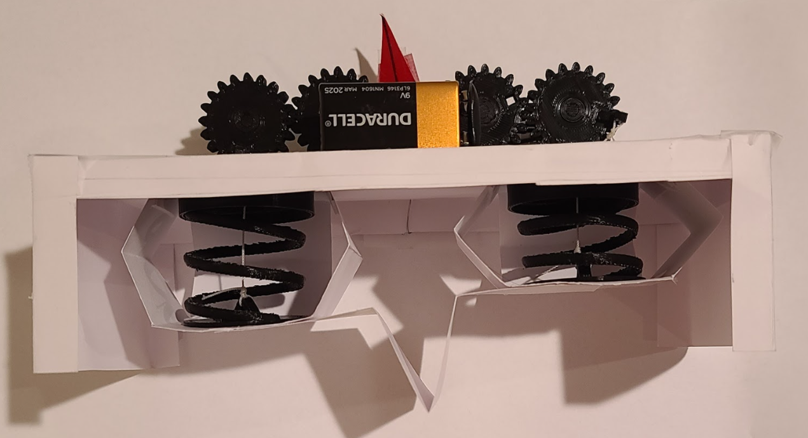

# Data Collection and Experimental Validation

## Description
[Assignment Instructions](https://egr557.github.io/assignments/data-collection-and-experimental-validation.html)

\
Fig 1 Podia Inspired Single Actuator Leg Robot
Table of Contents 

## Team Response
>**Content**\	
[Procedure](Procedure)
[System Assembly](System-Assembly)
[Experimental Design](Experimental-Design)
[Experimental Set up](Experimental-Set-up)
[Results](Results)
-[Optimization](Optimization)
-[Experimental Results](Experimental-Results)
[Discussion]
[Supplemental Materials](Supplemental-Materials)

[Candidate Organism for Bio Inspiration](#Candidate-Organism-for-Bio-Inspiration)\
[Bio-inspired Robots](#Bio-inspired-Robots)\
[Table of relevant info](#Table-of-relevant-info)\
[Extrapolation (Fill in the gaps)](#Extrapolation-(Fill-in-the-gaps))\
  -[Kinetic Energy](#Kinetic-Energy)\
  -[Metabolic Rate](#Metabolic-Rate)\
[Figures from literature](#Figures-from-literature)\
[Simple engineering drawing](#Simple-engineering-drawing)\
[Discussion](#Discussion)\
  -[Rationale for animal](#Rationale-for-animal)\
  -[Motor and battery](#Motor-and-battery)\
[Plots and Figures](#Plots-and-Figures)\
[References](#References)

### 1.0 Procedure
1.1 System Assembly
Our system was constructed using low cost materials, consisting of cardstock, kite string, 3D printed parts, a 9V battery, a single DC motor, and a simple switch circuit. The switch was capable of turning the motor off as well as having the ability to go in both directions. Our experiments only consider one direction for motion. The 3D printed parts, contained in system A (see figure 1), consist of 5 gears, with the center gear driven by the motor, and the outermost gears having arms attached to them to drive the kite string cable, compressing the 3D printed springs. The springs were printed with a hook to hold the kite string, and caps on either end to ensure the spring compresses vertically. To adhere parts together, tape was used in all instances. 

Figure 1: System A, Single Actuator Gear Hat, assembly. 
This design holds the motor, gears, battery, and circuit, and is placed on top of the cardstock frame such that the two holes align with the holes on the cardstock, allowing the cable to be run through.

 
Figure 2: Gear design and set up. 
The gears were design such that the single DC motor can actuate both gears at the same time. The larger gears help slow down the speed of the actuator. To perform the walking cycle, the arms on the gears that hold the cable are offset by ¼, the same phase offset used in the dynamics II and optimization codes. This allows the springs to undergo a compression cycle that lets the system walk. 

Figure 3: Device Manufacturing. 
Our device is made up of 3D printed parts, and folded cardstock parts. The single layer manufacturing design seen in the bottom right shows how each specific piece is cut out and the dotted lines are where the piece is folded. Cardstock does not need to be scored to fold. Each manufactured piece has an arrow pointing to the final folded part, where the leg has 5 different legs (4 layer cardstock not pictured). 

Figure 4: System B, Cardstock Leg Robot, assembly. 
This represents the fully constructed device, with system A placed on top of the cardstock frame. Both sarrus linkages house a spring, and the cardstock leg is attached to the bottom of each sarrus linkage. A red flag was made directly at the center of the device for testing so position can easily be recorded. It is placed in the center of the device to match the dynamics II and optimization codes. 
1.2 Experimental Design
Our goal was to measure the position of the device after 20 seconds based on different leg stiffnesses. This is done in order to find the best leg stiffness given factors such as system weight, motor torque, and sarrus spring stiffness. As seen in figure 3, 5 legs are used and tested on the device (note, 4 layer cardstock not pictured). Testing was performed on printer paper, then 1-4 layers of cardstock, where layer means adhering multiple 1 layer legs together to add stiffness. The leg is easily replaced as the bottom of the sarrus linkage was covered in clear packing tape, allowing us to use double sided tape to put on and take off each leg after testing. This ensures the cardstock sarrus linkage’s integrity is not compromised. Each run of the device was recorded, and every 2 seconds the position was written down up to 20 seconds. Every device was started before the 0 position point to get the device in motion, then the timer and positions were started once the flag reached 0 on  the backdrop. 
1.3 Experimental Set up
To run the experiment, the device as mentioned was started before the 0 point on the poster board. It then walked until the flag reached zero. The timer was then started, and every 2 seconds until 20 seconds, position was recorded. Videos were recorded on a phone stabilized by a tripod. 

Figure 5: Experimental setup I
To record data, we used a piece of poster board with markings every ½, that aligned such that the flag on the device clearly points at the position. The experiment was recorded using a tripod to keep the video steady, and was run on a table top, a relatively low friction surface. 

Figure 6: Experimental setup II
This is the point when the experiment officially started. Once the device walked to the 0 point, as shown, the timer was started and position measurements were recorded. 
1.4 Results
1.4.1 Optimization
From the optimization code we concluded that around .8 was the best stiffness for our device. This was the peak distance traveled in the x direction in our simulations, where after .8, distance began to drop off again. The values were simulated in meters and were converted to inches when compared to the experimental results. Optimization also started at .13 m, so it was normalized to 0 in order to compare. Optimization results were also simulated for a longer amount of time than the experimental results, so the time scale was also reduced to match the experiment. 

Figure 7: Optimization results
1.4.2 Experimental Results
After running each leg we found that a 3 layer cardstock leg was the optimal leg for traveling. The 4 layer leg didn’t travel as far, and the 3 layer leg far exceeded the results of the 2 layer with around 16 inches traveled in 20 seconds. It is also seen that printer paper was unable to move the device at all. These results help show that a stiffness between a very flexible and a completely rigid leg produces optimal locomotion, the same that was seen in our optimization simulations. 
Figure 8 shows the final results over time, as well as the opt8 (optimization .8 value), which under performed in comparison to our 3 layer leg. The system was able to produce an interesting locomotion, and future work could be done to test how well each leg could move a horizontal plate. This would allow us to neglect system weight as with everything put together, the system was unable to lift up and just scooted across the table. We also tested on a high friction surface like carpet, but the device struggled to produce motion for any leg. 

Figure 8: Experimental Results

2.0 Discussion
Answer the following questions:
2.1
What do you consider the top five sources of error in your data collection experiment?
 
The top five error sources are as follows: motor torque, system weight, deformable sarrus  linkage, gear friction, and surface friction. 
The motor torque required some fine tuning in the prototype to allow for cyclic motion. The springs at first were too stiff and the motor couldn’t provide sufficient torque even at high amps. We tested using an adjustable power supply. Eventually, after lowering the spring stiffness, and using wire to keep the kite string attached to the gear arms, we got the motor to turn without failure. This gave us our locomotion. 
The overall weight of our system was underestimated in the simulation and prior design iterations. The 3D printed gear hat, and the battery added significant weight to the frame. The single layer cardstock frame was able to hold a lot of weight due to its stiffness and folded design, but the leg could not handle the weight. This made the device scoot across the table, as it was never able to lift the frame. 
Deformable sarrus linkages and the deformable leg is similar to the system weight error. Since the sarrus linkage and leg were both made of cardstock, they had a tendency to deform incorrectly. That is the sarrus linkage sometimes didn’t only allow vertical motion, and can be seen with  a slight bend horizontally. The leg as well was not stiff enough to support the system's weight and deformed differently than our solidworks and simulation results expected.
Gear friction was due to the 3D printed material and directly affected the motor torque. This is a consequence of cheap material use, as is the deformable linkages and leg. 
Lastly, surface friction played a big factor in the experiment and it was something we didn’t fully factor into the optimization. As the system had to scoot using the leg and the frame never lifted, a lower friction surface was required to move. We tested on a smooth table top and on carpet and found that it was unable to move through a high friction surface like carpet. 
Some pros of the device design: 
Pros:
gears allowed ¼ offset
single actuator with a on or off (less complexity)
cheap parts
easily replaced leg
Surprisingly sturdy frame for single layer cardstock
2.2
What steps did you take to reduce the error?
To reduce error in our testing, we measured all of the pieces of our system and matched them up with our layered design from the previous assignment. Another step to reduce error in our design was to 3D print the springs that were used in our sarrus linkages to control the spring force that the motor would be contracting. We then adjusted the stiffness of our custom springs such that the motor with a 9V battery could provide sufficient torque to compress and extend the springs. To adjust this further we also made sure that the spring at max compression aligned with the top point of the gear, as if this was not aligned, it would cause a huge spike in torque as the motor would be attempting to compress plastic, and not a spring. Cheap materials and a single actuator are key design points for our system, so deformable linkages and gear friction were unavoidable. We reduced these as much as possible by adjusting the spring stiffness and ensuring proper construction.  
Testing on both carpet and a tabletop also allowed us to see what the device is best suited for walking on. So we were able to conclude a smoother surface was best. 
2.3
What was difficult to control?
After testing, it was easy to identify the most difficult aspect of our design to control and that was the contraction of the springs with the pulley. Timing the contractions of the pulley was difficult because with bad timing of the two pulleys, we would not get a good gait pattern. Through trial and error of different delays and PWM signals, we were ultimately able to get a workable gait pattern. Mechanical design of the gears also allowed us to offset the cables by ¼ which helped with the gait cycle as seen in our testing procedure. 
The contraction of the springs also had difficulties due to motor torque, since the single actuator pulling two cables was difficult to control at first. As mentioned, trial and error allowed us to reduce spring stiffness, create a better way for the cable to connect the gear and spring, and supply sufficient power to the motor. As seen in our experiments, we were able to achieve a unique locomotion with just one single actuator. 
2.4
How would you improve your testing setup or procedure next time?
To improve, we would need to have a way to move the camera with the device or take a wide lens shot so the entire experiment is captured. 
As we allowed the device to walk prior to recording position, it was not always guaranteed that the device would start at the same point in its gait cycle once it crossed the zero threshold. This is a testing source of error that we decided to allow as sometimes the device required a small nudge to get started. It also needed to be switched on and accurately placed by a user. Due to time constraints, testing was done by one individual, but future work would run smoother if two started up the device. 
Another improvement would also be to test the device's ability to change direction. The switch used could flip the direction of the motor, so after a certain period of time, the device could then be switched to walk backwards giving us another interesting mode of locomotion. 
2.5
How well does your data mirror your simulated results? What is similar, what is different?
Our results are similar in that there was an optimal stiffness in between a very flexible and a very stiff or rigid value. Our results show that after 3 layers of cardstock, the device begins to perform worse, and in the simulation, the device traveled farthest at .8 (on a scale of 0 to 1.5 N/m). 
The differences were mostly in approximations made. The flexible sarrus linkages and leg were considered rigid in the simulation, giving different results. System weight was also underestimated which may have affected how far the simulation would travel over time. We also did not fully consider the frictional forces on the frame and the leg, which would also slow down the system depending on the surface it is traveling on.
 
2.6
Is it possible to add a modeling element which models/captures discrepancies between these two results? What element, if added to your simulation what have the biggest impact on its fidelity
Our simulation was a bare bones test to see how far the device could travel given different leg stiffness values. It was always meant to be an approximation to point us in the right direction when designing the device. In order to add elements to the simulation, it would add a lot of complexity. Adding a better model for friction and factoring in the sarrus linkages and legs deformability would give a more accurate simulation. These would be complex to code as the sarrus linkages we assumed to be moving points based on sine waves, and the leg was considered to be rigid in points it deformed. 
So in conclusion it would be complex to add more modeling elements, but a more realistic/complex simulation would provide superior results.
2.7 
What additional equations and parameters would you need in order to add this element?
To fully add these, we would need to explore the stiffness in the linkages and the leg. We could then add more points in our model to simulate the deformability and adjust the stiffness value to explore how we could use a more rigid material to get better results. This requires adding more forces and more points in the simulation.
Adding proper stiffness values to everything, even the frame, and not considering everything to be rigid, would require more exploration on the cardstock stiffness, and how folding it in specific ways adds to that. 
Overall we would have to find more real world stiffness values, forces (friction of surface), and moments of inertia to fine-tune the model. This could be done with more cantilever beam experiments, and a sloped hill experiment to find a friction value of a surface. 
3.0 Supplemental Materials
Please see the provided zip file for the raw videos of the device moving. 
